###  Markdown 教程

###  标题

Markdown 标题有两种格式。

#### 1、使用 = 和 - 标记一级和二级标题

= 和 - 标记语法格式如下：

```markdown
我展示的是一级标题
=================

我展示的是二级标题
-----------------
```

#### 2、使用 # 号标记

使用 **#** 号可表示 1-6 级标题，一级标题对应一个 **#** 号，二级标题对应两个 **#** 号，以此类推。

```markdown
# 一级标题
## 二级标题
### 三级标题
#### 四级标题
##### 五级标题
###### 六级标题
```

### 段落

Markdown 段落没有特殊的格式，直接编写文字就好，**段落的换行是使用两个以上空格加上回车**。

当然也可以在段落后面使用一个空行来表示重新开始一个段落。

### 字体

Markdown 可以使用以下几种字体：

```markdown
*斜体文本*
_斜体文本_
**粗体文本**
__粗体文本__
***粗斜体文本***
___粗斜体文本___
```

### 分隔线

你可以在一行中用三个以上的星号、减号、底线来建立一个分隔线，行内不能有其他东西。你也可以在星号或是减号中间插入空格。下面每种写法都可以建立分隔线：

```markdown
***

* * *

*****

- - -

----------
```

### 删除线

如果段落上的文字要添加删除线，只需要在文字的两端加上两个波浪线 **~~** 即可，实例如下：

```markdown
RUNOOB.COM
GOOGLE.COM
~~BAIDU.COM~~
```

### 下划线

下划线可以通过 HTML 的 **<u>** 标签来实现：

```html
<u>带下划线文本</u>
```

### 脚注

脚注是对文本的补充说明。

Markdown 脚注的格式如下:

```
[^要注明的文本]
```

以下实例演示了脚注的用法：

```markdown
创建脚注格式类似这样 [^RUNOOB]。

[^RUNOOB]: 菜鸟教程 -- 学的不仅是技术，更是梦想！！！
```

### 列表

Markdown 支持有序列表和无序列表。

无序列表使用星号(*****)、加号(**+**)或是减号(**-**)作为列表标记，这些标记后面要添加一个空格，然后再填写内容：

```
* 第一项
* 第二项
* 第三项

+ 第一项
+ 第二项
+ 第三项


- 第一项
- 第二项
- 第三项
```

显示结果如下：


有序列表使用数字并加上 **.** 号来表示，如：

```
1. 第一项
2. 第二项
3. 第三项
```

显示结果如下：


### 列表嵌套

列表嵌套只需在子列表中的选项前面添加四个空格即可：

```
1. 第一项：
    - 第一项嵌套的第一个元素
    - 第一项嵌套的第二个元素
2. 第二项：
    - 第二项嵌套的第一个元素
    - 第二项嵌套的第二个元素
```

显示结果如下：


### 区块

Markdown 区块引用是在段落开头使用 **>** 符号 ，然后后面紧跟一个**空格**符号：

```
> 区块引用
> 菜鸟教程
> 学的不仅是技术更是梦想
```

显示结果如下：

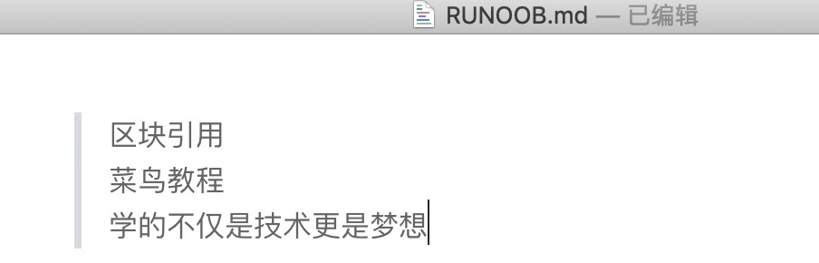

另外区块是可以嵌套的，一个 **>** 符号是最外层，两个 **>** 符号是第一层嵌套，以此类推：

```
> 最外层
> > 第一层嵌套
> > > 第二层嵌套
```

显示结果如下：


#### 区块中使用列表

区块中使用列表实例如下：

```
> 区块中使用列表
> 1. 第一项
> 2. 第二项
> + 第一项
> + 第二项
> + 第三项
```

显示结果如下：


#### 列表中使用区块

如果要在列表项目内放进区块，那么就需要在 **>** 前添加四个空格的缩进。

列表中使用区块实例如下：

```
* 第一项
    > 菜鸟教程
    > 学的不仅是技术更是梦想
* 第二项
```

显示结果如下：


### 代码

如果是段落上的一个函数或片段的代码可以用反引号把它包起来（**`**），例如：

```
`printf()` 函数
```

显示结果如下：

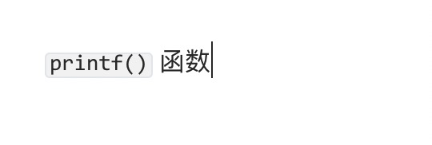

### 代码区块

代码区块使用 **4 个空格**或者一个**制表符（Tab 键）**。

实例如下：

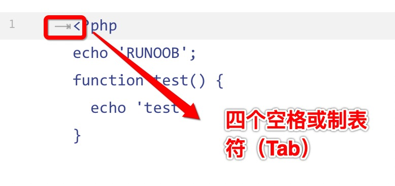

显示结果如下：

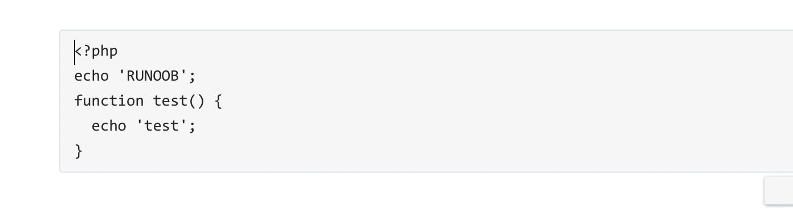

你也可以用 **```** 包裹一段代码，并指定一种语言（也可以不指定）：

```
​```javascript
$(document).ready(function () {
    alert('RUNOOB');
});
​```
```

显示结果如下：

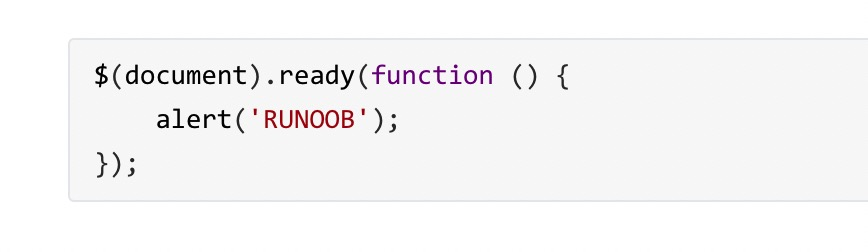

### 链接

链接使用方法如下：

```
[链接名称](链接地址)

或者

<链接地址>
```

例如：

```
这是一个链接 [菜鸟教程](https://www.runoob.com)
```

显示结果如下：


直接使用链接地址：

```
<https://www.runoob.com>
```

显示结果如下：


### 高级链接

我们可以通过变量来设置一个链接，变量赋值在文档末尾进行：

```
这个链接用 1 作为网址变量 [Google][1]
这个链接用 runoob 作为网址变量 [Runoob][runoob]
然后在文档的结尾为变量赋值（网址）

  [1]: http://www.google.com/
  [runoob]: http://www.runoob.com/
```

显示结果如下：


###  图片

Markdown 图片语法格式如下：

```


```

- 开头一个感叹号 !
- 接着一个方括号，里面放上图片的替代文字
- 接着一个普通括号，里面放上图片的网址，最后还可以用引号包住并加上选择性的 'title' 属性的文字。

使用实例：

```


```

显示结果如下：


当然，你也可以像网址那样对图片网址使用变量:

```
这个链接用 1 作为网址变量 [RUNOOB][1].
然后在文档的结尾为变量赋值（网址）

[1]: http://static.runoob.com/images/runoob-logo.png
```

显示结果如下：


Markdown 还没有办法指定图片的高度与宽度，如果你需要的话，你可以使用普通的  标签。

```

```

显示结果如下：


### 表格

Markdown 制作表格使用 **|** 来分隔不同的单元格，使用 **-** 来分隔表头和其他行。

语法格式如下：

```
|  表头   | 表头  |
|  ----  | ----  |
| 单元格  | 单元格 |
| 单元格  | 单元格 |
```

以上代码显示结果如下：

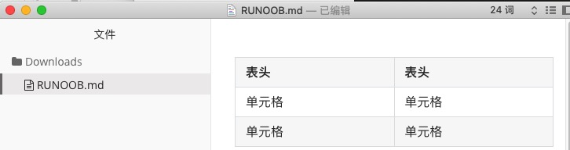


对齐方式

**我们可以设置表格的对齐方式：**

- **-:** 设置内容和标题栏居右对齐。
- **:-** 设置内容和标题栏居左对齐。
- **:-:** 设置内容和标题栏居中对齐。

实例如下：

```
| 左对齐 | 右对齐 | 居中对齐 |
| :-----| ----: | :----: |
| 单元格 | 单元格 | 单元格 |
| 单元格 | 单元格 | 单元格 |
```

以上代码显示结果如下：

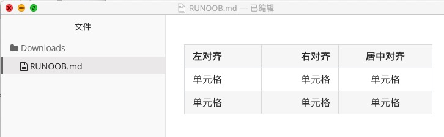


### 流程图

#### **1、横向流程图源码格式：**

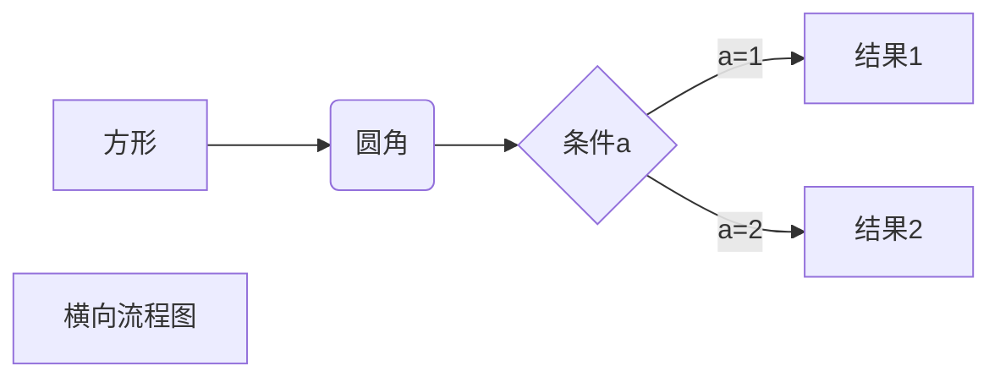

#### **2、竖向流程图源码格式：**

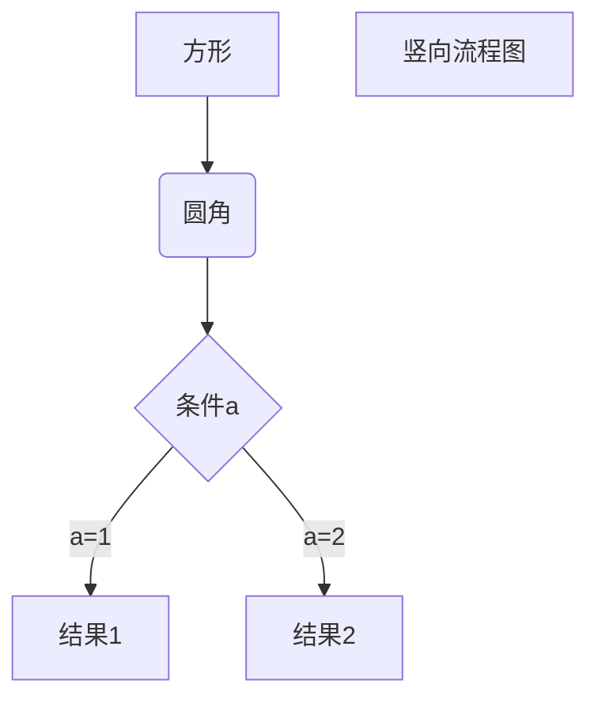

#### **3、标准流程图源码格式：**

```
​```flow
st=>start: 开始框
op=>operation: 处理框
cond=>condition: 判断框(是或否?)
sub1=>subroutine: 子流程
io=>inputoutput: 输入输出框
e=>end: 结束框
st->op->cond
cond(yes)->io->e
cond(no)->sub1(right)->op
​```
```

#### **4、标准流程图源码格式（横向）：**

```flow
st=>start: 开始框
op=>operation: 处理框
cond=>condition: 判断框(是或否?)
sub1=>subroutine: 子流程
io=>inputoutput: 输入输出框
e=>end: 结束框
st(right)->op(right)->cond
cond(yes)->io(bottom)->e
cond(no)->sub1(right)->op

```

#### **5、UML时序图源码样例：**

```sequence
对象A->对象B: 对象B你好吗?（请求）
Note right of 对象B: 对象B的描述
Note left of 对象A: 对象A的描述(提示)
对象B-->对象A: 我很好(响应)
对象A->对象B: 你真的好吗？
```

#### **6、UML时序图源码复杂样例：**

```sequence
Title: 标题：复杂使用
对象A->对象B: 对象B你好吗?（请求）
Note right of 对象B: 对象B的描述
Note left of 对象A: 对象A的描述(提示)
对象B-->对象A: 我很好(响应)
对象B->小三: 你好吗
小三-->>对象A: 对象B找我了
对象A->对象B: 你真的好吗？
Note over 小三,对象B: 我们是朋友
participant C
Note right of C: 没人陪我
```

#### **7、UML标准时序图样例：**

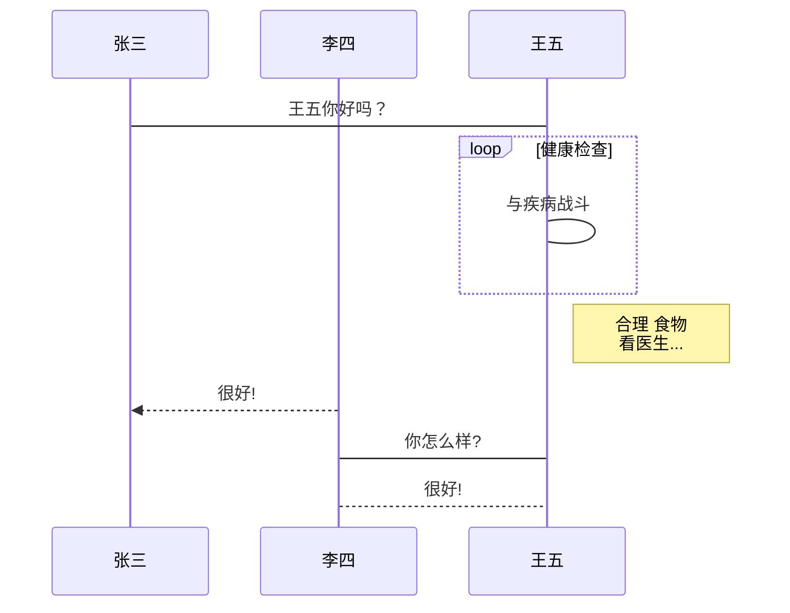

#### **8、甘特图样例：**

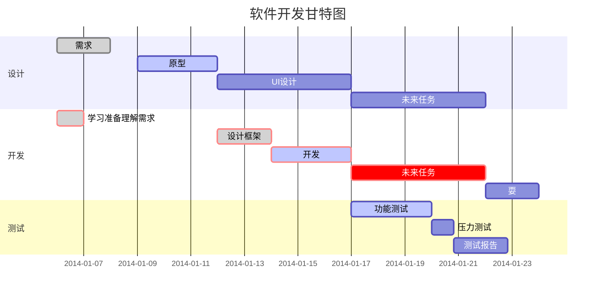

### HTML 元素

不在 Markdown 涵盖范围之内的标签，都可以直接在文档里面用 HTML 撰写。

目前支持的 HTML 元素有：`<kbd> <b> <i> <em> <sup> <sub> <br>`等 ，如：

```
使用 <kbd>Ctrl</kbd>+<kbd>Alt</kbd>+<kbd>Del</kbd> 重启电脑
```

输出结果为：

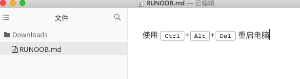

### 转义

Markdown 使用了很多特殊符号来表示特定的意义，如果需要显示特定的符号则需要使用转义字符，Markdown 使用反斜杠转义特殊字符：

```
**文本加粗** 
\*\* 正常显示星号 \*\*
```

输出结果为：


Markdown 支持以下这些符号前面加上反斜杠来帮助插入普通的符号：

```
\   反斜线
`   反引号
*   星号
_   下划线
{}  花括号
[]  方括号
()  小括号
#   井字号
+   加号
-   减号
.   英文句点
!   感叹号
```

Html 标签

本站支持在 Markdown 语法中嵌套 Html 标签，譬如，你可以用 Html 写一个纵跨两行的表格：

    <table>
        <tr>
            <th rowspan="2">值班人员</th>
            <th>星期一</th>
            <th>星期二</th>
            <th>星期三</th>
        </tr>
        <tr>
            <td>李强</td>
            <td>张明</td>
            <td>王平</td>
        </tr>
    </table>


<table>
    <tr>
        <th rowspan="2">值班人员</th>
        <th>星期一</th>
        <th>星期二</th>
        <th>星期三</th>
    </tr>
    <tr>
        <td>李强</td>
        <td>张明</td>
        <td>王平</td>
    </tr>
</table>


### 内嵌图标

本站的图标系统对外开放，在文档中输入

    <i class="icon-weibo"></i>

即显示微博的图标： <i class="icon-weibo icon-2x"></i>

替换 上述 `i 标签` 内的 `icon-weibo` 以显示不同的图标，例如：

    <i class="icon-renren"></i>

即显示人人的图标： <i class="icon-renren icon-2x"></i>

更多的图标和玩法可以参看 [font-awesome](http://fortawesome.github.io/Font-Awesome/3.2.1/icons/) 官方网站。

### 待办事宜 Todo 列表

使用带有 [ ] 或 [x] （未完成或已完成）项的列表语法撰写一个待办事宜列表，并且支持子列表嵌套以及混用Markdown语法，例如：

    - [ ] **Cmd Markdown 开发**
        - [ ] 改进 Cmd 渲染算法，使用局部渲染技术提高渲染效率
        - [ ] 支持以 PDF 格式导出文稿
        - [x] 新增Todo列表功能 [语法参考](https://github.com/blog/1375-task-lists-in-gfm-issues-pulls-comments)
        - [x] 改进 LaTex 功能
            - [x] 修复 LaTex 公式渲染问题
            - [x] 新增 LaTex 公式编号功能 [语法参考](http://docs.mathjax.org/en/latest/tex.html#tex-eq-numbers)
    - [ ] **七月旅行准备**
        - [ ] 准备邮轮上需要携带的物品
        - [ ] 浏览日本免税店的物品
        - [x] 购买蓝宝石公主号七月一日的船票

对应显示如下待办事宜 Todo 列表：
        

- [ ] **Cmd Markdown 开发**
    - [ ] 改进 Cmd 渲染算法，使用局部渲染技术提高渲染效率
    - [ ] 支持以 PDF 格式导出文稿
    - [x] 新增Todo列表功能 [语法参考](https://github.com/blog/1375-task-lists-in-gfm-issues-pulls-comments)
    - [x] 改进 LaTex 功能
    - [x] 修复 LaTex 公式渲染问题
    - [x] 新增 LaTex 公式编号功能 [语法参考](http://docs.mathjax.org/en/latest/tex.html#tex-eq-numbers)
- [ ] **七月旅行准备**
    - [ ] 准备邮轮上需要携带的物品
    - [ ] 浏览日本免税店的物品
    - [x] 购买蓝宝石公主号七月一日的船票

### 特殊字符需求使用参考

1.1 插入公式和编号

typora 的数学公式有两种：**行中公式**和**独立公式**。行中公式放在文中与其它文字混编，独立公式单独成行。
**行中公式**

```java
$ 数学公式 $
```

**独立公式**

```java
$$ 
数学公式 
$$
```

**公式编号**
`\tag{编号}`   可用来给公式加入编号。

+ 例子：

```java
$\displaystyle\sum_{i=1}^{n}{a_i^2}x_i \text{，行内公式示例}$
```

+ $\displaystyle\sum_{i=1}^{n}{a_i^2}x_i \text{，行内公式示例}$
+ 例子：

```java
 $$ 
 J_\alpha(x) = \sum_{m=0}^\infty \frac{(-1)^m}{m! \Gamma (m + \alpha + 1)} {\left({ \frac{x}{2} }\right)}^{2m + \alpha} \text {，带有编号的独立公式示例} \tag{1.1}
 $$     
```

+ 显示：
    $$
    J_\alpha(x) = \sum_{m=0}^\infty \frac{(-1)^m}{m! \Gamma (m + \alpha + 1)} {\left({ \frac{x}{2} }\right)}^{2m + \alpha} \text {，带有编号的独立公式示例} \tag{1.1}
    $$

#### 1.2 输入上/下标

+ 例子：

```java
 $$ 
 x^{y^z}=(1+{\rm e}^x)^{-2xy^w} \tag{1.2}
 $$
```

+ 显示：
    $$
    x^{y^z}=(1+{\rm e}^x)^{-2xy^w} \tag{1.2}
    $$

#### 1.3 输入括号和分隔符

`()`、`[]` 和 `|` 表示符号本身，使用 `\{\}` 来表示 `{}` 。当要显示大号的括号或分隔符时，要用 `\left` 和 `\right` 命令。
一些特殊的括号：

|  输入   | 显示 |  输入   | 显示 |
| :-----: | :--: | :-----: | :--: |
| \langle |  ⟨   | \rangle |  ⟩   |
| \lceil  | ⌈ \  | \rceil  |  ⌉   |
| \lfloor |  ⌊   | \rfloor |  ⌋   |
| \lbrace |  {   | \rbrace |  }   |

+ 例子：

```java
 $$
 f(x,y,z) = 3y^2z \left( 3+\frac{7x+5}{1+y^2} \right)\tag{1.3}
 $$
```

+ $$
    f(x,y,z) = 3y^2z \left( 3+\frac{7x+5}{1+y^2} \right)\tag{1.3}
    $$

+ 例子：

```java
  $$ 
  \left. \frac{{\rm d}u}{{\rm d}x} \right| _{x=0} \tag{1.4}
  $$
```

+ 显示：
    $$
    \left. \frac{{\rm d}u}{{\rm d}x} \right| _{x=0} \tag{1.4}
    $$

#### 1.4 输入分数

通常使用 `\frac {分子} {分母}` 命令产生一个分数，分数可嵌套。
便捷情况可直接输入 `\frac ab` 来快速生成一个 。
如果分式很复杂，亦可使用 `分子 \over 分母` 命令，此时分数仅有一层。

+ 例子：

```java
  $$
  \frac{a-1}{b-1} \quad and \quad {a+1\over b+1}\tag{1.5}
  $$
```

+ 显示：
    $$
    \frac{a-1}{b-1} \quad and \quad {a+1\over b+1}\tag{1.5}
    $$

#### 1.5 输入开方

使用 `\sqrt [根指数，省略时为2] {被开方数}` 命令输入开方。

+ 例子：

```java
  $$
  \sqrt{2} \quad and \quad \sqrt[n]{3}\tag{1.6}
  $$
```

+ 显示：
    $$
    \sqrt{2} \quad and \quad \sqrt[n]{3}\tag{1.6}
    $$

#### 1.6 输入省略号

数学公式中常见的省略号有两种，`\ldots` 表示与文本底线对齐的省略号，`\cdots` 表示与文本中线对齐的省略号。

+ 例子：

```java
  $$
  f(x_1,x_2,\underbrace{\ldots}_{\rm ldots},x_n)=x_1^2+x_2^2+\underbrace{\ldots}_{\rm ldots}+x_n^2\tag{1.7}
  $$
```

+ 显示：
    $$
    f(x_1,x_2,\underbrace{\ldots}_{\rm ldots},x_n)=x_1^2+x_2^2+\underbrace{\ldots}_{\rm ldots}+x_n^2\tag{1.7}
    $$

#### 1.7 输入矢量

使用 `\vec{矢量}` 来自动产生一个矢量。也可以使用 `\overrightarrow` 等命令自定义字母上方的符号。

+ 例子：

```java
  $$
  \vec{a} \cdot \vec{b}=0 \tag{1.8}
  $$
```

+ 显示：
    $$
    \vec{a} \cdot \vec{b}=0 \tag{1.8}
    $$

+ 例子：

```java
  $$
  \overleftarrow{xy} \quad and \quad \overleftrightarrow{xy} \quad and \quad \overrightarrow{xy}\tag{1.9}
  $$
```

+ 显示：
    $$
    \overleftarrow{xy} \quad and \quad \overleftrightarrow{xy} \quad and \quad \overrightarrow{xy}\tag{1.9}
    $$

#### 1.8 输入积分

使用 `\int_积分下限^积分上限{被积表达式}` 来输入一个积分。

+ 例子：

```java
  $$
  \int_0^1 {x^2} \,{\rm d}x \tag{1.10}
  $$
```

+ 显示：
    $$
    \int_0^1 {x^2} \,{\rm d}x \tag{1.10}
    $$

#### 1.9 输入极限运算

+ 例子：

```java
  $$ 
  \lim_{n \to +\infty} \frac{1}{n(n+1)} \quad and \quad \lim_{x_0\leftarrow{x}} \frac{1}{x(x+1)} 
  \tag{1.11}
  $$
```

+ 显示：
    $$
    \lim_{n \to +\infty} \frac{1}{n(n+1)} \quad and \quad \lim_{x_0\leftarrow{x}} \frac{1}{x(x+1)} 
      \tag{1.11}
    $$

    

    #### 1.10 输入累加累乘运算

使用 `\sum_{下标表达式}^{上标表达式} {累加表达式}` 来输入一个累加。
与之类似，使用 `\prod` `\bigcup` `\bigcap` 来分别输入累乘、并集和交集。
此类符号在行内显示时上下标表达式将会移至右上角和右下角。

+ 例子：

```java
  $$
  \sum_{i=1}^n \frac{1}{i^2} \quad and \quad
  \prod_{i=1}^n \frac{1}{i^2} \quad and \quad
  \bigcup_{i=1}^2,R \tag{1.12}
  $$
```

+ 显示：
    $$
    \sum_{i=1}^n \frac{1}{i^2} \quad and \quad
      \prod_{i=1}^n \frac{1}{i^2} \quad and \quad
      \bigcup_{i=1}^2,R \tag{1.12}
    $$

#### 1.11 输入希腊字母

输入 `\小写希腊字母英文全称` 和 `\首字母大写希腊字母英文全称` 来分别输入小写和大写希腊字母。
**对于大写希腊字母与现有字母相同的，直接输入大写字母即可。**

|   输入   | 显示 |  输入   | 显示 |   输入   | 显示 |   输入   |   显示   |
| :------: | :--: | :-----: | :--: | :------: | :--: | :------: | :------: |
|  \alpha  |  α   |    A    |  A   |  \beta   |  β   |    B     |    B     |
|  \gamma  |  γ   | \Gamma  |  Γ   |  \delta  |  δ   |  \Delta  | $\Delta$ |
| \epsilon |  ϵ   |    E    |  E   |  \zeta   |  ζ   |    Z     |    Z     |
|   \eta   |  η   |    H    |  H   |  \theta  |  θ   |  \Theta  |    Θ     |
|  \iota   |  ι   |    I    |  I   |  \kappa  |  κ   |    K     |    K     |
| \lambda  |  λ   | \Lambda |  Λ   |   \mu    |  μ   |    M     |    M     |
|   \nu    |  ν   |    N    |  N   |   \xi    |  ξ   |   \Xi    |    Ξ     |
|    o     |  o   |    O    |  O   |   \pi    |  π   |   \Pi    |    Π     |
|   \rho   |  ρ   |    P    |  P   |  \sigma  |  σ   |  \Sigma  |    Σ     |
|   \tau   |  $   |    T    |  T   | \upsilon |  υ   | \Upsilon |    Υ     |
|   \phi   |  ϕ   |  \Phi   |  Φ   |   \chi   |  χ   |    X     |    X     |
|   \psi   |  ψ   |  \Psi   |  Ψ   |  \omega  |  ω   |  \Omega  |    Ω     |

**部分字母有变量专用形式，以 `\var-` 开头。**

| 小写形式 | 大写形式 | 变量形式    | 显示      |
| -------- | -------- | ----------- | --------- |
| \epsilon | E        | \varepsilon | $\epsilon |
| \theta   | \Theta   | \vartheta   | $\theta   |
| \rho     | P        | \varrho     | $\rho     |
| \sigma   | \Sigma   | \varsigma   | $\sigma   |
| \phi     | \Phi     | \varphi     | $\phi     |

#### 1.12 输入其他特殊字符

**若需要显示更大或更小的字符，在符号前插入`\large`或 `\small`命令。**

##### 1.12.1 关系运算符

|   输入   | 显示 |    输入    | 显示 |   输入    | 显示 |    输入    | 显示 |
| :------: | :--: | :--------: | :--: | :-------: | :--: | :--------: | :--: |
|   \pm    |  ±   |   \times   |  ×   |   \div    |  ÷   |    \mid    |  ∣   |
|  \nmid   |  ∤   |   \cdot    |  ⋅   |   \circ   |  ∘   |    \ast    |  ∗   |
| \bigodot |  ⨀   | \bigotimes |  ⨂   | \bigoplus |  ⨁   |    \leq    |  ≤   |
|   \geq   |  ≥   |    \neq    |  ≠   |  \approx  |  ≈   |   \equiv   |  ≡   |
|   \sum   |  ∑   |   \prod    |  ∏   |  \coprod  |  ∐   | \backslash |  \   |

##### 1.12.2 集合运算

|   输入    | 显示 |   输入    | 显示 |   输入    | 显示 |
| :-------: | :--: | :-------: | :--: | :-------: | :--: |
| \emptyset |  ∅   |    \in    |  ∈   |  \notin   |  ∉   |
|  \subset  |  ⊂   |  \supset  |  ⊃   | \subseteq |  ⊆   |
| \supseteq |  ⊇   |  \bigcap  |  ⋂   |  \bigcup  |  ⋃   |
|  \bigvee  |  ⋁   | \bigwedge |  ⋀   | \biguplus |  ⨄   |

##### 1.12.3 对数运算

| 输入 | 显示  | 输入 | 显示 | 输入 | 显示  |
| :--: | :---: | :--: | :--: | :--: | :---: |
| \log | $log$ | \lg  | $lg⁡$ | \ln  | $ln ⁡$ |

##### 1.12.4 三角运算

|   输入   |    显示    | 输入 |  显示   |   输入    |    显示    |
| :------: | :--------: | :--: | :-----: | :-------: | :--------: |
| 30^\circ | $30^\circ$ | \bot | $ \bot$ | \angle A$ | $\angle A$ |
|   \sin   |  $⁡ \sin$   | \cos | $ \cos$ |   \tan    |   $\tan$   |
|   \csc   |   $\csc$   |  ec  | $ \sec$ |   \cot    |   $\cot$   |

##### 1.12.5 微积分运算符

| 输入 |  显示  |  输入  |   显示   |  输入   |   显示   |
| :--: | :----: | :----: | :------: | :-----: | :------: |
| \int | $\int$ | \iint  | $\iint$  | \iiint$ | $\iiint$ |
|      |        | \oint  | $\oint$  | \prime  | $\prime$ |
| \lim | $\lim$ | \infty | $\infty$ | \nabla  | $\nabla$ |

##### 1.12.6 逻辑运算

|   输入   |    显示    |    输入     |     显示     |    输入     |     显示      |
| :------: | :--------: | :---------: | :----------: | :---------: | :-----------: |
| \because | $\because$ | \therefore$ | $\therefore$ |             |               |
| \forall  | $ \forall$ |   \exists   |  $\exists$   | \not\subset | $\not\subset$ |
|  \not<   |  $\not<$   |    \not>    |   $\not>$    |    \not=    |    $\not=$    |

##### 1.12.7 戴帽运算

|    输入    |     显示      |      输入       |       显示        |
| :--------: | :-----------: | :-------------: | :---------------: |
|  \hat{xy}  | $^ \hat{xy}$  |  \widehat{xyz}  | $ \widehat{xyz}$  |
| \tilde{xy} | $ \tilde{xy}$ | \widetilde{xyz} | $\widetilde{xyz}$ |
| \check{x}  | $ \check{x}$  |    \breve{y}    |   $ \breve{y}$    |
| \grave{x}  | $  \grave{x}$ |    \acute{y}    |   $ \acute{y}$    |

##### 1.12.8 连线符号

|                      输入                      |                       显示                       |
| :--------------------------------------------: | :----------------------------------------------: |
|                 \fbox{a+b+c+d}                 |                 $\fbox{a+b+c+d}$                 |
|            \overleftarrow{a+b+c+d}             |            $\overleftarrow{a+b+c+d}$             |
|            \overrightarrow{a+b+c+d}            |            $\overrightarrow{a+b+c+d}$            |
|          \overleftrightarrow{a+b+c+d}          |         $ \overleftrightarrow{a+b+c+d}$          |
|            \underleftarrow{a+b+c+d}            |           $ \underleftarrow{a+b+c+d}$            |
|           \underrightarrow{a+b+c+d}            |           $ \underrightarrow{a+b+c+d}$           |
|         \underleftrightarrow{a+b+c+d}          |         $\underleftrightarrow{a+b+c+d}$          |
|               \overline{a+b+c+d}               |               $\overline{a+b+c+d}$               |
|              \underline{a+b+c+d}               |              $\underline{a+b+c+d}$               |
|          \overbrace{a+b+c+d}^{Sample}          |          $\overbrace{a+b+c+d}^{Sample}$          |
|         \underbrace{a+b+c+d}_{Sample}          |         $\underbrace{a+b+c+d}_{Sample}$          |
|  \overbrace{a+\underbrace{b+c}_{1.0}+d}^{2.0}  |  $\overbrace{a+\underbrace{b+c}_{1.0}+d}^{2.0}$  |
| \underbrace{a\cdot a\cdots a}_{b\text{ times}} | $\underbrace{a\cdot a\cdots a}_{b\text{ times}}$ |

##### 1.12.9 箭头符号

**推荐使用符号**

|   输入   |    显示    |  输入   |   显示    |    输入    |     显示      |
| :------: | :--------: | :-----: | :-------: | :--------: | :-----------: |
|   \to    |   $\to$    | \mapsto | $\mapsto$ |            |               |
| \implies | $\implies$ |  \iff   |  $\iff$   | \impliedby | $ \impliedby$ |

**其他可用符号**

|        输入         |         显示          |        输入         |         显示          |
| :-----------------: | :-------------------: | :-----------------: | :-------------------: |
|      \uparrow       |      $ \uparrow$      |      \Uparrow       |      $\Uparrow$       |
|     \downarrow      |     $ \downarrow$     |     \Downarrow      |     $ \Downarrow$     |
|     \leftarrow      |     $ \leftarrow$     |     \Leftarrow      |     $ \Leftarrow$     |
|     \rightarrow     |    $ \rightarrow$     |     \Rightarrow     |    $ \Rightarrow$     |
|   \leftrightarrow   |  $ \leftrightarrow$   |   \Leftrightarrow   |   $\Leftrightarrow$   |
|   \longleftarrow    |   $ \longleftarrow$   |   \Longleftarrow    |   $\Longleftarrow$    |
|   \longrightarrow   |  $ \longrightarrow$   |   \Longrightarrow   |   $\Longrightarrow$   |
| \longleftrightarrow | $\longleftrightarrow$ | \Longleftrightarrow | $\Longleftrightarrow$ |

#### 1.13 字体转换

若要对公式的某一部分字符进行字体转换，可以用 `{\字体 {需转换的部分字符}}` 命令，其中 `\字体` 部分可以参照下表选择合适的字体。一般情况下，公式默认为意大利体 。
示例中 **全部大写** 的字体仅大写可用。

| 输入  | 说明       | 显示        | 输入 | 说明     | 显示        |
| ----- | ---------- | ----------- | ---- | -------- | ----------- |
| \rm   | 罗马体     | $\rm Zoe$   | \cal | 花       | $\̲c̲a̲l̲Zoe$   |
| \it   | 意大利体   | $\it Zoe$   | \Bbb | 黑板粗体 | $\Bbb Zoe$  |
| \bf   | 粗体       | $ \bf Zoe$  | \mit | 数学斜体 | $ \̲m̲i̲t̲ ̲Zoe$ |
| \sf   | 等线体     | $ \sf Zoe$  | \scr | 手写体   | $ \̲s̲c̲r̲ ̲Zoe$ |
| \tt   | 打字机体   | $\tt Zoe$   |      |          |             |
| \frak | 旧德式字体 | $\frak Zoe$ |      |          |             |

转换字体十分常用，例如在积分中：

+ 例子：

```java
 $$
 \begin{array}{cc}
 \mathrm{Bad} & \mathrm{Better} \\
 \hline \\
 \int_0^1 x^2 dx & \int_0^1 x^2 \,{\rm d}x
 \end{array}
 $$
```

+ 显示：
    $$
    \begin{array}{cc}
     \mathrm{Bad} & \mathrm{Better} \\
     \hline \\
     \int_0^1 x^2 dx & \int_0^1 x^2 \,{\rm d}x
     \end{array}
    $$
    注意比较两个式子间的不同。使用\operatorname命令也可以达到相同的效果

#### 1.14 大括号的使用

+ 例子：

    ```java
    $$
    f\left(
     \left[
      \frac
      {1+\left\{x,y\right\}}
      {\left(\frac{x}{y}+\frac{y}{x}\right)
      \left(u+1\right)}+a
     \right]^{3/2}
    \right)
    \tag{1.13}
    $$
    
    ```

    + 显示：
        $$
        f\left(
         \left[
          \frac
          {1+\left\{x,y\right\}}
          {\left(\frac{x}{y}+\frac{y}{x}\right)
          \left(u+1\right)}+a
         \right]^{3/2}
        \right)
        \tag{1.13}
        $$
        如果你需要在不同的行显示对应括号，可以在每一行对应处使用 `\left.` 或 `\right.` 来放一个"影子"括号：

+ 例子：

```java
  $$
  \begin{aligned}
  a=&\left(1+2+3+  \cdots \right. \\
  & \cdots+ \left. \infty-2+\infty-1+\infty\right)
  \end{aligned} \tag{1.14}
  $$
```

+ 显示：
    $$
    \begin{aligned}
      a=&\left(1+2+3+  \cdots \right. \\
      & \cdots+ \left. \infty-2+\infty-1+\infty\right)
      \end{aligned} \tag{1.14}
    $$

#### 1.15 其他命令

##### 1.15.1 添加注释文字

在 `\text {文字}` 中仍可以使用 `$公式$` 插入其它公式。

+ 例子：

```java
  $$
  f(n) = \begin{cases}
  n/2,
  & \text {if $n$ is even} \\
  3n+1,
  & \text {if $n$ is odd}
  \end{cases} \tag{1.15}
  $$
```

+ 显示：
    $$
    f(n) = \begin{cases}
      n/2,
      & \text {if $n$ is even} \\
      3n+1,
      & \text {if $n$ is odd}
      \end{cases} \tag{1.15}
    $$

##### 1.15.2 在字符间加入空格

有四种宽度的空格可以使用： `\,`、`\;`、`\quad` 和 `\qquad` 。

+ 例子：

```java
 $$
 a \, b \mid a \; b \mid a \quad b \mid a \qquad b 
 $$
```

+ 显示：
    $$
    a \, b \mid a \; b \mid a \quad b \mid a \qquad b
    $$

##### 1.15.3 更改文字颜色

使用 `\color{颜色}{文字}` 来更改特定的文字颜色。
更改文字颜色 **需要浏览器支持** ，如果浏览器不知道你所需的颜色，那么文字将被渲染为黑色。
对于较旧的浏览器（HTML4与CSS2），以下颜色是被支持的：

|  输入  |         显示          |  输入   |          显示           |
| :----: | :-------------------: | :-----: | :---------------------: |
| black  | $\color{black}{Zoe}$  |  grey   |   $\color{grey}{Zoe}$   |
| silver | $\color{silver}{Zoe}$ |  white  |  $\color{white}{Zoe}*$  |
| maroon | $\color{maroon}{Zoe}$ |   red   |   $\color{red}{Zoe}$    |
| yellow | $\color{yellow}{Zoe}$ |  lime   |   $\color{lime}{Zoe}$   |
| olive  | $ \color{olive}{Zoe}$ |  green  |  $ \color{green}{Zoe}$  |
|  teal  | $ \color{teal}{Zoe}$  |  auqa   |  $ \color{auqa}{Zoe}$   |
|  blue  |  $\color{blue}{Zoe}$  |  navy   |  $ \color{navy}{Zoe}$   |
| purple | $\color{purple}{Zoe}$ | fuchsia | $ \color{fuchsia}{Zoe}$ |


### 数学公式

#### 1．如何插入公式

全文任意处使用 `\eqref{eq:公式名}` 语句引用.

- 例子：

```
$ J_\alpha(x) = \sum_{m=0}^\infty \frac{(-1)^m}{m! \Gamma (m + \alpha + 1)} {\left({ \frac{x}{2} }\right)}^{2m + \alpha} \text {，行内公式示例} $
```

- 显示：$ J_\alpha(x) = \sum_{m=0}^\infty \frac{(-1)^m}{m! \Gamma (m + \alpha + 1)} {\left({ \frac{x}{2} }\right)}^{2m + \alpha} \text {，行内公式示例} $

- 例子：

```
$$ J_\alpha(x) = \sum_{m=0}^\infty \frac{(-1)^m}{m! \Gamma (m + \alpha + 1)} {\left({ \frac{x}{2} }\right)}^{2m + \alpha} \text {，独立公式示例} $$
```

- 显示：$$ J_\alpha(x) = \sum_{m=0}^\infty \frac{(-1)^m}{m! \Gamma (m + \alpha + 1)} {\left({ \frac{x}{2} }\right)}^{2m + \alpha} \text {，独立公式示例} $$

- 例子：

```
$$ 在公式 \eqref{eq:sample} 中，我们看到了这个被自动编号的公式

\begin{equation}
    E=mc^2 \text{，自动编号公式示例}
    \label{eq:sample}
\end{equation}
$$
```

- 显示：

$$ 在公式 \eqref{eq:sample} 中，我们看到了这个被自动编号的公式。\begin{equation}
    E=mc^2 \text{，自动编号公式示例}\end{equation}$$

####2．如何输入上下标

`^` 表示上标, `_` 表示下标。如果上下标的内容多于一个字符，需要用 `{}` 将这些内容括成一个整体。上下标可以嵌套，也可以同时使用。

- 例子：

```
$$ x^{y^z}=(1+{\rm e}^x)^{-2xy^w} $$
```

- 显示：$$ x^{y^z}=(1+{\rm e}^x)^{-2xy^w} $$

另外，如果要在左右两边都有上下标，可以使用 `\sideset` 命令；也可以简单地在符号前面多打一个上下标，此时会以行内公式渲染。

- 例子：

```
$$ \sideset{^1_2}{^3_4}\bigotimes \quad or \quad {^1_2}\bigotimes {^3_4} $$
```

- 显示：$$\sideset{^1_2}{^3_4}\bigotimes \quad or \quad {^1_2}\bigotimes {^3_4} $$

####3．如何输入括号和分隔符

`()`、`[]` 和 `|` 表示符号本身，使用 `\{\}` 来表示 `{}` 。当要显示大号的括号或分隔符时，要用 `\left` 和 `\right` 命令。

一些特殊的括号：

|  输入   |   显示    |  输入   |   显示    |
| :-----: | :-------: | :-----: | :-------: |
| \langle | $\langle$ | \rangle | $\rangle$ |
| \lceil  | $\lceil$  | \rceil  | $\rceil$  |
| \lfloor | $\lfloor$ | \rfloor | $\rfloor$ |
| \lbrace | $\lbrace$ | \rbrace | $\rbrace$ |
| \lvert  | $\lvert$  | \rvert  | $\rvert$  |
| \lVert  | $\lVert$  | \rVert  | $\rVert$  |

> **@lymd** 有时，我们需要在行内使用两个竖杠表示向量间的某种空间距离，可以这样写
> <span style="text-align: center; display: block"> `\lVert \boldsymbol{X}_i - \boldsymbol{S}_j \rVert^2` → $\lVert \boldsymbol{X}_i - \boldsymbol{S}_j \rVert^2$ </span>

- 例子：

```
$$ f(x,y,z) = 3y^2z \left( 3+\frac{7x+5}{1+y^2} \right) $$
```

- 显示：$$ f(x,y,z) = 3y^2z \left( 3+\frac{7x+5}{1+y^2} \right) $$

有时要用 `\left.` 或 `\right.` 进行匹配而不显示本身。

- 例子：

```
$$ \left. \frac{{\rm d}u}{{\rm d}x} \right| _{x=0} $$
```

- 显示：$$ \left. \frac{{\rm d}u}{{\rm d}x} \right| _{x=0} $$

####4．如何输入分数

通常使用 `\frac {分子} {分母}` 来生成一个分数，分数可多层嵌套。如果分式较为复杂，亦可使用 `分子 \over 分母` 此时分数仅有一层。

- 例子：

```
$$ \frac{a-1}{b-1} \quad or \quad {a+1 \over b+1} $$
```

- 显示：$$ \frac{a-1}{b-1} \quad or \quad {a+1 \over b+1} $$

当分式 **仅有两个字符时** 可直接输入 `\frac ab` 来快速生成一个 $\large\frac ab$ 。

- 例子：

```
$$ \frac 12,\frac 1a,\frac a2 \quad \mid \quad \text{2 letters only:} \quad \frac 12a \,, k\frac q{r^2} $$
```

- 显示：$$ \frac 12,\frac 1a,\frac a2 \quad \mid \quad \text{2 letters only:} \quad \frac 12a \,, k\frac q{r^2} $$

####5．如何输入开方

使用 `\sqrt [根指数，省略时为2] {被开方数}` 命令输入开方。

- 例子：

```
$$ \sqrt{2} \quad or \quad \sqrt[n]{3} $$
```

- 显示：$$ \sqrt{2} \quad or \quad \sqrt[n]{3} $$

####6．如何输入省略号

数学公式中常见的省略号有两种，`\ldots` 表示与 **文本底线** 对齐的省略号，`\cdots` 表示与 **文本中线** 对齐的省略号。

- 例子：

```
$$ f(x_1,x_2,\underbrace{\ldots}_{\rm ldots} ,x_n) = x_1^2 + x_2^2 + \underbrace{\cdots}_{\rm cdots} + x_n^2 $$
```

- 显示：$$ f(x_1,x_2,\underbrace{\ldots}_{\rm ldots} ,x_n) = x_1^2 + x_2^2 + \underbrace{\cdots}_{\rm cdots} + x_n^2 $$

####7．如何输入向量

使用 `\vec{向量}` 来自动产生一个向量。也可以使用 `\overrightarrow` 等命令自定义字母上方的符号。

- 例子：

```
$$ \vec{a} \cdot \vec{b}=0 $$
```

- 显示：$$ \vec{a} \cdot \vec{b}=0 $$

- 例子：

```
$$ xy \text{ with arrows:} \quad \overleftarrow{xy} \; \mid \; \overleftrightarrow{xy} \; \mid \; \overrightarrow{xy} $$
```

- 显示：$$ xy \text{ with arrows:} \quad \overleftarrow{xy} \; \mid \; \overleftrightarrow{xy} \; \mid \; \overrightarrow{xy} $$

####8．如何输入积分

使用 `\int_积分下限^积分上限 {被积表达式}` 来输入一个积分。

例子：

```
$$ \int_0^1 {x^2} \,{\rm d}x $$
```

显示：$$ \int_0^1 {x^2} \,{\rm d}x $$

####9．如何输入极限运算

使用 `\lim_{变量 \to 表达式} 表达式` 来输入一个极限。如有需求，可以更改 `\to` 符号至任意符号。

例子：

```
$$ \lim_{n \to \infty} \frac{1}{n(n+1)} \quad and \quad \lim_{x\leftarrow{示例}} \frac{1}{n(n+1)} $$
```

显示：$$ \lim_{n \to \infty} \frac{1}{n(n+1)} \quad and \quad \lim_{x\leftarrow{示例}} \frac{1}{n(n+1)} $$

####10．如何输入累加、累乘运算

使用 `\sum_{下标表达式}^{上标表达式} {累加表达式}` 来输入一个累加。与之类似，使用 `\prod` `\bigcup` `\bigcap` 来分别输入累乘、并集和交集.
此类符号在行内显示时上下标表达式将会移至右上角和右下角，如 $\sum_{i=1}^n \frac{1}{i^2}$。

- 例子：

```
$$ \sum_{i=1}^n \frac{1}{i^2} \quad and \quad \prod_{i=1}^n \frac{1}{i^2} \quad and \quad \bigcup_{i=1}^{2} \Bbb{R} $$
```

- 显示：$$ \sum_{i=1}^n \frac{1}{i^2} \quad and \quad \prod_{i=1}^n \frac{1}{i^2} \quad and \quad \bigcup_{i=1}^{2} \Bbb{R} $$

####11．如何输入希腊字母

输入 `\小写希腊字母英文全称` 和 `\首字母大写希腊字母英文全称` 来分别输入小写和大写希腊字母。
**对于大写希腊字母与现有字母相同的，直接输入大写字母即可。**

|   输入   |    显示    |  输入   |   显示    |   输入   |    显示    |   输入   |    显示    |
| :------: | :--------: | :-----: | :-------: | :------: | :--------: | :------: | :--------: |
|  \alpha  |  $\alpha$  |    A    |    $A$    |  \beta   |  $\beta$   |    B     |    $B$     |
|  \gamma  |  $\gamma$  | \Gamma  | $\Gamma$  |  \delta  |  $\delta$  |  \Delta  |  $\Delta$  |
| \epsilon | $\epsilon$ |    E    |    $E$    |  \zeta   |  $\zeta$   |    Z     |    $Z$     |
|   \eta   |   $\eta$   |    H    |    $H$    |  \theta  |  $\theta$  |  \Theta  |  $\Theta$  |
|  \iota   |  $\iota$   |    I    |    $I$    |  \kappa  |  $\kappa$  |    K     |    $K$     |
| \lambda  | $\lambda$  | \Lambda | $\Lambda$ |   \mu    |   $\mu$    |    M     |    $M$     |
|   \nu    |   $\nu$    |    N    |    $N$    |   \xi    |   $\xi$    |   \Xi    |   $\Xi$    |
|    o     |    $o$     |    O    |    $O$    |   \pi    |   $\pi$    |   \Pi    |   $\Pi$    |
|   \rho   |   $\rho$   |    P    |    $P$    |  \sigma  |  $\sigma$  |  \Sigma  |  $\Sigma$  |
|   \tau   |   $\tau$   |    T    |    $T$    | \upsilon | $\upsilon$ | \Upsilon | $\Upsilon$ |
|   \phi   |   $\phi$   |  \Phi   |  $\Phi$   |   \chi   |   $\chi$   |    X     |    $X$     |
|   \psi   |   $\psi$   |  \Psi   |  $\Psi$   |  \omega  |  $\omega$  |  \Omega  |  $\Omega$  |

**部分字母有变量专用形式，以 `\var-` 开头。**

| 小写形式 | 大写形式 |  变量形式   |                显示                 |
| :------: | :------: | :---------: | :---------------------------------: |
| \epsilon |    E     | \varepsilon | $\epsilon \mid E \mid \varepsilon$  |
|  \theta  |  \Theta  |  \vartheta  | $\theta \mid \Theta \mid \vartheta$ |
|   \rho   |    P     |   \varrho   |     $\rho \mid P \mid \varrho$      |
|  \sigma  |  \Sigma  |  \varsigma  | $\sigma \mid \Sigma \mid \varsigma$ |
|   \phi   |   \Phi   |   \varphi   |    $\phi \mid \Phi \mid \varphi$    |

####12．如何输入其它特殊字符

> **完整的 $\LaTeX$ 可用符号列表可以在 [这份文档](https://mirror.its.dal.ca/ctan/info/symbols/comprehensive/symbols-a4.pdf) 中查阅（极长，共 348 页），大部分常用符号可以参阅 [这份精简版文档](https://pic.plover.com/MISC/symbols.pdf) 查询。**需要注意的是，$\LaTeX$ 符号并不保证在 MathJax v2.2 中可用，即在 Cmd Markdown 编辑阅读器中可能并不支持所输入的特定命令。

> 若需要显示更大或更小的字符，在符号前插入 `\large` 或 `\small` 命令。
> MathJax 针对任意元素均提供从小至大 `\tiny` `\Tiny` `\scriptsize` `\small` `*默认值 \normalsize` `\large` `\Large` `\LARGE` `\huge` `\Huge` 共十种渲染大小，详见[官方文档](http://docs.mathjax.org/en/latest/input/tex/extensions/textmacros.html#size-control)。

> [若找不到需要的符号，推荐使用 $\large\rm{Detexify}$ 来画出想要的符号](http://detexify.kirelabs.org/classify.html)
> <span style="text-align: center; display: block">
> </span>

#####(1)．关系运算符

|   输入   |    显示    |    输入    |     显示     |   输入    |    显示     |    输入    |     显示     |
| :------: | :--------: | :--------: | :----------: | :-------: | :---------: | :--------: | :----------: |
|   \pm    |   $\pm$    |   \times   |   $\times$   |   \div    |   $\div$    |    \mid    |    $\mid$    |
|  \nmid   |  $\nmid$   |   \cdot    |   $\cdot$    |   \circ   |   $\circ$   |    \ast    |    $\ast$    |
| \bigodot | $\bigodot$ | \bigotimes | $\bigotimes$ | \bigoplus | $\bigoplus$ |    \leq    |    $\leq$    |
|   \geq   |   $\geq$   |    \neq    |    $\neq$    |  \approx  |  $\approx$  |   \equiv   |   $\equiv$   |
|   \sum   |   $\sum$   |   \prod    |   $\prod$    |  \coprod  |  $\coprod$  | \backslash | $\backslash$ |

#####(2)．集合运算符

|   输入    |    显示     |  输入   |   显示    |    输入     |     显示      |
| :-------: | :---------: | :-----: | :-------: | :---------: | :-----------: |
| \emptyset | $\emptyset$ |   \in   |   $\in$   |   \notin    |   $\notin$    |
|  \subset  |  $\subset$  | \supset | $\supset$ |  \subseteq  |  $\subseteq$  |
| \supseteq | $\supseteq$ |  \cap   |  $\cap$   |    \cup     |    $\cup$     |
|   \vee    |   $\vee$    | \wedge  | $\wedge$  |   \uplus    |   $\uplus$    |
|   \top    |   $\top$    |  \bot   |  $\bot$   | \complement | $\complement$ |

#####(3)．对数运算符

| 输入 |  显示  | 输入 | 显示  | 输入 | 显示  |
| :--: | :----: | :--: | :---: | :--: | :---: |
| \log | $\log$ | \lg  | $\lg$ | \ln  | $\ln$ |

#####(4)．三角运算符

|   输入   |    显示    | 输入  |  显示   |   输入   |    显示    |
| :------: | :--------: | :---: | :-----: | :------: | :--------: |
| \backsim | $\backsim$ | \cong | $\cong$ | \angle A | $\angle A$ |
|   \sin   |   $\sin$   | \cos  | $\cos$  |   \tan   |   $\tan$   |
|   \csc   |   $\csc$   | \sec  | $\sec$  |   \cot   |   $\cot$   |

#####(5)．微积分运算符

|   输入   |    显示    |  输入  |   显示   |  输入  |   显示   |
| :------: | :--------: | :----: | :------: | :----: | :------: |
|   \int   |   $\int$   | \iint  | $\iint$  | \iiint | $\iiint$ |
| \partial | $\partial$ | \oint  | $\oint$  | \prime | $\prime$ |
|   \lim   |   $\lim$   | \infty | $\infty$ | \nabla | $\nabla$ |

#####(6)．逻辑运算符

|   输入   |    显示    |    输入    |     显示     |    输入     |     显示      |
| :------: | :--------: | :--------: | :----------: | :---------: | :-----------: |
| \because | $\because$ | \therefore | $\therefore$ |    \neg     |    $\neg$     |
| \forall  | $\forall$  |  \exists   |  $\exists$   | \not\subset | $\not\subset$ |
|  \not<   |  $\not<$   |   \not>    |   $\not>$    |    \not=    |    $\not=$    |

#####(7)．戴帽符号

|    输入    |     显示     |      输入       |       显示        |   输入    |    显示     |
| :--------: | :----------: | :-------------: | :---------------: | :-------: | :---------: |
|  \hat{xy}  |  $\hat{xy}$  |  \widehat{xyz}  |  $\widehat{xyz}$  |  \bar{y}  |  $\bar{y}$  |
| \tilde{xy} | $\tilde{xy}$ | \widetilde{xyz} | $\widetilde{xyz}$ | \acute{y} | $\acute{y}$ |
| \breve{y}  | $\breve{y}$  |    \check{y}    |    $\check{y}$    | \grave{y} | $\grave{y}$ |
|  \dot{x}   |  $\dot{x}$   |    \ddot{x}     |    $\ddot{x}$     | \dddot{x} | $\dddot{x}$ |

若需要在特定文字顶部\底部放置内容，可使用 `\overset{顶部内容}{正常内容}` 和 `\underset{底部内容}{正常内容}` 命令。

- 例子：

```
$$ \verb+\overset{above}{level}+ \qquad \overset{xx}{ABC} \;\; \mid \quad \overset{x^2}{\longmapsto}\ \, \mid \quad \overset{\bullet\circ\circ\bullet}{T} $$
```

- 显示：
    $$ \verb+\overset{above}{level}+ \qquad \overset{xx}{ABC} \;\; \mid \quad \overset{x^2}{\longmapsto}\ \, \mid \quad \overset{\bullet\circ\circ\bullet}{T} $$

- 例子：

```
$$ \verb+\underset{below}{level}+ \qquad \underset{xx}{ABC} \;\; \mid \quad \underset{x^2}{\longmapsto}\ \, \mid \quad \underset{\bullet\circ\circ\bullet}{T} $$
```

- 显示：
    $$ \verb+\underset{below}{level}+ \qquad \underset{xx}{ABC} \;\; \mid \quad \underset{x^2}{\longmapsto}\ \, \mid \quad \underset{\bullet\circ\circ\bullet}{T} $$

    此命令可叠加嵌套使用，生成类似化学反应式的多重条件符号，如 `\overset{H_2}{\underset{1300℃}{\Longleftrightarrow}}`：

$$ \rm{SrO+V^{''}_{Sr} \overset{H_2}{\underset{1300℃}{\Longleftrightarrow}} Sr^{\times}_{Sr}+2e^{'}+\frac 12O_2(g)} $$ 和


 `\overset{Surface/bulk}{\underset{diffusion}{\longleftrightarrow}}`：
$$ \rm{2OH^{\bullet}_{O(STN)}+2O^{\times}_{O(YSZ)} \; \overset{Surface/bulk}{\underset{diffusion}{\longleftrightarrow}} \;\; 2OH^{\bullet}_{O(YSZ)}+2O^{\times}_{O(STN)}} $$

一般建议在书写化学方程式时声明 `\require{AMDcd}` 语句，使用 MathJax 内置的交换图表功能，具体例子可[参见下文](#1如何输入一个交换图表)。

#####(8)．连线符号


|                      输入                      |                       显示                       |
| :--------------------------------------------: | :----------------------------------------------: |
|                 \fbox{a+b+c+d}                 |                 $\fbox{a+b+c+d}$                 |
|            \overleftarrow{a+b+c+d}             |            $\overleftarrow{a+b+c+d}$             |
|            \overrightarrow{a+b+c+d}            |            $\overrightarrow{a+b+c+d}$            |
|          \overleftrightarrow{a+b+c+d}          |          $\overleftrightarrow{a+b+c+d}$          |
|            \underleftarrow{a+b+c+d}            |            $\underleftarrow{a+b+c+d}$            |
|           \underrightarrow{a+b+c+d}            |           $\underrightarrow{a+b+c+d}$            |
|         \underleftrightarrow{a+b+c+d}          |         $\underleftrightarrow{a+b+c+d}$          |
|               \overline{a+b+c+d}               |               $\overline{a+b+c+d}$               |
|              \underline{a+b+c+d}               |              $\underline{a+b+c+d}$               |
|          \overbrace{a+b+c+d}^{Sample}          |          $\overbrace{a+b+c+d}^{Sample}$          |
|         \underbrace{a+b+c+d}_{Sample}          |         $\underbrace{a+b+c+d}_{Sample}$          |
|  \overbrace{a+\underbrace{b+c}_{1.0}+d}^{2.0}  |  $\overbrace{a+\underbrace{b+c}_{1.0}+d}^{2.0}$  |
| \underbrace{a\cdot a\cdots a}_{b\text{ times}} | $\underbrace{a\cdot a\cdots a}_{b\text{ times}}$ |

#####(9)．箭头符号

- 推荐使用符号：

|   输入   |    显示    |  输入   |   显示    |           输入           |            显示            |
| :------: | :--------: | :-----: | :-------: | :----------------------: | :------------------------: |
|   \to    |   $\to$    | \mapsto | $\mapsto$ | \underrightarrow{1℃/min} | $\underrightarrow{1℃/min}$ |
| \implies | $\implies$ |  \iff   |  $\iff$   |        \impliedby        |        $\impliedby$        |


- 其它可用符号：

|        输入         |         显示          |        输入         |         显示          |
| :-----------------: | :-------------------: | :-----------------: | :-------------------: |
|      \uparrow       |      $\uparrow$       |      \Uparrow       |      $\Uparrow$       |
|     \downarrow      |     $\downarrow$      |     \Downarrow      |     $\Downarrow$      |
|     \leftarrow      |     $\leftarrow$      |     \Leftarrow      |     $\Leftarrow$      |
|     \rightarrow     |     $\rightarrow$     |     \Rightarrow     |     $\Rightarrow$     |
|   \leftrightarrow   |   $\leftrightarrow$   |   \Leftrightarrow   |   $\Leftrightarrow$   |
|   \longleftarrow    |   $\longleftarrow$    |   \Longleftarrow    |   $\Longleftarrow$    |
|   \longrightarrow   |   $\longrightarrow$   |   \Longrightarrow   |   $\Longrightarrow$   |
| \longleftrightarrow | $\longleftrightarrow$ | \Longleftrightarrow | $\Longleftrightarrow$ |

####13．如何进行字体转换

若要对公式的某一部分字符进行字体转换，可以用 `{\字体 {需转换的部分字符}}` 命令，其中 `\字体` 部分可以参照下表选择合适的字体。一般情况下，公式默认为斜体字 $italic$ 。

示例中 **全部大写** 的字体仅大写可用。

| 输入  | 全字母可用 |      显示       |     输入     |        仅大写可用        |        显示        |
| :---: | :--------: | :-------------: | :----------: | :----------------------: | :----------------: |
|  \rm  |   罗马体   |  $\rm{Sample}$  | **\mathcal** |  **花体（数学符号等）**  | $\mathcal{SAMPLE}$ |
|  \it  |    斜体    |  $\it{Sample}$  | **\mathbb**  | **黑板粗体（定义域等）** | $\mathbb{SAMPLE}$  |
|  \bf  |    粗体    |  $\bf{Sample}$  |     \mit     |         数学斜体         |   $\mit{SAMPLE}$   |
|  \sf  |   等线体   |  $\sf{Sample}$  |     \scr     |          手写体          |   $\scr{SAMPLE}$   |
|  \tt  |  打字机体  |  $\tt{Sample}$  |              |                          |                    |
| \frak | 旧德式字体 | $\frak{Sample}$ |              |                          |                    |

> **@lymd** `\boldsymbol{\alpha}` 用来表示向量或者矩阵的加粗斜体，如向量 $\boldsymbol{\vec\alpha}$。

转换字体十分常用，例如在积分中：

- 例子：

```
\begin{array}{cc}
    \mathrm{Bad} & \mathrm{Better} \\
    \hline \\
    \int_0^1 x^2 dx & \int_0^1 x^2 \,{\rm d}x
\end{array}
```

- 显示：

    $$\begin{array}{cc}
      \mathrm{Bad} & \mathrm{Better} \\
      \hline \\
      \int_0^1 x^2 dx & \int_0^1 x^2 \,{\rm d}x
    \end{array}$$

注意比较两个式子间 $dx$ 与 ${\rm d} x$ 的不同。
使用 `\operatorname` 命令也可以达到相同的效果，详见“[定义新的运算符](#1定义新的运算符-operatorname)”。

####14．如何高亮一行公式(Latex)

使用 `\bbox[底色, (可选)边距, (可选)边框 border: 框宽度 框类型 框颜色]` 命令来高亮一行公式。

- 例子：

```
$$
\bbox[yellow]{
    e^x=\lim_{n\to\infty} \left( 1+\frac{x}{n} \right)^n \qquad (1)
}
$$
```

- 显示：

$$
\bbox[yellow]{
    e^x=\lim_{n\to\infty} \left( 1+\frac{x}{n} \right)^n \qquad (1)
}
$$

- 例子：

```
$$
\bbox[#9ff, 5px]{ % 此处向外添加 5 像素的边距
    e^x=\lim_{n\to\infty} \left( 1+\frac{x}{n} \right)^n \qquad (1)
}
$$
```

- 显示：

$$
\bbox[#9ff, 5px]{
    e^x=\lim_{n\to\infty} \left( 1+\frac{x}{n} \right)^n \qquad (1)
}
$$

- 例子：

```
$$
% 此处使用 0.5 倍行高作为边距，附加 2 像素的实线边框（Ctrl+Alt+Y 可见）
\bbox[#2f3542, 0.5em, border:2px solid #f1f2f6]{
    \color{#f1f2f6}{e^x=\lim_{n\to\infty} \left( 1+\frac{x}{n} \right)^n \qquad (1)}
}
$$
```

- 显示：

$$
\bbox[#2f3542, 0.5em, border:2px solid #f1f2f6]{
    \color{#f1f2f6}{e^x=\lim_{n\to\infty} \left( 1+\frac{x}{n} \right)^n \qquad (1)}
}
$$

####15．大括号和行标的使用

在 `\left` 和 `\right` 之后加上要使用的括号来创建自动匹配高度的圆括号 `(` `)`，方括号 `[` `]` 和花括号 `\{` `\}`。
在每个公式末尾前使用 `\tag {行标}` 来实现行标。

- 例子：

```
$$
f\left(
   \left[ 
     \frac{
       1+\left\{x,y\right\}
     }{
       \left(
          \frac xy + \frac yx
       \right)
       (u+1)
     }+a
   \right]^{3/2}
\right)
\tag {行标}
$$
```

- 显示：

$$
f\left(
   \left[ 
     \frac{
       1+\left\{x,y\right\}
     }{
       \left(
          \frac xy + \frac yx
       \right)
       (u+1)
     }+a
   \right]^{3/2}
\right)
\tag {行标}
$$

如果你需要在不同的行显示对应括号，可以在每一行对应处使用 `\left.` 或 `\right.` 来放一个“不存在的括号”。

- 例子：

```
$$
\begin{align*}
    a=&\left(1+2+3+ \cdots \right. \\
      &\cdots+\left. \infty-2+\infty-1+\infty\right)
\end{align*}
$$
```

- 显示：

$$
\begin{align*}
    a=&\left(1+2+3+ \cdots \right. \\
      &\cdots+\left. \infty-2+\infty-1+\infty\right)
\end{align*}
$$

如果你需要将大括号里面显示的分隔符也变大，可以使用 `\middle` 命令，此处分别使用单竖线 `|` 和双竖线 `\\|` 。

- 例子：

```
$$
\left\langle  
    q \; \middle|
        \frac{\frac xy}{\frac uv}
    \middle\| p 
\right\rangle
$$
```

- 显示：

$$
\left\langle  
    q \; \middle|
        \frac{\frac xy}{\frac uv}
    \middle\| p 
\right\rangle
$$

####16．其它命令

#####(1)．定义新的运算符 \operatorname

当需要使用的运算符不在 MathJax 的内置库中时，程序可能会报错或产生错误的渲染结果。此时可以使用 `\operatorname` 命令定义一个新的运算符号。

- 反例： 

```
\begin{array}{c|c}
    \mathrm{Error} & \text{Wrong rendering} \\
    \hline \\
    \arsinh(x) & arsinh(x) \\
    \Res_{z=1} & Res_{z=1}{\frac{1}{z^2-z}=1} \\
\end{array}
```

- 显示： 

    $$\begin{array}{c|c}
    \mathrm{Error} & \text{Wrong rendering} \\
      \hline \\
      \arsinh(x) & arsinh(x) \\
      \Res_{z=1} & Res_{z=1}{\frac{1}{z^2-z}=1} \\
    \end{array}$$

使用 `\operatorname{运算符}{式子}` 来生成一个普通运算，或使用 `\operatorname*{运算符}_{下标}^{上标}{式子}` 来生成一个含上下标的自定义运算。

- 例子：

```
\begin{array}{c|c}
    \text{Normal Operator} & \text{Operator with label above and below} \\
    \hline \\
    \scriptsize\text{\operatorname{arsinh}{x}} & \scriptsize\text{\operatorname*{Res}_{z=1}{\frac{1}{z^2-z}=1}} \\
    \operatorname{arsinh}{x} & \operatorname*{Res}_{z=1}{\frac{1}{z^2-z}=1} \\
\end{array}
```

- 显示： 

    $$\begin{array}{c|c}
      \text{Normal Operator} & \text{Operator with label above and below} \\
      \scriptsize\text{\operatorname{arsinh}{x}} & \scriptsize\text{\operatorname*{Res}_{z=1}{\frac{1}{z^2-z}=1}} \\[2ex]
      \hline \\
      \operatorname{arsinh}{x} & \operatorname*{Res}_{z=1}{\frac{1}{z^2-z}=1}
    \end{array}$$

#####(2)．添加注释文字 \text

在 `\text {文字}` 中仍可以使用 `$公式$` 插入其它公式。

- 例子：

```
$$ f(n)= \begin{cases} n/2, & \text {if $n$ is even} \\ 3n+1, & \text{if $n$ is odd} \end{cases} $$
```

- 显示：
    $$ f(n)= \begin{cases} n/2, & \text {if $n$ is even} \\ 3n+1, & \text{if $n$ is odd} \end{cases} $$

#####(3)．在字符间加入空格

有四种宽度的空格可以使用： `\,`、`\;`、`\quad` 和 `\qquad`，灵活使用 `\text{n个空格}` 也可以在任意位置实现空格。
同时存在一种负空格 `\!` 用来减小字符间距，一般在物理单位中使用。
**反复使用 `\!` 命令能够实现不同元素的叠加渲染，如$\wedge\!\!\!\!\!\!\!\!\;\bigcirc$ 和 $ \}\!\!\!\!\!\div $**


- 例子：

```
\begin{array}{c|c}
    \text{Spaces} & \text{Negative Space in Units} \\
    \hline \\
    \overbrace{a \! b}^{\text{\!}} \mid \underbrace{ab}_{\rm{default}} \mid \overbrace{a \, b}^{\text{\,}} \mid \underbrace{a \; b}_{\text{\;}} \mid \overbrace{a \quad b}^{\text{\quad}} \mid \underbrace{a \qquad b}_{\text{\qquad}} & \mathrm{N}\!\cdot\!\mathrm{m} \mid \mathrm{s}\!\cdot\!\mathrm{A} \mid \mathrm{kg}\!\cdot\!\mathrm{m}^2 \\ 
\end{array}
```

- 显示：

    $$\begin{array}{c|c}
      \text{Spaces} & \text{Negative Space in Units} \\
      \hline \\
      \overbrace{a \! b}^{\text{\!}} \mid \underbrace{ab}_{\rm{default}} \mid \overbrace{a \, b}^{\text{\,}} \mid \underbrace{a \; b}_{\text{\;}} \mid \overbrace{a \quad b}^{\text{\quad}} \mid \underbrace{a \qquad b}_{\text{\qquad}} & \mathrm{N}\!\cdot\!\mathrm{m} \mid \mathrm{s}\!\cdot\!\mathrm{A} \mid \mathrm{kg}\!\cdot\!\mathrm{m}^2 \\ 
    \end{array}$$

一些常见的公式单位可表达如下：

- 例子：

```
$$ \mu_0=4\pi\times10^{-7} \ \left.\mathrm{\mathrm{T}\!\cdot\!\mathrm{m}}\middle/\mathrm{A}\right. $$
$$ 180^\circ=\pi \ \mathrm{rad} $$
$$ \mathrm{N_A} = 6.022\times10^{23} \ \mathrm{mol}^{-1} $$
```

- 显示：
    $$ \mu_0=4\pi\times10^{-7} \ \left.\mathrm{\mathrm{T}\!\cdot\!\mathrm{m}}\middle/\mathrm{A}\right. $$ $$ 180^\circ=\pi \ \mathrm{rad} $$ $$ \mathrm{N_A} = 6.022\times10^{23} \ \mathrm{mol}^{-1} $$

#####(4)．更改文字颜色 \color

使用 `\color{颜色}{文字}` 来更改特定的文字颜色。

更改文字颜色需要浏览器支持 ，如果浏览器不知道你所需的颜色，那么文字将被渲染为黑色。对于较旧的浏览器（HTML4 & CSS2），以下颜色是被支持的：

|  输入  |          显示          |  输入   |          显示           |
| :----: | :--------------------: | :-----: | :---------------------: |
| black  | $\color{black}{text}$  |  grey   |  $\color{grey}{text}$   |
| silver | $\color{silver}{text}$ |  white  |  $\color{white}{text}$  |
| maroon | $\color{maroon}{text}$ |   red   |   $\color{red}{text}$   |
| yellow | $\color{yellow}{text}$ |  lime   |  $\color{lime}{text}$   |
| olive  | $\color{olive}{text}$  |  green  |  $\color{green}{text}$  |
|  teal  |  $\color{teal}{text}$  |  auqa   |  $\color{auqa}{text}$   |
|  blue  |  $\color{blue}{text}$  |  navy   |  $\color{navy}{text}$   |
| purple | $\color{purple}{text}$ | fuchsia | $\color{fuchsia}{text}$ |

对于较新的浏览器（HTML5 & CSS3），HEX 颜色将被支持：

输入 `\color {#rgb} {text}` 来自定义更多的颜色，其中 `#rgb` 或 `#rrggbb` 的 `r` `g` `b` 可输入 `0-9` 和 `a-f` 来表示红色、绿色和蓝色的纯度（饱和度）。

- 例子：

```
\begin{array}{|rrrrrrrr|}\hline
    \verb+#000+ & \color{#000}{text} & & &
    \verb+#00F+ & \color{#00F}{text} & & \\
    & & \verb+#0F0+ & \color{#0F0}{text} &
    & & \verb+#0FF+ & \color{#0FF}{text} \\
    \verb+#F00+ & \color{#F00}{text} & & &
    \verb+#F0F+ & \color{#F0F}{text} & & \\
    & & \verb+#FF0+ & \color{#FF0}{text} &
    & & \verb+#FFF+ & \color{#FFF}{text} \\
\hline\end{array}
```

- 显示：

    $$\begin{array}{|rrrrrrrr|}\hline
      \verb+#000+ & \color{#000}{text} & & &
      \verb+#00F+ & \color{#00F}{text} & & \\
      & & \verb+#0F0+ & \color{#0F0}{text} &
      & & \verb+#0FF+ & \color{#0FF}{text} \\
      \verb+#F00+ & \color{#F00}{text} & & &
      \verb+#F0F+ & \color{#F0F}{text} & & \\
      & & \verb+#FF0+ & \color{#FF0}{text} &
      & & \verb+#FFF+ & \color{#FFF}{text} \\
    \hline\end{array}$$

- 例子：

```
\begin{array}{|rrrrrrrr|}\hline
    \verb+#000+ & \color{#000}{text} & \verb+#005+ & \color{#005}{text} & \verb+#00A+ & \color{#00A}{text} & \verb+#00F+ & \color{#00F}{text}  \\
    \verb+#500+ & \color{#500}{text} & \verb+#505+ & \color{#505}{text} & \verb+#50A+ & \color{#50A}{text} & \verb+#50F+ & \color{#50F}{text}  \\
    \verb+#A00+ & \color{#A00}{text} & \verb+#A05+ & \color{#A05}{text} & \verb+#A0A+ & \color{#A0A}{text} & \verb+#A0F+ & \color{#A0F}{text}  \\
    \verb+#F00+ & \color{#F00}{text} & \verb+#F05+ & \color{#F05}{text} & \verb+#F0A+ & \color{#F0A}{text} & \verb+#F0F+ & \color{#F0F}{text}  \\
\hline
    \verb+#080+ & \color{#080}{text} & \verb+#085+ & \color{#085}{text} & \verb+#08A+ & \color{#08A}{text} & \verb+#08F+ & \color{#08F}{text}  \\
    \verb+#580+ & \color{#580}{text} & \verb+#585+ & \color{#585}{text} & \verb+#58A+ & \color{#58A}{text} & \verb+#58F+ & \color{#58F}{text}  \\
    \verb+#A80+ & \color{#A80}{text} & \verb+#A85+ & \color{#A85}{text} & \verb+#A8A+ & \color{#A8A}{text} & \verb+#A8F+ & \color{#A8F}{text}  \\
    \verb+#F80+ & \color{#F80}{text} & \verb+#F85+ & \color{#F85}{text} & \verb+#F8A+ & \color{#F8A}{text} & \verb+#F8F+ & \color{#F8F}{text}  \\
\hline
    \verb+#0F0+ & \color{#0F0}{text} & \verb+#0F5+ & \color{#0F5}{text} & \verb+#0FA+ & \color{#0FA}{text} & \verb+#0FF+ & \color{#0FF}{text}  \\
    \verb+#5F0+ & \color{#5F0}{text} & \verb+#5F5+ & \color{#5F5}{text} & \verb+#5FA+ & \color{#5FA}{text} & \verb+#5FF+ & \color{#5FF}{text}  \\
    \verb+#AF0+ & \color{#AF0}{text} & \verb+#AF5+ & \color{#AF5}{text} & \verb+#AFA+ & \color{#AFA}{text} & \verb+#AFF+ & \color{#AFF}{text}  \\
    \verb+#FF0+ & \color{#FF0}{text} & \verb+#FF5+ & \color{#FF5}{text} & \verb+#FFA+ & \color{#FFA}{text} & \verb+#FFF+ & \color{#FFF}{text}  \\
\hline\end{array}
```

- 显示：$$
    \begin{array}{|rrrrrrrr|}\hline
      \verb+#000+ & \color{#000}{text} & \verb+#005+ & \color{#005}{text} & \verb+#00A+ & \color{#00A}{text} & \verb+#00F+ & \color{#00F}{text}  \\
      \verb+#500+ & \color{#500}{text} & \verb+#505+ & \color{#505}{text} & \verb+#50A+ & \color{#50A}{text} & \verb+#50F+ & \color{#50F}{text}  \\
      \verb+#A00+ & \color{#A00}{text} & \verb+#A05+ & \color{#A05}{text} & \verb+#A0A+ & \color{#A0A}{text} & \verb+#A0F+ & \color{#A0F}{text}  \\
      \verb+#F00+ & \color{#F00}{text} & \verb+#F05+ & \color{#F05}{text} & \verb+#F0A+ & \color{#F0A}{text} & \verb+#F0F+ & \color{#F0F}{text}  \\
    \hline
      \verb+#080+ & \color{#080}{text} & \verb+#085+ & \color{#085}{text} & \verb+#08A+ & \color{#08A}{text} & \verb+#08F+ & \color{#08F}{text}  \\
      \verb+#580+ & \color{#580}{text} & \verb+#585+ & \color{#585}{text} & \verb+#58A+ & \color{#58A}{text} & \verb+#58F+ & \color{#58F}{text}  \\
      \verb+#A80+ & \color{#A80}{text} & \verb+#A85+ & \color{#A85}{text} & \verb+#A8A+ & \color{#A8A}{text} & \verb+#A8F+ & \color{#A8F}{text}  \\
      \verb+#F80+ & \color{#F80}{text} & \verb+#F85+ & \color{#F85}{text} & \verb+#F8A+ & \color{#F8A}{text} & \verb+#F8F+ & \color{#F8F}{text}  \\
    \hline
      \verb+#0F0+ & \color{#0F0}{text} & \verb+#0F5+ & \color{#0F5}{text} & \verb+#0FA+ & \color{#0FA}{text} & \verb+#0FF+ & \color{#0FF}{text}  \\
      \verb+#5F0+ & \color{#5F0}{text} & \verb+#5F5+ & \color{#5F5}{text} & \verb+#5FA+ & \color{#5FA}{text} & \verb+#5FF+ & \color{#5FF}{text}  \\
      \verb+#AF0+ & \color{#AF0}{text} & \verb+#AF5+ & \color{#AF5}{text} & \verb+#AFA+ & \color{#AFA}{text} & \verb+#AFF+ & \color{#AFF}{text}  \\
      \verb+#FF0+ & \color{#FF0}{text} & \verb+#FF5+ & \color{#FF5}{text} & \verb+#FFA+ & \color{#FFA}{text} & \verb+#FFF+ & \color{#FFF}{text}  \\
    \hline\end{array}$$

#####(5)．添加删除线

使用删除线功能必须声明 `$$` 符号。

在公式内使用 `\require{cancel}` 来允许**片段删除线**的显示。
声明片段删除线后，使用 `\cancel{字符}`、`\bcancel{字符}`、`\xcancel{字符}` 和 `\cancelto{字符}` 来实现各种片段删除线效果。

- 例子：

```
$$
\require{cancel}
\begin{array}{rl}
    \verb|y+\cancel{x}| & y+\cancel{x} \\
    \verb|\cancel{y+x}| & \cancel{y+x} \\
    \verb|y+\bcancel{x}| & y+\bcancel{x} \\
    \verb|y+\xcancel{x}| & y+\xcancel{x} \\
    \verb|y+\cancelto{0}{x}| & y+\cancelto{0}{x} \\
    \verb+\frac{1\cancel9}{\cancel95} = \frac15+& \frac{1\cancel9}{\cancel95} = \frac15 \\
\end{array}
$$
```

- 显示：

$$
\require{cancel}
\begin{array}{rl}
    \verb|y+\cancel{x}| & y+\cancel{x} \\
    \verb|\cancel{y+x}| & \cancel{y+x} \\
    \verb|y+\bcancel{x}| & y+\bcancel{x} \\
    \verb|y+\xcancel{x}| & y+\xcancel{x} \\
    \verb|y+\cancelto{0}{x}| & y+\cancelto{0}{x} \\
    \verb+\frac{1\cancel9}{\cancel95} = \frac15+& \frac{1\cancel9}{\cancel95} = \frac15 \\
\end{array}
$$

使用 `\require{enclose}` 来允许**整段删除线**的显示。
声明整段删除线后，使用 `\enclose{删除线效果}{字符}` 来实现各种整段删除线效果。
其中，删除线效果有 `horizontalstrike`、`verticalstrike`、`updiagonalstrike` 和 `downdiagonalstrike`，可叠加使用。

- 例子：

```
$$
\require{enclose}
\begin{array}{rl}
    \verb|\enclose{horizontalstrike}{x+y}| & \enclose{horizontalstrike}{x+y} \\
    \verb|\enclose{verticalstrike}{\frac xy}| & \enclose{verticalstrike}{\frac xy} \\
    \verb|\enclose{updiagonalstrike}{x+y}| & \enclose{updiagonalstrike}{x+y} \\
    \verb|\enclose{downdiagonalstrike}{x+y}| & \enclose{downdiagonalstrike}{x+y} \\
    \verb|\enclose{horizontalstrike,updiagonalstrike}{x+y}| & \enclose{horizontalstrike,updiagonalstrike}{x+y} \\
\end{array}
$$
```

- 显示：

$$
\require{enclose}
\begin{array}{rl}
    \verb|\enclose{horizontalstrike}{x+y}| & \enclose{horizontalstrike}{x+y} \\
    \verb|\enclose{verticalstrike}{\frac xy}| & \enclose{verticalstrike}{\frac xy} \\
    \verb|\enclose{updiagonalstrike}{x+y}| & \enclose{updiagonalstrike}{x+y} \\
    \verb|\enclose{downdiagonalstrike}{x+y}| & \enclose{downdiagonalstrike}{x+y} \\
    \verb|\enclose{horizontalstrike,updiagonalstrike}{x+y}| & \enclose{horizontalstrike,updiagonalstrike}{x+y} \\
\end{array}
$$


- 例子：

    |分别使用 `circle` 和 `roundedbox` 包围的公式|

```
$$
\require{enclose}
\begin{array}{c}
    \enclose{circle}{f(\top),\, f^2(\top),\, f^3(\top) \,\cdots\, f^n(\top)} \\
    \enclose{roundedbox}{f(\bot),\, f^2(\bot),\, f^3(\bot) \,\cdots\, f^n(\bot)} \\
\end{array}
$$
```

$$
\require{enclose}
\begin{array}{c}
    \enclose{circle}{f(\top),\, f^2(\top),\, f^3(\top) \,\cdots\, f^n(\top)} \\
    \enclose{roundedbox}{f(\bot),\, f^2(\bot),\, f^3(\bot) \,\cdots\, f^n(\bot)} \\
\end{array}
$$

|使用 `box` 框住所有公式|

```
$$
\require{enclose}
\enclose{box}{
    \begin{array}{c}
        f(\top),\, f^2(\top),\, f^3(\top) \,\cdots\, f^n(\top) \\
        f(\bot),\, f^2(\bot),\, f^3(\bot) \,\cdots\, f^n(\bot) \\
    \end{array}
}
$$
```

- 显示：

$$\require{enclose}
\enclose{box}{
    \begin{array}{c}
        f(\top),\, f^2(\top),\, f^3(\top) \,\cdots\, f^n(\top) \\
        f(\bot),\, f^2(\bot),\, f^3(\bot) \,\cdots\, f^n(\bot) \\
    \end{array}
}$$

### 矩阵

####1．如何输入无框矩阵

在开头使用 `\begin{matrix}`，在结尾使用 `\end{matrix}`，在中间插入矩阵元素，每个元素之间插入 `&` ，并在每行结尾处使用 `\\` 。
使用矩阵时必须声明 `$` 或 `$$` 符号。

- 例子：

```
$$
\begin{matrix}
    1 & x & x^2 \\
    1 & y & y^2 \\
    1 & z & z^2 \\
\end{matrix}
$$
```

- 显示：

$$
\begin{matrix}
    1 & x & x^2 \\
    1 & y & y^2 \\
    1 & z & z^2 \\
\end{matrix}
$$

####2．如何输入边框矩阵

在开头将 `matrix` 替换为 `pmatrix` `bmatrix` `Bmatrix` `vmatrix` `Vmatrix` 。

- 例子：

```
$ \begin{matrix} 1 & 2 \\ 3 & 4 \\ \end{matrix} $
$ \begin{pmatrix} 1 & 2 \\ 3 & 4 \\ \end{pmatrix} $
$ \begin{bmatrix} 1 & 2 \\ 3 & 4 \\ \end{bmatrix} $
$ \begin{Bmatrix} 1 & 2 \\ 3 & 4 \\ \end{Bmatrix} $
$ \begin{vmatrix} 1 & 2 \\ 3 & 4 \\ \end{vmatrix} $
$ \begin{Vmatrix} 1 & 2 \\ 3 & 4 \\ \end{Vmatrix} $
```

- 显示：

|                      matrix                       |                       pmatrix                       |                       bmatrix                       |                       Bmatrix                       |                       vmatrix                       |                       Vmatrix                       |
| :-----------------------------------------------: | :-------------------------------------------------: | :-------------------------------------------------: | :-------------------------------------------------: | :-------------------------------------------------: | :-------------------------------------------------: |
| $ \begin{matrix} 1 & 2 \\ 3 & 4 \\ \end{matrix} $ | $ \begin{pmatrix} 1 & 2 \\ 3 & 4 \\ \end{pmatrix} $ | $ \begin{bmatrix} 1 & 2 \\ 3 & 4 \\ \end{bmatrix} $ | $ \begin{Bmatrix} 1 & 2 \\ 3 & 4 \\ \end{Bmatrix} $ | $ \begin{vmatrix} 1 & 2 \\ 3 & 4 \\ \end{vmatrix} $ | $ \begin{Vmatrix} 1 & 2 \\ 3 & 4 \\ \end{Vmatrix} $ |

####3．如何输入带省略符号的矩阵

使用 `\cdots` $\cdots$ , `\ddots` $\ddots$ , `\vdots` $\vdots$ 来输入省略符号。

- 例子：

```
$$
\begin{pmatrix}
    1 & a_1 & a_1^2 & \cdots & a_1^n \\
    1 & a_2 & a_2^2 & \cdots & a_2^n \\
    \vdots & \vdots & \vdots & \ddots & \vdots \\
    1 & a_m & a_m^2 & \cdots & a_m^n \\
\end{pmatrix}
$$
```

- 显示：

$$
\begin{pmatrix}
    1 & a_1 & a_1^2 & \cdots & a_1^n \\
    1 & a_2 & a_2^2 & \cdots & a_2^n \\
    \vdots & \vdots & \vdots & \ddots & \vdots \\
    1 & a_m & a_m^2 & \cdots & a_m^n \\
\end{pmatrix}
$$

####4．如何输入带分割符号的矩阵

详见"[数组使用参考](#五数组与表格使用参考)"。

- 例子：

```
$$
\left[
    \begin{array}{cc|c}
        1 & 2 & 3 \\
        4 & 5 & 6 \\
    \end{array}
\right]
$$
```

- 显示：

$$
\left[
    \begin{array}{cc|c}
        1 & 2 & 3 \\
        4 & 5 & 6 \\
    \end{array}
\right]
$$

其中 `cc|c` 代表在一个三列矩阵中的第二和第三列之间插入分割线。

####5．如何输入行中矩阵

若想在一行内显示矩阵，
使用`\bigl(\begin{smallmatrix} ... \end{smallmatrix}\bigr)`。

- 例子：

```
这是一个行中矩阵的示例 $\bigl(\begin{smallmatrix} a & b \\ c & d \end{smallmatrix}\bigr)$ 。
```

- 显示：这是一个行中矩阵的示例 $\bigl(\begin{smallmatrix} a & b \\ c & d \end{smallmatrix}\bigr)$ 。

### 方程式序列

####1．如何输入一个方程式序列

人们经常想要一列整齐且居中的方程式序列。使用 `\begin{align}…\end{align}` 来创造一列方程式，其中在每行结尾处使用 `\\` 。使用方程式序列无需声明公式符号 `$` 或 `$$` 。

**请注意 `{align}` 语句是自动编号的，使用 `{align*}` 声明不自动编号。**

- 例子：

```
\begin{align}
    \sqrt{37} & = \sqrt{\frac{73^2-1}{12^2}} \\
              & = \sqrt{\frac{73^2}{12^2}\cdot\frac{73^2-1}{73^2}} \\ 
              & = \sqrt{\frac{73^2}{12^2}}\sqrt{\frac{73^2-1}{73^2}} \\
              & = \frac{73}{12}\sqrt{1-\frac{1}{73^2}} \\ 
              & \approx \frac{73}{12}\left(1-\frac{1}{2\cdot73^2}\right) \\
\end{align}
```

- 显示：
    $$\begin{align}
      \sqrt{37} & = \sqrt{\frac{73^2-1}{12^2}} \\
                & = \sqrt{\frac{73^2}{12^2}\cdot\frac{73^2-1}{73^2}} \\ 
                & = \sqrt{\frac{73^2}{12^2}}\sqrt{\frac{73^2-1}{73^2}} \\
                & = \frac{73}{12}\sqrt{1-\frac{1}{73^2}} \\ 
                & \approx \frac{73}{12}\left(1-\frac{1}{2\cdot73^2}\right) \\
    \end{align}$$


####2．在一个方程式序列的每一行中注明原因

在 `{align}` 中后添加 `&` 符号来自动对齐后面的内容，可灵活组合 `\text` 和 `\tag` 语句。`\tag` 语句编号优先级高于自动编号。

- 例子：

```
\begin{align}
    v + w & = 0  & \text{Given} \tag 1 \\
       -w & = -w + 0 & \text{additive identity} \tag 2 \\
   -w + 0 & = -w + (v + w) & \text{equations $(1)$ and $(2)$} \\
\end{align}
```

- 显示：

    $$\begin{align}
      v + w & = 0  & \text{Given} \tag 1 \\
         -w & = -w + 0 & \text{additive identity} \tag 2 \\
     -w + 0 & = -w + (v + w) & \text{equations $(1)$ and $(2)$} \\
    \end{align}$$

本例中第一、第二行的自动编号被 `\tag` 语句覆盖，第三行的编号为自动编号。

如何引用 `\tag` 标记的公式？
<span style="text-align: center; display: block;"> 使用 `\tag{yourtag}` 来标记公式，然后在 `\tag` 之后加上 `\label{yourlabel}` </span>

###条件表达式

####1．如何输入一个条件表达式

使用 `\begin{cases}…\end{cases}` 来创造一组条件表达式，在每一行条件中插入 `&` 来指定需要对齐的内容，并在每一行结尾处使用 `\\`。

- 例子：

```
$$
    f(n) =
        \begin{cases}
            n/2,  & \text{if $n$ is even} \\
            3n+1, & \text{if $n$ is odd} \\
        \end{cases}
$$
```

- 显示：

$$
    f(n) =
        \begin{cases}
            n/2,  & \text{if $n$ is even} \\
            3n+1, & \text{if $n$ is odd} \\
        \end{cases}
$$

> **@Sherlockk** 用 markdown+math 编辑时 `\text` 内需用 `\(equation\)`

####2．如何输入一个左侧对齐的条件表达式

若想让文字在**左侧对齐显示**，则有如下方式：

- 例子：

```
$$
    \left.
        \begin{array}{l}
            \text{if $n$ is even:} & n/2 \\
            \text{if $n$ is odd:} & 3n+1 \\
        \end{array}
    \right\}
    =f(n)
$$
```

- 显示：

$$
\left.
        \begin{array}{l}
            \text{if $n$ is even:} & n/2 \\
            \text{if $n$ is odd:} & 3n+1 \\
        \end{array}
    \right\}
    =f(n)
$$

###数组与表格使用参考

####1．如何输入一个数组或表格

通常，一个格式化后的表格比单纯的文字或排版后的文字更具有可读性。
数组和表格均以 `\begin{array}` 开头，并在其后定义列数及每一列的文本对齐属性，`c` `l` `r` 分别代表居中、左对齐及右对齐。若需要插入垂直分割线，在定义式中插入 `|` ，若要插入水平分割线，在下一行输入前插入 `\hline` 。
与矩阵相似，每行元素间均须要插入 `&` ，每行元素以 `\\` 结尾，最后以 `\ end{array}` 结束数组。
使用单个数组或表格时无需声明 `$` 或 `$$` 符号。

- 例子：

```
\begin{array}{c|lcr}
    n & \text{左对齐} & \text{居中对齐} & \text{右对齐} \\
    \hline
    1 & 0.24 & 1 & 125 \\
    2 & -1 & 189 & -8 \\
    3 & -20 & 2000 & 1+10i \\
\end{array}
```

- 显示：$$
    \begin{array}{c|lcr}
      n & \text{左对齐} & \text{居中对齐} & \text{右对齐} \\
      \hline
      1 & 0.24 & 1 & 125 \\
      2 & -1 & 189 & -8 \\
      3 & -20 & 2000 & 1+10i \\
    \end{array}$$

####2．如何输入一个嵌套的数组或表格

多个数组\表格可 **互相嵌套** 并组成一组数组或表格。
使用嵌套前必须声明 `$$` 符号。

- 例子：

```
$$
\begin{array}{c} % 总表格
    \begin{array}{cc} % 第一行内分成两列
        \begin{array}{c|cccc} % 第一列"最小值"数组
            \text{min} & 0 & 1 & 2 & 3 \\
            \hline
            0 & 0 & 0 & 0 & 0 \\
            1 & 0 & 1 & 1 & 1 \\
            2 & 0 & 1 & 2 & 2 \\
            3 & 0 & 1 & 2 & 3 \\
        \end{array}
        &
        \begin{array}{c|cccc} % 第二列"最大值"数组
            \text{max} & 0 & 1 & 2 & 3 \\
            \hline
            0 & 0 & 1 & 2 & 3 \\
            1 & 1 & 1 & 2 & 3 \\
            2 & 2 & 2 & 2 & 3 \\
            3 & 3 & 3 & 3 & 3 \\
        \end{array}
    \end{array} % 第一行表格组结束
    \\
    \begin{array}{c|cccc} % 第二行 Delta 值数组
        \Delta & 0 & 1 & 2 & 3 \\
        \hline
        0 & 0 & 1 & 2 & 3 \\
        1 & 1 & 0 & 1 & 2 \\
        2 & 2 & 1 & 0 & 1 \\
        3 & 3 & 2 & 1 & 0 \\
    \end{array} % 第二行表格结束
\end{array} % 总表格结束
$$
```

- 显示：

$$
\begin{array}{c} % 总表格
    \begin{array}{cc} % 第一行内分成两列
        \begin{array}{c|cccc} % 第一列"最小值"数组
            \text{min} & 0 & 1 & 2 & 3 \\
            \hline
            0 & 0 & 0 & 0 & 0 \\
            1 & 0 & 1 & 1 & 1 \\
            2 & 0 & 1 & 2 & 2 \\
            3 & 0 & 1 & 2 & 3 \\
        \end{array}
        &
        \begin{array}{c|cccc} % 第二列"最大值"数组
            \text{max} & 0 & 1 & 2 & 3 \\
            \hline
            0 & 0 & 1 & 2 & 3 \\
            1 & 1 & 1 & 2 & 3 \\
            2 & 2 & 2 & 2 & 3 \\
            3 & 3 & 3 & 3 & 3 \\
        \end{array}
    \end{array} % 第一行表格组结束
    \\
    \begin{array}{c|cccc} % 第二行 Delta 值数组
        \Delta & 0 & 1 & 2 & 3 \\
        \hline
        0 & 0 & 1 & 2 & 3 \\
        1 & 1 & 0 & 1 & 2 \\
        2 & 2 & 1 & 0 & 1 \\
        3 & 3 & 2 & 1 & 0 \\
    \end{array} % 第二行表格结束
\end{array} % 总表格结束
$$

####3．如何输入一个方程组

可以使用 `\begin{array} … \end{array}` 和 `\left\{ … \right.` 来创建一个方程组：

- 例子：

```
$$
\left\{ 
    \begin{array}{c}
        a_1x+b_1y+c_1z=d_1 \\ 
        a_2x+b_2y+c_2z=d_2 \\ 
        a_3x+b_3y+c_3z=d_3 \\
    \end{array}
\right. 
$$
```

- 显示：

$$
\left\{ 
    \begin{array}{c}
        a_1x+b_1y+c_1z=d_1 \\ 
        a_2x+b_2y+c_2z=d_2 \\ 
        a_3x+b_3y+c_3z=d_3 \\
    \end{array}
\right. 
$$

或使用条件表达式组 `\begin{cases} … \end{cases}` 来实现相同效果：

- 例子：

```
\begin{cases}
    a_1x+b_1y+c_1z=d_1 \\ 
    a_2x+b_2y+c_2z=d_2 \\ 
    a_3x+b_3y+c_3z=d_3 \\
\end{cases}
```

- 显示：
    \begin{cases}
      a_1x+b_1y+c_1z=d_1 \\ 
      a_2x+b_2y+c_2z=d_2 \\ 
      a_3x+b_3y+c_3z=d_3 \\
    \end{cases}

###连分数

####1．如何输入一个连分式

就像输入分式时使用 `\frac` 一样，使用 `\cfrac` 来创建一个连分数。

- 例子：

```
$$
x = a_0 + \cfrac{1^2}{a_1 +
            \cfrac{2^2}{a_2 +
              \cfrac{3^2}{a_3 +
                \cfrac{4^4}{a_4 + 
                  \cdots
                }
              }
            }
          }
$$
```

- 显示：

$$
x = a_0 + \cfrac{1^2}{a_1 +
            \cfrac{2^2}{a_2 +
              \cfrac{3^2}{a_3 +
                \cfrac{4^4}{a_4 + 
                  \cdots
                }
              }
            }
          }
$$

不要使用普通的 `\frac` 或 `\over` 来生成连分数，这样会看起来**很恶心**。

- 反例：

```
$$
x = a_0 + \frac{1^2}{a_1 +
            \frac{2^2}{a_2 +
              \frac{3^2}{a_3 +
                \frac{4^4}{a_4 + 
                  \cdots
                }
              }
            }
          }
$$
```

- 显示：

$$
x = a_0 + \frac{1^2}{a_1 +
            \frac{2^2}{a_2 +
              \frac{3^2}{a_3 +
                \frac{4^4}{a_4 + 
                  \cdots
                }
              }
            }
          }
$$

当然，你可以使用 `\frac` 来表达连分数的**紧缩记法**。

- 例子：

```
$$
x = a_0 + \frac{1^2}{a_1 +}
          \frac{2^2}{a_2 +}
          \frac{3^2}{a_3 +}
          \frac{4^4}{a_4 +}
          \cdots
$$
```

- 显示：

$$
x = a_0 + \frac{1^2}{a_1 +}
          \frac{2^2}{a_2 +}
          \frac{3^2}{a_3 +}
          \frac{4^4}{a_4 +}
          \cdots
$$

连分数通常都太大以至于不易排版，所以建议在连分数前后声明 `$$` 符号，或使用像 `[a0,a1,a2,a3,…]` 一样的紧缩记法。

###交换图表使用参考

####1．如何输入一个交换图表

使用一行 `\require{AMScd}` 语句来允许交换图表的显示。
声明交换图表后，语法与矩阵相似，在开头使用 `\begin{CD}`，在结尾使用 `\ end{CD}`，在中间插入图表元素，每个元素之间插入 `&` ，并在每行结尾处使用 `\\`。

- 例子：

```
$$
\require{AMScd}
\begin{CD}
    A @>a>> B \\
    @V b V V\# @VV c V \\
    C @>>d> D \\
\end{CD}
$$
```

- 显示：

$$
\require{AMScd}
\begin{CD}
    A @>a>> B \\
    @V b V V\# @VV c V \\
    C @>>d> D \\
\end{CD}
$$

其中，`@>>>` 代表右箭头、`@<<<` 代表左箭头、`@VVV` 代表下箭头、`@AAA` 代表上箭头、`@=` 代表水平双实线、`@|` 代表竖直双实线、`@.`代表没有箭头。
在 `@>>>` 的 `>>>` 之间任意插入文字即代表该箭头的注释文字。

- 例子：

```
$$
\require{AMDcd}
\begin{CD}
    A @>>> B @>{\text{very long label}}>> C \\
    @. @AAA @| \\
    D @= E @<<< F \\
\end{CD}
$$
```

- 显示：

$$
\require{AMDcd}
\begin{CD}
    A @>>> B @>{\text{very long label}}>> C \\
    @. @AAA @| \\
    D @= E @<<< F \\
\end{CD}
$$

在本例中，`very long label` 自动延长了它所在箭头以及对应箭头的长度，因而交换图表十分适合进行化学反应式的书写。

- 例子：

```
$$
\require{AMDcd}
\begin{CD}
    \rm{RCOHR^{'}SO_3Na} @>{\large\text{Hydrolysis, $\Delta$, Dil.HCl}}>> \rm{(RCOR^{'})+NaCl+SO_2+ H_2O}
\end{CD}
$$
```

- 显示：

$$
\require{AMDcd}
\begin{CD}
    \rm{RCOHR^{'}SO_3Na} @>{\large\text{Hydrolysis, $\Delta$, Dil.HCl}}>> \rm{(RCOR^{'})+NaCl+SO_2+ H_2O}
\end{CD}
$$

### 一些特殊的注意事项


现在指出的小问题并不会影响公式的正确显示，但能让它们看起来明显更好看。初学者可无视这些建议，自然会有强迫症患者替你们改掉它的，或者更可能地，不会有人在意这些细节。

在以 $e$ 为底的指数函数、极限和积分中尽量不要使用 `\frac` 符号——它会使整段函数看起来很奇怪并可能产生歧义，因此它在专业数学排版中几乎从不出现。可试着横着写这些分式，中间使用斜线间隔 `/` （用斜线代替分数线）。

- 例子：

```
\begin{array}{cc}
    \mathrm{Bad} & \mathrm{Better} \\
    \hline \\
    \large e^{i\frac{\pi}2} \quad e^{\frac{i\pi}2}& \large e^{i\pi/2} \\[2ex]
    \int_{-\frac\pi2}^\frac\pi2 \sin x\,dx & \int_{-\pi/2}^{\pi/2}\sin x\,dx \\
\end{array}
```

- 显示：

    $$\begin{array}{cc}
      \mathrm{Bad} & \mathrm{Better} \\
      \hline \\
      \large e^{i\frac{\pi}2} \quad e^{\frac{i\pi}2}& \large e^{i\pi/2} \\[2ex]
      \int_{-\frac\pi2}^\frac\pi2 \sin x\,dx & \int_{-\pi/2}^{\pi/2}\sin x\,dx \\
    \end{array}$$

The `|` symbol has the wrong spacing when it is used as a divider, for example in set comprehensions. Use `\mid` instead:

使用 `|` 符号作为分隔符时会产生错误的间距，因此在需要分隔时最好使用 `\mid` 来代替它。

- 例子:

```
\begin{array}{cc}
    \mathrm{Bad} & \mathrm{Better} \\
    \hline \\
    \{x|x^2\in\Bbb Z\} & \{x\mid x^2\in\Bbb Z\} \\
\end{array}
```

- 显示：$$
    \begin{array}{cc}
      \mathrm{Bad} & \mathrm{Better} \\
      \hline \\
      \{x|x^2\in\Bbb Z\} & \{x\mid x^2\in\Bbb Z\} \\
    \end{array}$$

For double and triple integrals, don't use `\int\int` or `\int\int\int`. Instead use the special forms `\iint` and `\iiint`:

使用多重积分符号时，不要多次使用 `\int` 来声明，直接使用 `\iint` 来表示**二重积分**，使用 `\iiint` 来表示**三重积分**。
个人补充：在表示面积分和体积分时下标建议使用 `\boldsymbol{S}` 和 `\boldsymbol{V}` 符号；对于多维函数的超体积，可使用 `\idotsint`，如下面的例子所示。

- 例子：

```
\begin{array}{cc}
    \mathrm{Bad} & \mathrm{Better} \\
    \hline \\
    \int\int_S f(x)\,dy\,dx & \iint_{\boldsymbol{S}} f(x)\,{\rm d}y\,{\rm d}x \\
    \int\int\int_V f(x)\,dz\,dy\,dx & \iiint_{\boldsymbol{V}} f(x)\,{\rm d}z\,{\rm d}y\,{\rm d}x \\[3ex]
    \hline \\
    \text{多重积分示例} & \idotsint_{\boldsymbol{D}} f(x_1,x_2,\,\cdots\, ,x_n)\,{\rm d}x_1\cdots{\rm d}x_n
\end{array}
```

- 显示：

$$
\require{AMSmath}
\begin{array}{cc}
    \mathrm{Bad} & \mathrm{Better} \\
    \hline \\
    \int\int_S f(x)\,dy\,dx & \iint_{\boldsymbol{S}} f(x)\,{\rm d}y\,{\rm d}x \\
    \int\int\int_V f(x)\,dz\,dy\,dx & \iiint_{\boldsymbol{V}} f(x)\,{\rm d}z\,{\rm d}y\,{\rm d}x \\[3ex]
    \hline \\
    \text{多重积分示例} & \idotsint_{\boldsymbol{D}} f(x_1,x_2,\,\cdots\, ,x_n)\,{\rm d}x_1\cdots{\rm d}x_n
\end{array}
$$

Use `\,`, to insert a thin space before differentials; without this $\TeX$ will mash them together:

使用多重积分时，在被积变量后加入 `\,` （或在微分符号 ${\rm d}$ 之前）来插入一个小的间距，否则各种被积变量将会挤成一团。注意比较 ${\rm d}z{\rm d} y{\rm d} x$ 的不同。

- 例子：

```
\begin{array}{cc}
    \mathrm{Bad} & \mathrm{Better} \\
    \hline \\
    \iiint_V f(x){\rm d}z {\rm d}y {\rm d}x & \iiint_{\boldsymbol{V}} f(x)\,{\rm d}z\,{\rm d}y\,{\rm d}x \\
\end{array}
```

- 显示：$$
    \begin{array}{cc}
      \mathrm{Bad} & \mathrm{Better} \\
      \hline \\
      \iiint_V f(x){\rm d}z {\rm d}y {\rm d}x & \iiint_{\boldsymbol{V}} f(x)\,{\rm d}z\,{\rm d}y\,{\rm d}x \\
    \end{array}$$

---