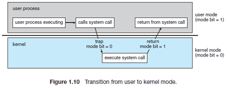
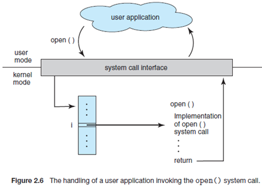
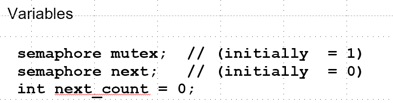
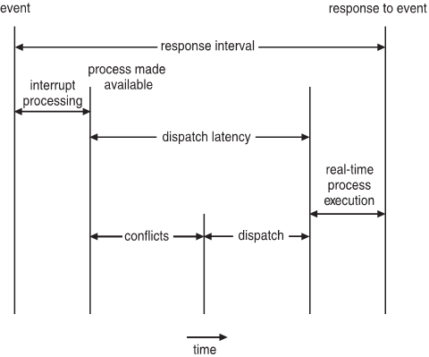
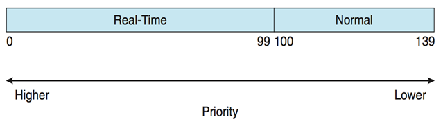
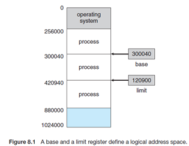
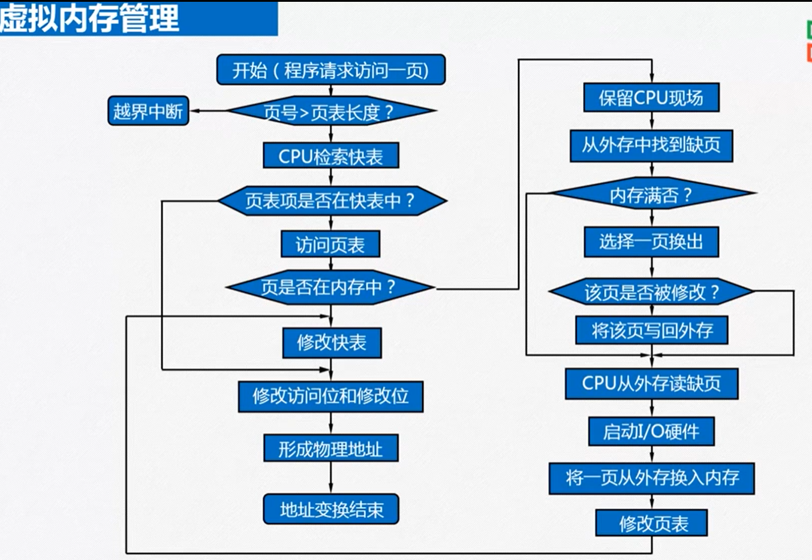
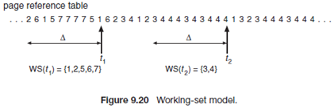
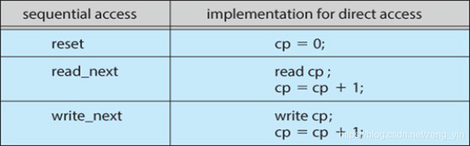

# OperatingSystemReview

[TOC]


> https://www.bilibili.com/video/BV1kJ411E7AQ?from=search&seid=16010825604667189028
>
> https://www.bilibili.com/video/BV18X4y1u7aU?from=search&seid=13603946897090647412
>
> 西安交通大学:
>
> https://www.bilibili.com/video/BV1JQ4y1K7Tn?p=37&spm_id_from=pageDriver
>
> Exercise
>
> https://www.zhihu.com/column/c_1242426573364064256

## 第一部分　概论

### 第1章　导论 2

#### 　1.1操作系统的功能 2

**操作系统**是作为计算机和计算机用户之间的中介的程序。操作系统的目的是为用户提供方便且有效地执行程序的环境。

计算机系统可以大致分为4个组成部分：计算机硬件，操作系统，系统程序与应用程序和用户。


**硬件**，如**中央处理单元（central processing unit，CPU）、内存（memory）、输入输出设备（input/output devices，I/O devices），**为系统提供基本的计算资源。**应用程序**规定了用户按何种方式使用这些资源。操作系统控制和协调各用户的应用程序对硬件的使用。

#####==1.1.1　用户视角 2==

#####==1.1.2　系统视角 3==

#####==1.1.3　操作系统的定义 4==

A program that acts as an intermediary between a user of a computer and the computer hardware


OS is a **resource allocator**.Manages all resources.Decides between conflicting requests for efficient and fair resource use.

OS is a **control program**Controls execution of programs to prevent errors and improper use of the computer.

#### 1.4　操作系统的结构 13

##### 单处理器系统

##### 多处理器系统

**多处理器系统（也称为并行系统parallel system）**或**紧耦合系统（tightly coupled system）**。这类系统有多个紧密通信的CPU，它们共享计算机总线，有时还有时钟，内存和外设等。

多处理器有三个主要优点：**增加吞吐量**、**规模经济**、**增加可靠性**

现在使用的多处理系统主要有两种类型。**非对称处理和对称处理**

**非对称处理（asymmetric multiprocessing）：**即每个处理器多有各自特定的任务。一个主处理器控制系统，其他处理器或者向主处理器要任务或做预先定义的任务。这种方案称为主-从关系。主处理器调度从处理器并安排工作。

**对称多处理（symmetric mutiprocessing,SMP）:**每个处理器都要完成操作系统的所有任务。SMP意味着处理器对等，处理器之间没有主-从关系。


**刀片服务器（blade server）：**将多处理器版，I/O板和网络板全部置于同一底板上。它和传统多处理器系统的不同在于，每个刀片处理器独立启动并运行各自的操作系统。


##### 集群系统

多CPU系统的另一种类型是**集群系统（clustered system）。**与多处理系统一样，集群系统将多个CPU集中起来完成计算任务。然而，集群系统与多处理器系统不同，它是有两个或多个独立的系统耦合起来的。集群计算机共享存储并通过局域网络连接或更快的内部连接。

#### 计算机系统操作

现在通用计算机系统由一个或多个CPU和若干设备控制器通过共同的总线相连而成，该总线提供了对共享内存的访问。


每个设备控制器负责一种特定类型的设备（如磁盘驱动器，音频设备，视频显示器）。CPU与设备控制器可以并发工作，并竞争内存周期。为了确保对共享内存的有序访问，需要内存控制器来协调对内存的访问。

  当打开电源或重启时，计算机开始运行，它需要运行一个初始化程序。该初始化程序或**引导程序（bootstrap program）**比较简单，通常位于ROM或EEPROM中，称为计算机硬件中的固件。

它初始化系统中的所有部分，包括CPU寄存器，设备控制器和内存内容。引导程序必须知道如何装入操作系统并开始执行系统。


为了完成这一目标，引导程序必须定位操作系统内核并把它装入内存。接着，操作系统开始执行第一个进程如init，并等待事件的发生。

  事件的发生通常通过硬件或软件**中断（interrupt）**来表示。硬件可随时通过系统总线向CPU发出信号，以触发中断。

软件通过执行特别操作如**系统调用（system call）**也称为**监视器调用（monitor call）**也能触发中断。

  当CPU中断时，它暂停正在做的事并立即转到固定的位置上继续执行。该固定位置通常是中断服务程序开始位置的地址。中断服务程序开始执行，在执行完后，CPU重新执行被中断的计算。时间线路如下：


  中断时计算机结构的重要部分。每个计算机设计都有自己的中断机制，但是有些功能是共同的。中断必须将控制转移到合适的中断处理程序。处理转移的简单方法是调用一个通用子程序以检查中断信息。接着，该子程序会调用相应的中断处理程序。

  处理中断要快，由于只有少量的预定义的中断，所以可使用中断处理子程序的指针表。这样通过指针表可间接调用中断处理子程序，而不需要通过其他中间子程序。通常，指针位于低地址内存（前100左右的位置）。

这些位置包含各种设备的中断处理子程序的地址。这种地址的数组或**中断向量（interrupt vector）**可通关过唯一设备号来索引（对于给定的中断请求），以提供设备的中断处理子程序的地址。

  中断体系结构也保存被中断指令的地址。许多旧的设计简单在固定位置中（或在可用设备号来索引的地址中）保存中断地址。

更为现代化的结构将返回系统堆栈中的地址。如果中断处理程序需要修改处理器状态，如修改寄存器的值，它必须明确地保存当前状态并在返回之前恢复该状态。在处理中断之后，保存的返回地址会装入程序计数器，被中断的计算可以重新开始，就好像中断没有发生一样的。

现代操作系统是由中断驱动的，如果没有进程要执行，没有I/O设备要服务，也没有用户请求要响应，操作系统会静静地等待某件事件的发生。事件总是由中断或陷阱引起的。**陷阱(**或**异常)**是一种软件中断，源于出错（如除数为零或无效的存储访问），或源于用户程序的一个特别请求（完成操作系统服务）。这种操作系统的中断性定义了系统的通用结构。对每一种中断，操作系统中不同的代码决定了将要采取的动作。中断服务程序被用来处理中断。

#### 双重模式操作

  操作系统至少需要两种独立的操作模式：**用户模式(user mode)**和**监督程序模式（monitor mode）(**也称为**管理模式（supervisor mode）、系统模式（system mode）**或**特权模式（privileged mode）)**。

在计算机硬件中增加一个称为**模式位（mode bit）**的位以表示当前模式：监督程序模式（0）和用户模式（1）。

有了**模式位，**就可区分为操作系统所执行的任务和用户所执行的任务。当计算机系统表示用户应用程序正在执行，系统处于用户模式。然而，当用户应用程序需要操作系统的服务（通过系统调用），它必须从用户模式转换过来执行请求



  系统引导时，硬件开始处于内核模式。接着，装入操作系统，开始在用户模式下执行用户进程。一旦出现陷阱或中断，硬件会从用户模式切换到内核模式（即模式位设为0）。因此，只要操作系统获得了对计算机的控制，它就处于内核模式。系统在将控制交还给用户进程时会切换到用户模式（将模式位设为1）。

  双重模式操作提供了保护操作系统和用户不受错误用户程序影响的手段。其实现方式为：将能引起损害的机器指令作为**特权指令（privileged instruction）。**如果在用户模式下试图执行特权指令，那么硬件并不执行指令，而是认为该指令非法，并将其以陷阱的方式通知操作系统。

  转换到用户模式就是一个特权指令，其他的例子包括I/O控制、定时器管理和中断管理。

  最初的控制发生在操作系统中，在此指令以内核模式来执行。当控制权转到一个用户应用程序后，模式变为用户模式。最后，通过中断、陷阱或系统调用将控制权返回给操作系统。

  系统调用为用户程序请求操作系统代表用户程序完成预留给操作系统的任务提供了方法。系统调用可以采用多种途径，具体采用哪种途径取决于由下层处理提供的功能。不管哪种途径，它都是一种进程请求操作系统执行动作的方法。系统调用通常采用陷阱到中断向量中的一个指定位置的方式。该陷阱可以由普通trap指令来执行。

  当系统调用被执行时，硬件会将它作为软件中断。控制权会通过中断向量转交到操作系统的中断处理程序，模式位设置成内核模式。系统调用服务程序是操作系统的一部分。内核检查中断指令以确定发生了什么系统调用：参数表示用户程序请求什么类型的服务。请求所需的其他信息可通过寄存器、堆栈或内存（内存的指针柯传递给寄存器）来传递。内核检查参数是否正确和合法，再执行请求，然后将控制返回到系统调用之后的指令。

####   定时器

必须确保操作系统能维持对CPU的控制，也必须防止用户程序陷入死循环或不调用系统服务，并且不将控制权返回到操作系统。为了实现这一目标，可使用**定时器（timer）。**可将定时器设置为给定时间后中断计算机，时间段可以是固定（例如1/60s）或可变的（例如，1ms-1s）。**可变定时器（variable timer）**一般通过一个固定速率的时钟和计数器来实现。操作系统设置计数器，每经过一个时间周期，计数器都要递减，当计数器的值为0时，产生中断。例如，对于10位的计数器和1ms精度的时钟，可允许在1-1024ms的时间间隔内产生中断，时间步长为1ms。

  操作系统在将控制权交给用户前，应确保设置好定时器以便产生中断。如果定时器产生中断，那么控制权会自动交给操作系统，而操作系统可以将中断作为致命错误来处理，也可以给予用户更多的时间，显然，用于修改定时器的指令时特权指令。

  因此，可以使用定时器来防止用户程序运行时间过长。一种简单技术是程序所允许执行的时间来初始化计数器。定时器每秒产生一次中断，计数器相应减1.只要计数器的值为正，控制就返回到用户程序。当计数器的值为负时，操作系统会中止程序执行，因为它超过了所赋予时间的限制。

####1.6　进程管理 17

程序在未被CPU执行之前不会做任何事。如前面提到过的，**处于执行中的程序称为进程**。

  进程需要一定的资源（包括CPU时间，内存，文件，I/O设备）以完成其任务。这些资源可以在进程创建时分配给进程，也可以在执行进程时分配给进程。除了在创建时得到各种物理和逻辑资源外，进程还可以接受传输过来的各种初始化数据（输入）。当进程中止时，操作系统将收回所有可再用的资源。

  程序本身并不是进程，程序是被动的实体，如同存储在磁盘上的文件内容，而进程是一个活动的实体。单线程进程具有一个**程序计数器**来明确下一个执行的指令。这样一个进程的执行必须是连续的。

CPU一个接着一个地执行进程的指令，直至进程终止。再者，在任何时候，最多只有一个指令代表进程被执行。因此，尽管两个进程可能与同一个程序相关联，然而这两个进程都有其各自的执行顺序。

多线程程序具有多个程序计数器，每一个指向下一个给定线程要执行的指令。

  进程是系统工作的单元。系统由多个进程组成，其中一些是操作系统进程（执行系统代码），其余的是用户进程（执行用户代码）。

所有这些进程可以潜在地并发执行，如通过在单CPU上采用CPU复用来实现。

操作系统负责下述与进程管理相关的活动：

+ 创建和删除用户进程和系统进程
+ 挂起和重启进程
+ 提供进程同步机制
+ 提供进程通信机制
+ 提供死锁处理机制

####1.7　内存管理 17

内存是现代计算机系统操作的中心。内存是一个大的字节或字的数组，其大小从数十万到数十亿。每个字节或字都有其自己的地址。

内存是可以被CPU和I/O设备共同快速访问的数仓库。中央处理器在获取指令周期时从内存中读取指令，而在获取数据周期时对内存的数据进行读出或写入。

内存通常是CPU所能直接寻址和访问的唯一大容量存储器。

  如果一个程序要执行，那么它必须先变换成绝对地址并装入内存。随着程序的执行，进程可以通过产生绝对地址来访问内存中的程序指令和数据。

最后，程序终止，其内存空间得以释放，并且下一个程序可以装入并得以执行。

  为了改善CPU的利用率和计算机对用户的相响应速度，通用计算机必须在内存中保留多个程序，从而产生对内存管理的需要。内存管理有多种不同的方案。

这些方案反映出各种各样的方法，所有特定算法的有效率取决于特定环境。对于某一特定系统的内存管理方法的选择，必须考虑许多因素—尤其是系统的硬件设计。每个算法都要求特定的硬件支持。

操作系统负责下列有关内存管理的活动：

+ 记录内存的哪部分正在被使用及被谁使用
+ 当有内存空间时，决定哪些进程可以转入内存
+ 根据需要分配和释放内存空间

####1.8　存储管理 18

算机程序必须在内存(或**随机访问内存(random access memory,RAM)**中以便于运行。

内存是处理器可以直接访问的唯一大容量存储区域（数兆到数千兆）。它通常是用被称为**动态随机访问内存（dynamic random access meimory,DRAM）**的半导体技术来实现的，是一组内存字的数组，每个字都有其地址。

通过对特定内存地址执行一系列load或store指令实现交互。指令load能将内存中的字移到CPU的寄存器中，而指令store能将寄存器的内容移到内存。除了显示使用load和store外，CPU可自动从内存中装入指令来执行。

  一个典型指令执行周期（如冯诺依曼体系结构上执行时）首先从内存中获取指令，并保存在**指令寄存器（instruction register）中。**接着指令被解码，并可能导致从内存中获取操作数或将操作数保存在内部寄存器中。在指令完成对操作数的执行后，其结果可以存回到内存。

注意内存单元只看见内存地址流，它并不知道它们是如何产生的（通过指令计数器、索引、间接、常量地址等），或它们是什么地址（指令或数据）。相应地，可忽视程序如何产生内存地址，只对程序运行所生成的地址序列感兴趣。

  存储设备的层次结构如下：


#####1.8.1　文件系统管理 18

文件管理是操作系统最为常见的组成部分。计算机可以在多种类型的物理介质上存储信息。磁带，磁盘和光盘是最常用的介质。这些介质都有自己的特点和物理组织。每种介质通过一个设备来控制，如磁盘驱动器或磁带驱动器等，它们都有自己的特点。这些属性包括速度，容量，数据传输率和访问方法（顺序或随机）。

  文件是由创建者定义的一组相关信息的集合。通常，文件表示程序（源程序和目标程序）和数据。数据文件可以是数值的，字符的，字符数值或二进制的。文件可以没有格式，也可以有严格格式。

  操作系统通过管理大容量存储器，如磁盘和磁带及控制它们的设备，来实现文件这一抽象概念。而且，文件通常组成目录以方便使用。最后，当多个用户可以访问文件时，需要控制由什么人及按什么方式（例如，读，写，附加）来访问文件。

操作系统负责下列有关文件管理的活动：
创建和删除文件

+ 创建和删除目录来组织文件
+ 提供操作文件和目录的原语
+ 将文件映射到二级存储上
+ 在稳定存储介质上备份文件

#####1.8.2　大容量存储器管理 19

由于内存太小不能容纳所有数据和程序，再加上掉电会失去所有数据，计算机系统必须提供**二级存储器（secondary storage）**以备份内存。绝大多数现代计算机系统都采用硬盘作为主要在线存储介质来存储程序和数据。操作系统负责下列有关硬盘管理的活动：

+ 空闲空间管理
+ 存储空间分配
+ 银盘调度

#####1.8.3　高速缓存 19

高速缓存是计算机系统的重要概念之一。信息通常保存在一个存储系统中（如内存）。

当使用它时，它会被临时地复制到更快的存储系统—高速缓存中。当需要特定信息时，首先检查它是否在高速缓存中。如果是，可直接使用高速缓存中的信息。否则，使用位于内存中的信息，同时将其复制到告诉缓存中以便下次再用。

  另外，内部可编程寄存器（如索引寄存器）为内存提供了高速缓存。程序员（或编译程序）使用寄存器分配和替换算法以决定哪些信息应在寄存器中而那些应在内存中。

有的高速缓存完全是由硬件实现的。绝大多数系统都有指令高速缓存以保存下一个要执行的指令。没有这一高速缓存，**CPU将会等待多个时钟周期以便从内存中获取指令**。基于类似原因，绝大多数系统在其存储层次结构中有一个或多个高速缓存。

  由于高速缓存大小有限，所以高速缓存管理（cache management）的设计很重要。对高速缓存大小和置换策略的仔细选择可以极大地提高性能。


  内存可用做外存的告诉缓存，因为**外存数据必须先复制到内存才可使用**，数据在移至外外存保存前也必须保存在内存中。永久地驻留在外存上的文件系统数据，可以出现在存储系统的许多层次上。

  存储层次之间的信息移动可以是显式的，也可以是隐式的，这取决于硬件设计和所控制的操作系统软件。例如，高速缓存到CPU和寄存器之间的数据传递通常为硬件功能，无需操作系统的干预。另一方面，磁盘到内存的数据传递通常是由操作系统控制的。

  对于层次存储结构，同样的数据可能出现在不同层次的存储系统上。例如，整数A位于文件B中且需要加1，而文件B位于磁盘上。加1操作这样进行：先发出I/O操作以将A所在的磁盘块调入内存。

之后，A被复制到告诉缓存和硬件寄存器。这样A的副本出现在许多地方：磁盘上，内存中，高速缓存中，硬件寄存器中。一旦加法在内部寄存器中执行后，A的值在不同存储系统中会不同。只有在A的新值从内部寄存器写回磁盘时，A的值才会一样。


  对于同时只有一个进程执行的计算环境，这种安排没有困难，因为对A的访问总是在层次结构的最高层进行。不过，对于多任务环境，CPU会在进程之间来回切换，所以需要十分谨慎以确保当多个进程访问A时，每个进程都得到最近更新的A值。

  对于多处理器环境，这种情况变得更为复杂，因为每个CPU不但有自己的内部寄存器，还有本地高速缓存。对于这种环境，A的副本会同时出现在多个高速缓存中。

由于多个CPU可并发执行，必须确保在一个高速缓存中对A值得更新马上反映在所有其他A所在的高速缓存中。这称为**高速缓存一致性（cache coherency）**，这通常是硬件问题（在操作系统级别之下处理）。

  对于分布式环境，这种情况变得异常复杂。在这种情况下，同一文件的多个副本会出现在多个分布在不同场所的计算机上。

由于各个副本可能会被并发访问和更新，所以必须确保当一处的副本被更新时，所有其他副本应尽可能快地加以更新。

#####1.8.4　I/O系统 21

通用计算机系统由一个CPU和多个设备控制器组成，它们通过共同的总线连接起来。每个设备控制器负责特定类型的设备，可有多个设备与其相连。例如，**SCSI(small computer system interface)**控制器可有7个或更多的设备与之相连。设备控制器维护一定量的本地缓冲存储和一组特定用途的寄存器。设备控制器负责在其所控制的外部设备与本地缓冲存储之间进行数据传递。通常，操作系统为每个设备提供一个设备驱动程序。这些设备驱动程序理解设备控制器，并提供一个设备与其余操作系统的统一接口。

  **DMA(direct memory access,直接内存访问)**是为了解决大块的数据移动，在为这种I/O设备设置好缓冲、指针和计数器后，设备控制器能在本地缓冲和内存之间传送一整块数据，而无需CPU的干预。每块只产生一个中断，来告知设备驱动程序操作已完成，而不是像低速设备那样每个字节产生一个中断。当设备控制器在执行这些操作的时候，CPU可以去完成其他工作。

  一些高端的系统采用交换而不是总线结构。在这些系统中，多个部件可以与其他部件并发对话，而不是在公共总线上争夺周期，此时DMA更为有效。


####1.9　保护与安全 21

如果计算机系统有多个用户，并允许多个进程并发执行，那么必须系统地管理对数据的访问。

为此，系统采用了各种机制确保只有从操作系统中获得恰当授权的进程才可以操作相应的文件，内存段，CPU和其他的资源。

例如，**内存寻址硬件**确保一个进程仅可以在它自己的地址空间内执行，**定时器**确保没有进程能一直占有CPU控制权而不释放它，用户不能访问设备控制寄存器，因而保护了各种外部设备的完整性。

  保护是一种控制进程或用户对计算机系统资源的访问的机制。这个机制必须为强加控制提供一种规格说明方法和一种强制执行方法。

  通过检测组件子系统接口的潜在错误进行保护能够提高可靠性。早期检测接口错误通常能防止已经发生故障的子系统影响其他健康的子系统。一个未受保护的资源无法抵御未授权或不合格用户的访问（或误用）。面向保护的系统会提供辨别授权使用和未授权使用的方法。

  系统可以获得足够的保护，但也会出错和发生不适合的访问。考虑一个授权信息被偷窃的用户（向系统标识自己的方法），其数据可能被复制或删除，但文件和内存保护仍在运行。

**安全（security）**的主要工作是防止系统不受外部或内部攻击。这些攻击范围很广，包括病毒和蠕虫、拒绝服务攻击（使用所有的系统资源以致合法的用户不能使用）、身份偷窃、服务偷窃（未授权的系统使用）。在有些系统中，阻止这些攻击需要考虑操作系统的功能，而另外一些系统则采用策略或者软件阻止方法。由于安全事件急剧增长，操作系统的安全问题成了快速增长的研究和实现的领域。

  保护和安全需要系统能区分它的所有用户。绝大多数操作系统维护一个用户和相关用户标识（user ID,UID）的链表。

在Windows NT中，这称为**安全ID（Secure ID,SID）。**这些数值对每个用户来说是唯一的。当用户登录到系统，鉴别步骤会确定用户的合适ID。

  有些环境中，需要区分用户集而不是单个用户。例如，UNIX系统上一个文件的拥有者可能被允许对文件进行所有操作，而有些选定的用户只能读文件。

为此，需要定义一个组名以及属于该组的用户集。组功能可用系统范围内的组名列表和**组标识（group idendity）**来实现。一个用户可以属于一个或多个组，这取决于操作系统设计方法。用户的组ID也包括在每一个相关的进程和线程中。

  在一般的系统使用中，用户ID和组ID就足够了。但用户有时需要**升级特权（escalate privilege）**来获取对一个活动的额外特权。

例如，该用户可能需要访问受限的设备。操作系统提供了各种允许升级特权的方法。例如，在UNIX系统中，程序的setuid属性使得程序以文件所属用户的ID来运行，而不是当前的用户ID。

进程用此**有效UID（effective UID）**运行，直至它关掉特权或终止。

####1~~.10　内核数据结构 22~~

#####~~1.10.1　列表、堆栈及队列 22~~

#####~~1.10.2　树 23~~

#####~~1.10.3　哈希函数与哈希表 23~~

#####~~1.10.4　位图 24~~

####1.11　计算环境 24

随着PC变得更快、更强大和更便宜，设计者开始抛弃中心系统结构。与中心系统相连的终端开始被PC所取代。相应地，过去为中心系统所处理的用户接口功能也被PC所取代。因此，今天中心系统成为**服务器系统（server system）**以满足**客户机系统（client system）**的请求。这种称为**客户机-服务器（client-server）**系统的专有分布式系统


服务器系统可大致分为计算服务器和文件服务器：

**计算服务器系统**提供了一个接口，以接收用户所发送的执行操作的请求（如读数据），执行操作，并将操作结构返回给客户机。运行响应客户机数据请求的数据库的服务器就是一个这样的例子。

**文件服务器系统**提供文件系统接口，以便客户机能创建、更新、访问和删除文件。Web服务器就是该系统的一个例子，它将文件传送到正在运行Web浏览器的客户机。

  分布式系统的另一种结构是**对等（p2p）系统**模式。采用该模式，客户机和服务器彼此并不区别，而是系统中的所有节点都是对等的，每一个都可作为客户机或服务器，这取决于它是请求还是提供服务。对等系统对于传统的客户机-服务器系统提供了更好的性能。在客户机-服务器系统中，存在服务器瓶颈问题；但在对等系统中，可以由分布在网络中的多个节点来提供服务。

  为了加入对等系统，节点必须先加入**对等网络。**一旦节点加入对等网络，它就可以开始向网络中的其他节点提供服务或请求服务。

  当一个结点加入网络时，它用网络集中查询服务来注册它的服务。任何需要某种服务的节点首先与此集中查询服务联系，以决定哪个节点能提供此服务。剩下的通信就在客户机和服务者之间进行。

  作为客户机的对等行动必须首先通过向所有网络中的其他节点广播服务请求，以发现哪个节点提供所需的服务。提供该服务的节点（或多个节点）响应发出此请求的对等节点。为了支持该方法，必须提供一种发现协议（discovery protocol）,以允许网络上的对等节点能被发现服务。

  Web计算的实现也导致了新一类设备的出现，如**负载平衡器（load balancer）,**它能在一组相似的服务器之间实现负荷分配。操作系统过去只能作为Web客户机，现在也发展成为即可做Web服务器，又可作为客户机，通常因为用户需要支持Web驱动，所以增加了设备的复杂性。

#####1.11.1　传统计算 24

#####1.11.2　移动计算 25

#####1.11.3　分布计算 26

 分布式系统是将一组物理上分开来的，各种可能异构的计算机系统通过网络连接在一起，为用户提供系统所维护的各种资源的计算机集合。访问共享资源增加了计算速度、功能、数据可用性及可靠性。有些操作系统将网络访问简化为一种文件访问，网络细节包含在网络接口驱动程序中，而其他的系统采用用户调用网络函数的方式。通常，系统包含两种模式组合-----如FTP和NFS。生成分布式系统的协议通常会影响系统的效用和普及程序。

  网络，简单来说，就是两个或多个系统之间的通信路径。分布式系统通过网络提供功能。网络随所使用的协议，节点距离，传输介质的变换而不同。TCP/IP是最常用的网络协议，ATM和其他协议也有所应用。同样，操作系统对协议的支持也不同。绝大数操作系统（如Windows和UNIX操作系统）支持TCP/IP。有的系统只支持专用协议以满足其需求。对于操作系统而言，一个网络协议只简单地需要一个接口设备，如网络适配器，加上管理它的驱动程序以及按网络协议处理数据的软件。

  网络可根据节点间的距离来划分。**局域网（local-area network，LAN）**位于一个房间、一楼层或一栋楼内。**广域网（wide-area network,WAN）**通常位于楼群之间、城市之间或国家之间。

  有些操作系统采用了比只提供网络连接更进一步的网络和分布式系统的概念。**网络操作系统（network operating system）**就是这样一种操作系统。

#### ~~1.12　开源操作系统 30~~

### 第2章　操作系统结构 38


#### ==2.1　操作系统的服务 38==

一组操作系统服务提供对用户很有用的函数:
**用户界面**：所有的操作系统都有**用户界面（user interface,UI）。**

用户界面可以有多种形式。一种是**命令行界面（command-line interface,CLI）,**它采用文本命令，并用一定的方法输入（即一种允许输入并编辑的命令）。

另一种是批界面，其中控制这些命令和命令的指令被输入文件中，通过执行文件来实现。最为常用的是**图形用户界面（graphical user interface,GUI）,**

此时界面是一个视窗系统，它具有定位设备来指挥I/O，从菜单来选择，选中部分并用键盘输入文本。有些系统还提供两种甚至这三种界面。

**程序执行：**系统必须能将程序装入内存并运行程序。程序必须能结束执行，包括正常或不正常结束（指明错误）。

**I/O操作：**运行程序可能需要I/O，这些I/O可能涉及文件或设备。对于特定设备，需要特定的功能。为了提高效率和进行保护，用户通常不能直接控制I/O设备。因此，操作系统必须提供进行I/O操作的方法。

**文件系统操作：**文件系统特备重要。很明显，程序需要读写文件和目录，也需要根据文件名来创建和删除文件、搜索一个给定的文件、列出文件信息。最后有些程序还包括了基于文件所有权的允许或拒绝对文件或目录的访问管理。

**通信：**在许多情况下，一个进程需要与另一个进程交换信息。这种通信有两种主要形式。一种是发生在同一台计算机运行的两个进程之间。另一种是运行在由网络连接起来的不同的计算机上的进程之间。通信可以通过共享内存来实现，也可以通过消息交换技术来实现（对于消息交换，消息包通过操作系统在进程之间移动）。

**错误检测：**操作系统需要知道可能出现的错误。错误可能发生在CPU或内存硬件（如内存错误或电源失败）、I/O设备（磁盘奇偶错出错，网络连接出错，打印机缺纸）和用户程序中（如算术溢出，试图访问非法内存地址，使用CPU时间过长）。对于每种类型的错误，操作系统应该采取适当的动作以确保正确和一致的计算。调试工具可以在很大程度上加强用户和程序员有效使用系统的能力。另外，还有一组操作系统函数，它们不是帮助用户而是确保系统本身高效运行。多用户系统通过共享计算机资源可以提高效率。

**资源分配：**当同时又多个用户或多个作业运行时，系统必须为它们中的每一个分配资源。操作系统管理多种不同的资源。有的资源（如CPU周期，内存和文件存储）可能要有特别的分配代码，而其他的资源（如I/O设备）可能只需要通用的请求和释放代码。例如，为了最好地使用CPU，操作系统需要采用CPU调度算法以考虑CPU的速度、必须执行的作业、可用的寄存器和其他因素。还有一些其他程序可以分配打印机，Modem、USB存储设备和其他外设。

**统计：**需要记录哪些用户使用了多少和什么类型的资源。这种记录可用于记账（以便让用户交费），或用于统计数据。使用统计数据对研究人员很有用。可用于重新配置系统以提高计算服务能力。

**保护和安全：**对于保存在多用户或网络连接的计算机系统中的信息，用户可能需要控制信息的使用。当多个进程并发执行时，一个进程不能干预另一个进程或操作系统本身。保护即确保所有对系统资源的访问是受控的。系统安全不受外界侵犯也很重要。这种安全从用户向系统证明自己（利用密码）开始，以获取对系统资源访问权限。安全也包括保护外部I/O设备，如Modem和网络适配器不受非法访问，并记录所有非法闯入的企图。如果一个系统需要保护和安全，那么系统中的所有部分都要预防。一条链子的强度与其最弱的链环相关。

#### 2.3　系统调用 43

**系统调用（system call）**提供了操作系统提供的有效服务界面。这些调用通常用C或C++编写，当然，对底层的任务（如必须直接访问的硬件），可能会汇编语言指令的形式提供。

一个从一个文件读取数据并复制到另一个文件的简单程序的系统调用过程


  不过，绝大多数程序员不会看到这些细节。一般应用程序开发人员根据**应用程序接口(API)**设计程序。API是一系列适用于应用程序员的函数，包括传递给每个函数的参数及其返回的程序员想得到的值。有三种应用程序员常用的API：适用于Windows系统的Win32API，适用于POSIX系统的POSIX API（包括几乎所有的UNIX，Linux和Mac OS X版本），以及用于设计运行于Java虚拟机程序的Java API。


  在后台组成API的函数通常为应用程序员调用实际的系统调用。例如，Win32函数CreateProcess()(用于生成一个新的进程)实际上调用Windows内核中的NTCreateProcess()系统调用。为什么一个应用程序员宁可根据API来编程，而不是调用实际的系统调用？

这有几个原因。根据API编程的好处之一在于程序的可移植性，一个采用API设计程序的应用程序员希望她的程序能在任何支持同样API的系统上编译并执行（尽管事实上，体系的不同常使其很困难）。此外，对一个应用程序员而言，实际的系统调用比API更为注重细节和困难。尽管如此，调用API中的函数和与其相关的内核系统调用之间还常常存在紧密的联系。事实上，许多Win32和POSIX的API与UNIX，Linux和Windows操作系统提供的自身的系统调用是相类似的。

  绝大多数程序设计语言的运行时支持系统（与编译器一起的预先构造的函数库）提供了系统调用接口，作为应用程序与操作系统的系统调用的链接。

**系统调用接口截取API的函数调用，并调用操作系统中相应的系统调用。**通常，每个系统调用一个与其相关的数字，系统调用接口根据这些数字维护一个列表索引。然后，系统调用接口来调用所需的操作系统内核中的系统调用，并返回系统调用状态及其他返回值。

  **调用者不需要知道如何执行系统调用或者执行过程中它做了什么，它只需遵循API并了解执行系统调用后，系统做了什么。**因此，对于程序员，通过API操作系统接口的绝大多数细节被隐藏起来，并被执行支持库所管理。API，系统调用接口和操作系统之间的关系如下，它表现了操作系统如和处理一个调用open()系统调用的用户应用



  系统调用根据使用的计算机的不同而不同。通常，需要提供比所需系统调用识别符更多的信息。这些信息的具体类型和数量根据特定操作系统和调用而有所不同。例如，为了获取输入，可能需要指定作为源的文件或设备和用于存放输入的内存区域的地址和长度。当然，设备或文件长度也可以隐含在调用中。

  向操作系统传递参数有三种方法。

最简单的是通过寄存器来传递参数。不过有时，参数数量会比寄存器多。这时，这些参数通常存在内存的块和表中，并将块的地址通过寄存器来传递。Linux和Solaris就采用这种方法。

参数也可通过程序放在或压入堆栈中，并通过操作系统弹出。有的系统采用块或堆栈方法，因为这些方法并不限制所传递参数的数量或长度。

 


#### 2.4　系统调用的类型 46

系统调用大致可分成五大类：**进程控制、文件管理、设备管理、信息维护和通信。**


##### ==2.4.1　进程控制 46==

运行程序需要能正常或非正常地中断其执行（end或abort）。如果一个系统调用被用来非正常地中断执行程序，或者程序运行碰到问题而引起错误陷阱，那么可能会在内存信息转储并产生一个错误信息。

内存信息转储通常写到磁盘上，并被**调试器**（帮助程序员发现和纠正错误的系统程序）检查和确定问题原因。不管是正常还是非正常中止，操作系统都必须将控制权转交给调用命令解释器。命令解释器接着读取下一个命令。

对于交互系统，命令解释器只不过简单地读取下一个命令，因为假定用户会采取合适的命令以处理错误。对于GUI系统，一个弹出窗口提醒用户出错并请求建议。对于批处理系统，命令解释器通常终止整个作业并继续下一个作业。

当出现一个错误的时候，有的系统允许控制卡指出一个具体的恢复动作。**控制卡**是一个批处理系统概念，它是一个管理进程执行的命令。

如果程序发现输入有错并想要非正常地终止，那么它可能也需要定义一个错误级别。更加严重的错误可以用更高级的错误参数来表示。

如果将正常终止定义为级别为0的错误，那么可能将正常和非正常终止混合起来。命令解释器和下一个程序能利用错误级别来自动决定下一个动作。

  执行一个程序的进程或作业可能需要装入和执行另一个程序。这一点允许命令解释器来执行一个程序，该命令可通过用户命令、鼠标点击或批处理命令来表示。

当装入程序终止时，一个有趣的问题是控制权返回到哪里。这个问题与现有程序是否丢失、保存或与新程序继续并发执行有关。

  如果新程序终止时控制权返回到现有程序，那么必须保存现有程序的内存镜像。因此，事实上创建一个机制以便一个程序调用另一个程序。

如果两个程序并发继续，那么创建一个新作业和进程以便多道执行。通常，有的系统调用专门用于这一目的（如createprocess或submit job）。

  如果创建一个新作业或进程，或者一组作业或一组进程，那么应该能控制它的执行。这种控制要求能决定和重置进程或作业的属性，包括作业的优先级、最大允许执行时间等（get process attributes和set process attributes）。如果发现所创建的进程不正确或不再需要，那么也要能终止它（terminate process）。


  创建了新作业和进程之后，可能需要等待其完成执行。这需要等待一定时间（等待时间），更有可能需要等待某个事件的出现（等待事件）。当事件出现时，作业或进程就会响应（响应事件）。

  另一组系统调用有助于调试程序。许多系统提供转储内存信息的系统调用。这有助于调试。程序trace在执行时能列出所用的每条执行的指令，但是只有少数几类系统提供。即使微处理器也提供一个称为单步的CPU模式，这种模式在每个指令运行后能执行一个陷阱。该陷阱通常为调试程序所用。

  许多操作系统都提供程序的时间表，以表示一个程序在某个位置或某些位置执行所花的时间。时间表要求具有跟踪功能或定时时间中断。在每次出现定时中断时，会记录程序计数器的值。如果有足够频繁的时间中断，就可得到程序各部分所用时间的统计数据。


##### ~~2.4.2　文件管理 49~~

##### ~~2.4.3　设备管理 50~~

##### ~~2.4.4　信息维护 50~~

##### 2.4.5　通信 50

有两种通信模型：消息传递模型和共享内存模型。对于**消息传递模式（message-passing model）,**通信进程通过彼此之间交换消息来交换信息。直接或间接地通过一个共同的邮箱，消息可以在进程之间得到交换。在通信前，必须先打开连接。必须知道另一个通信实体的名称，它可能是同一CPU的另一个进程，也可能是通过与网络相连的另一计算机上的进程。网络上的每台计算机都有一个**主机名，**这通常是已知的。同样，主机也有一个网络标识，如IP地址。类似的，每个进程也有**进程名，**它通常转换成标识符以便操作系统引导。系统调用get hostid和get processid用于这一转换。这些标识符再传递给文件系统提供的通用open和close系统调用，或open connection和close connection系统调用，这是由系统的通信模型决定的。接受方进程通常通过accept connection调用来允许通信。能接收连接的进程为特殊用户的后台程序，这些程序是专用的系统程序。它们执行wait for connection调用，当有连接时会被唤醒。通信源被称为客户机，而接受方则被称为服务器，通过read message和write message系统调用来交换消息。close connection 调用将终止通信。

  对于**共享内存模型（shared-memory model）**,进程使用shared memory create和shared memory attach系统调用来获得其他进程所拥有的内存区域的访问权。

##### ~~2.4.6　保护 51~~

#### 2.5　系统程序 51

最底层是硬件，上面是操作系统，接着是系统程序，最后是应用程序。系统程序提供了一个方便的环境，以开发程序和执行程序。其中一小部分只是系统调用的简单接口，其他的可能是相当复杂的。它们主要分为以下几类：

**文件管理：**这些程序创建、删除、复制、重新命名、打印、转储、列出和操作文件和目录。

**状态信息：**一些程序从系统那里得到日期、时间、可用内存或磁盘空间的数量、用户数或类似状态信息。另一些更为复杂，能提供详细的性能、登录和调试信息。通常，这些信息经格式化后，再打印到终端、输出设备或文件，或在GUI的窗体上显示。有些系统还支持**注册表，**它被用于存储和检索配置信息。

**文件修改：**有多个编辑器可以创建和修改位于磁盘或其他存储设备上的文件内容。也可能有特殊的命令被用于查找文件内容或完成文本的转换。

**程序语言支持：**常用程序设计语言（如C，C++，Java，Visual Basic和Perl等）的编译程序，汇编程序，调试程序和解释程序通常与操作系统一起提供给用户。

**程序装入和执行：**一旦程序汇编或编译后，它必须转入内存才能执行。系统可能要提供绝对加载程序、重定位加载程序、链接编辑器和覆盖式加载程序。系统还需要有高级的语言或机器语言的调试程序。

**通信：**这些程序提供了在进程、用户和计算机系统之间创建虚拟连接的机制。他们允许用户在互相的屏幕上发送消息，浏览网页，发送电子邮件，远程登录，从一台机器向另一台机器传送文件。

  绝大多数用户所看到的操作系统是由应用和系统程序而不是系统调用所决定的。

#### ~~2.6　操作系统的设计与实现 52~~

##### ~~2.6.1　设计目标 52~~

##### ~~2.6.2　机制与策略 53~~

##### ~~2.6.3　实现 53~~

#### 2.7　操作系统的结构 54

##### 2.7.1　简单结构 54

#### 简单结构


 

 

  另一个受限结构的例子是原始的UNIX操作系统。UNIX是另一个最初受到硬件功能限制的系统。它由内核和系统程序两个独立部分组成。内核进一步分成为一系列接口和驱动程序。物理硬件之上和系统调用接口之下的所有部分作为内核。内核通过系统调用以提供文件系统，CPU调度，内存管理和其他操作系统功能。


##### 2.7.2　分层方法 55

采用适当的硬件支持，操作系统可以分成比原来MS-DOS和UNIX所允许的更小和更合适的模块。这样操作系统能提供对计算机和使用计算机的应用程序更多的控制。实现人员能更加自由地改变系统内部工作和创建模块操作系统。采用自顶向下方法，可先确定总的功能和特征，再划分成模块。隐藏信息同样很重要，因为它在保证子程序接口不变和子程序本身执行其功能的前提下，允许程序员自由地实现底层函数。

  系统模块化有许多方法。一种方法是**分层法，**即操作系统分成若干层（级）。


  操作系统层可作为抽象对象来实现，该对象包括数据和操作这些数据的操作。

##### 2.7.3　微内核 56

微内核将所有非基本部分从内核中移走，并将它们实现为系统程序或用户程序。微内核通常包括最小的进程和内存管理以及通信功能。

  微内核的主要功能是使客户程序和运行在用户空间的各种服务之间进行通信。通信以消息传递形式提供。

  微内核方法的好处之在于便于扩充操作系统。所有新服务可以在用户空间增加，因而并不需要修改内核。当内核确实需要改变时，所做的改变也很小，因为微内核本身很小。


##### 2.7.4　模块 57

最新的操作系统设计方法是面向对象编程技术来生成模块化的内核。这里内核有一组核心部件，以及在启动或运行时对附加服务的动态链接。这种方法使用动态加载模块，并在现代的UNIX,如Solaris,Linux和Mac OS X中很常见。


Solaris操作系统结构被组织为7个可加载的内核模块围绕一个核心内核构成

+ 调度类
+ 文件系统
+ 可加载的系统调用
+ 可执行格式
+ STREAMS模块
+ 杂项模块
+ 设备和总线驱动

这样设计允许内核提供核心服务，也能动态地实现特定的功能。例如，特定硬件的设备和总线驱动程序可以加载给内核，而对各种文件系统的支持也可作为可加载的模块加入其中。所得到的结果就好像一个分层系统，它的每个内核部分都有被定义和保护的接口。

但它比分层系统更为灵活，它的任一模块都能调用任何其他模块。进一步讲，这种方法类似微内核方法，核心模块只有核心功能以及其他模块加载和通信的相关信息，但这种方法更为高效，因为**模块不需要调用消息传递来通信。**

##### ~~2.7.5　混合系统 58~~

#### 2.8　~~操作系统的调试 60~~

##### ~~2.8.1　故障分析 60~~

##### ~~2.8.2　性能优化 60~~

##### ~~2.8.3　DTrace 61~~

#### 2.9　操作系统的生成 63

对于某个特定的计算机场所，必须要配置和生成系统，这一过程有时称为**系统生成（system generation SYSGEN）**。(客制化系统)

#### 2.10　系统引导(启动) 64

在生成操作系统后，它必须要为硬件所使用。

但是硬件如何知道内核在哪里，或者如何装入内核？装入内核以启动计算机的过程称为引导系统。

绝大多数计算机都有一小块代码，它称为**引导程序**或**引导装载程序**。这段代码能定位内核，将它装入内存，开始执行。

有的计算机系统，如个人计算机，采用两步完成：一个简单的引导程序从磁盘上调入一个复杂的引导程序，而后者再装入内核。

当CPU接收到一个重置事件时，例如它被加电或重新启动，具有预先定义内存位置的指令寄存器被重新加载，并在此开始执行。该位置就是初始引导程序所在。

该程序为只读存储器（ROM）形式，因为系统启动时RAM处于未知状态。由于不需要初始化和不受计算机病毒的影响，用ROM很方便的。

引导程序可以完成一系列任务。通常，一个任务要运行诊断程序来确定机器的状态。如果诊断通过，程序可按启动步骤继续进行。系统的所有部分都可以被初始化，从CPU寄存器到设备控制器，以及内存的内容。最后，操作系统得以启动。

对于大型操作系统（包括大多数通用的操作系统，如Windows，Mac OS X 和 UNIX）或经常改变的系统，引导程序被存储在固件中，而操作系统保存在磁盘上。此时，引导程序运行诊断程序，它具有能够从磁盘固定位置（0区块）读取整块信息到内存的代码，并从引导块执行代码。存储在引导块的程序多半足够复杂，可以将一个完整的操作系统装载到内存并开始执行。

既然完全的引导程序已被装入，它可以扫描文件系统以找到操作系统内核，将之装入内存，启动并执行。只有到了这个时候才能说系统开始运行了。

## 第二部分　进程管理

### 第3章　进程 72

#### 3.1　进程概念 72

##### 1. 如何理解进程？

进程在直观的概念上，进程就是运行起来的程序。

```undefined
  强调：程序的本身不是进程，程序只是被动实体，它是磁盘上包含的一系列的指令的文件。
       进程是活动的实体，具有一个程序计数器用于表示下个执行命令和一组可以描述当前进程状态的信息。
                                                  -------《操作系统概念精要》
```

个人理解：程序好比一个机器人，只是一堆机械，进程好比一个安装了电池的机器人，他们有了自己运行的一些状态信息。

##### 2.操作系统是如何把CPU 抽象成进程的？

回答这个问题，一定要搞懂两个概念，就是物理CPU和逻辑CPU。
 物理CPU好理解，它就是实际运行在物理机上的可以运行指令的东西。
 当一个程序在运行的时候，他在CPU上运行一般分为，取指，解码和运行三个部分。和这三个在运行的时候需要用到一些寄存器，和程序计数器一起其他在运行时需要的一些信息。
 当在它的运行时间周期我们可以进行一个快照，这个可以认为CPU处于运行状态。
 我们假设这个时候将这个世界静止下来，把这些寄存器和程序计数器一起其他的堆栈信息，一起它的运行状态进行记录，那么我们用包含这些信息的结构体就可以 抽象出来CPU的状态，从而对CPU进行了一个抽象。我们把保存这个CPU状态的结构成为程序控制块（PCB）。

###### 3. 如何理解内核态和用户态？如何理解 用户线程和内核线程？

根据书上和字面上的意思，内核态可以执行CPU的指令集的全部，用户态是只可以执行CPU指令的集的部分子集，比如，内部和I/O以及PSW（程序计数器寄存器）是不可以修改。他要访问物理硬件必须通过系统调用，切换到内核态。
 了解了内核态和用户态，就以此类推。类比用户线程和内核线程。
 用户线程就是运行在用户态的，内核线程是运行在内核态的。

###### 重要：

在讨论进程的时候没有用户进程和内核进程的讨论，其实它是隐式存在的，因为当用户进程执行系统调用的时候，他就要切换到内核态，进行指令的操作。如果细分的话，他在进程内是有一个用户线程和内核线程的，内核线程是专门为了执行系统调用而服务的。
 其实上面说的那个就是最基本的一对一的线程模型。
 所以在理解这个用户线程和内核线程的时候，只要记住，内核线程是用来为用户线程执行的系统调用来服务的就会对很多问题有所理解。
 类似的也就可以理解线程的 多对一，和多对多模型进行理解。

###### 4. 当父进程创建子进程后，父子进程会共享那些数据？

父进程在创建子进程的时候，一般子进程是父进程的一个副本，当执行数据的时候
 他会有写时拷贝这么一说，这时，他的变量和堆栈，会被重新拷贝出来一份，但是有编程的同学都应该知道有深浅拷贝， 这里的拷贝就类似与浅拷贝，它指针指向的地方不会进行复制，所以对于它的PCB里面包含的文件描述符指向的I/O设备的是不会被复制一份的。理解了深浅拷贝和PCB 里面包含的数据就很会很好的理解这个问题。

###### 5.同一个进程内的线程之间共享哪些数据？

每个线程都有自己的程序计数器，和寄存器以及堆栈信息。但是他们都是共享的进程的地址空间，堆内存，代码段，数据段和打开的文件以及信号。


thread_1.png

###### 6. 如何理解进程是系统分配资源的基本单位，线程是CPU执行的最小单位？

地址空间是在进程的层级提出的，它是在进程创建的时候进行分配的。线程的创建时在线程库的基础上实现的，并不存在资源的分配。
 CPU的执行，都是根据程序计数器和周边的寄存器共同决定那一条质量来执行的，每个线程有自己的程序计数器和寄存器，那说明只有一个线程就能完全确定CPU执行哪条指令。

##### 3.1.1　进程 72

**进程**是执行的程序，这是一种非正式的说法。进程不只是程序代码，程序代码有时被成为**文本段(text section)**（或者代码段(code section))。进程还包括当前活动，如**程序计数器**的值和处理器**寄存器**的内容等。另外进程通常还包括：**进程的堆栈**（包括临时数据，比如函数参数，返回地址和局部变量）和**数据段**（全局变量，常量，静态变量）,除此之外还有动态分配的内存**堆**(heap)。如图所示：


##### 3.1.2　进程状态 73

进程在执行时会改变状态。进程状态部分取决于进程的当前活动。
 每个进程可能处于一下状态：

1. **新的（new）**： 进程正在创建。
2. **运行（running）**: 指令正在运行。
3. **等待（waiting）**: 进程等待某个事件发生（如I/O完成或者某个信号）。
4. **就绪（ready）**: 进程等待分配处理器。
5. **终止（terminated）** : 进程已经完成执行。

在这些状态中，一次只有一个进程可以在处理去上运行，但是许多进程可处于就绪或者等待状态。

他们的状态转移图如图所示:


process_state.png

##### 3.1.3　进程控制块 73

操作系统内的每个进程都是由**进程控制块**(Process Control Block, PCB)来进行表示的。
 PCB中包含了很多的特定的进程相关信息：

+ **进程状态(state)**:  状态可以包括，新的，就绪，运行，等待和停止。
+ **程序计数器(PC)**:  计数器表示进程将要执行的下一个指令的地址。CPU到进程和线程抽象的重要CPU物理寄存器。
+ **CPU寄存器(CPU register)**: 根据计算机体系结构的不同，寄存器的类型和数量也会不同。包括累加器，索引寄存器，堆栈指针，通用寄存器和其他条件码信息寄存器。在发生终端时，这些状态信息和程序计数器一起保存到PCB中，一边进行上下文的切换。
+ **CPU调度信息(CPU scheduling information)**: 这类信息包括进程的优先级和调度队列的指针和其他调度参数。
+ **内存管理制度(memory-management information)**: 根据操作系统使用的内存系统，这类信息可以包括基地址和界限寄存器的值，页表和段表。
+ **记账信息(accounting information)**：这类信息包括CPU时间，实际使用时间时间期限，作业和进程数量等。
+ **I/O状态信息(I/O status information)**: 这类信息包括分配给进程的I/O设备列表，打开的文件列表。


##### 在Linux中的进程表示：

linux 操作系统的进程控制块是采用C语言的结构体 task_struct 来表示，它位于内核的源代码目录内的头文件<linux/sched.h>。 这个结构体包含用于表示进程的所有必要信息，包括进程状态，调度和内存
 管理信息，打开的文件列表，指向父进程的指针以及子进程，兄弟进程列表的指针。

##### ==3.1.4　线程 74==

#### 3.2　进程调度 75

##### 3.2.1　调度队列 75

#### 调度队列

进程在进入系统时，会被加入**作业队列**(job queue)，这个队列包括系统内所有的进程。除此之外，系统还有一个**就绪队列**。它保存了驻留在内存中的，就绪的，等待运行的进程， 一般是一个**链表结构**来实现的。其头节点有两个指针，用于指向链表的第一个和最后一个PCB块；每个PCB有个指针指向队列里的下一个PCB。
 系统还有其他队列。当一个进程被分配了CPU以后，它执行了一段时间，最终退出，或被中断，或等待特定事件发生(I/O事件完成)。假设进程向一个共享设备发出请求，由于具有许多进程，磁盘可能忙于其他进程的I/O进程，因此该进程可能需要等待磁盘。等待I/O设备的进程列表，也被放到了一个队列中，这个队列就是**设备队列**。每个设备都有属于自己的设备队列。


ready_queue_device_queue.png

CPU的调度可以用下面的图进行来进行表示：


进程调度实际表示.png

进程从开始到进入系统到结束一般都是在这个图中进行的，

1. 进程进入系统后，加入到就绪队列中，这时进程处于就绪状态。
2. 进程被调入到CPU中后，就进入到了运行状态。
3. 运行时需要访问I/O设备，进程被放入设备队列中，进入挂起状态(或者等待状态)，直到I/O事件就绪后，在进入到就绪对列中。

##### 3.2.2　调度程序 77

在上面的进程的整个生命周期中，进程会在各种调度队列中迁移。
 操作系统为了调度必须按照一定的方式从这些队列中选择进程。进程选择通过**调度程序（调度器）**进行调度。
 通常，对于有大量的需要执行进程的系统中。可能进程的任务不能全部加载到内存中，这个时候会有部分的进程保存在磁盘中。这部分磁盘的数据，他作为一个虚拟的内存池被称为**虚拟内存**。
 调度程序可以分为**长期调度程序**和**短期调度程序**。
 **长期调度程序** 会把在磁盘上的进程加载到内存，把最近不会被执行的进程从内存中挪出。
 **短期调度程序(CPU调度程序)** 从就绪队列中选择进程分配CPU。

为什么会有两个调度程序？

这两种调度程序的主要区别是执行效率。短期调度程序必须经常为CPU选择新的进程。长期调度程序执行并不频繁，但是它控制着内存中进程的数量，也就是并发进程的程度。

长期调度程序他会进行认真的选择。一般根据进程的类型分为：**I/O密集型进程**和**CPU密集型进程**。

如果所有进程都是I/O密集型进程，那么I/O设备队列一直都是满的，而就绪队列是空的，短期调度程序就一直处于空闲。

当所有进程都是CPU密集型进程，那么I/O 设备对列都是空的，I/O设备就没有得到使用。所以长期调度程序是保证系统使用CPU和I/O设备平衡的。

##### 3.2.3　上下文切换 78

进程间的切换是由调度器完成的。它们进行切换的过程如图所示：


其中状态保存和状态回复的这一个过程成为**上下文切换**。
 上下文的切换的时间与硬件支持是分不开的。

#### 3.3　进程运行 79

##### 3.3.1　进程创建 79

进程在执行的过程中可以创建多个新的进程。创建进程成为**父进程**，而新的进程成为**子进程**。每个子进程又可以创建其他进程，从而形成**进程树**。下图为一个Linux系统的典型的进程树。


#### 父子进程

一般来说，当一个进程创建子进程时，该子进程会需要一定的资源来完成任务。子进程可以从操作系统那里直接获取资源，也可以只从父进程里获得。父进程可能在子进程之间非配资源或者共享资源（主要是打开的I/O设备，也有可能是内存）。

在进程创建新进程时，可能有两种情况：

+ 父进程与子进程并发进行。
+ 父进程等待，直到某个子进程执行完成。

新进程的地址空间也有两种可能：

+ 子进程是父进程的复制品。
+ 子进程加载另外一个程序。

这里看下Unix和Linux的具体实现吧。

 每个进程都有一个唯一的整型进程标识符来标识。进程是通过*fork()*系统调用来创建的。每个进程的地址空间复制了原来的父进程的地址空间。这种机制允许父子进程之间可以轻松的通信。

这两个进程都继续执行*fork()*之后的指令。但是对于子进程,系统调用*fork()*的返回值是0，对于父进程，返回的是子进程的进程标识符。(具体实现参考《linux 内核源码剖析》) 根据返回返回值的不同对父子进程进行不同的操作。

通常*fork()*系统调用之后，子进程一般会使用*exec()*系统调用，**以新的程序来进行替换新进程的内存空间，系统调用*exec()*加载二进制文件到内存中（破坏包含系统调用exec()的原来进程内存内容），并开始执行新的进程。**

父进程能够创建更多的子进程，或者如果在子进程运行时没有什么可做，那么他就会使用系统调用*wait() * 把自己移出就绪队列，等待子进程完成，这里是任意一个子进程。


```cpp
  #include <sys/types.h>      
  #include <sys/wait.h>
  #include <stdio.h>                  
  #include <unistd.h>                 
  int main() {
     pid_t pid;
     // 调用fork系统调用创建新的进程
     pid = fork();
     if (pid < 0) {
         fprintf(stderr, "Fork Failed.\n");                                       
         return 1;
     } else if (pid == 0) {
         printf("I am child process.\n");
         execlp("/bin/ls", "ls", NULL);
     } else {
         wait(NULL);
         printf("I am parent process.\n");
    }
    return 0;
} 
```

执行命令: ./fork


##### 3.3.2　进程终止 82

当进程完成执行最后语句并通过系统调用*exit()*请求操作系统删除自身时，进程终止。这时，进程可以返回状态值到父进程（如果父进程调用了wait())。所有进程资源，如物理和虚拟内存，文件表，I/O缓冲区等，都由操作系统释放。
 在其他情况下，进程也有可能出现进程终止。进程通过适当的系统调用，可以终止另一个进程。通常，只有终止进程的父进程才能执行这一系统调用，否则用户可以任意终止彼此的进程。

父进程终止子进程的原因有很多，如：

+ 子进程使用了超过他分配的资源
+ 分配给子进程的任务，不再需要
+ 父进程正在退出，而且有些系统不支持无父进程的子进程继续运行。
     第三种的情况，是在某些系统中存在，那么，父进程创建的所有的子进程都应该终止，比如关机，这种株连九族的现象叫做 **级联终止**，一般由操作系统来启动。

在Unix和Linux系统中，父进程可以通过系统调用*wait()* 等待子进程的终止，系统调用*wait()*可以通过参数，让父进程获取子进程的终止状态；*wait()* 也返回终止子进程的标识符，让父进程知道哪个子进程被终止了。


```cpp
  pid_t pid;    
  int status;  
  pid = wait(&status); 
```

当一个进程终止时， 操作系统会释放其资源，不过，它位于进程表中的条目还是在的，知道父进程调用*wait()*;  这是因为进程表包含了进程的退出状态。

当进程已经终止，父进程没有*wait()*的进程，称为 **僵尸进程**。
 所有进程在中的时候都会进入到这个状态，但一般僵尸进程只是很短暂的存在，一旦父进程调用了*wait()*, 僵尸进程的进程描述符和它的进程表中的条目都会被释放。

如果父进程没有执行*wait()*就终止了，那么它的子进程就变成了**孤儿进程**， 在Unix和Linux 系统，他们的父进程就会变成 pid = 1的init 进程。 进程init 会定期进行*wait()* 操作。以便收集孤儿进程的状态，并释放孤儿进程标识符和进程表条目。

#### 3.4　进程间通信 83

操作系统的并发执行的进程可以是独立的也可以是协作的。一个进程的运行不会影响其他进程的运行，那么这个进行时**独立的**。显然，不与任何其他进程共享数据的进程是独立的。相反的，进程之前就是相互**协作的**。协作的进程之间会有共享的数据。

协作进程需要进行进程间通信（InterProcess Communication, IPC）机制，以允许进程相互交换数据与信息。
 就目前大多数系统来说，进程间的通信一般由两种基本模型：**共享内存** 和 **消息传递**。
 消息传递在交换少量的数据量来说很有用，而且在分布式系统中，消息传递是比共享内存更容易实现。如业界的kafka。
 共享内存的优点是快于消息队列，这是因为消息传递经常使用系统调用，而共享内存是在内存里映射一个共享内存区域，访问他就和内存的速度一样，不需要内核进行干预。


IPC.png

对于消息传递和共享内存，会在后面的文章中详细去讲解，这里只做最基本的概念整理。

##### 3.4.1　共享内存系统 85

采用共享内存进行通信，需要通信的进程公共的共享内存区域。通常，一个进程创建一个共享内存区域，这块内存会驻留在创建共享内存段的进程的地址空间里，其他希望使用共享内存的进程需要将这块地址附加到自己的地址空间里。

##### 3.4.2　消息传递系统 86

消息传递提供一种机制，以便允许进程不必共享地址空间来实现通信和同步。对分布式系统特别有用。
 假如两个进程，P和Q需要进程通信，他们需要互相发送和接受消息：他们必须有**通信链路**。该通信链路有多种实现方法。但这里不关心物理实现。
 一般消息传递工具，至少提供两种操作：

```undefined
 send (messge)     
 receive(message)
 
```

##### 3.4.3 同步

进程间通信可以通过调用原语 send() 和receive()来进行。实现这些原语有很多种设计方案。
 消息在传递的时候可以是***阻塞的（blocking）***，也可以是***非阻塞的***(nonblocking), 也称为***同步的(synchronous)*** 和***异步的(asynchronous)***。

+ 阻塞发送： 发送进程阻塞，直到消息由接收进程或者邮箱所接收。
+ 非阻塞发送： 发送进程发送消息，不用等待接收进程回复，继续自己的操作。
+ 阻塞接收：接收进程阻塞，直到有消息可用。
+ 非阻塞接收： 接收进程收到一个有效消息或者空消息。

#### !~~3.5　IPC系统例子 89~~

##### 3.5.1　例子：POSIX共享内存 89

##### 3.5.2　例子：Mach 91

##### 3.5.3　例子：Windows 92

#### 3.6　客户机/服务器通信 93

了解了使用共享内存和消息传递进行通信。但是现在使用最多的还是基于客户端/服务器通信的方式。
 这里介绍网络通信最常用的两种策略和历史的IPC机制管道： 套接字(socket), 远程程序调用（RPC）和管道。

##### 3.6.1　套接字 93

套接字为通信的端点。通过网络通信的每对进程需要使用一对套接字，每个进程表示一个端点。
 每个套接字由一个IP地址和一个端口组成。通常，套接字采用客户端——服务器的架构。服务器通过监听指定端口，来等待客户请求。服务器收到请求后，接收来到套接字的连接，从而完成套接字的连接。（此细节和三次握手相关过程参考和计算机网络有关的参考书）。


##### 3.6.2　远程过程调用 96

RPC 与IPC想对应，是目前业界许多互联网公司常用的通信方式。目前业界用的比较多rpc框架的有：应用级的服务框架：阿里的 Dubbo/Dubbox、Google gRPC、Spring Boot/Spring Cloud。

和IPC不同的是，RPC通信交换的消息具有明确的结构，而不仅仅是数据包。消息传递到RPC服务，RPC服务监听远程系统的端口号；消息包含用于指定，执行的函数的一个标识符和传给函数的参数。函数按照要求来进行执行，而所有的结构会通过另一种消息传递给请求方。
 rpc的通信过程：
 RPC语义上允许客户端调用位于远程主机的过程，就如同调用本地的过程一样。它一般通过客户端提供的**存根**(stub), 当用户调用远程过程是，RPC系统调用适当的存根，并且传递远程过程参数，都有存根定位服务器的端口，并且封装参数并且对rpc的内部结构进行序列化并进行打包。然后像服务器发送一个消息。
 服务器根据类似于存根接收到这个消息，并且调用定义好的Rpc协议格式，对封装的结构解包并进行反序列化，得到客户端的消息。


##### 3.6.3　管道 98

管道允许两个进程进行通信，早期是Unix系统最早使用的一种IPC通信机制。现在基本不怎么用了。
 这里做最基本的管道设计考虑。

+ 管道允许单向通信还是双向通信。
+ 如果允许双向通信，他是半双工的还是全双工的。
+ 通信进程之间是否应该有一定的关系（父子进程）
+ 管道通信是否只能在单机进行，是否可以在网络上用？

根据管道的类型分为：普通管道和命名管道

##### 普通管道

回答上面的问题。

+ 普通管道是单向的，要双向通信，就要两个管道。
+ 普通管道通信是在父子进程间进行的。所以肯定不能进行网络通信。


pipe.png

##### 命名管道（FIFO）

+ 命名管道可以是双向的。但是具体在实现的时候一般都是半双工的，如果要实现双向通信，需要两个FIFO。
+ 不需要是父子关系。
+ 只能在一台机器上使用，网络通信还是选择套接字。


### 第4章　线程 112

#### 4.1　概述 112

每个线程是CPU使用的基本单元；他包括线程ID,程序计数器，寄存器和堆栈。它与统一进程的其他线程共享代码段，数据段和其他操作系统资源，如打开文件和信号。
 每个传统的进程只有一个控制线程。如果一个进程拥有多个控制线程，那么它能同时执行多个任务。下图说明了传统单线程和多线程进程的差异。


##### 4.1.2　优点 113

多线程编程具有如下4个优点

**响应度高：**如果一个交互程序采用多线程，那么即使其部分阻塞或执行较冗长的操作，该程序仍然继续执行，从而增加了对用户的响应程度。

**资源共享：**线程默认共享它们所需进程的内存和资源。代码和数据共享的优点是它能允许一个应用程序在同一地址空间有多个不同的活动线程。

**进程：**进程创建所需要的内存和资源的分配比较昂贵。由于线程能共享它们所属进程的资源，所以创建和切换线程会更为经济。

**多处理器体系结构的利用：**多线程的优点之一是能充分使用多处理器体系结构，以便每个进程能并行运行在不同的处理器上。不管有多少CPU，单线程进程只能运行在一个CPU上。在多CPU上使用多线程加强了并发功能。

#### 4.2　多核编程 114

##### 4.2.1　编程挑战 115

##### 4.2.2　并行类型 115

#### 4.3　多线程模型 116

在线程运行的过程中，一般分为**用户线程** 和**内核线程**。
 用户线程位于内核之上，它的管理无需内核支持。
 内核线程由操作系统来直接支持和管理。几乎所有的现代操作系统都是支持内核线程的。
 在实现的方式上，用户线程和内核线程存在某种关系。一般分为三种：一对一模型，多对一模型，多对多模型。

##### 4.3.1　多对一模型 116

多对一模型映射多个用户线程到一个内核线程。线程管理是由用户控件的线程库来完成的，因此效率更高。但是，一个线程执行阻塞系统调用，那么整个进程将会被阻塞。在着，在任意时间只能有一个线程可以访问内核。万一内核线程也在同步等待其他事件的发生，那么此时，进程的其他线程也就得不到执行了。**Green thread(**Solaris所应用的线程库**)**就使用了这种模型，**GUN可移植线程（**GUN Portable Threads**）**


##### 4.3.2　一对一模型 116

一对一模型： 每个用户线程映射到一个线程。这个模型，在一个线程执行系统调用的时候，能够允许另一个线程继续执行。它也允许多个线程并行运行在多核处理器上。这个模型的缺点就是：创建一个用户线程就要创建一个内核线程，内核线程的创建开销影响程序的性能。所以在这个模型中，系统对支持的线程的数量是有限制的。


##### 4.3.3　多对多模型 116

多对多模型多路复用多个用户线程到同样数量或者数量更小的内核线程上。这种模型结合了前两种的方式。没有了前两种的缺点。
 开发人员可以创建任意多的用户线程，并且相应内核线程能在多处理上进行并发执行。而且当一个用户执行系统调用的时候，内核可以调度另外的内核线程来执行其他线程的操作。


#### 4.4　线程库 `thread library`117

线程库为程序员提供了创建和管理线程的API。
 在展开对线程的API的整理之前，首先了解两个概念：**异步线程**和**同步线程**。

异步线程：一旦父线程创建了一个子线程，父线程继续自身的执行，不用管子线程何时终止，这个父子线程会并发执行，独立运行。由于各自独立运行，他们通常会有很少的数据共享。

同步线程：如果父线程创建一个子线程或者多个子线程后，那么在回复执行之前，它需要等待所有子线程的终止，就出现了同步线程。由父线程创建的子线程并发执行，但是父线程没有办法继续工作。一旦有线程终止，它就会与父线程连接。所有子线程完成后，父线程才继续工作，这种方式叫做 ***分叉-连接策略***。

##### 4.4.1　Pthreads 118

Pthreads库是Posix 标准定义的线程创建与同步API。它是线程的行为规范，而不是实现。大多数的操作系统都实现了这个线程规范。

```cpp
#include <pthread.h>
#include <stdio.h>
#include <unistd.h>
#include <stdlib.h>

int sum; // 这个数据是被线程共享的数据
void *runner(void* param) {
    printf("son thread is here.\n");
    int i = 0;
    int upper = atoi((char*)param);
    sum = 0;
    for (i = 0; i <= upper; ++i) {
        sum += i;
    }
    pthread_exit(0);
}

int main(int argc, char* argv[]) {
    pthread_t tid;
    pthread_attr_t attr;  // 设置线程属性

    if (argc != 2) {
        fprintf(stderr, "usage: a.cout <integer value> \n");
        return -1;
    }
    if (atoi(argv[1]) < 0) {
        fprintf(stderr, "%d must be >=0\n", atoi(argv[1]));
        return -1;
    }

    // 获取默认的线程属性
    pthread_attr_init(&attr);

    // 创建线程
    pthread_create(&tid, &attr, runner, argv[1]);

    // 等待线程退出
    pthread_join(tid, NULL);
    printf(" parent thread is here.\n");

    printf(" sum = %d\n", sum);
    return 0;
}
```

pthread_t tid; 声明了线程的线程标识符。每个线程都有一个唯一的线程标识符。
 每个线程都有一组属性，包括堆栈大小和调度信息。pthread_attr_t attr; 表示线程属性。
 通过调用pthread_attr_init(&attr) 可以设置这些属性。由于没有任何属性，这里为默认属性。
 pthread_create(); 可以创建一个单独的线程。除了传递线程的标识符和属性外，还要传递一个函数名，这里为runnner。以便线程从哪个函数开始执行，最后一个需要传递命令行参数。
 这里程序里有两个线程。一个为main的主线程 ,另外一个线程从runner()开始执行。根据上面的分叉-连接策略:主线程通过pthread_join()来等待runner()完成。 runner() 线程在pthread_exit()之后就会终止。

##### ==4.4.2　Windows线程 119==

##### ==4.4.3　Java线程 121==

#### 4.5　隐式多线程 122

##### 4.5.1　线程池 123

为了说明线程池，先来看一个多线程的web服务器。
 在web服务中，每当服务器收到一个请求时，他就会创建一个单独的线程来处理请求。虽然创建一个线程的代价比创建一个进程的代价要小，但是任然存在问题。

+ 线程在创建需要的时间是多少，处理完这个请求后，线程还是会被注销。
+ 如果允许所有并发请求都通过新线程来处理，那么系统的资源和内存需要受到限制，因为不可能无限制的创建新的线程。
     解决方法就是线程池。

**线程池**的主要思想就是：在进程开始的时候就创建一定量的线程。并加载到线程池中等待工作。当服务器受到请求是，它会唤醒池内的一个线程去处理请求。一旦线程完成了服务，它在回到池中等待再次被唤醒。如果池内没有可用线程，服务器会等待，知道有新的空线程为止。

##### ==4.5.2　OpenMP 124==

##### ==4.5.3　大中央调度 125==

##### ==4.5.4　其他方法 125==

#### 4.6　多线程问题 125

##### 4.6.1　系统调用fork()和exec() 125

##### 系统调用fork() 和exec()

如果程序内的某个线程调用了fork()，那么新的进程是复制所有线程呢，还是复制只调用fork()的线程？
 Unix 两种都支持，但是具体的实现还是根据是否要调用exec()来决定。
 **如果分支后直接执行exec()，那么没有必要全部复制。因为exec()会把整个进程换掉。如果分支后不调用exec(),新进程应该重复所有进程。**

##### 4.6.2　信号处理 126

**Unix信号**用于通知某个进程特定的事件已经发生。比如，I/O就绪，或者用户键盘输入了 ctrl+c等。
 这里在了解下**同步信号**和**异步信号**。

和以前的概念一样，同步表示一直在等待信号的处理。异步表示发完信号就可以执行其他操作。
 一般进程街道信号后，可以有两种处理方法：

+ 缺省的信号处理程序。（操作系统定义的默认处理）
+ 用户自定义的信号处理程序。（比如异常捕捉等）。

 每个信号都有一个**默认信号处理程序（default signal handler）**,当处理信号时是在内核中运行的。这种默认动作可以用**用户定义的信号处理程序**来改写。信号可按不同的方式处理。有的信号可以简单地忽略（如改变窗口大小），其他的（如非法内存访问）可能要通过终止程序来处理。

1. 信号发给所有的使用的线程。（不同进程的线程）
2. 信号发给某个进程内所有线程。
3. 信号发给某个进程内的某些线程。
4. 规定一个特性线程只处理，接收外部的所有信号。

同步信号的例子包括非法访问内存或被0所除。在这种情况下，如果运行程序执行这些动作，那么就产生信号。同步信号发送到执行操作而产生信号的同一进程（这就是为什么被认为是同步的原因）。

  当一个信号由运行进程之外的事件产生，那么进程就异步接收这一信号。通常，异步信号被发送到另一个进程。

##### 4.6.3　线程撤销 127

线程撤销是在线程完成之前终止线程。
 例子： 用户按下网页浏览器上的按钮，以停止进一步的加载网页。通常加载网页可能是多个线程，每个图像可能都是一个单独的线程在加载，当用户点下停止按钮，所有的网页加载线程都要被撤销。

需要撤销的线程称为**目标线程**。目标线程的终止一般分为

+ **异步撤销**`asynchronous cancellation`： 一个线程立即终止目标线程。
+ **延迟撤销**`deferred cancellation`： 目标线程需要检查它自身是否可以终止，比如它有依赖其他线程的终止，自己才能终止。

所以问题来了：

 当系统为进程分配资源的时候，分配到了已撤销的线程怎么办？ 比如 线程退出了，它的子线程和他在并行执行，但是资源分配到了父线程。还有就是已经撤销的线程正在更新和其他线程共享的数据，撤销会有问题。

操作系统收回撤销线程的系统资源，不会收回所有的资源。所以在最后线程撤销的时候，最后有可能资源泄露。

pthread_cancel() 可以发起线程额撤销。这个是Pthread线程库提供的API。但是它并不能解决上面的问题。

##### ==4.6.4　线程本地存储 128==

##### 4.6.5　调度程序激活 128

多线程编程最后的一个问题就是线程库与内核之间的通信。
 许多系统在实现多对多的模型是，都在用户和内核线程之间加了一个中间数据结构**轻量级进程 LWP(LightWeight process)**。


用户线程库与内核之间的一种通信方案称为**调度器激活**。

内核提供一组虚拟处理器LWP给应用程序，而应用程序可以调度用户线程到任意一个虚拟处理器上。此外，内核应将有关特事件通知应用程序。这个步骤 称为 **回调**。它由线程库通过**回调处理程序**来处理。

 当一个应用程序的线程要阻塞时，它会触发一个回调的事件。内核向应用程序发出一个回调，通知它有一个线程将会阻塞并标识特定线程。然后分配一个新的虚拟处理器给应用线程。应用程序在这个新的虚拟处理器上进行回调处理程序，保存它的阻塞状态，并释放阻塞线程运行的虚拟处理器。接着，回调处理函数调度一个新的线程到虚拟处理器上。当阻塞线程等待的事件发生时，内核向线程库在发出另一个回调，通知线程库，之前等待的事件发生了。该回调也需要虚拟处理器，内核可能分配一个新的虚拟处理器，或者抢占一个用户线程再次执行会回调处理程序。

#### 4.7　操作系统例子 129

##### 4.7.1　Windows线程 129

##### 4.7.2　Linux线程 130

### 第5章　进程同步 138

#### 5.1　背景 138

在之前的学习中，了解了进程能与系统内其他执行进程相互影响。**协作进程**之间或能直接共享逻辑地址空间（代码和数据），或能通过文件或者消息来共享数据。前一种是通过线程来实现的。

多个进程并发访问和操作同一数据并且执行结果与特定顺序有关，称为**竞争条件**。

> 例如:这里以进程之间最常见的同步问题，**生产者-消费者**（也叫**有界缓冲区**）问题来开始讨论吧。
>  问题描述：假设有一个固定大小的缓冲区，生产者生产数据写入，消费者取出数据进行消费。当缓冲区满的时候，生产者必须等待；当缓冲区为空时，消费者必须等待。
>
> 对于这个问题，我们进行深入分析，首先有一个必须共享的缓冲区。所以先进行下面的定义。
>
> 
>
> ```cpp
>    typedef struct {
>      ...
>    } Item;
>    #define BUFFER_SIZE 10
>    Item  buffer[BUFFER_SIZE];
>    int count = 0;    // 缓冲区中的数据量
>    int in = 0;     // 用来标识生产者存放下一个数据位置
>    int out = 0;    // 用来标识消费者取出下一个数据位置
> ```
>
> 我们假设缓冲区的数据为BUFFER_SIZE，则我们可以得到这样的伪代码:
>
> ```swift
> // producer
> while (true) {
>     A = producer();
>     // 缓冲区满,等待
>     while (BUFFER_SIZE == count) ;
>     buffer[in] = A;
>     in = (in + 1) % BUFFER_SIZE;
>     count++;
> }
> 
> ```
>
> ```swift
> // cosumer
> while (true) {
>     // 缓冲区空,等待
>     while (0 == count) ;
>     B = buffer[out];
>     out = (out + 1) % BUFFER_SIZE;
>     count--;
> } 
> ```
>
> 虽然以上代码在各自的程序中各自正确，但是在并发执行时，可能会存在问题，因为count 这个数据是两个程序共享的。
>
>  "count++" 可以按照机器语言分解：
>
> ```cpp
>     regisetr1 = count;
>     register1 = register + 1 
>     count = register;
> ```
>
> "count--" 可以分解为
>
> ```swift
>     register2 = count ; 
>     register2 =  register2 - 1;
>     count = register2;
> ```
>
> 在CPU交替执行的时候，会产生三种结果。(因为一起访问一个寄存器)
>
> 
>
> 这样的并发执行，我们得到count = 4; 如果T4，T5交换顺序，那么将得到6；

#### 5.2　临界区问题(ctitical section) 140

##### **临界区**

假设某个系统有n个进程{P0, P1, P2 .... Pn-1} 每个进程有一段代码.

进程在执行的过程中，可能修改公共变量，更新一个表，写一个文件。这段代码叫做临界区。

当有进程在临界区执行的时候，其他进程不允许在它们的临界区内执行。一般的临界区，我们会根据他们的结构分为**进入区（entry section）**，**退出区(exit section)**，**临界区(ctitical section)** 和 **剩余区(remainder section)**。

##### $P_i$的一般结构:


##### 临界区问题的解决方案需求

临界区问题的解决方案需要满足三个要求：

1. **互斥**：如果进程Pi在其临界区内执行，那么其他进程不能再其临界区执行。
2. **有空才让进`progress`**： 如果没有进程在其临界区，并且有进程需要进入临界区，那么只有那些不在剩余区内执行的进程可以参选，以便确定谁能下次进入临界区，而且这种选择不能无限推迟。
3. **有限等待**： 从一个进程作出进入临界区的请求直到这个请求允许为止，其他进程进入临界区的次数具有上限。
    + 假设每个进程以非零速度执行
    + 关于n个过程的相对速度没有假设

#### 5.3　Peterson解决方案 141

针对临界区问题，PeterSon给出了自己的算法

只要适用于两个线程交错执行临界区和剩余区。
 假设有两个线程，P0和P1，这里只有两个线程，所以这里用i，j来表示，如果线程Pi表示一个线程，那么Pj表示另一个线程，两个线程共享数据

```cpp
int turn;
bool flags[2];
```

变量turn表示那个线程程可以进入到临界区，如果turn == 0;表示进程P0可以进入缓冲区。

数组flags表示那个线程可以进入临界区。判断一个线程能否进入缓冲区需要 其他线程不在临界区。

比如Pi线程需要判断，Pj在不在临界区内。他需要两个条件来判断 flags[j] 和turn == j; 所以可以得到这样的伪码结构：


为了进入临界区，进程Pi 首先设置flags[i] = true;表示第i个线程准备进入临界区。

turn == j; 这个是一个在执行过程中，根据操作系统调度的顺序，来选择的线程的一个值。

因为假设P0和P1两个线程同时执行到了这里，并且都对flags值进行了设置，那么根据操作系统的调度，有可能两个同时被执行了，虽然这里会有不同的结果，但是最后的 turn 只能有一个，要么为0，要么为1 。（根据语义，我们可以看出，这个值其实可以 可以用turn == i，我读到这里的一个疑问，但是请看下面的一个条件判断。）

while (flags[j] && turn == j ) ;  这个判断主要是看另外一个线程有没有在临界区，如果在临界区，那么忙等待它退出；(上一步的j不能被替换，因为他会使 这个循环直接退出)。

flags[i] = false; 当退出临界区的时候，设置这个值，会使另外一个忙等待的线程跳出循环，进入到临界区。


```cpp
#include <stdio.h>
#include <stdlib.h>
#include <unistd.h>
#include <pthread.h>


// 线程同步之临界区问题
// PeterSon算法

// 共享count数据
int count = 0;

// turn表示哪个进程可以进入临界区，
// turn == i; 表示第i个线程允许在临界区内执行。
int turn = 0;
// 数组flags 表示哪个进程准备进入临界区。
// flags[i] 为true, 表示第i个线程准备进入临界区。
bool flags[2];

void* process0(void* arg) {
    while (true) {
        // 第0个线程准备进入临界区
        flags[0] = true;
        // 如果两个线程同时进去，那么turn 会几乎在同时设置为0和1;
        // 但是只有一个赋值语句可以成功，因为一个会被另外一个覆盖。
        // 变量turn 表示最后会去哪一个。
        // 这里turn 不能设置为0，因为下面的while的第二个条件直接跑走了。
        // 默认应该是进行忙等待的
        turn = 1;

        while (flags[1] && turn == 1);
        // 临界区代码
        {
            count++;
            sleep(1);
            printf("process 0 in 临界区. count=%d\n", count);
        }
        //
        flags[0] = false;
    }
}

void* process1(void* arg) {
    while (true) {
        // 第1个线程准备进入临界区
        flags[1] = true;
        // 如果两个线程同时进去，那么turn 会几乎在同时设置为0和1;
        // 但是只有一个赋值语句可以成功，因为一个会被另外一个覆盖。
        // 变量turn 表示最后会去哪一个。
        turn = 0;

        while (flags[0] && turn == 0);
        // 临界区代码
        {
            count++;
            sleep(1);
            printf("process 1 in 临界区. count=%d\n", count);
        }
        //
        flags[1] = false;
    }
}

int main() {

    pthread_t  t0, t1;
    flags[0] = flags[1] = false;

    int err;
    turn = 0;
    err = pthread_create(&t0, NULL, process0, NULL);

    if (err != 0)
        exit(-1);

    err = pthread_create(&t1, NULL, process1, NULL);

    if (err != 0)
        exit(-1);

    pthread_join(t0, NULL);
    pthread_join(t1, NULL);
    return 0;
}
```

#### 5.4　硬件同步 142

许多系统为实现关键部分代码提供硬件支持。以下所有解决方案都基于锁定`locking`的思想,即通过锁保护关键区域.

对于单处理器环境，临界区问题可简单的加以解决：在修改共享变量的时候只要**禁止中断**。这样就能保证当前指令正确的执行，且不会被抢占。

 然而，在多处理器环境，多处理器的中断禁止会很耗时，因为消息要传递到所有的处理器。消息传递会延迟进入临界区，并且降低多核的效率。另外，如果系统时钟是终端来更新的，那么问题就更复杂了。

因此，许多的现在系统提供特殊的硬件指令，用于检测和修改字的内容，或者用于原子**Atomic**的交换两个字（作为不可打断`non-interruptible`的指令）。它们通过这些特殊的指令，相对简单的解决临界区问题。

**以test_and_set()指令为例来说明：**


test_and_set()的指令是原子的。因此，不论CPU如何并发的执行，在指令上，test_and_set是不能被打断的。

返回传递参数的原始值,并将传递参数的新值设置为“TRUE”。

因此可以把临界区问题这样实现:


**以test_and_set()指令为例来说明：**


1. 原子执行
2. 返回传递参数“value”的原始值
3. 将变量“value”设置为传递参数“new_\_u value”的值，但仅当“value”=“expected”时。也就是说，互换只在这种情况下发生。


#### 5.5　互斥锁`Mutex Locks` 144

上面的方法是基于硬件实现的，在临界区问题上，应用程序设计人员能用到最简单的工具就是**互斥锁（mutex lock)**。

利用互斥锁的临界区问题的结构为：


这里可以看到，一个进入临界区时应该得到锁；在退出时释放锁。

通过先acquire（）锁然后释release（）这个锁来保护关键部分指示锁是否可用的布尔变量

对acquire（）和release（）的调用必须是原子的

通常通过硬件原子指令实现,但是这个解决方案需要等待`busy waiting`.因此，这个锁被称为**自旋锁**`spin lock.`

在这个结构中，我们给出acquire() 和release()的定义：

```cpp
  // available 表示锁是否可用
  acquire() {
      // 如果临界区不可用，进行忙等待。
      while (!available) ; 
      available = false;
  }
  
  release() {
      available = true;
  }
```

这里实现的一个缺点是：他需要忙等待。一般在实现时，互斥锁都是采用硬件来实现的。

这里介绍的这个方法处于忙等待。 一般把 在访问临界区时，不断地要通过忙等待判断锁是否可用的互斥锁称为 **自旋锁**（spin lock）

自旋锁与互斥锁有点类似，但是自旋锁不会引起调用者阻塞，如果自旋锁已经被别的执行单元保持，**调用者会一直循环检查该自旋锁的保持者是否已经释放了锁，所以才叫自旋。**自旋锁是忙等待，互斥锁是挂起阻塞。

自旋锁的有点：自旋锁一般持有的代码段耗时比较短，当进程获取到自旋锁后，不用进行上下文的切换。

 自旋锁一般用于多核系统中，自旋锁在一个处理器上"旋转"，其他线程在其他核上执行命令。

#### 5.6　信号量 144

##### 5.6.1　P&V操作 145

信号量是线程同步中另一种方法。
 通常信号量是一个整数变量。信号量一般由**两个操作wait()** 和**signal()**，*wait()*操作称为**P**操作(荷兰语：proberen，测试) ，*signal()*称为**V**操作(荷兰语: verhogen,增加)

P操作：**申请一个资源**,当一个线程程执行操作wait()并且发现信号量值不为正的时候，他必须等待，这里的等待不是忙等待，而是阻塞自己，把自己放入到和信号量有关的队列中。

 V操作：**释放一个资源**并**安排下一个来接着的进程**,当被阻塞的线程等到其他线程执行了signal()操作后， V操作会把被阻塞的线程wakeup(),将它从I/O队列加入到就绪对列中。


##### 5.6.2　信号量 145

信号量一般根据使用情况分为**计数信号量**和**二进制信号量**。

二进制信号量可以当做互斥锁来用。

计数信号量可以用于控制访问具有多个实例的某种资源。

为了克服忙等待，可以修改信号量操作wait和signal的定义：当一个进程执行操作wait并且发现信号量不为正时，它必须等待。然而，该进程不是忙等待而是阻塞自己。

阻塞`block`操作将一个进程放到与信号量相关的等待队列中，并且将该进程状态切换成等待状态。然后，控制转到CPU调度程序，以便选择执行另一个进程。等待信号量s而阻塞的进程，在其他进程执行signal之后，应该被重新执行。

进程的重新执行是通过操作`wake up`来进行的，它将进程从等待状态改为就绪状态。进程被添加到就绪队列。为了实现这样定义的信号量，可以定义信号量：**typedef struct**。

每个信号量都有一个整数value和一个进程链表list。当一个进程必须等待信号量时，就被添加到进程链表。操作signal从等待进程链表上去走一个进程，并加以唤醒。

在信号量经典定义下,S不可能为负.在改进版(下面的)中:

+ S>0,存在有可供并发进程使用的资源
+ S<0,其绝对值就是正在等待进入临界区的进程的数量.

忙等待的信号量的实现是:

```bash
wait(S) {
    while (s <= 0) 
    ;   // busy wait
    S--;
} 
signal(S) {
     S++;
}
```

阻塞的信号量的实现为：

```csharp
    typedef struct {
        int value;
        struct  process * list; // 进程的队列
    } semaphore;

    wait (semaphore& s) {
       s.value -- ;
       // 如果value 的值小于它们的使用量，把进程加入到队列中进行挂起
       if (s.value < 0) {
             /* add this process to s.list */
             block();
       }
    }

    signal(semaphore & s) {
        s.value++；
        // 如果s->value的绝对值 表示挂起的队列的长度，如果挂起队列有值，就唤醒一个进程
        if (s->value <= 0) {
            remove a process from s.list;
            wakeup();
        }
   }
```

##### 信号量的两种用法:

当我要求安排$P_1 P_2$两个进程间的次序的时候,通过设置$S_{12}=0$,来安排次序,只有$V_1(S_{12})$之后,才能$P_2(S_{12})$.

当我们要解决互斥的时候,S的值就是一共有的资源数,直接安排就好

##### 信号量的物理意义


##### 5.6.3死锁与饥饿 147

虽然上面的的进程队列，可以避免忙等待的情况，但是具有等待队列的信号量实现可能导致： 两个进程或者多个进程，无限等待一个事件，而该事件只有由等待的进程之一来产生，就会出现**死锁**。

看下死锁的情况：

假设有一个系统，它有两个进程，P0和P1，每个访问共享信号的S和Q，这两个的初始值都为1。


这里就会看到，P0进程在等待P1进程的S,Q, P1进程在等待进程的P0的Q,S； 由于**执行顺序的不确定**，就会导致死锁。

除此之外，如果进程**无限等待**信号量而得不到执行，那么我们称这类问题为 **饥饿`Starvation`**。即信号量有关的信号有关的队列按照后进先出的顺序来增加和删除，第一个信号量将一直得不到响应。

##### 5.6.4各信号量优先级的反转 147

假设有三个进程，L,M和H，他们的优先级顺序为L< M < H。

假定进程H需要资源R，而R被进程L访问。通常进程H将等待L用完资源R，但是在假设M在这个过程中进入了可运行状态，从而抢占了L，从而导致了进程优先级低的M影响了H的执行，这种问题就是**优先级**翻转。

在解决这类问题的时候，采用了**优先级继承协议**。

比如：上面的例子中，优先级继承协议将允许有关进程L**临时继承**进程的H的优先级，从而防止M抢占执行。当进程L用完资源R后，它将放弃继承的进程H的优先级，从而采用原来的优先级。

#### 5.7　经典同步问题 148

##### 5.7.1　有界缓冲(生产者消费者)问题 148

问题描述：一组生产者进程和一组消费者进程共享一个初始为空大小为n的缓冲区，只有缓冲区没满时，生产者才能给缓冲区投放信息，否则必须等待；只有缓冲区不空时，消费者才能继续取出消息，否则也必须等待。由于缓冲区是临界资源，他只允许一个进程投放资源或者一个进程取出资源。

我们先用最基本的方法来实现下这个有界缓冲区的问题。

我们假设缓冲区的数据为BUFFER_SIZE，则我们在不考虑执行并发的情况下，可以实现这样的伪代码:

>```c++
>typedef struct {
>     ...
>   } Item;
>   #define BUFFER_SIZE 10
>   Item  buffer[BUFFER_SIZE];
>   int count = 0;    // 缓冲区中的数据量
>   int in = 0;     // 用来标识生产者存放下一个数据位置
>   int out = 0;    // 用来标识消费者取出下一个数据位置
>```
>
>```c++
>// producer
>while (true) {
>    A = producer();
>    // 缓冲区满,等待
>    while (BUFFER_SIZE == count) ;
>    buffer[in] = A;
>    in = (in + 1) % BUFFER_SIZE;
>    count++;
>}
>// cosumer
>while (true) {
>    // 缓冲区空,等待
>    while (0 == count) ;
>    B = buffer[out];
>    out = (out + 1) % BUFFER_SIZE;
>    count--;
>} 
>```

首先我们定义了，这样的一个伪代码的算法。

接下来我们考虑下加下信号量的实现方法。

>**n**个 buffers, each can hold one item
>
>Semaphore **mutex** initialized to the value 1
>
>Semaphore **full** initialized to the value 0
>
>Semaphore **empty** initialized to the value n
>
>


首先，缓冲区是临界资源，那么不论是生产者还是消费者访问临界资源的时候都必须是互斥的访问。所以，对于访问临界资源必须有个互斥信号量———mutex，其初始值为1，表示可以访问。

可以先把临界区加上这个限制。

```csharp
// 生产者临界区
wait(mutex)；
      buffer[in] = A; 
      in = (in + 1) % BUFFER_SIZE;                                                         
      count++; 
signal(mutex);

// 消费者临界区

wait(mutex)
    B = buffer[out];   
    out = (out + 1) % BUFFER_SIZE;                                                       
    count--;   
signal(mutex)
```

对于临界资源的访问不分这个生产者还是消费者，谁访问都一样，都是一个进程访问临界资源的时候其他进程得等待。

接下来我们来用信号量来替换上面的忙等待部分。

生产者与消费者是互相合作的关系，我们说，为完成某种任务而建立的多个进程，这些进程因为要在某些位置上协调他们的工作次序而等待。

比如：A进程要工作必须等待B进程的一个结果，如果仅仅是A进程单方面的需要B进程的一个结果，那这张制约关系就是单方向的（此处的单方向和下面双方向是我个人的理解而用的词汇），如果同时B进程的工作也需要A进程工作的结果，那么这就是双方向的互相制约了。

而生产者-消费者问题里的同步关系我认为是双方向的，原因如下：生产者要生产的前提是缓冲区没满，而缓冲区没满是消费者运行后的结果，同样消费者要运行的前提是缓冲区不空，而缓冲区不空是生产者不断生成的结果。所以，按本人的理解就是双方向制约的关系。

也许有人好奇为什么要搞这么细，原因很简答，在指定同步关系的信号量的时候一个制约就是一个信号量，本题的同步关系需要两个信号量。一个是消费者通知生产者是否可以生产的“有空位”信号量——empty，一个是生产者通知消费者要消费的“有信息”信号量——full。
 (这一部分讲解摘自：[https://blog.csdn.net/m0_38041038/article/details/80958714](https://links.jianshu.com/go?to=https%3A%2F%2Fblog.csdn.net%2Fm0_38041038%2Farticle%2Fdetails%2F80958714)）

所以我们看到的具体实现逻辑为两个信号量相互制约控制。

```csharp
semaphore mutex=1;//互斥信号量
semaphore empty=n;//代表的是临界区的空位
semaphore full=0;//代表的是临界区的数据。空位+数据=n
producer(){ //生产者
    while(1){
       // produce an item in nextep;
        p(empty);(想要什么p一下)      //获取空的缓冲区单元，有n个单元，每p一下。empty-- 一次
        p(muetx);                    //进入区。也就是进入临界区，互斥的访问。
        add nextep to buffer;        //临界区， 将数据装入缓冲区
        v(mutex);                    //退出区。
        v(full);(提供什么v一下)       //缓冲区有了数据了，没生产一个数据 full++一次。
    }
}

consumer(){ //消费者
    while(1){
        p(full);//获取满的缓冲单元
        p(muetx);//进入区
        remove an item from buffer;//临界区，取出缓冲区里的数据
        v(muetx);//退出区
        v(empty);//获取缓冲单元里的数据，产生一个空的缓冲单元。
        consume the item;//消费了数据
    }
}
```

##### 5.7.2　读者-作者问题 149

###### 问题描述：

假设一个数据库为多个并发线程所共享。有的线程只读，有的线程需要写数据库。因此要求：

①允许多个读者可以同时对文件执行读操作；

②只允许一个写者往文件中写信息；

③任一写者在完成写操作之前不允许其他读者或写者工作；

④写者执行写操作前，应让已有的读者和写者全部退出。

这个问题有两个变种：

+ 读者优先（第一读者-作者): 要求读者不应该保持等待，除非作者已经获得了权限使用对象。

+ 写者优先（第二读者-作者）: 要求一旦作者就绪，就应该尽快的执行，其他读者应该进行等待。
+  两种问题都会带来了**饥饿**。第一种写者饥饿；第二种读者饥饿。

**读者优先**：

+ 关系分析。
     由题目分析读者和写者是互斥的，写者和写者也是互斥的，而读者和读者不存在互斥问题。

+ 整理思路。
     两个进程，即读者和写者。写者是比较简单的，它和任何进程互斥，它写入的数据部分应该属于临界区。用互斥信号量的P操作、V操作即可解决。

    读者的问题比较复杂，它必须实现与写者互斥的同时还要实现与其他读者的同步，因此，仅仅简单的一对P操作、V操作是无法解决的。
     那么，在这里用到了一个计数器，用它来判断当前是否有读者读文件。当有读者的时候写者是无法写文件的，此时读者会一直占用文件，当没有读者的时候写者才可以写文件。同时这里不同读者对计数器的访问也应该是互斥的。

     

([这部分的讲解参考](https://blog.csdn.net/u014253011/article/details/82744241))

###### 信号量设置

首先设置信号量read_count为计数器，用来记录当前读者数量，初值为0;

设置mutex为互斥信号量，==用于保护更新count变量时的互斥；==

设置互斥信号量rw_mutex用于==保证读者和写者的互斥访问.==

```swift
int count=0;  //用于记录当前的读者数量
semaphore mutex=1;  //用于保护更新count变量时的互斥
semaphore rw=1;  //用于保证读者和写者互斥地访问文件

//写者进程
do {        
    wait(rw_mutex);// 互斥访问共享文件
           ...          
    /* writing is performed */ //写入
            ... 
     signal(rw_mutex); //释放共享文件
} while (true);

```

读者：作为读者，当你去拿一个资源时，你首先要看read_count是多少

如果是0，表示这个资源有可能被写进程占用，先用写锁将其锁住，避免写进程修改进来。当读完了，需要看，自己自己读完以后，是否是count 是0， 因为前面对写进程进行了加锁，如果是0，需要释放让写进程可以拿到这个数据，

```swift
// 读者进程
do {          
    wait(mutex); //互斥访问count变量           
    if (read_count == 1) 
           wait(rw_mutex); //当第一个读进程读共享文件时
           signal(mutex); //阻止写进程写
               ...         
    /* reading is performed */ 
               ... 
           wait(mutex); //释放互斥变量count
   		 read count--;          
    if (read_count == 0) //当最后一个读进程读完共享文件
           signal(rw_mutex);//允许写进程写 
           signal(mutex); //释放互斥变量
       } while (true);

```

**信号量解决**


##### 5.7.3　哲学家就餐问题 150

问题描述
 由Dijkstra提出并解决的哲学家就餐问题是典型的同步问题。该问题描述的是五个哲学家共用一张圆桌，分别坐在周围的五张椅子上，在圆桌上有五个碗和五只筷子，他们的生活方式是交替的进行思考和进餐。平时，一个哲学家进行思考，饥饿时便试图取用其左右最靠近他的筷子，只有在他拿到两只筷子时才能进餐。进餐完毕，放下筷子继续思考。

###### 用信号量解法：

 **每只筷子都用一个信号量来表示**，一个哲学家通过执行wait()试图获取左边和右边的筷子，它会通过signal()释放筷子。因此：


```bash
semaphore  chopstick[5] = {1,1,1,1,1}

// 第i个哲学家的伪码表示为：
while (true) {
     wait(chopstick[i])；
     wait(chopstick[(i+1)%5]);
       // eating
      signal(chopstick[(i+1)%5]);
      signal(chopstick[i]);
}
```

虽然这一解决方案保证两个邻居不能同时进食，但是它可能导致**死锁，因此还是应被拒绝的。假若所有 5 个哲学家同时饥饿并拿起左边的筷子。**所有筷子的信号量现在均为 0。当每个哲学家试图拿右边的筷子时，他会被永远推迟。

死锁问题有多种可能的补救措施：

1. 允许最多 4 个哲学家同时坐在桌子上。
2. 只有一个哲学家的两根筷子都可用时，他才能拿起它们（他必须在临界区内拿起两根 辕子)。
3. 使用非对称解决方案。即单号的哲学家先拿起左边的筷子，接着右边的筷子；而双 号的哲学家先拿起右边的筷子，接着左边的筷子。

#### 5.8　管程`Monitor` 151

##### 信号量的问题

不正确使用信号量操作，僵局和饥饿是可能的。

##### 管程

为了处理这种错误，研究人员开发了一些高级语言工具。其中一种重要的、高级的同步工具，就是管程`Monitor`。

抽象数据类型`ADT`，封装了数据及对这些数据进行操作的一组函数，管程类型属于ADT类型，提供一组由程序员定义的、在管程内互斥的操作。

 管程其实是一种语法定义的数据和函数的集合。就类似于一个函数，但是它可以保证在管程的这段结构代码里，每次只有一个进程在管程内处于活动状态。

管程结构确保每次只有一个进程在管程内处于活动状态。因此，程序员不需要明确编写同步约束。如此图代码所示“管程的语法”。


Monitor主要解决开发者因为信号量等使用不当**造成较难调试和复现的时序问题，试图通过上层封装降低编程难度。**

保证正确的并发操作时序。一般会配合引入条件变量通知机制以达到更加使用的同步控制能力。用于多线程互斥访问共享资源。

首先，**是互斥访问，即任一时刻只有一个线程在执行管程代码**；==第二，**正在管程内的线程可以放弃对管程的控制权**，等待某些条件发生再继续执行。==

第二点就厉害了，不管是之前提到的互自旋锁还是信号量，进入了临界区域除非代码执行完，否则是不会出现线程切换的，而管程**可以主动放弃执行权**，这反映到编码上也会有一些差异。

管程在进行同步时，是下面的结构，一次只有一个管程在代码段中执行，其他都在入口队列中排队。


进入管程时的互斥是由编译器负责，但通常是用一个互斥量的方式来进行的。

虽然管程提供了一种实现互斥的方法，但是，当进程无法继续运行的是被阻塞。比如：在生产者-消费者中，我们怎么让生产者在缓冲区满的时候阻塞呢？

然而，这些管程结构，在处理某些同步问题时，还不够强大。

解决的办法就是，一个新的同步机制**条件变量**`condition`

为此，需要定义附加的同步机制；这些可由条件(condition)结构来提供。当程序员需要编写定制的同步方案时，他可以定义一个或多个类型为condition的变量：condition x，y。

条件变量（condition variable）是管程内部的实现机制，每个条件变量都代表一种等待的原因，也对应一个等待队列。条件变量有两个操作：wait和signal，或者在加上一个signal_all操作。

当一个管程无法继续运行时，它会在某个条件变量上执行wait();该操作使得调用线程自身阻塞直到其他管程执行signal()，并且还将另外一个以前在等待管程之外的线程调入管程。


对于条件变量，只有操作wait（）和signal（）可以调用。

操作x.wait()意味着调用这一操作的进程会被挂起，直到另一进程调用x.signal(). 

X.signal（）重新恢复一个调用x.wait（）的进程。==如果没有挂起进程，那么操作signal（）就没有作用。==

简单来说：线程加入等待队列的这一操作就是线程挂起,而阻塞和睡眠是线程加入两类等待队列的结果！　

条件变量都是配合互斥锁一起使用，互斥锁保证了对临界资源的互斥访问。简单来说，==管程就是互斥锁（称之为monitor's lock）与条件变量的配合使用==。

这种模式用于让一个线程锁住一个互斥量，然后当它不能获得某个结果的时候，挂起并等待一个条件变量。

比如生产者消费者中，假设生产者缓冲区满了，需要阻塞，那么,可以使用条件变量将其阻塞。

条件变量的wait操作一般干了三件事：
		 1、给互斥锁解锁
 		2、把调用线程投入睡眠，直到另外某个线程就本条件调用signal。
 		3、然后，在返回前重新给互斥锁上锁（没有获得锁时一直阻塞在这里）

##### 5.8.2　哲学家就餐问题的管程解决方案 153

```cpp
monitor DiningPhilosophers
{ 
	enum { THINKING; HUNGRY, EATING) state [5] ;//为哲学家设置三种状态
	condition self [5];
	void pickup (int i) { 
	       state[i] = HUNGRY;
	       test(i);
	       if (state[i] != EATING) self[i].wait;
}//哲学家 i 只有在两个邻居都不进餐时才能将变量 state[i] 设置为 EATING,他处在饥饿状态又无法进餐时可以使自己忍耐一段时间
   void putdown (int i) { 
	       state[i] = THINKING;
                   // test left and right neighbors
	        test((i + 4) % 5);
	        test((i + 1) % 5);
}

void test (int i) { 
	        if ((state[(i + 4) % 5] != EATING) &&
	        (state[i] == HUNGRY) &&
	        (state[(i + 1) % 5] != EATING) ) { 
	             state[i] = EATING ;
		    self[i].signal () ;
	        }
}
```

##### 5.8.3　采用信号量的管程实现 154

要实现的管程对于重启进程采用的策略是： 

调用 x.signal() 的进程挂起自己，直到重新启动的进程离开或者等待 。



每个管程都有一个信号量 mutex 初始化为 1，进程进入管程之前必须通过 wait() 获得允许，离开时需要调用 signal() 释放权限。

信号量 next 初始化为 0，供线程在唤醒重启进程时挂起自己，整数变量 next_count 用于对挂起在 next 上的进程数量计数。

进入管程的外部子程序结构 F 是这样定义的：


对每个管程内的条件变量 x，引入信号量 x_sem 和整数变量 x_count 记录信号量 x 上挂起的进程数量，均初始化为 0。


x.wait() 和 x.signal() 实现如下：


##### 5.8.4　管程内的进程重启 155

如果多个进程在条件x上排队，并且执行了x.signal（），应该恢复等待最长的进程先重新运行。也可以使用条件等待`conditional-wait`构造。

x.wait(c);其中c表示优先值（priority number），会与悬挂进程的名称一起存储。

使用管程来管理资源时，为确保系统的正确，有两个条件是必须检查的：

第一，用户进程必须总是按正确顺序来对管程进行调用；

第二，必须确保一个不合作的进程不能简单地忽略由管程所提供的互斥关口，以及在不遵守协议的情况下直接访问共享资源。


#### 形象的一种理解

>人们到一家叫做计算机的银行取钱，这个银行里面就一个空窗口。最早之前，每个人需要从这个窗口爬进去取钱。
>
>这里，银行里面每一个需要取钱的人看作`进程`，而银行里面的钱可以看做计算机的`共享资源`，一般是硬件设备或一群共享变量。
>
>每个人都向窗口拥挤，场面混乱不堪。
>
>后面计算机银行不断改进，发明了一种叫ATM的机器（`管程`），ATM（管程）**封装了钱和对外开放了一些存取钱的操作。**
>
>这样一来，**ATM（管程）在计算机银行的钱和客户之间担任了中介服务的角色。**
>
>在一个相对封闭的屋子里面，一次只能服务一个人（`让进程互斥使用`）。ATM屋子里面有人的时候，其他需要依次排队使用。
>
>一个人（进程）在ATM使用的时间太长也不行，所以需要一个**条件变量（condition）来约束他。条件变量可以让一个线程等待时让另一线程进入管程，这样可以有效防止死锁。**

#### ~~5.9同步~~

##### ~~5.9.1　Windows同步 156~~

##### ~~5.9.2　Linux同步 157~~

##### ~~5.9.3　Solaris同步 158~~

##### ~~5.9.4　Pthreads同步 159~~

#### ~~5.10　替代方法 160~~

##### ~~5.10.1　事务内存 161~~

##### ~~5.10.2　OpenMP 162~~

##### ~~5.10.3　函数式编程语言 162~~

### 第5.5章　死锁 163

前面提到了死锁。这里对死锁进行几个概念性的总结


#### 死锁的条件

如果在一个系统中一下**==四个同时满足==**，那么就有可能引起死锁：

+ 互斥`Mutual exclusion`。 必须至少有一个资源只能允许一个线程使用。
+ 占用并等待`Hold and wait`.一个线程应该占有一个资源并且的等待其他资源。
+ 非抢占`No preemption`。 资源不能被抢占。
+ 循环等待`Circular wait`。 有一组等待进程(P0,P1,....Pn), P0等待的资源P1占用，P1的资源P2占用...., Pn等待的资源P0占用，形成一个死循环.

#### 系统模型 163

死锁问题可用 **系统资源分配图**`system resource-allocation graph` 

描述：该图的节点集合 V 分为系统活动进程集合 P = {P1, P2, ..., Pn} 和系统资源类型集合 R = {R1, R2, ..., Rm}。

从进程 Pi 到资源类型 Rj 的有向边记为 Pi → Rj，称为 **申请边**`request edge` ，表示进程 Pi 已经申请并正在等待资源类型 Rj 的一个实例。

从资源类型 Rj 到进程 Pi 的有向边记为 Rj → Pi，称为 **分配边**`assignment edge` ，表示资源类型 Rj 的一个实例已经分配给进程 Pi。


#### 死锁特征 164

如果分配图中**不存在环**，则系统未发生进程死锁

如果分配图中**存在环且每个资源类型仅有一个实例**，则系统已处于进程死锁

如果分配图中存在环，且存在某个资源类型有多个实例，则系统**可能处于进程死锁**.

#### 死锁处理方法 167

##### 鸵鸟策略(忽略死锁的存在)


##### 死锁的预防

最主要的办法就是处理上面死锁的四个条件:

+ 互斥,因为相应的需求无法打破.互斥条件必须成立。也就是说，至少有一个资源应该是非共享的`non-sharable`。相反，可共享资源不要求互斥访问，因此不会参与死锁，只读文件是一个很好的共享资源例子。

+ 占有并等待

    ​	必须保证一个进程不能在已经占有其他资源的情况下再申请一个资源，两种方法可选（两种方法 **资源利用率均较低** ，且 **可能导致饥饿** ，需要多个常用资源的进程可能会永久等待）：

    1. 每个进程在执行前申请并获得执行期间所需的全部资源；
    2. 仅允许进程在没有资源时才可申请资源，在它申请更多资源前必须释放全部已持有资源。

+ 非抢占

    ​	如果一个进程在占有一些资源的同时申请了另一个不能立刻被分配的资源（等待列表中的其他进程也没有持有该资源），则该进程目前已获得的所有资源都可被其它正在等待的进程抢占。

    ​	也就是说，该进程持有的资源被隐式释放了。该进程要想重新执行，必须分配到要申请的资源，同时还要恢复自己在等待时被抢占的资源。此协议通常用于状态可以保存和恢复的资源，如 CPU 寄存器和内存，对于不可剥夺资源无效。

+ 循环等待

    ​	系统定义一个函数 F: R → N 为资源类型集合编号，不同资源类型的编号不同。每个 **进程只能按照递增顺序申请资源** ，进程开始执行时可以申请任意数量的资源类型 Ri 的实例，之后若想申请资源类型 Rj 的实例，则必须满足 F(Rj) > F(Ri) 才可申请，否则它必须释放所有编号 **大于** F(Rj) 的资源后才能再申请。

    ​	按照此协议，程序员必须按系统为资源定义的顺序来编写程序才可防止死锁。有些软件（如 Witness）可以验证资源锁是否按顺序获取，并对不按顺序获取的代码做出警告。


##### 死锁的避免`deadlock-avoidance`之安全状态

死锁避免算法动态监测资源分配状态以保证循环等待条件无法成立，同时它要求进程提供一定的 **先验信息**`a priori information` ，例如进程执行期间可能需要使用的每种资源类型实例的最大数量。

若系统中的进程按照某**个特定顺序执行**不会产生死锁，则此时系统处于安全状态，这个进程执行的顺序称为 **安全序列**`safe sequence` 。

如图，安全状态必然不会导致死锁，不安全状态可能会导致死锁状态，死锁状态必然是不安全状态。


##### 死锁的避免之资源有单个实例—资源分配图

向系统资源分配图中加入一种新类型的边，称为 **需求边** `Claim edge`。

需求边 Pi->Rj 表示进程 Pi 可能在将来某时刻申请资源 Rj，**需求边用虚线表示**。

当 Pi 申请资源 Rj 时，需求边 Pi->Rj变为申请边(实线)，当进程 Pi 释放资源 Rj 时，分配边 Rj->Pi 变成需求边(虚线)；

若进程 Pi 试图申请资源 Rj，则系统需要检查：如果需求边 Pi->Rj 变成分配边 Rj->Pi 后，资源分配图中不存在环（虚实线无所谓），则允许申请，否则进程 Pi 必须等待。

变一条虚线边为实线边,再看整个图中构不构成环.

系统检查是否存在环可使用 Tarjan 等求联通子图的 n² 级算法。

==**只有当将请求边转换为分配边不会导致在资源分配图中形成循环时，才能授予请求.**==


##### 死锁的避免之资源有多个实例–银行家算法

适用于每种资源类型有多个实例的情形，效率低于资源分配图.

银行家算法需要在进程请求资源时检查分配后的状态是否保持安全。使用下面的安全性算法可确定系统是否处于安全状态，算法的时间复杂度为 **mn²**。

+ 每个进程都必须事先声明最大限度的使用

+ 当进程请求资源时，它可能需要等待。

+ 当一个进程获得所有资源时，它必须在**有限的时间内返回它们**

##### **==银行家算法使用的数据结构：==**

**m种数据,n种进程**

1. 总量`Available`：(长度为 m 的向量，表示**每种资源当前可用的（未被分配给进程的）实例数量**

2. 最大需求量`Max`：n × m 的矩阵，Max\[i][j] 表示进程 Pi 在整个生命周期中需要**申请资源类型 Rj 实例的最大数量**

3. 各进程已经有的`Allocation`：n × m 矩阵，Allocation\[i][j] 表示进程 Pi 当前已经持有（已被分配）的资源类型 Rj 的实例数量

    Allocation 的第 i 行记作 Allocation[i,]，表示进程 Pi 当前持有的不同资源类型的数量。

4. 各个进程还需要的`Need`：n × m 矩阵，Need\[i][j] = Max\[i][j] - Allocation\[i][j]，表示进程 Pi 还可能申请多少个 Rj 类型的资源实例；Need 的第 i 行记作 Need[i,]，表示进程 Pi 结束前可能仍要申请的不同资源数量.

##### 银行家算法中所必需的安全性算法(就相当于一个可以用递归实现的判断是否生成的judge函数)

1. 令 Work = Available 为长度为 m 的行向量，表示每种资源当前剩余可用的实例数量；令 Finish=[False for i = 0 to n-1] 为长度为 n 的行向量，初始化全部为 False，表示进程当前是否已结束执行。
2. 寻找一个正在执行的进程 Pi，并且 Need[i,] ≤ Work，即：Finish[i] == False && Need[i,] ≤ Work，这意味着当前系统剩余资源能够满足 Pi 的全部需求。若不存在这样的进程，则调到第 4 步。
3. 更新 Work = Work + Allocation[i,] ，令 Finish[i] = True 并跳回第 2 步。这意味着进程 Pi 已经执行结束，并且它所持有的资源全部释放，因此系统可用资源数量 Work 增加。注意这一步实际 **等价于对资源分配图的化简** ，它将一个可消去的进程（即该进程可以得到资源并执行完）和所有该进程与相关资源连接的边从资源分配图中删去。
4. 检查所有的 i，是否都有 Finish[i] == True，若是则系统处于安全状态，否则系统处于不安全状态。


##### **银行家算法中所必需的资源请求算法** 

判断进程对资源的申请是否可以维持安全性。

1. 设申请资源的进程为 Pi，Request[i,] 为一个长度为 m 的行向量，表示进程 Pi 要申请的不同资源实例数量。

    若 Request[i,] ≤ Need[i,] 则转到第 2 步，否则产生出错条件（**进程 Pi 要申请的资源数量超过了它此前声明的可能使用的最大资源数量**）(不够分的了)

2. 若 Request[i,] ≤ Available 则转第 3 步，否则 Pi 等待（因为此时剩余资源不满足 Pi 的请求,需要等着别人吃剩下喂给它）

3. 假设系统剩余资源足够 Pi 使用，则系统计算修改后的状态是否安全，若安全则允许修改，不安全则 Pi 必须等待，并恢复到原来的资源分配状态**(回退)**。

>就是,找所有进程中need最少的,然后看available是否满足,满足后此进程排第一.
>
>接着在找第二个need最少的,然后依次…..
>
>如果过程中发现不能满足need<available,则换一条路
>
>这样就能快速找出一条序列

##### 死锁的侦测

##### 侦测之只有一个实例–维护等待`Maintain wait-for `图

每个资源类型仅存在一个实例：可以使用资源分配图的变种–等待`wait-fo`r图 ，该图删去了资源分配图中的资源节点，**而将原图中所有 Pi->Rj->Pk的边转化为 Pi->Pk，**==(去掉赚差价的中间商)==

即进程 Pi 正在等待进程 Pk 掌握的资源。如果等待图中有环存在，则系统存在死锁。为了检测死锁，系统要维护这个等待图，并且周期性的在图中调用检测算法，该算法时间复杂度为 n²，n 为系统中进程数。

例如,左边的去掉中间商之后,就可以得到右边的这个图.结果里面是有环的.


##### 侦测有多个实例–死锁检测算法

与银行家算法类似，仍采用 Available，Allocation 和 Request 三个变量保存系统状态.

==死锁检测算法可以用银行家算法来实现，银行家算法既能检测死锁又能找出一个使用资源序列避免死锁.==

`Available`：长度为m的向量表示每种类型的可用资源数

`Allocation`：nxm矩阵定义了当前分配给每个进程的每种类型的资源的数量

其中此处的` Request` 是一个 n × m 的矩阵，Request\[i][j] 表示进程 Pi 当前正在申请的资源类型 Rj 的数量。

算法步骤:

```
每次判断时，计算：

　　是否有一个正在执行的进程的还需要的资源数（need)，当前的剩余资源数就可以满足？

　　　　遍历进程，

　　　　　　如果有可以满足，且没有被标记被结束的进程，和银行家算法一样，则认定该进程可以完成，此时把剩			               余资源的数目加上该进程已经占有的资源。不同的是，会额外标记该进程为已结束。
　　　　　　　　　        继续。

　　　　　　如果有不能满足的进程，（需求量>空闲资源量）而且还没有被标记为已结束。

　　　　　　　			  出现死锁。

　　　　　　否则认为没有出现死锁。
```


如果出现死锁，则进行死锁恢复，抢占一些进程的资源，回退这些进程。或者按一定顺序终止全部进程。

死锁检测算法复杂度很高 N个进程，遍历N遍，M个资源，每个资源操作一次。则复杂度 O(M*N^2)

所以，一般由程序实现，而不是操作系统检测。


##### 死锁的恢复

两种方法通过终止进程来取消死锁，被终止的进程所持有的所有资源都会被系统回收：

1. **终止所有死锁进程** ：代价较大，有些进程可能已经运行很长时间而不得不放弃
2. **每次终止一个进程，直到死锁状态取消** ：开销较大，每终止一个进程都需要重新调用死锁检测算法

当采用终止部分死锁的进程时，确定终止哪个进程/哪个进程可以打破死锁的因素涉及：

+ 进程优先级

+ 进程已运行的时间和完成任务所需要的剩余时间

+ 进程使用了哪些、多少资源，以及资源是否可抢占

+ 进程仍需多少资源

+ 有多少进程需要被终止

+ 交互进程还是批处理进程

死锁的恢复也可以通过**牺牲一个倒霉蛋**来逐步取消死锁状态，需要处理三个问题：

**选择倒霉蛋** `Selecting a victim` ：抢占哪些进程和资源，这和死锁恢复中部分终止要考虑的因素类似。

**回滚**`rollback` ：牺牲掉一个之后看看被抢占的进程需要回滚到某个安全状态以便之后重新执行。完全回滚（终止被抢占的进程并重启该进程）比较容易，更有效的方式是将进程回滚到足够打破死锁的状态，但这需要系统维护更多关于进程状态的信息。

**饥饿**`Starvation` ：确保不会总牺牲同一个倒霉蛋。通常会考虑回滚次数，确保一个进程只能被抢占有限次。

### 第6章　CPU调度 180 

#### 6.1　基本概念 180

根据之前进程一章中的介绍，进程的执行一般会分为两个执行周期：**CPU执行**`CPU burst`和**I/O等待**`IO burst`。


##### 6.1.1　CPU-I/O执行周期

##### 6.1.2　CPU调度程序 181

每当CPU空闲时，操作就必须从就绪队列中选择一个进程来执行。进程选择由**短期调度程序（short-term scheduler）**或CPU调度程序执行。

调度程序从内核中选择一个能够执行的进程，并为之分配CPU。就绪队列不必是先进先出（FIFO）队列。就绪队列可实现为FIFO队列，优先队列，树或简单的无序链表。不过从概念上来说，就绪队列内的所有进程都要排队以等待在CPU上运行。

**队列中的记录通常为进程控制块（PCB）。**

##### 6.1.3　抢占调度 181

CPU调度决策可在如下4种环境下发生:

+ 当一个进程从运行状态切换到等待状态（例如，I/O请求，或调用wait等待一个子进程的终止）。
+ 当一个进程从运行状态切换到就绪状态（例如，当出现中断时）
+ 当一个进程从等待状态切换到就绪状态（例如，I/O完成）
+ 当一个进程终止

对于第1和第4两种情况，没有选择而只有调度。一个新进程（如果就绪队列中已有一个进程存在）必须被选择执行。不过，对于第2和第3两种情况，可以进行选择。

  当调度只能发生在第1和第4两种情况下时，称调度方案是**非抢占的**(`nonpreemptive`)的或**协作的**(`cooperative`);否则，称调度方案是**抢占的(`preemptive`)**。

采用非抢占调度，一旦CPU分配给一个进程，那么该进程会**一直使用CPU知道进程终止或切换到等待状态。**

  中断能随时发生，而且不能总是被内核所忽视，所以受中断影响的代码段必须加以保护以避免同时访问。为了这些代码段不被多个进程同时访问，在进入时要禁止中断，而在退出时要重新允许中断。

##### 6.1.4　调度程序 182

调度程序模块将CPU控制权交给短期调度程序选择的进程；这包括：

+ 切换上下文

+ 切换到用户模式

+ 跳转到用户程序中的正确位置以重新启动该程序

**调度延迟**`Dispatch latency` —调度器停止一个进程并启动另一个进程所需的时间.

#### 调度中的一些时间量

1. **调度延迟**`Dispatch latency` —调度器停止一个进程并启动另一个进程所需的时间.对于真实系统，它应从40%(轻负荷系统)~90%（重负荷系统）

2. **CPU利用率**`CPU utilization `–使CPU尽可能繁忙

3. **吞吐量**`Throughput`—==**一个时间单元内所完成进程的数量**==

4. **周转时间**`Turnaround time `–运行该进程需要多长时间。==**从进程提交到进程完成的时间**==称为周转时间。

    ==为**所有时间段之和**，包括等待进入内存，在就绪队列中等待，在CPU上执行和I/O执行。==

5. **等待时间**`Waiting time `–CPU调度算法并**不影响进程运行和执行I/O的时间；**

    它只影响进程在就绪队列中等待所花的时间。等待时间为==**在就绪队列中等待所花费时间之和**。==

6. **响应时间**`Response time`–对于交互系统，周转时间并不是最佳准则。

    通常，进程能相当早就产生输出，并继续计算新结果同时输出以前的结果给用户。

    因此，另一时间是**==从提交请求道产生第一响应的时间。==**

    这种时间称为**响应时间**，是从开始响应所需的时间，而不是输出响应所需要的时间。周转时间通常受输出设备速度的限制。



#### 6.2　调度准则 182

需要使**CPU使用率和吞吐量最大化**，而使**周转时间、等待时间和响应时间最小化**。

在绝大多数情况下，需要优化平均值。不过在有的情况下，需要优化最小值或最大值，而不是平均值。

例如，为了保证所有用户都得到好的服务，可能需要使最大响应时间最小。

#### 6.3　调度算法 183

##### 6.3.1　先到先服务调度`First- Come, First-Served (FCFS) Scheduling` 183

最简单的调度算法：可以采用FIFO队列实现。

采用FCFS策略的平均等待时间通常不是最小的，且如果进程CPU区间时间变化很大，平均等待时间也会变化很大。

 FCFS调度算法是**非抢占**的。一旦CPU被分配给了一个进程，该进程会保持CPU直到释放CPU为止，即程序终止或是请求I/O。

FCFS算法对于分时系统（每个用户需要定时地得到一定的CPU时间）是特别麻烦的。允许一个进程保持CPU时间过长将是个严重错误。

护航效应`Convoy effect`-短流程落后于长流程

考虑一个CPU绑定进程和多个I/O绑定进程.

##### 6.3.2　最短作业优先调度 `Shortest-Job-First (SJF) Scheduling`184

这一算法将**每个进程与其下一个CPU区间段相关联**。

**当CPU为空闲时，它会赋给具有最短CPU区间的进程。**

**==如果两个进程具有相同长度，那么可以使用FCFS调度来处理。==**

一个更为适当的表示是最短下一个CPU区间的算法，这是因为调度检查进程的下一个CPU区间的长度，而不是其总长度。

  SJF调度算法可证明为**最佳**的，这是因为对于给定的一组进程，SJF算法的平均等待时间最小。通过将最短进程移到长进程之前，短进程等待时间的减少大于长进程等待时间的增加。因而，平均等待时间减少了。

  SJF算法的真正困难是**如何知道下一个CPU区间的长度**。对于批处理系统的长期（作业）调度，可以将用户提交作业时所指定的进程时间极限作为长度。SJF调度经**常用于长期调度**。

  虽然SJF算法最佳，但是它<u>不能在短期CPU调度层次上加以实现</u>。因为没有办法知道下一个CPU区间的长度。

一种方法是近似SJF调度。虽然不知道下一个CPU区间的长度，但是<u>可以预测它</u>。认为下一个CPU区间的长度与以前的相似。因此，通过计算下一个CPU区间长度近似值，能选择具有最短预测CPU区间的进程来进行。

  下一个CPU区间通常可以预测为以前CPU区间的测量长度的**指数平均。**设为第n个CPU区间的长度，设为下一个CPU区间的预测值。因此，对于a, 0≤a≤1，定义

公式定义了一个指数平均。存储了过去历史，值包括最近信息。参数a控制了最近和过去历史在预测中的相对加权。如果a=0，那么近来历史没有影响；如果a=1，只有最近的CPU区间才重要。下图说明了一个指数平均值，其中a=1/2, =10


由于a和（1-a）小于或等于1，所以后面项的权比前面项的权要小。

  SJF算法可能是抢占或非抢占的。当一个新进程到达就绪队列而以前进程正在执行时，就需要选择。

与当前运行的进程相对，新进程可能有一个更短的CPU区间。抢占SJF算法可抢占当前运行的进程，而非抢占SJF算法会允许当前运行的进程先完成其CPU区间。

抢占SJF调度有时称为**最短剩余时间优先调度（`shortest-remaining-time-first scheduling`）。**

##### 6.3.3　优先级调度 `priority scheduling algorithm`186

 SJF算法可作为通用**优先级调度算法（priority scheduling algorithm）**的一个特例。优先级就是给定的时间

每个进程都有一个优先级与其关联，具有最高优先级的进程会分配到CPU。

具有**==相同优先级的进程按FCFS顺序调度==**。SJF算法属于简单优先级算法，其优先级（p）为下一个（预测的）CPU区间(要用的时间)的倒数。CPU区间(要用的时间)越大，则优先级越小，反之亦然。

  优先级调度可通过内部或外部方式来定义。内部定义优先级使用一些测量数据以计算进程优先级。例如，时间极限，内存要求，打开文件的数量和平均I/O区间与平均CPU区间之比都可以用于计算优先级。外部优先级是通过操作系统之外的准则来定义的，如进程重要性，用于支付使用计算机的费用类型和数量，赞助工作的单位，其他因素。

  优先级调度可以是抢占或者非抢占的。当一个进程到达就绪队列时，其有优先级与当前运行进程的优先级相比较。如果新到达进程的优先级高于当前运行进程的优先级，那么抢占优先级调度算法会抢占CPU。

而非抢占优先级调度算法只是将新进程加到就绪队列的头部。

  优先级调度算法的一个主要问题是**无穷阻塞（indefinite blocking）或饥饿(starvation)。**

可以运行但缺乏CPU的进程可认为是阻塞的，它在等待CPU。优先级调度算法会使某个低优先级进程无穷等待CPU。通常，会发生两种情况，要么进程最终能运行，在系统最后为轻负荷时，要么系统最终崩溃并失去所有未完成的低优先级进程。

  低优先级进程无穷等待问题的解决之一是**老化（aging）。**老化是一种技术，以逐渐增加在系统中等待很长时间的进程的优先级。

##### 6.3.4　轮转调度`Round Robin (RR)`187

每个人用一段时间,大家轮着来,谁完事谁就滚蛋.

**轮转法(round-robin,RR)**调度算法是**专门为分时系统设计的**。

它类似于FCFS调度，但是增加了抢占以切换进程。定义了一个较小时间单元，称为**时间片（time quantum,or time slice）。**时间片通常为10-100ms。将就绪队列作为循环队列。就绪队列作为循环队列。CPU调度程序循环整个队列，为每个进程分配不超过一个时间片的CPU。

  为了实现RR调度，将就绪队列保存为进程的FIFO队列。**新进程增加到就绪队列的尾部**。

CPU调度程序从就绪队列中选择第一个进程，设置定时器在一个时间片之后中断，再分派该进程。

  接下来将可能发生两种情况。进程可能只需要小于时间片的CPU区间。

对于这种情况，进程本身自动释放CPU。调度程序接着处理就绪队列的下一个进程。

否则，如果当前运行进程的CPU区间比时间片长，定时器会中断并产生操作系统中断，然后进程上下文切换，将进程加入到就绪队列的尾部，接着CPU调度程序会选择就绪队列中的下一个进程。

  对于RR调度算法，队列中没有进程被分配超过一个时间片的CPU时间（除非它是唯一可运行的进程）。如果进程的CPU区间超过一个时间片，那么该进程会被抢占，而被放回到就绪队列。RR调度算法是可抢占的。

  RR算法的性能很大程序上依赖于时间片的大小。在极端的情况下，如果时间片非常大，那么RR算法与FCFS算法一样。如果时间片很小，那么RR算法称为**处理器共享**，**n个进程对于用户都有它自己的处理器，速度为真正处理器的1/n。**

  周转时间随着时间片的大小而改变：


##### 6.3.5　多级队列调度 189

**多级队列调度算法（multilevel queue scheduling algorithm）**将就绪队列分成多个独立队列。

根据进程的属性，如内存大小、进程优先级、进程类型，一个进程被永久地分配到一个队列中。

每个队列都有自己的调度算法。例如，前台进程`foreground (interactive)`和后台进程`background (batch)`可处于不同队列。

**前台队列可能采用RR算法调度，而后台队列可能采用FCFS算法调度。**


  另外，**队列之间必须有调度，通常采用固定优先级抢占调度**。每个队列与更低层队列相对有绝对优先级。

例如，只有系统进程、交互进程和交互编辑进程队列都为空，批处理队列内的进程才可运行。

如果在一个批处理进程运行时有一个交互进程进入就绪队列，那么该批处理进程会被抢占。

  另一种可能是在队列之间划分时间片。每个队列都有一定的CPU时间，这可用于调度队列内的进程。例如，对于前台-后台队列的例子，前台队列可以有80%的CPU时间用于在进程之间进行RR调度，而后台队列可以有20%的CPU时间采用FCFS算法调度进程。

##### 6.3.6　多级反馈队列调度 `multilevel feedback queue scheduling algorithm`190

通常在使用多级队列调度算法时，进程进入系统时被永久地分配到一个队列。

例如，如果前台进程和后台进程分别有独立队列，进程并不从队列转移到另一个队列，这是因为进程并不改变前台或后台性质。这种设置的优点是低调度开销，缺点是不够灵活。

  与之相反**多级反馈队列调度算法（multilevel feedback queue scheduling algorithm）****==允许进程在队列之间移动。==**

主要思想是根据不同CPU区间的特点以区分进程。如果进程使用过多的CPU时间，那么它会被转移到更低优先级队列。

这种方案将I/O约束和交互进程留在更高优先级队列。此外，在较低优先级队列中等待时间过长的进程会被转移到更高优先级队列。**==这种形式的老化阻止了饥饿的发生。==**


通常，多级反馈队列调度程序可由下列参数来定义：

1. 队列数量
2. 每个队列的调度算法
3. 用以确定何时升级到更高优先级队列的方法
4. 用以确定何时降级到更低优先级队列的方法
5. 用以确定进程在需要服务时应进入哪个队列的方法

多级反馈队列调度程序的定义使它成为**最普通的CPU调度算法**。它可被配置以适应特定系统设计。不幸的是，由于需要一些方法来选择参数以定义最佳的调度程序，**它也是最复杂的算法**。

#### 6.4　线程调度 191

##### 6.4.1　竞争范围 191

用户线程与内核线程的区别之一在于它们是如何被调度的。

在执行多对一模型多对多模型的系统上，线程库调度用户级线程到一个有效的LWP上运行.

由线程库调度的线程，他只会和它所在进程之间的线程进行竞争，这叫做**进程竞争范围**`process-contention scope (PCS) `。

当提及线程库调度用户线程到有效的LWP时，并不意味着线程实际上就在CPU上运行，这需要操作系统将内核线程调度到物理CPU上。

为了决定调度哪个内核线程到CPU，内核采用**系统竞争范围（system-contention scope,SCS）**方法来进行。

由内核进行调度的线程，它会和系统中所有线程进行竞争，这种叫做**系统竞争范围**`system-contention scope (SCS)`采用SCS调度方法，竞争CPU发生在系统的所有线程中，采用一对一的模型的系统，调度仅使用SCS方法。

  PCS是根据优先级完成的----调度程序选择具有最高优先级的可运行的线程来运行。用户线程优先级由程序员给定，并且不被线程库调节，尽管有些线程库允许程序员改变线程的优先级。

##### 6.4.2　Pthreads调度 191

Pthreads 库的API 实现了两种竞争范围的接口：

+ PTHREAD_SCOPE_PROCESS: 采用进程竞争范围。
+ PTHREAD_SCOPE_SYSTEM: 采用系统竞争范围。


##### 6.5　多处理器调度 193

对于多处理系统，CPU 调度的一种方法是让一个处理器处理所有的调度决定、I/O处理以及其他活动，其他的处理器只执行用户代码。

这种称谓**非对称多处理**`Asymmetric multiprocessing `。这种调度比较简单，因为不存在多个CPU共享数据。(一个老大哥负责安排活动)

还有一种方法是**对称多处理（SMP）**`Symmetric multiprocessing (SMP)`。即每个处理器自我调度，所有进程都可能处于一个共同的就绪队列，或者每个处理器有自己私有的就绪队列。这时就需要保证两个处理器不会同时选择同一个进程。(每个人自己找活干,谁闲着谁就自己找活)

**处理器亲和性**`Processor affinity `： 当一个进程运行在一个特定的处理器上时，它会进行缓存数据。但是当一个进程在下次执行的时候，切换到了其他的处理器时，这个缓存就无效了。所以大多数SMP系统都会保证进程从一个处理器移到另外一个处理器。这就是处理器的亲和性。

##### 6.5.2　处理器亲和性`Processor affinity ` 193

SMP系统上，重要的就是保持所有的处理器的负载平衡。否则就会出现，一个或者多个处理器空闲，而其他处理器处于高负载状态。

处理器亲和性有几种形式。

当一个操作系统具有设法让一个进程保持在同一处理器上运行的策略，但不做任何保证时，则会出现**软亲和性（`soft affinity`）。**此时，进程进程可能在处理器之间移动。(能挪动)

有些系统，如Linux，还提供一个支持**硬亲和性（`hard affinity`）**的系统调用，从而允许进程指定它不允许移至其他处理器上。(不能挪动)

##### 6.5.3　负载平衡 `load balancing`194

**负载平衡（load balancing）**设法将工作负载平均地分配到SMP系统中的所有处理器上。

负载平衡通常只是对那些拥有自己私有的可执行进程的处理器而言是必要的。在具有共同队列的系统中，通常不需要负载平衡，因为一旦处理器空闲，它立刻从共同队列中取走一个可执行进程。

但同样值得注意的是，在绝大多数支持SMP的当代操作系统中，每个处理器都有一个可执行进程的私有队列。

负载平衡通常有两种方法：**push migration(给别人活干)和pull migration(自己拉活干)。**

对于push migration，一个特定的任务周期性地检查每个处理器上的负载，如果发现不平衡，即通过将进程从超载处理器移到（或推送到）空闲或不太忙的处理器，从而平均地分配负载。

当空闲处理器从一个忙的处理器上pull一个等待任务时，发送pull migration。push migration 和 pull migration不能相互排斥.

#### 6.5.4　多核处理器 194

将多个处理器内核放在同一物理芯片上是目前的最新趋势.

这样的处理器速度更快，耗电更少

每个核心有多个线程也在增长在执行内存检索时，利用**内存暂停**`memory retrieve`在另一个线程上执行

当一个处理器访问内存时，它花费大量时间等待所需数据，这种情况称为内存停顿。

#### 6.6　实时CPU调度 196

**软实时系统**`Soft real-time systems `-不保证何时安排关键实时过程

**硬实时系统**`Hard real-time systems `-任务必须在截止日期前完成

有两种类型的延迟会影响性能

1. 中断延迟–从中断到达服务中断的例程开始的时间

2. Dispatch latency–计划将当前进程从CPU上取下并切换到另一个进程的时间


##### 6.6.1　最小化延迟 196

##### 6.6.2　优先级调度`Priority-based Scheduling`(按照要求截止期来) 197

对于实时调度，调度器必须支持抢占式、基于优先级的调度但只能保证软实时性.

对于硬实时还必须提供满足最后期限的能力

这样进程就有了新的特点：周期性进程`**periodic** ones require CPU `需要以固定的间隔使用CPU

+ 有处理时间t，截止日期d，周期p

+ 0≤t≤d≤p

+ **周期任务率为1/p**


##### 6.6.3　单调速率调度 `Rate Montonic Scheduling`(快的先来)198

优先级是根据其周期的倒数来分配的

更短的时间=更高的优先级；

时间越长=优先级越低

>
>
>P1的优先级高于P2。
>
>P1，p2周期：50  100；cpu时间：20, 35


##### 6.6.4　最早截止期限优先调度 `Earliest Deadline First Scheduling (EDF)`(能拖就拖)199

根据截止日期分配优先级：截止日期越早，优先级越高；最后期限越晚，优先级越低.

> 
>
> 
>
> P1： period 50, CPU burst 25
>
> P2: period 80, CPU burst 35.

##### ==6.6.5　比例分享调度 200==

在系统中的所有进程之间分配T共享,应用程序接收N个共享，其中N<T,

这确保了**每个应用程序将收到总处理器时间的N/T**

##### 6.6.6　~~POSIX实时调度 200~~

#### 6.7　操作系统例子 202

##### 6.7.1　例子：Linux调度**in Version 2.6.23 +** 202

**完全公平调度程序`Completely Fair Scheduler `（CFS）**

排班`Scheduling classes`

+ 每个都有特定的优先级

+ 调度器在最高调度类中选择优先级最高的任务

+ 而不是基于固定时间分配的量子，基于CPU时间的比例

+ 包括2个调度类，其他可添加
    1. 默认`default`
    2. 实时`real-time`

基于-20到+19的**nice value** 计算出的综合值

+ 值越低优先级越高

+ 计算目标延迟`target latency`–任务应至少运行一次的时间间隔`interval of time `

+ 如果活动任务数增加，目标延迟可能会增加

CFS调度器在可变的vruntime中维护每个任务的虚拟运行时间`virtual run time `

+ 与基于任务优先级的衰减因子相关-优先级越低，衰减率越高

+ 正常默认优先级产生虚拟运行时间=实际运行时间

为了决定下一个要运行的任务，调度程序选择虚拟运行时间最低的任务

根据POSIX.1b实时调度–实时任务具有静态优先级

实时正态映射到全局优先级方案

Nice value of -20 maps to global priority 100

Nice value of +19 maps to priority 139



##### 6.7.2　~~例子：Windows调度 204~~

##### 6.7.3　~~例子：Solaris调度 206~~

#### 6.8　~~算法评估 207~~

##### 6.8.1　~~确定性模型 208~~

##### 6.8.2　~~排队模型 209~~

##### 6.8.3　~~仿真 209~~

## 第三部分　内存管理

### 第7章　内存 220

内存由很大一组字或字节组成，每个字或字节都有自己的地址。

CPU根据程序计数器（PC）的值从内存中提取指令，这些指令可能会引起进一步对特定内存地址的读取和写入。

#### 7.1　背景 220

##### 7.1.1　基本硬件 220

CPU所能直接访问的存储器只有内存和处理器内的寄存器。

机器指令可以用内存地址作为参数，而不能用磁盘地址作为参数。CPU内置寄存器通常可以在一个CPU时间周期内完成访问。

对于寄存器中的内容，绝大多数CPU可以在一个时间周期内解析并执行一个或多个指令，而对于内存（其访问通过内存总线上的事物进行）就不行了。

完成内存访问需要多个CPU时间周期，由于没有数据以便完成正在执行的指令，CPU通常需要暂停，CPU通常需要暂停。由于内存访问频繁，这种情况是难以忍受的。解

决方法是在CPU与内存之间，增加高速内存。这种协调速度差异的内存缓存区，称为高速缓存（`cache`）。首先需要确定每个进程都有独立的内存空间，为此需要确定进程可以反问的合法地址的范围，并确保进程只访问其合法地址。



通过两个寄存器即基地址寄存器和界限地址寄存器，可以实现这种保护。

基地址寄存器（`base register`）(首指针)含有最小的合法物理内存地址，而界限地址寄存器（`limit register`）(总长度)决定了范围的大小。

例如，如果基地址寄存器为300040，而界限寄存器位120900，那么程序可以合法访问从300040到420940（含）(300040+120900)的所有地址。

内存空间保护的实现，是通过CPU硬件对用户模式所产生的每一个地址与寄存器的地址进行比较来完成的。

如果用户模式下执行的程序试图访问操作系统内存或其他用户内存，则会陷入到操作系统，并作为致命错误处理。如下


这种方案防止用户程序（有意或无意地）修改操作系统或其他用户的代码或数据结构。

只有操作系统可以通过特殊的特权指令来加载基地址寄存器和界限地址寄存器。由于特权指令只可在内核模式下执行，而只有操作系统在内核模式下执行，所以只有操作系统可以加载基地址寄存器和界限地址寄存器。

这种方案允许操作系统修改这两个寄存器的值，而不允许用户程序修改它们。操作系统在内核模式下执行，可以无限制地访问操作系统和用户的内存。

因此操作系统可以将用户程序装入用户内存，在出错时输出这些程序，访问并修改系统调用的参数等。

##### 7.1.2　地址绑定 222

通常，程序以二进制可执行文件的形式存储在磁盘上。为了执行，程序被调入内存并放在进程空间内。根据所使用的内存管理方案，进程在执行时可以在磁盘和内存之间移动。

在磁盘上等待调入内存以便执行的进程形成输入队列（input queue）。

通常的步骤是从输入队列中选取一个进程并装入内存。

程在执行时，会访问内存中的指令和数据。最后，进程终止，其地址空间将释放。

许多系统允许用户进程放在物理内存的任意位置。因此，虽然计算机的地址空间从00000开始，但用户进程的开始地址不必也是000000。

这种组织方式会影响用户程序能够使用的地址空间。绝大多数情况下，用户程序执行前，需要经过好几个步骤

大多数系统允许用户进程放在屋里内存中的任意位置。也就是说，物理内存的地址是从000000开始的，但是用户进程的地址不必也是000000。

通常将指令与数据绑定到内存地址有以下几种情况

**编译时（complike time）：**如果在编译时就知道进程将在内存中的驻留地址，那么就可以生成**绝对代码（absolute code）**。例如，如果事先就知道用户进程驻留在内存地址R处，那么所生成的编译代码就可以从该位置开始并向后扩展。如果将来开始地址发生改变，那么就必须重新编译代码。MS-DOS的.COM格式程序就是在编译时绑定成绝对代码的。==(逻辑地址等于物理地址)==

**加载时（load time）：**如果在编译时并不知道进程将驻留在内存的什么地方，那么编译器就必须生成**可重定位代码（relocatable code）**。对于这种情况，最后绑定会延迟到加载时才进行。如果开始地址发生变化，只需重新加载用户代码以引入改变值。(==逻辑地址等于物理地址)==

**执行时（execution time）:**如果进程在执行时可以从一个内存段移到另一个内存段，那么绑定必须延迟到执行时才进行。==(逻辑地址不等于物理地址)==

##### 7.1.3　逻辑地址空间与物理地址空间 222

CPU所生成的地址通常称为**逻辑地址（logical address）**

**而内存单元所看到的地址,即加载到内存寄存器（memory-address register）**中的地址通常称为**物理地址（physical address）。**

  编译和加载时的地址绑定方法生成相同的逻辑地址和物理地址。

但是，执行时的地址绑定方案导致不同的逻辑地址和物理地址。对于这种情况，通常称逻辑地址为**虚拟地址(virtual address)。逻辑地址**和**虚拟地址**不作区分。

由程序所生成的所有逻辑地址的集合称为**逻辑地址空间（logical address space），**与这些逻辑地址相对应的所有物理地址的集合称为**物理地址空间（physical address space）。**

  运行时从虚拟地址到物理地址的映射是由被称为==**内存管理单元（memory-management unit,MMU）**==的==<u>硬件设备</u>==来完成的。(本质上就是一个映射器)

下图用一个简单的MMU方案来实现这种映射，基地址寄存器在这里称为**重定位寄存器（relocation register）。**用户进程所生成的地址在送交内存之前，都将加上重定位寄存器的值。


  逻辑地址（范围0到max）和物理地址(范围为R+0到R+max，其中R为基地址)。用户只生成逻辑地址，且认为进程的地址空间为0到max。用户提供逻辑地址，这些地址在使用前必须映射到物理地址。

动态加载指的是一个进程只有在执行的时候才被加载，而不是一次性把所有的进程全部放进内存中。
 动态链接类似于动态加载。

但是这里不是加载和是链接，会延迟到运行。动态链接这里链接的一般称为**动态链接库**。

它是系统库，一般会驻留在内存中，供所有的用户程序使用。

它的原理是：当程序中有动态链接，在二进制文件中，每个库程序的引用都会有个`存根（stub)`。存根是一小段代码，==用来指出如何定位适当的内存驻留库程序，以及不在内存时，如何加载==。

动态链接库的好处是，一个库的更新，所有使用它的程序都会自动使用新的版本。

##### 7.1.5　动态链接与共享库 224

**动态链接库（dynamically linked library）,**有的操作系统只支持**静态链接（static linking）**,此时系统语言库的处理与其他目标模块一样，由加载程序合并到二进制程序镜像中。

==动态链接的概念与动态加载==相似。只是这里不是将加载延迟到运行时，而是将链接延迟到运行时。

  二进制镜像中对每个库程序的引用都有一个**存根（stub）。**存根是一小段代码，用来<u>指出如和定位适当的内存驻留库程序</u>，或如果该程序不再内存时如何装入内存。

不管怎么样存根会用子程序地址来替换自己，并开始执行子程序。

#### 7.2　交换 224

##### 7.2.1　标准交换 224

最后一个基本概念是交换（swap）。进程可以暂时从内存交换到备份存储中，当再次执行的时候，再调回到内存中。

##### 标准交换

 进程需要在内存中以便执行。不过，进程可以暂时从内存中**交换（swap）**到**备份存储（backing store）**上，当需要再次执行时再调回到内存中。


  在优先级调度中，如果有一个更高优先级的进程需要服务，内存管理器可以交换出低优先级的进程，以便可以装入和执行更高优先级的进程。当更高优先级的进程执行完后，低优先级进程可以交换回内存以继续执行。这种交换有时称为**滚入（roll in）和滚出（roll out）**。

系统有一个**就绪队列**，它包括在备份存储或在内存中准备运行的所有进程。当CPU调度程序决定执行进程时，它调用调度程序。调度程序检查队列中的下一个进程是否在内存中。

如果不在内存中且没有空闲内存空间，调度程序将一个已在内存中的进程交换出去，并换入所需要的进程。然后，它重新转载寄存器，并将控制转交给所选择的进程。

交换也受到其他因素的约束，如果我们想要换出一个进程，那么确保该进程是完全处于空闲的。特别需要关注等待I/O。当需要换出一个进程以释放内存时，该进程可能正在等待I/O操作。

 然而如果I/O异步访问用户内存的I/O缓冲区，那么该进程就不能被换出。假定由于设备忙，I/O操作正在排队等待。

==一般一个交换出的进程需要交换回它原来所占有的内存空间。这一限制是由**地址绑定**方式决定的==。

如果绑定是在汇编时或加载时所定的，那么就不可以移动到不同的位置。如果绑定在运行时才确定，由于物理地址是在运行时才确定的，那么进程可以移动到不同的地址空间。

如果我们需要换出P1进程而执行P2进程，那么I/O操作可能试图使用现在已经属于进程P2的内存。
 解决的办法有两种：

+ 不能换出等待处理I/O的进程
+ I/O操作的执行只能操作系统的缓冲池。
     只有在进程进入时，操作系统缓冲才能与进程之间进行数据迁移。但是这增加了开销。

##### 7.2.2　移动系统的交换 225

虽然用于PC和服务器的大多数操作系统都支持一些交换。但是移动设备通常不支持任何形式的交换。
 移动设备通常是闪存（U盘，内存卡）而不是更大空间的硬盘。所以这是不支持交换的一个原因之一。还有一些原因就是，闪存和内存之间的数据交换的吞吐量差。

 苹果的IOS系统，当空闲内存降低到一定的阈值时，不是采用交换，而是要求应用程序==资源放弃分配的内存==，只读数据可以从系统中删除，以后如有必要再从闪存中重新加载。它修改的数据不会被删除，然而， 操作系统==可以终止任意的未能释放足够多内存的用户程序。==

Android系统不支持交换。而当没有足够内存的时候，系统可以终止任何进程。但是他在删除前会把应用程序的状态写入到闪存，以便后面快速启动。

由于这些限制，所以移动的程序员应该小心分配内存，避免有资源泄露。

#### 7.3　连续内存分配 226

内存必须容纳操作系统和各种用户进程，因此应该尽可能有效地分配内存的各个部分。

  **内存通常分为两个区域：一个用于驻留操作系统，另一个用于用户进程。操作系统可以位于低内存，也可位于高内存。**

影响这一决定的主要因素是中断向量的位置。由于==中断向量通常位于低内存，因此程序员通常将操作系统也放在低内存==。

  通常需要将多个进程同时放入到内存中，因此需要考虑如何为输入队列中需要调入内存的进程分配内存空间。采用**连续内存分配（contiguous memory allocation）**时，每个进程位于一个连续的内存区域。

##### 7.3.1　内存保护 226

在讨论内存分配前，必须先讨论内存映射与保护问题。通过采用重定位寄存器含有最小的物理地址值：界限地址寄存器含有逻辑地址的范围（例如，重定位=100040，界限=74600）。

有了重定位寄存器和界限地址寄存器，每个逻辑地址必须小于界限地址寄存器。

MMU动态地将逻辑地址加上重定位寄存器的值后映射成物理地址。映射后的物理地址再送交内存单元。


  当CPU调度器选择一个进程来执行时，作为上下文切换工作的一部分，调度程序会用正确的值来初始化重定位寄存器和界限地址寄存器。

由于CPU所产生的每一个地址都需要与寄存器进行核对，所以可以保证操作系统和其他用户程序不受该进程的运行所影响

  重定位寄存器机制为允许操作系统动态改变提供了一个有效方法。许多情况都需要这一灵活性。例如，操作系统的驱动程序需要代码和缓冲空间。

如果某驱动程序（或其他操作系统服务）不常使用，可以不必再内存中保留该代码和数据，这部分空间可以用于其他目的。==这类代码有时称为**暂停（`transient`）**操作系统代码；它们根据需要调入或调出。==

==因此，使用这种代码可以在程序执行时**动态改变操作系统的大小**。==

##### 7.3.2　内存分配 227

 最为简单的内存分配方法之一就是将内存分为多个固定大小的**分区（partition）。**每个分区只能容纳一个进程。多道程序的程度会受分区数所限制。

如果使用这种**多分区方法（multiple-partition method）**,当一个分区空闲时，可以从输入队列中选择一个进程，以调入到空闲分区。当进程终止时，其分区可以被其他进程所使用。

  在**可变分区（variabl-partition）**方案里，操作系统有一个表，用于记录哪些内存可用和那些内存已被占用。一开始，所有内存都可用于用户进程，因此可以作为一大块可用内存，称为**孔（hole）**。

当有新进程需要内存时，为该进程查找足够大的孔。如果找到，可以从该孔为该进程分配所需的内存，孔内未分配的内存可以下次再用。

  随着进程进入系统，它们被加入到输入队列。操作系统根据所有进程的内存需要和现有可用内存情况来决定哪些进程可分配内存，当进程分配到空间时，它就被装入内存，并开始竞争CPU。

当进程终止时，它将释放内存，该内存可以被操作系统分配给输入队列中的其他进程。

  在任意时候，**有一组可用孔（块）大小列表和输入队列**。操作系统根据调度算法来对输入队列进行排序。

内存不断地分配给进程，直到下一个进程的内存需求不能满足为止，这时没有足够大的可用孔来装入进程。

操作系统可以等到有足够大的空间，或者往下扫描输入队列以确定是否有其他内存需求较小的进程可以被满足。

  通常，一组不同大小的孔分散在内存中。当新进程需要内存时，系统为该进程查找足够大的孔。

如果孔太大，那么久分为两块：一块分配给新进程，另一块还回到孔集合。

当进程终止时，它将释放其内存，该内存将还给孔集合。==如果新孔与其他孔相邻，那么将这些孔合并成大孔。==这时，系统可以检查是否有进程在等待内存空间，新合并的内存空间是否满足等待进程。

  这种方法是通用**动态内存分配问题**的一种情况（根据一组空闲孔来分配大小为n的请求）。这个问题有许多解决方法。从一组可用孔中选择一个空闲孔的最为常用方法有**首次适应（first-fit）、最佳适应（best-fit）、最差适应（worst-fit）。**

+ 首次适应：分配首个足够大的空。查找从头开始，也可以从上次首次适应结束的时候开始，寻找一个足够大的空闲孔，分配个进程。
+ 最优适应： 分配足够小的孔，只要可以满足进程的内存需求。需要查找整个列表，所以可能要求，列表按大小进程排序，以便更快速的找到最小满足的孔。
+ 最差适应： 分配最大的孔。这个和最优相对，也要查找整个列表。
     经过模拟显示：首次适应和最优适应的执行效果和空间利用方面都要优于最差适应。

##### 7.3.3　碎片`Fragmentation` 228

 首次适应方法和最佳适应方法算法都有**外部碎片问题（external fragmentation）。**

随着进程装入和移除内存，空闲内存空间被分为小片段。当所有总的可用内存之和可以满足请求，但并不连续时，这就会出现了外部碎片问题。

  内存碎片可以是内部的，也可以是外部的。

维护一个小孔的开销要比孔本身大得多。因此，通常将内存以固定大小的块为单元（而不是字节）来分配。采用这种方案，进程所分配的内存可能比所要的要打。这两个数字之差称为**内部碎片，**这部分内存在分区内，但又不能使用。

  一种解决外部碎片问题的方法是**紧缩（compaction）。**紧缩的目的是移动内存内容，以便所有空闲空间合并成一整块。

缩仅在重定位是动态并在运行时可采用。

 另一种可能解决外部碎片问题的方法是允许物理地址空间为非连续，这样只要有物理内存就可为进程分配。

这种方案有两种互补的实现技术：分页和分段。这两种技术也可合并。

在清理内存碎片的时候，我们有两种解决方案：

+ 把所有的进程的移到内存的一端，把孔移到另一端，但是这种代价太高。
+ 允许进程的逻辑地址空间不是连续的; 从而让代码和数据分离，进程在使用的时候,当物理内存可用，就允许进程分配内存, 然后根据不同的基地址寄存器和界限寄存器来控制和保护进程的内存。 也就是**分段和分页**技术。

#### 7.4　分段 228

##### 7.4.1　基本方法 229


在编写代码的时候，程序员认为它是由主程序加上一组方法，过程或者函数的集合。他还包括这种数据结构：对象，数组，堆栈，变量。每个模块或者数据元素通过名字来引用。而不关心具体的内存位置。

采用分页内存管理有一个不可避免的问题：用户视角的内存和实际物理内存的分离。前面已经看到，用户视角的内存与实际物理内存不一样。

**用户视角的内存需要映射到实际物理内存，该映射允许区分逻辑内存和物理内存。**

 **分段**就是支持这种用户视图的内存管理方法。逻辑地址空间是由一组段构成。每个段都有名称和长度，比如，代码段，数据段，堆栈，堆等等。

地址指定了**段名称和段内偏移**。所以段一般是由两个量来进行表示：

```xml
           <段号， 偏移>
```

通常，在编译用户程序的时候，编译器会自动生成：

+ 代码
+ 全局变量
+ 堆
+ 栈
+ 程序库

##### 7.4.2　分段硬件 229

虽然用户可以实现通过**二维地址**来引用程序内的对象，但是实际物理内存还是一维的字节数组。因此需要我们需要定义一个映射方法，把二维地址转换为一维地址。

这个地址是通过**段表** 来实现的。段表的每个条目都有一个**段基地址**和**段界限**。

段基地址包含该段在内存中的开始物理地址，而界限地址指定该段的长度。


段表.png

从图中，我们可以看到段表和每个段的分布情况。

再看看分段的硬件实现，每个逻辑地址都有两个部分来实现，***段号s\***和***偏移d\***。 当我们从CPU的指令中得到一个地址时，它有段号和偏移d，段号首先去段表中进行索引，获取到段基(base)地址，然后加上偏移d,然后和 界限地址进行比较，得到最终的物理内存地址。**（这里段表上两个元素实际上是基地址寄存器和界限寄存器组成的结构体数组）。**


#### 7.5　分页(等大划分空间) 230

**分页（paging）**内存管理方案允许进程的物理地址空间可以是非连续的。分页避免了将不同大小的内存块匹配到交换空间上这样的麻烦。

传统上，分页支持一直是由硬件来处理。然而，最近的设计师通过将硬件和操作系统相配合来实现分页。

分段（segmentation）就是支持这种用户视角内存管理方法。逻辑地址空间由一组段组成的。每个段都有名称和长度。地址指定了段名称和段内偏移。因此用户通过两个量来指定地址：段名称和偏移。

（注意这一方案与分页的对比。在分页中，用户只指定一个地址，该地址通过硬件分为页码和偏移。）为实现简单起见，**段是编号的，是通过段号而不是段名来引用的**。

#### 基本概念

##### 7.5.1　基本方法 231

实现分页的基本方法涉及将物理内存分为固定大小的块，称为**帧（frame）;**而将逻辑内存也分为同样大小的块，称为**页（page）。**当需要执行进程时，其页从备份存储中调入到可用的内存帧中。备份存储也分为固定大小的块，其大小与内存帧一样。


分页硬件支持如图所示。由CPU生成的每个地址分为两个部分：**页号(p)和页偏移(d)。**页号作为**页表**中的索引。

页表包含页内所在物理内存的基地址，这些基地址与页偏移的组合就形成了物理地址，就可送交物理单元。内存的页模型如下图


  **页大小（与帧大小一样）**是由硬件来决定的。页的大小通常为2的幂，根据计算机结构的不同，其每页大小从512B~16MB不等。选择页的大小为2的幂可以方便地将逻辑地址转换为页号也页偏移。如果逻辑地址空间为2^m^且页大小为$2^n$单元（字节或字），

**那么逻辑地址的高m-n位表示页号，而低n位表示页偏移。这样，逻辑地址如下所示：**


其中P作为页表的索引，而d作为页的偏移。

假设page size 为a(每个宽)，根据page number p(一共多少个)得到基地址f(总长度)，页偏移为d(前进量 )，则物理地址为：

f * a + d;

一个分页的例子如下：


分页也是一种动态重定位。每个逻辑地址由分页硬件绑定为一定的物理地址。

采用分页类似于使用一组基（重定位）地址寄存器，每个基地址对应着一个内存帧。

  采用分页不会产生外部碎片：每个帧都可以分配给需要它的进程。不过，**==分页有内部碎片==**。

**==注意分配是以帧为单元进行的。==**

如果进程需要求的内存并不是页的整数倍，那么最后一个帧就可能用不完。

  每个页表的条目通常为4B，不过这是可变的。一个32位的条目可以指向$2^{23}$个物理帧中的任一个。

如果帧为4KB，那么具有4B条目的系统可以访问$2^{44}$B大小（或16TB）的物理内存。

  当系统进程需要执行时，它将检查该进程的大小（按页来计算），进程的每页都需要一帧。因此，如果进程需要n页，那么内存中至少应有n个帧。

如果有，那么久可分配给新进程。进程的第一页装入一个已分配的帧，帧号放入进程的页表中。

下一页分配给另一帧，其帧号也放入进程的页表中等待。


  由于操作系统管理物理内存，它必须知道物理内存的分配细节：哪些帧已占用，哪些帧可用，总共有多少帧，等等。这些信息通常保存在称为帧表的数据结构中。在**帧表（frame table）**中，每个条目对应着一个帧，以表示该帧是空闲还是已占用，如果占用，是被那个进程的哪个页所占用。

  另外，操作系统必须意识到用户进程是在用户空间内执行，且所有逻辑地址必须映射到物理地址。如果用户执行一个系统调用（例如进行I/O），并提供地址作为参数（如一个缓冲），那么这个地址必须映射成物理地址。

操作系统为每个进程维护一个页表的副本，就如同它需要维护指令计数器和寄存器的内容一样。

当操作系统必须手工将逻辑地址映射成物理地址时，这个副本可用来将逻辑地址转化为物理地址。当一个进程可分配到CPU时，CPU调度程序可以根据该副本定义硬件页表。因此，**分页增加了切换时间**。

##### 7.5.2　硬件支持 233

分页的硬件支持和分段类似，由CPU解码后的指令地址分为两个部分：

**页码（page number）和页偏移（page offset）。**

 页码作为页的索引。页表包含每页所有物理内存的基地址。这个基地址与页偏移的组合形成了物理内存地址。


分页硬件.png

再看看页表的结构(**注意这里的地址用的是帧码，也就是frame的页号，而不是字节**)。


页表.png


我们通过上面的学习，应该可以看到，分页本身是一种动态的重定向。每个逻辑地址由分页硬件绑定某一个物理地址。采用分页类似于一个基地址寄存器，每个基址代表一个一个内存帧。

当系统进程需要执行时，它将检验该进程的大小，进程的每页都需要一帧。因此一个进程需要n页，那么内存中至少应该有n帧。如果有，那么可分配给新进程。进程的第一页装入一个已分配的帧，帧码会在装入后写到进程的页表中，下一页分配给另一帧，然后帧码也会写到进程的页表中。


有了分页，程序员就可以将内存看做一整块来处理。内存的分配和管理交给操作系统。他可以认为他的程序在逻辑上是连续的，但是实际上，物理内存中他们是分布在不同的帧上的。在操作系统管理内存的分配时：它需要知道哪些帧已经分配，哪些帧空着，总共有多少帧。这些都在内核的叫做**帧表 （frame table）**的数据结构中。在帧表中每个条目对应一个帧，以表示该帧是空闲还是已占用；如果占用，是被那个进程占用。

##### 7.5.3　保护 236

###### 分页的效率讨论

+ 页表具体的结构是怎样的？
     每个操作系统都有自己保存页表的方法。有的系统为每个进程分配一个页表，然后通过指针保存在PCB中。
     
     当启动一个进程的时候，他应该首先加载一个用户寄存器，并通过保存的用户页表来定义正确的硬件页表值。
     
+ 页表的硬件实现时怎样的？
     页表的硬件实现有很多种，但是最简单的方法是通过一组专用的寄存器来实现。这些寄存器应用高速逻辑电路来构成，以高效的进行分页地址的转换。
     
     由于每次访问内存都要经过分页映射，因此效率是一个重要的考虑因素。CPU分派器在加载其他寄存器时，当然也需要加载这些寄存器，当然，这些页表寄存器的加载指令也是特权的。
     
+ 用寄存器来实现页表的问题？
     如果页表比较小的时候，用页表寄存器时效率是很高的。但是现在的计算机基本都允许页表很大，对这些机器，采用寄存器就不行了。因此，页表需要放在内存中，并将**页表基地址寄存器（PTBR）**指向页表，改变页表只需要操作这一个寄存器就可以了。
     
+ 采用页表基地址寄存器的效率？
     采用这种方法的问题是访问用户内存位置的所需时间，如果需要访问位置i， 那么应该首先利用 PTBR的值，再加上i的页码，作为偏移，来查找页表。这一任务需要内存访问。 根据所得的帧码，再加上页偏移，就得到了真是的物理地址。接着就可以访问内存内的所需位置。采用这种方案，访问一个字节需要两次内存访问（一次是页表，一次是字节）。这样内存的访问效率就减半了。

因为效率问题，我们的解决方案是采用专用的，小的，查找快速的高速硬件缓冲，它称为**转换表缓冲区（TLB）**。它是一个关键的高速内存。(中间商分诊台)
 TLB的工作原理

==TLB条目由两部分组成：键和值。当关联内存根据给定值查找时，它会同时与所有的键进行比较。==那么就得到相应的值。搜索的特别快。现代TLB的查找硬件是指令流的一部分，基本不会考虑性能代价。

TLB只包含了少量的页表条目。**当CPU产生一个逻辑地址后，它的页码就送到TLB，**如果他能找到这个页码，它的帧码也就立即可用，可用于访问内存。

如果页码不在TLB中，那么就需要访问页表（访问内存）。取决于CPU，这可能由硬件自动处理或者通过系统的中断来处理。

当得到帧码后，就可以用它来访问内存，同时还会把页码和页帧加到TLB中。


有的TLB在每个TLB条目中还保存**地址空间标识码（address-space identifier，ASID）**。

ASID可用来唯一标识进程，并为进程提供地址空间保护。当TLB试图解析虚拟页号时，它确保当前运行进程的ASID与虚拟页相关的ASID相匹配。如果不匹配，那么就作为TLB失效。除了提供地址空间保护外，ASID允许TLB同时包含多个进程的条目。

如果TLB不支持独立的ASID，每次选择一个页表时（例如，上下文切换时），TLB就必须被冲刷（flushed）或删除，以确保下一个进程不会使用错误的地址转换。

**TLB是一个硬件功能**，我们不需要关心，但是了解他的功能和特性，有利于我们在开发时，进行系统的优化。

EAT:


###### 分页的安全讨论

分页环境下的内存保护是通过与每个帧关联的保护位来实现的，通常这些 保护位会保存在页表中。

用一个位可以定义一个页是可读可写或只可读。每次内存引用都要通过页表，来查找正确的帧码。在计算物理地址的同时，还可以通过检查保护位来保护系统对内存的正确操作。

还有一个位通常与页表中的每一条项目相关联：**有效-无效位**。

 当该位是有效位时，该值表示相关的页在进程的逻辑空间中内，因此它是合法的页。

当改为为无效位时，表示相关的页不在进程的逻辑地址空间内。

通过有效--无效位，非法地址会被捕捉，然后操作对该地址进行允许和不允许对某页的访问。


对于上图：14位地址空间 (016383）的系统，假设有一个程序，它的有效地址空间是010468。如果页的大小是2k,那么他会有5个页表。

然而，如果试图产生页表 6和页表7，那么操作系统就会根据有效-无效位的捕捉到非法操作。

##### 7.5.4　共享页 (别的页也可以用这个也里头的东西)237

分页的优点之一在于可以共享公共代码，这种考虑对分时环境特别重要。

考虑一个支持40个用户的系统，每个用户都执行一个文本编辑器。如果文本编辑器包括150KB的代码及50KB的数据空间，则需要8000KB来只支持这40个用户。

如果代码是**可重入代码（reentrant code,纯代码）**，则可以共享。在此将看到3个页的编辑器----每页50KB大小------在3个进程间共享。每个进程都有它自己的数据页。如下所示


  可重入代码是不能自我修改的代，它从不会再执行期间改变。因此，两个或更多的进程可以在相同的时间执行相同的代码。

每个进程都有它自己的寄存器副本和数据存储，以控制进程执行的数据。当然，两个不同的进程的数据也将不同。

#### 7.6　页表结构 238

##### 7.6.1　分层分页 238

大多数现代计算机系统支持大逻辑地址空间（2^32 ~ 2^64）。这种情况下，页表本身可以非常大。

 例如：假如具有32位逻辑地址空间的一个计算机系统。如果系统的页大小为4KB(2^12)。那么页表可以多达100万的条目 （2^32/ 2^12)。假

设某个项目有4字节。那么每个进程需要4MB的地址物理地址来存储页表本身。显然，我们并不想在内存中连续分配这么多页表。

这个问题的一个简单的解决方法就是**将页表划分为更小的块**。完成这种划分方法有很多种。

最简单的方法就是使用两层分页算法，就是将页表再分页，例如，再次假设一个系统，具有32位逻辑地址空间和4K大小的页。一个逻辑地址被分为20位的页码和12位的页偏移。

因此要对20位的页表进行再分页，所以该页码可以分10位的页码和10位的偏移。这样一个逻辑地址就会分为如下表示。


其中p1表示的用来访问外部页表的索引，而p2是内部页表的页偏移。采用这种结构的地址转换方法。

由于地址转换有外向内，所以这种也称为**向前映射页表**。


在这种分页结构的方案中，假设，系统是64位系统，那么当它的地址空间就有2^64， 当再以4KB作为地址的话，那么页表就会2^52个条目`entries`(就是一共有多少块)，那么就把页表进行细分，从而形成三级分层分页，四级分层分页等等。

为了装换每个逻辑地址，74位的系统需要7个级别的分页，如此多的内存访问时不可取的，从而分层分页在64位的系统并不是最优的。

##### 7.6.2　哈希页表 240

处理超过32位地址空间的常用方法是使用**哈希页表（hashed page table）,**并以虚拟页码作为哈希值。

哈希页表的每一条目都包括一个链表的元素，这些元素哈希成同一位置（要处理碰撞）。

每个元素有3个域：（1）虚拟页码，（2）所映射的帧号，（3）指向链表中下一个元素的指针。


  该算法按如下方式工作：虚拟地址中的虚拟页号转换到哈希表中，用虚拟页号与链表中的每一个元素的第一个域相比较。

如果匹配，**那么相应的帧号（第二个域）就用来形成物理地址；如果不匹配，那么就对链表的下一个节点进行比较，以寻找一个匹配的页号。(**就跟排序的方法一样,通过这种方法,直接从相应寄存器中获取地址,**==减少了所带来的复杂映射逻辑结构==**)

##### 7.6.3　倒置页表(转换建设思路,依照实际存在的PID来全局的构建查询页表) 240

通常，每个进程都有一个相关的页表。该进程所使用的每个页都在页表中的一项（或者每个虚拟地址都有一项，不管后者是否有效）。

这种页的表示方式比较自然，这是因为进程是通过页的虚拟地址来引用页的。

操作系统必须将这种引用转换成物理内存地址。由于页表是按虚拟地址排序的，操作系统能够计算出所对应条目在页表中的位置，并可以直接使用该值。

这种方法的缺点之一是每个页表可能有很多项。这些表可能消耗大量物理内存，却仅用来跟踪物理内存是如何使用的。

  为了解决这个问题，可以使用**反向页表（inverted page table）。**

反向页表对于**每个真正的内存页或帧才有一个条目**。每个条目保存在真正内存位置的页的虚拟地址以及拥有该页的进程的信息。

因此，整个系统只有一个页表，对每个物理内存的页只有一条相应的条目。

因为系统只有一个页表，而有多个地址空间映射物理内存，所以反向页表的条目通常需要一个**地址空间标识符**以确保一个特定进程的一个逻辑页可以映射到相应的物理帧。


虽然这种方案减少了存储每个页表所需要的内存空间，但是当引用页时，它增加了查找页表所需要的时间。

为了解决这一问题，可以使用哈希页表来将查找限制在一个或少数几个页表条目。

当然，每次访问哈希页表也为整个过程增加了一次内存引用，因此一次虚拟地址引用至少需要两个内存读：一个查找哈希页表条目，另一个查找页表。为了改善性能，可以在访问哈希页表时先查找TLB。

  采用反向页表的系统在实现共享内存时存在困难。解决该问题的一个简单方法是允许页表仅包含一个虚拟地址到共享物理地址的映射，这意味着对未被映射的虚拟地址的引用将导致页错误。

##### 7.6.4　Oracle SPARC Solaris 241

#### ~~7.7　例子：Intel 32位与64位体系结构 242~~

##### 7.7.1　IA-32架构 242

IA-32 系统的内存管理可以分为分段和分页两个部分，工作如下：CPU 生成逻辑地址，并交给分段单元，分段单元为每个逻辑地址生成 一个线性地址。 然后线性地址交给分页单元，以生成内存的物理地址。


IA-32地址映射.png

###### IA-32分段

IA-32 架构允许一个段的大小最多可以达到4G， 每个进程最多有16K个段。进程的逻辑地址空间分为两部分。
 第一部分最多由8K段组成，这部分是单个进程私有；
 第二部分也是最多由8K段组成，这部分是所有进程共享。

第一部分保存在**局部描述符表（LTD）**中，第二部分保存在**全局描述符表(GDT)**中，他们的每个 条目都是8个字节，包括一个段的详细信息。比如段基地址和段界限。
 逻辑地址一般为二元数组（选择器，偏移），选择器是一个16位的数：


IA-32段选择器.png

其中s表示段号，g表示实在LTD中还是在GDT中， p表示保护信息。
 段的寻址过程为：


IA-32段寻址.png

###### IA-32 分页

IA-32架构的页可分为4K，或者4M 。采用4K的页，IA-32采用二级分页方法。其中的32位的寻址和表示请参照二级分页算法。

为了提高物理内存的使用率，IA-32 的页表可以被交换存在磁盘。因此，页目录的条目通过一个**有效位**，以表示该条目所指的页表实在内存还是在磁盘上。如果页表再磁盘上，则操作系统可通过其他31位来表示页表的磁盘位置。之后根据需要调入内存。

随着软件开发人员的逐步发现，32位架构的4GB内存限制，Inter通过**页地址扩展**，以便允许访问大于4GB的物理地址空间。

引入页地址扩展，主要是将两级的分页方案扩展到了三级方案， 后者的最后两位用于指向页目录指针表。


页地址扩展.png

页地址扩展使得地址地址空间从32位增加到了36位。Linux和Mac OS X 都支持了这项技术。

##### 7.7.2　x86-64 244

X86-64 支持更大的逻辑和物理地址空间。支持64位的地址空间意味着可寻址的内存达到惊人的2^64字节。64位系统有能力访问那么多的内存，但是实际上，目前设计的地址远没有那么多。
 目前提供的x86-64 架构的机器最多采用四级分页，支持48位的虚拟地址。它的页面大小可以4KB，2MB，或者1G。


x86-64位寻址.png

#### 7.8　~~例子：ARM架构 245~~

虽然Intel的芯片占了大部分的市场，但是移动设备的架构一直采用的是32位ARM的架构。现在的iPhone 和iPad 都或得了ARM的授权。Android的智能手机也都是ARM的处理器。
 ARM支持的页面大小：

+ 4KB 或者16KB。

+ 1MB 或者16MB的页（称为段）。
     系统使用的分页取决于所引用的是页还是段。
     一级分页用于1MB和16MB的段。 二级分页用于4KB和16KB的页。
     ARM的MMU的地址转换如图：

    

    ARM地址转换.png

ARM架构还支持两级TLB（高速缓存）。在外部，有两个微TLB： 一个用于数据，另一个用于指令。微TLB也支持 （ASID）进程地址空间标识符。 在内部 有一个主 TLB。 地址转换从微TLB级开始。如果没有找到，那么再检查主TLB。如果还没找到，再通过页表进行硬件查找。


### 第8章　虚拟内存 251

#### 8.1　背景 251

**虚拟内存**：虚拟内存可以是一种逻辑上扩充物理内存的技术。它会把进程的逻辑地址空间进行扩展。（书中说的虚拟内存，可以看做是假象的逻辑内存，虽然在平常使用top 命令看到了虚拟内存表示一些具体的物理实体，但是而书上一直用虚拟内存这个词个人认为不是很好 ）。
 **虚拟地址空间**： 其实这里的虚拟地址空间 感觉还是可以用逻辑地址空间的概念来代替。它表示进程在内存中的逻辑地址范围。

#### 8.2　请求调页 253

 看看一个执行程序是如何从磁盘载入内存的。一种选择是在程序执行时，将整个程序载入到内存。不过，这种方法的问题是可能开始并不需要整个程序在内存。如有的程序开始时带有一组用户的可选的选项。载入整个程序，也就将所有选项的执行代码都载入到内存中，而不管这些选项是否使用。另一种选择是在需要时才调入相应的页。这种技术称为**按需调页（demand paging）,** 常为虚拟内存系统所采用。对于按需调页虚拟内存，只有程序执行需要时才载入页，那些从未访问的页不会调入到物理内存。

  按需调页系统类似于使用交换的分页系统，进程驻留在第二级存储器上（通常为磁盘）。当需要执行进程时，将它换入内存。不过，不是将整个进程换入内存，而是使用**懒惰交换（lazy swapper）。**懒惰较厚安只有在需要页时，才将它调入内存。由于将进程看做是一系列的页，而不是一个大的连续空间，因此使用交换从技术上来讲并不正确。交换程序（swapper）对整个进程操作，而**调页程序（paper）**只是对进程的单个页进行操作。因此，在讨论有关按需调页，需要使用调页程序而不是交换程序。


##### 8.2.1　基本概念 253

我们在把进程加载到内存的过程中， 并不是把进程的所有执行代码都加载到内存，而是在需要执行的时候才加载进内存，这种技术叫**请求调页**，常常用于虚拟内存系统。
 对于请求页的逻辑内存，页面只有在程序执行期间被请求时才被加载。因此，从未访问的那些页从不加载到物理内存中。而这种交换的方式也被称为 **惰性交换**。

基本执行过程：当换入进程时，调页程序会猜测在该进程被再次换出之前，会用到哪些页。调页程序不是调入整个进程，而是把哪些要使用的页调入内存。从而减少交换时间，而且还能避免物理内存空间的浪费。
 具体实现：在使用这种方案的时候，需要一定的硬件支持。以区分内存的页面和磁盘的页面。通常在页面上会有一个保护位，它的最后一位就是用于提供这个功能的。这个位是**有效-无效位**。
 当这个位被置为有效位时， 相关的页面是合法的，并且在内存中。
 当这个位被置为无效位时，页面无效或者是有效但是在磁盘上。


有效-无效位的页表.png


当进程在执行过程中的时候，如果访问内存驻留的页面时，会一切顺利。但是当访问到尚未调入的页面的时候，对，标记为无效的页面会产生**缺页错误**。分页硬件在通过页表转换地址时，会发现无效位被设置，从而陷入操作系统。
 一般缺页错误的处理很简单：

1. 检查这个进程的内部表，以确认该引用是有效的还是无效的内存访问。
2. 如果引用无效，那么终止进程。如果引用有效但是没有调入内存，那么现在就调入。
3. 找到一个空闲帧。
4. 调度一个磁盘操作，以将所需页面读到刚分配的帧。
5. 磁盘读取完成，修改进程内部表和页表。以指示该页现在处于内存中。
6. 重新启动被陷入中断的指令。该进程能访问所需要的页面，就好像原来他就在内存中一样。


**交换空间**

在进程执行过程中，需要一个辅助设备，用于保存不在内存中的那么页面。这种外存通常为高速硬盘，称为**交换设备**，用于交换的这部分磁盘叫做**交换空间**。
 请求调页的中使用的交换空间的磁盘I/O 通常要快于文件系统的。交换空间的文件系统更快，因为它是按更大的块来分配的。并且不采用文件查找和间接分配方法。
 因此，系统可以在进程启动时，将整个文件映像复制到交换空间，然后从交换空间执行请求调页，从而获取到好的分页吞吐量。
 另一个选择是开始时在文件系统进行请求调页，但是在置换页面时将换出的页面写入交换空间。这保证了后续的调页都是从交换空间完成的。

##### 8.2.2　请求调页的性能 256

按需调页对计算机系统的性能有重要影响。为了说明起见，下面计算一下关于按需调页内存的**有效访问时间（effective access time）。**只要没有出现页错误，那么有效访问时间等于内存访问时间（用ma表示）。然而，如果出现页错误，那么就必须从磁盘中读入相关页，再访问所需要的字。

设p为页错误的概率(0<p<1)。如果p接近与0，即页错误很少。那么**有效访问时间**为：

==**有效访问时间=(1-p)*ma+p*页错误时间**==

为了计算有效时间，必须知道处理页错误需要多少时间。页错误会引起如下序列的动作产生：

1. 陷入操作系统。
2. 保存用户寄存器和进程状态。
3. 确定中断是否为页错误。
4. 检查页引用是否合法并确定页所在磁盘的位置。
5. 从磁盘读入页到空闲帧中。
6. 在该磁盘队列中等待，直到处理完请求。
7. 等待磁盘的寻道和/或延迟时间。
8. 开始将磁盘的页传到空闲帧。
9. 在等待时，将CPU分配给其他用户（CPU调度，可选）。
10. 从I/O子系统接收到中断（以示I/O完成）。
11. 保存其他用户的寄存器和进程状态。
12. 确定中断是否来自磁盘。
13. 修正页表和其他表以表示所需页现已在内存中。
14. 等待CPU再次分配给本进程。
15. 恢复用户寄存器、进程状态和新页表，再重新执行中断的指令。

主要经历了两次上下文切换，以及磁盘的读取等待。

#### 8.3　写时复制 258

在父进程调用fork()创建子进程时后，我们曾说子进程应该创建一个父进程地址空间的副本，复制属于父进程的页面。然而考虑到了许多子进程在创建之后立马执行了exec()函数替换了，所以复制父进程的页面可能没有必要。因此我们采用了**写时复制技术**。

他通过**允许父进程和子进程最初共享相同的页面来进行工作。**这些页面是共享页面，被标记为写时复制，这意味着任何进程写入共享页面，那么就创建一个共享页面的副本。


进程1修改页面C之前.png


进程1修改页面C之后.png

可以看到使用写时复制技术，仅复制任何一个进程修改的页面，所有未修改的页面可以由父进程和子进程共享。
 还要注意，只有可以修改的页面才需要标记写时复制。不能修改的页面可以父子共享（比如代码段）。

在实现上，许多操作系统都为这类请求提供了一个空闲的**页面池（个人认为和内存池差不多）**。

当进程的堆栈或者堆要进行扩展时，或者有写时复制的请求时，通常分配这里的空闲页面。操作系统分配这些页面通常采用**按需填0**的技术。以清理原来的内存。

当确定一个页采用写时复制时，从哪些分配空闲页是很重要的。许多操作系统为这类请求提供空闲缓冲池（pool）。这些空闲页在进程栈或堆必须扩展时可用于分配。或用于管理写时复制页。操作系统通常采用**按需填零(zero-fill-on-demand)**的技术以分配这些页。按需填零页在需要分配之前先填零，因此清除了以前的内容

Linux 提供了 fork()的变种，vfork()。vfork()的操作不同于写时复制的fork()。它会将父进程挂起，子进程使用父进程的地址空间。
 由于vfork()不会发生写时复制，所以他的修改的页面在父进程中是可以看到的。当子进程在创建后立即会被exec()的情况下，可以使用vfork()。因为他们有复制页面，可以高效的启动新进程。



#### 8.4　页面置换 259

在内存分配页面的时候，不仅用于保存程序页面，用于I/O 的缓冲也需要消耗大量的内存，这种使用会增加内存置换算法的压力。确定多少内存给用户程序，多少内存给I/O缓冲去是个很棘手的问题，有的系统给I/O缓冲分配了固定百分比的内存，有些系统则允许用户进程和I/O子系统进行竞争所有内存。

如果某个进程突然决定需要更多页面并且没有任何可用帧,，会在内存中查找当前未使用的某个页面,并将该页交换到磁盘,从而释放可分配给请求该页的进程

1. 在交换空间或文件系统中查找所需页面在磁盘上的位置。
2. 查找空闲frame:a.如果有空闲frame,使用。b.如果没有空闲frame,使用页面替换算法选择要替换的现有frame,称为受害者frame。c.将受害frame写入磁盘。更改所有相关页表以指示此页不再在内存中。
3. 读取所需的页面并将其存储在frame中。调整所有相关的页面和frame表以指示更改。
4. 重新启动等待此页面的进程。


**考虑的因素：1.给每个进程分配多少frame？2.怎么寻找受害者？**

##### 8.4.1　基本页面置换 260

当用户进程在执行时，可能发生缺页错误。操作系统确定所需要页面的磁盘位置，但是却发现内存上没有空闲的帧。所有内存都在使用。这时，操作系统不能终止一个进程来释放，因此这样太不友好了。此时，它会选择交换出一个进程，以释放它在所有帧并降低多道程序。这种技术就是**页面置换**。


需要页面置换的情况.png

在没有空闲帧的情况下，那么就要查找当前不在使用的一个帧，并释放它，它就是哪个**牺牲帧**`"牺牲"帧（victim frame）`，他被换出到交换空间，并修改它的页表。

 可以看到当没有空闲帧的情况下，需要两个页面传输（一个传入，一个传出）。这种情况世界加倍了缺页错误处理时间，并增加了有效的访问时间。

为了减少置换的时间，系统提供了一个**修改位**`modify bit`。

在这种方案中，每个页面或者帧都有一个修改位，两者的关联采用硬件。每当一个页面内的任何字节被写入时，它的页面修改位会由硬件来设置，以表示该页面被修改过。
 当要选择一个页面置换时，它会先看这个页面或者帧有没有被修改过，如果没有修改过就不用将它换出，直接进行换入，将它的空间覆盖。

为了实现请求调页，那么就要涉及两个重要问题，**帧分配算法`frame-allocation algorithm`和页面置换算法**`page-replacement algorithm`。

可以采用这样来评估一个算法：针对特定内存引用序列，运行某个置换算法，并计算出页错误的数量。内存的引用序列称为**引用串（reference string）**。为了降低数量，可利用以下两个事实。

  第一：对给定页大小（页大小通常由硬件或系统来决定），只需要考虑页码，而不需要完整地址。

  第二：如果有一个对页p的引用，那么任何紧跟着对页p的引用决不会产生页错误。页p第一次引用时已在内存中，任何紧跟着的引用不会出错。


针对某一特定引用串和页置换算法，为了确定页错误的数量，还需知道可用帧的数量。显然，随着可用帧数量的增加，页错误的数量会相应地减少。


  为了讨论页置换算法，将采用如下引用串：

  7,0,1,2,0,3,0,4,2,3,0,3,2,1,2,0,1,7,0,1

  而可用帧的数量位3.

##### 8.4.2　FIFO页面置换 262

在置换算法中，FIFO 是最简单的算法。
 FIFO页面置换算法为每个页面记录了调用的时间。当必须置换页面是，选择最旧的页面，而不需要记录调入页面的确切时间。可以创建一个FIFO队列来管理所有的内存页面。置换的每次都是队首。


FIFO页面置换算法易于理解和编程，但是它的性能并不是总是十分理想的。

这种最为令人难以置信的结果称为**Belady异常（Belady's anomaly）:**

对有的页置换算法，页错误率可能会随着所分配的帧数的增加而增加，而原期望为进程增加内存会改善其性能。

在早期研究中，研究人员注意到这种推测并不总是正确的。因此，发现了Belady异常。

##### 8.4.3　最优页面置换OPT [Optimal Page Replacement] 263

**最优页面置换**：指的是置换**最长时间不会使用**的页面。


**注意看**： 第五个和第6个数之间的， 0，3，0，4。 这里0刚一执行就被换出去了，这个是和下面LRU算法的区别。
 这种方法会产生最低的可能缺页错误率。然而，最优置换算法难以实现，因为需要知道引用串的未来推算。

##### 8.4.4　LRU页面置换 263

如果最优算法不可行，那么最优算法的近似或许可以。FIFO和OPT算法的关键区别在于，一个是页面调入内存的时间，一个是页面将来可能使用的时间。两者都不是最可控的。那么我们使用了最近的过去作为将来的近似，那么可以置换**最长时间没有使用**的页。

**最近最少使用(LRU)**的算法：LRU 置换将每个页面与它的上次使用的时间关联起来。

**注意看两个概念： OPT的算法是最长时间不会使用，而LRU是最长时间没有使用。细细的思考，就会发现一个是未来时间，一个是过去时间。**
 如果还没看懂，就来看看两个图的比较。


看出来区别了吗？OPT算法的在第五次置换的时候把刚执行过的0页面换出去了。这个它虽然名字是最优置换，但是不一定就是最优的解法了。

LRU算法通常被人们认为是不错的策略，也是被很多系统用到的页面置换算法。

LRU页置换算法可能需要一定的硬件支持。它的问题是为页帧==确定一个排序序列==，这个序列按页帧上次使用的时间来定。有两种可行实现。

**计数器：**最为简单的情况是，为每个页表关联一个使用时间域，并为CPU增加一个逻辑时钟或计数器。对每次内存引用，计数器都会增加。

每次内存引用时，始终寄存器的内容会被复制到相应页所对应页表项的使用时间域内。用这种方式就得到每页的最近引用时间。置换具有最小时间的页。这种方案需要搜索页表以查找LRU页，且每次内存访问都要写入内存（到页表的使用时间域）。

在页表改变时（因CPU调度）也必须保持时间。

  **栈：**实现LRU置换的另一个方法时采用页码栈。每当引用一个页，该页就从栈中删除并放在顶部。

这样，栈顶总是最近使用的页，栈底部总是LRU页。由于必须从栈中部删除项，所以该栈可实现为具有头指针和尾指针的双向链表。

这样，删除一页 并放在栈顶部在最坏情况下需要改变6个指针。虽然说更新有点费时，但是置换不需要搜索；尾指针指向栈底部，就是LRU页。


  最优置换和LRU置换都没有Belady异常。这两个都属于同一类算法，称为**栈算法（stack algorithm）**,都绝不可能有Belady异常。

##### 8.4.5　近似LRU页面置换 265

 页表内的每项都关联着一个**引用位（reference bit）。**每当引用一个页时（无论是对页的字节进行读或写），相应页表的引用位就被硬件置位。

  开始，操作系统会将所有引用位清零。随着用户进程的执行，与引用页相关联的引用位被硬件置位（置为1）。

之后，通过检查引用位，能够确定那些页使用过而那些页未使用过。虽然不知道使用顺序，但是知道那些页用过而那些页未用过。

这些信息是许多近似LRU页置换算法的基础。

##### 8.4.5.1额外引用算法 Bits Algorithm

（8位引用位，每一段时间右移一位）(记录了时间)

可以为位于内存内的每个表中的页保留一个8位的字节。在规定时间间隔内，时钟定时器产生中断并将控制转交给操作系统。操作系统把每个页的引用位转移到其8位字节的高位，而将其他位向右移一位，并抛弃最低位。

这些8**位移位寄存器包含着页在最近8个时间周期内的使用情况**。如果将这8位字节作为无符号整数，那么具有最小值的页位LRU页，且可以被置换。注意这些数字并不唯一。可以置换所有具有最小值的页，或在这些页之间采用FIFO来选择置换。

##### 8.4.5.2第二次机会算法``Second Chance Algorithm``

又叫做时钟算法（如果表中的所有引用位都已设置,则降级为FIFO）,形成一个环，依次设零，找到一个能用的，如果转了一圈还是没找到一个能用的，就相当于所有的斗仑了一遍，回到了最开始的一个，由于直接置换第一个为0的，所以就相当于退化为了FIFO。


##### 8.4.5.3增强型机会算法Enhanced Second Chance Algorithm(一个引用位，一个修改位)

通过将**引用位**和**修改位**作为一有序对来考虑，可以改进二次机会算法。采用这两个位，有下面四种可能类型：

（0，0）最近没有使用且也没有修改-----用于置换的最佳页。

（0，1）最近没有使用但修改过——不是很好，因为在置换之前需要将页写出到磁盘

（1，0）最近使用过但没有修改——它有可能很快又要被使用

（1，1）最近使用过且修改过——它有可能很快又要被使用，且置换之前需要将页写出到磁盘。

每个页都属于这四种类型之一。当页需置换时，可使用时钟算法，不是检查所指页的引用位是否设置，而是检查所指页属于哪个类型。置换在低非空类中所碰到的页。注意在找到要置换页之前，可能要多次搜索整个循环队列。

  这种方法与简单时钟算法的==**主要差别时这里给那些已经修改过的页以更高的级别，从而降低了所需I/O的数量。**==

##### 8.4.6　基于计数的页面置换 266

还有许多其他算法可用于页置换。例如，可以为每个页保留一个用于记录其引用次数的计数器，并可形成如下两个方案。

  **最不经常使用页置换算法（least frequently used(LFU) page-replacement algorithm）**要求置换计数最小的页。这种选择的理由是活动页应该有更大的引用次数。

这种算法会产生如下问题：一个页在进程开始时使用很多，但以后就不再使用。由于其使用过很多，所以它有较大次数，所以即使不再使用仍然会在内存中。

解决方法之一时定期地将次数寄存器右移一位，以形成**指数衰减的平均使用次数**。

  **最常使用页置换算法（most frequently used(MFU) page-replacement algorithm）**是基于如下理论：具有最小次数的页可能刚刚调进来，且还没有使用。

##### 8.4.7　页面缓冲算法 267

除了特定的页面置换算法外，还经常有其他的措施。比如在系统中，会保留一个**空闲帧缓冲池**。当出现缺页终端时，它会首先在缓冲池中读取空闲帧。这允许进程快速启动。

1.保留空闲帧池(缓冲区),出现页面错误时,从这个池中读取所需的页面。如有必要,稍后会将受害帧换出并放入空闲帧池中

2.可能的话，保留已修改页列表，当备份存储空闲时,将页面写入其中并设置为未修改

3.可能的话,保持自由帧内容不变,以防以后再次使用。

##### ~~8.4.8　应用程序与页面置换 267~~

#### 8.5　帧分配 267

在各个进程之间分配一定地空闲内存

##### 8.5.1　帧的最小数 268

 分配至少最少数量地帧地原因之一时性能。显然，随着分配给每个进程地帧数量地减少，页错误会增加，从而减慢进程的执行。

另外，记住：当在指令完成之前出现页错误时，该指令必须重新执行。因此，必须有足够的帧来容纳所有单个指令所引用的页。

##### 8.5.2　分配算法 269

1. 平均分配

    在n个进程之间分配m个帧的最为容易的方法是给每个一个平均值，即m/n帧。例如，如果有93个帧和5个进程，那么每个进程可得到18个帧，剩余3个帧可以放在空闲帧缓存池中。这种方案称为**平均分配（equal allocation）。**

2. 按进程大小比例分配

    也可以使用**比例分配（proportional allocation）。**根据进程大小，而将可用内存分配给每个进程。设进程Pi的虚拟内存大小位Si，且定义

    

    这样，如果可用帧的总数为m，那么进程pi可分配到ai个帧，这里ai近似为：

    

3. 根据页错误率分配帧。如果页面错误率超过某个上限,则该进程需要更多的帧,如果低于给定的下限,则它有能力将其部分帧放弃给其他进程。

4. **一个大问题是帧分配(页面替换)是在本地级别还是全局级别发生。（本地页面替换允许进程更好地控制自己的页面故障率）**

##### 8.5.3　全局分配与局部分配 269

为各个进程分配帧的另一个重要因素是页置换。当多有个进程竞争帧时，可将页置换算法分为两个大类：**全局置换（global replacement）**和**局部置换（local replacement）。**

全局置换允许一个进程从所有帧集合中选择一个置换帧，而不管该帧是否已分配给其他进程，即一个进程可以从另一个进程中拿到帧。

局部置换要求每个进程仅从其自己的分配帧中进行选择。全局置换允许高优先级进程从低优先级进程中选择帧以便置换。

一个进程可以从自己的帧中或任何低优先级进程中选择置换帧。这种方法允许高优先级进程增加其帧分配而以损失低优先级进程为代价。

因为**局部置换不能使用其他进程的不常用的内存，所以阻碍一个进程**。因此，==全局置换==通常会有更好的系统吞吐量，且==更为常用==。

##### 8.5.4　非均匀内存访问 `Non-Uniform Memory Access`270

许多系统都是NUMA—对内存的访问速度各不相同

考虑包含CPU和内存的系统板，它们通过系统总线互连.最佳性能来自于将内存分配到“接近”调度线程的CPU.

以及在可能的情况下修改调度程序以调度同一主板上的线程

通过创建lgroups由Solaris解决

跟踪CPU/内存低延迟组的结构

用了我的时间表和传呼机

如果可能，安排进程的所有线程，并在lgroup中为该进程分配所有内存

#### 8.6　系统抖动`thrashing` (一种恶性循环)270

##### 8.6.1　系统抖动的原因 271

进程花在换页的时间比进程运行的时间还多，这叫颠簸。

早期进程调度方案基于 CPU 利用率,在 CPU 利用率低时添加更多进程。问题是,当内存填满,进程开始花费大量时间等待其页面,然后 CPU 利用率将降低,导致添加更多的进程,并加剧问题。


##### 8.6.2　工作集模型 272

**工作集合模型（working-set model）**是基于局部性假设的。该模型使用参数定义**工作集合窗口（working-set window）。**

其思想是<u>==检查最近个页的引用==</u>。这最近个引用过的页集合称为**工作集合（working set）。**如果一个页正在使用中，那么它就在工作集合内。如果它不再使用，那么它会在其上次引用的时间单位后从工作集合中删除。

因此，工作集合是==程序局部的近似==。



  最为重要的工作集合的属性是其==大小==。如果经计算而得到系统内每个进程的工作集合为，那么就得到


  其中D为总的帧需求量。每个进程都经常要使用位于其工作集合内的页。因此，进程i需要帧。如果总的需求大于可用帧的数量（D>m），那么有的进程就会得不到足够得帧，从而出现颠簸。

  一旦确定了，那么工作集合模型得使用就较为简单。操作系统跟踪每个进程的工作集合，并为进程分配大于其工作集合的帧数。如果还有空闲帧，那么可启动另一个进程。如果所有工作集合之和的增加超过了可用帧的总数，那么操作系统会选择暂停一个进程。该进程的页被写出，且其帧可分配给其他进程。挂起的进程可以在以后重启。

  这种工作集合策略防止了颠簸，并尽可能提高了多道程序的程序。因此，它优化了CPU使用率。工作集合模型的困难是跟踪工作集合。工作集合窗口是移动窗口。在每次引用时，会增加新引用，而最老的引用会失去。如果一个页在工作集合窗口内被引用过，那么它就处于工作集合内。


##### 8.6.3　缺页错误频率 273

 工作集合模型是成功的，工作集合知识能用于预先调页，但是用于控制颠簸有点不太灵活。一种更为直接的方法是采用**页错误频率（page-fault frequency,PFF）**策略。

  这里的问题是如何防止颠簸，颠簸具有高的也错误率。因此，需要控制页错误率。当也错误率太高时，进程需要更多帧。

类似地，如果页错误率太低，那么进程可能有太多的帧。可以为所期望的页错误率设置上限和下限。如果实际页错误率超过上限，那么为进程分配更多的帧；如果实际页错误率低于下限，那么可从该进程中移走帧。因此，可以直接测量和控制页错误率以防止颠簸。

  与工作集合策略一样，也可能必须暂停一个进程。如果页错误增加且没有可用帧，那么必须选择一个进程暂停。

接着，可**将释放的帧分配给那些具有高页错误率的进程**。

虚拟内存技术将文件 I/O 视为常规内存访问

##### 8.6.q4　结束语 274

#### 8.7　内存映射文件 `Memory-mapped file`274

假设采用标准系统调用open(), read()， write()来顺序读取磁盘文件。每个文件的访问都需要系统调用和磁盘访问。或者采用虚拟内存技术，将文件I/O作为常规的内存访问。这种方法称为**内存映射**文件，它==允许虚拟内存和文件进行逻辑关联==。

内存映射文件（Memory-mapped file），或称“文件映射”、“映射文件”，是**一段虚内存逐字节对应于一个文件或类文件的资源**，==使得应用程序处理映射部分如同访问主内存。==

>**优点:**
>
>主要用处是增加I/O性能，特别是用于大文件。对于小文件，内存映射文件会导致碎片空间浪费，[1]因为内存映射总是要对齐页边界，这起码是4 KiB。因而一个5 KiB文件将会映射占用8 KiB内存，浪费了3 KiB内存。访问内存映射文件比直接文件读写要快几个数量级。
>
>内存映射文件可以只加载一部分内容到用户的逻辑内存空间。这对非常大的文件特别有用。
>
>使用内存映射文件可以避免颠簸：把相当大的文件直接加载到内存时，由于可用内存不足，使得一边读取文件内存，同时把部分已经加载的文件从内存写入硬盘虚存文件中。
>
>内存映射文件由操作系统的内存管理程序负责，因此绕过了硬盘虚存的分页文件（page file）。
>
>**缺点**:
>
>内存映射文件需要在进程的占用一块很大的连续逻辑地址空间。对于Intel的IA-32的4 GiB逻辑地址空间，可用的连续地址空间远远小于2---3 GiB。
>
>相关联的文件的I/O错误（如可拔出驱动器或光驱被弹出，磁盘满时写操作等）的内存映射文件会向应用程序报告SIGSEGV/SIGBUS信号（POSIX环境）或EXECUTE_IN_PAGE_ERROR结构化异常（Windows环境）。
>
>通常的内存操作是无需考虑这些异常的。
>
>有内存管理单元（MMU）才支持内存映射文件。
>
>**用途:**
>
>最常见用途是绝大多数操作系统(包括Microsoft Windows与Unix-like系统)用于加载进程。[4]
>
>另一个用途是多个进程的共享内存。
>
>第三个用途是对大文件的读写。
>
>

##### 8.7.1　基本机制 274

实现文件的内存映射，是将每个磁盘块映射到一个或者多个内存页面。（**注意这里是内存页面，内存页面，内存！！！重要的事情说三遍**）

文件的内存映射可将**一磁盘块映射成内存的一页（或多页）**。

开始的文件访问按普通请求页面调度来进行，会产生页错误。这样，一页大小的部分文件从文件系统读入物理页（有的系统会一次读入多个一页大小的内容）。

以后文件的读写就按通常的内存访问来处理，由于是通过内存操作文件而不是使用系统调用read()和write()，从而<u>简化了文件访问和使用</u>。

  多个进程可以允许将同一文件映射到各自的虚拟内存中，以允许数据共享。其中任一进程修改虚拟内存中的数据，都会为其他映射相同文件部分的进程所见。每个共享进程的虚拟内存表都指向物理内存的同一页，该页有磁盘块的复制。

内存映射系统调用还支持**写时复制**功能(可以通过虚内存进行修改)，允许进程共享只读模式的文件，但也有它们所修改数据的各自副本。


多个进程允许并发的内存映射同一个文件，以便允许数据共享，任何一个进程的写入都会修改映射文件的数据，并且其他映射同一文件的进程都可以看到。

可以看到上图中，每个共享进程的虚拟内存映射指向物理内存的同一页面，**而该页面有磁盘块的复制**。内存映射的数据还可以支持**写时复制**功能。

##### 8.7.2　共享内存Windows API 275

##### 8.7.3　内存映射I/O 277

**内存映射I/O（Memory-mapped I/O MMIO）**: 在MMIO中，内存和I/O设备共享同一个地址空间。MMIO是应用得最为广泛的一种IO方法，它使用相同的地址总线来处理内存和I/O设备，I/O设备的内存和寄存器被映射到与之相关联的地址。当CPU访问某个内存地址时，它可能是物理内存，也可以是某个I/O设备的内存。
 因此，用于访问内存的CPU指令也可来访问I/O设备。每个I/O设备监视CPU的地址总线，一旦CPU访问分配给它的地址，它就做出响应，将数据总线连接到需要访问的设备硬件寄存器。为了容纳I/O设备，CPU必须预留给I/O一个地址区域，该地址区域不能给物理内存使用。


#### 8.8　分配内核内存 278

 当用户态进程需要额外内存时，可以从内核所维护的空闲页帧链表中获取页。该链表通常由页替换算法来更新，且如前所述，这些页帧通常分散在物理内存中。

另外，请记住，如果用户进程只需要一个字节的内存，那么会产生内部碎片，这是因为进程会得到整个页帧。

  但是，**内核内存的分配通常是从空闲内存池中获取的**，而并不是从满足普通用户模式进程的内存链表中获取的。这主要有两个原因：

1. 内核需要为不同大小的数据结构分配内存，其中有的不到一页。因此，**内核必须谨慎使用内存，并试图减低碎片浪费**。这一点非常重要，因为许多操作系统的内核代码与数据不受分页系统控制。
2. 用户进程所分配的页不必要在连续的物理内存中。然而，有的硬件要直接与物理内存打交道，而不需要经过虚拟内存接口，因此**需要内存常驻在连续的物理页**中。

#### 伙伴系统（解决外部碎片）

使用场景：内核中很多时候要求分配连续页，为快速检测内存中的连续区域，内核采用了一种技术：伙伴系统。

原理：系统中的空闲内存总是两两分组，每组中的两个内存块称作伙伴。伙伴的分配可以是彼此独立的。但如果两个小伙伴都是空闲的，内核将其合并为一个更大的内存块，作为下一层次上某个内存块的伙伴。

 具体先看下一个例子：


这是一个最初由256KB的物理内存，内核需要请求21KB的内存。

 那么最初他将256KB的内存进行分割，变成两个128KB的内存块，AL和AR，这两个内存块称为**伙伴**。 随后他发现128KB也远大于21KB，于是他继续分割为两个64KB的内存块，发现64KB 也不是满足需求的最小的内存块，于是他继续分割为两个32KB的。32KB再往下就是16KB，就不满足需求了，所以32KB是它满足需求的最下的内存块了，所以他就分割出来的CL 或者CR 分配给需求方。

当需求方用完了，需要进行归还，然后他把32KB的内存还回来，它的另一个伙伴如果没被占用，那么他们地址连续，就合并成一个64KB的内存块，以此类推，进行合并。

注意这里的所有的分割都是进行二分来分割，所有内存块的大小都是2的幂次方。

 他们的具体结构会保存在一个结构中。

它的从上到下都是都保存一个链表，每一条链表的第一个页框的物理地址是该块大小的整数倍。例如，大小为 16个页框的块，其起始地址是 16 * 2^12 （2^12 = 4096，这是一个常规页的大小）的倍数。

Linux2.6为每个管理区使用不同的伙伴系统，内核空间分为三种区，DMA，NORMAL，HIGHMEM，对于每一种区，都有对应的伙伴算法。

伙伴系统的缺点：**由于分配的都是2的幂次方的内存，会有内部碎片。**

>假设这是一段连续的页框，阴影部分表示已经被使用的页框，现在需要申请一个连续的5个页框。这个时候，在这段内存上不能找到连续的5个空闲的页框，就会去另一段内存上去寻找5个连续的页框，这样子，久而久之就形成了页框的浪费。
>
>为了避免出现这种情况，Linux内核中引入了伙伴系统算法(Buddy system)。把所有的空闲页框分组为11个块链表，每个块链表分别包含大小为1，2，4，8，16，32，64，128，256，512和1024个连续页框的页框块。最大可以申请1024个连续页框，对应4MB大小的连续内存。每个页框块的第一个页框的物理地址是该块大小的整数倍，如图
>
>
>
>
>
>假设要申请一个256个页框的块，先从256个页框的链表中查找空闲块，
>
>如果没有，就去512个页框的链表中找，找到了则将页框块分为2个256个页框的块，一个分配给应用，另外一个移到256个页框的链表中。
>
>如果512个页框的链表中仍没有空闲块，继续向1024个页框的链表查找，如果仍然没有，则返回错误。页框块在释放时，会主动将两个连续的页框块合并为一个较大的页框块。
>
>从上面可以知道Buddy算法一直在对页框做拆开合并拆开合并的动作。Buddy算法运用了世界上任何正整数都可以由$2^n$的和组成。这也是Buddy算法管理空闲页表的本质。


##### 8.8.2　slab分配 279

内核分配的另一种方案是**slab分配。**

在Linux中，伙伴系统（buddy system）是以页为单位管理和分配内存。

但是现实的需求却以字节为单位，假如我们需要申请20Bytes，总不能分配一页吧！那岂不是严重浪费内存。那么该如何分配呢？

slab分配器就应运而生了，专为小内存分配而生。slab分配器分配内存以Byte为单位。但是slab分配器并没有脱离伙伴系统，而是基于伙伴系统分配的大内存进一步细分成小内存分配。

**Slab**是由一个或多个物理上连续的页组成的。高速缓存（cache）含有一个或多个slab。

每个内核数据结构都有一个cache，如进程描述符、文件对象、信号量等。

每个cache含有内核数据结构的**对象**实例。例如，信号量cache存储着信号量对象，进程描述符cache存储着进程描述对象。

下图描述了slab，cache以及对象三者之间的关系。Slab分配算法采用cache存储内存对象。当创建cache时，起初包括若干标记为空闲的对象。对象的数量与slab的大小有关。


kmem_cache是一个cache_chain的链表，描述了一个高速缓存，每个高速缓存包含了一个slabs的列表，这通常是一段连续的内存块。存在3种slab：

+ slabs_full(完全分配的slab)
+ slabs_partial(部分分配的slab)
+ slabs_empty(空slab,或者没有对象被分配)。

slab是slab分配器的最小单位，在实现上一个slab有一个货多个连续的物理页组成（通常只有一页）。单个slab可以在slab链表之间移动，例如如果一个半满slab被分配了对象后变满了，就要从slabs_partial中被删除，同时插入到slabs_full中去。

为了进一步解释，这里举个例子来说明，用struct kmem_cache结构描述的一段内存就称作一个slab缓存池。

一个slab缓存池就像是一箱牛奶，一箱牛奶中有很多瓶牛奶，每瓶牛奶就是一个object。

分配内存的时候，就相当于从牛奶箱中拿一瓶。总有拿完的一天。

当箱子空的时候，你就需要去超市再买一箱回来。超市就相当于partial链表，超市存储着很多箱牛奶。

如果超市也卖完了，自然就要从厂家进货，然后出售给你。厂家就相当于伙伴(Buddy)系统。

  Slab分配器有两个主要优点：

1. 没有因碎片而引起的内存浪费。碎片不是问题，这时因为每个内核数据结构都有相应的cache，而每个cache都由若干slab组成，而每个slab又分为若干个与对象大小相同的部分。因此，当内核请求对象内存时，slab分配器可以返回刚好可以表示对象所需的内存。

2. 内存请求可以快速满足。Slab分配器对于需要经常不断分配内存、释放内存来说特别有效，而操作系统经常这样做。

    内存分配与释放可能费时。然而，由于对象预先创建，所以可从cache上快速分配。另外，当用完对象并释放时，只需要标记为空闲并返回给cache，以便下次再用。

#### 8.11 个人理解

**逻辑地址和物理地址？进程的地址空间。内存，虚拟内存和交换空间是怎么回事？ 为什么进程地址空间可以比物理内存大？**

个人理解这个这个问题就通俗的比喻下就是一座高楼，和图纸的比喻。（虽然这个在后面分页分段的映射上不能使用，但是这是一个区别物理和逻辑地址好的方法）。

 物理地址就是楼层的建好后的实体， 每个物理地址代表这个楼房的一个位置。

 逻辑地址就好比手里拿到的工程师拿到图纸，你也可以通过地址指出楼的不同位置，但是只是逻辑上的，而不是实际运行的。

进程的地址空间其实也类比下，实际的物理地址空间。比如32位的物理地址空间为0~4G这个范围内的空间。 逻辑地址当然也是纸面上的地址空间。每个进程有它们自己的图纸，也就有它们自己的地址空间。

内存就是物理内存，虚拟内存其实是一种技术。虚拟内存技术，使得在进程执行过程中，通过页面置换来实现多道程序并发运行的。

很多书上讲到的虚拟内存，其实更贴切的应该成为逻辑内存。就是图纸上的需要的内存。

linux上top命令显示的 VIRT结果其实就是进程“需要的”虚拟内存大小，包括进程使用的库、代码、数据，以及malloc、new分配的堆空间和分配的栈空间等。
 具体区别参考：[linux top 命令---VIRT,RES,SHR,虚拟内存和物理内存](https://links.jianshu.com/go?to=https%3A%2F%2Fblog.csdn.net%2Fcrazyhacking%2Farticle%2Fdetails%2F40788553)

交换空间指的是在磁盘上开辟的一个分区，这个分区用来在进程切换的过程中，当需要的指令不在物理内存，而物理内存都被占用时进行换进换出操作的。

最后一个问题，虚拟内存其实就是图纸。图纸可以画出超出楼层，比如来个地下室，但是物理内存是固定的，他不能说加就加。

**内存机制是用怎样的方法保证各个进程之间执行时不会影响？**

每个进程都有自己的图纸，也就是有自己的地址空间，每次在被调到内存的时候，

早期的时候，它是有一个基地址寄存器和界限地址寄存器，他每次在被加载到内存的时候，都会保存好这两个寄存器，然后每次 访问的时候都会根据这两个寄存器的值来进行保护。

后来有了分段和分页技术，他们都有类似与前面的寄存器的东西，存放在段表和页表中，每次访问的时候，都是通过这两个东西保证不会访问其他进程的内存。他们的值是不可以随便改的，只有操作系统有权限改。

**内存分配分段和分页机制？**

分段：在进程编译，链接，生产逻辑地址的时候，就把他们分别进行分段，分为代码段，数据段，堆栈，堆等等。然后在执行的时候把每一段的内容分别映射到物理内存上，并通过段表来进行记录，所以**每个进程应该都有一个段表。其中包括每一段的基地址和界限地址。**(计算机组成原理学过)

分页：将每个进程执行前，把逻辑地址空间进行分页，分成很多很多小的页面，同时把物理内存也根据页面的大小分为很多很多页框（帧 ）（再次强调注意在书中用词，逻辑地址空间的分出来的部分叫页面，物理内存中分出来的叫帧）。当进程中的页面加载到内存中后，通过页表进行记录。

**什么是写时复制？**

这个主要用于在父进程创建子进程的时候，而子进程一般会直接exec()替换新的地址空间，所以没有必要在fork的时候进行复制父进程的地址空间，而是让父子共享父进程的地址空间。但是也有那种不进行exec的子进程，那么这种只有父子进程开始修改共享部分的时候，共享部分才会复制一个副本，达到父子进程互不影响的目的。

 一般的只有写的时候，才进行复制，而写是只有写的那一页进行复制，没写到的页面不会复制，这个是在页表中的一个单独的保护位来实现的。

 为了取消写时拷贝，父子同步共享一个数据时，一般可以使用vfork()代替。但vfork()主要还是用于 创建后直接exec()。

**页面置换算法？**

一般页面置换算法有：FIFO 算法，OPT(最优页面置换)算法，LRU（最近最少使用），基于计数的页面置换和 页面缓冲池算法

主要说下OPT 和LRU的区别：

注意看两个概念： OPT的算法是最长时间不会使用，而LRU是最长时间没有使用。细细的思考，就会发现一个是未来时间(OPT)，一个是过去时间(LRU)。

如果还没看懂，就来看看两个图的比较。


最优页面置换.png


LRU置换算法.png

看出来区别了吗？OPT算法的在第五次置换的时候把刚执行过的0页面换出去了。这个它虽然名字是最优置换，但是不一定就是最优的解法了。

**共享内存的实现？**

其实共享内存主要用了两种技术手段。

一种是内存映射技术，一种是绑定地址。

共享内存首先是在自己的地址空间建立一个共享内存区域。然后通过映射的方法，绑定到物理内存。

这个区域比其他的区域不同，它可以被其他的进程 通过映射的方式绑定，也就是说，多个进程的逻辑内存，可以绑定同一个物理内存地址。从而实现了进程间的数据共享。

**内存分配策略**？
主要两种策略，一种是伙伴系统，一种是slab分配器。

伙伴系统是：每次把一块内存一分为2， 他们都是2的幂次方大小的内存块。两个相同的内存块互为伙伴。然后通过一个结构体数组进行连接，每个结构体后面都对应的一个链表，它们分别会把不同大小的内存块进行连接，从而以后每次需要内存块的时候，可以快速的查找到匹配的内存块。（但是伙伴系统会产生内部碎片）。


slab分配：
 它类似于一个包含了一系列的不同结构体的内存池。
 在内核中，对于一些常用的数据结构PCB，文件描述符等，因为经常使用到，所以每次创建和释放都是很麻烦的，所以内核为它们准备了以后分好的内存，每次使用直接使用这个结构体，用完了以后再还给slab，这样就加快内存分配的效率，并且将内核中经常使用的这些对象池放到高速缓存中。

一般对于这种动态存储进行匹配的时候，可以使用**首次适应，最优适应**等适配方法。


## 第四部分　存储管理

### 第9章　大容量存储结构 298

#### 9.1　大容量存储结构概述 298

文件系统从逻辑上可分为三个部分。用户和程序员所使用的的文件系统接口。

操作系统实现该接口所使用的数据结构和算法。以及系统的最底层：次级和三级存储结构。

##### 9.1.1　硬盘 298

现代计算机系统最常用的外部大量存储就是磁盘或者硬盘。


磁头与**磁臂（disk arm）**相连，磁臂能将所有磁头作为一个整体而一起移动。磁盘片的表面被逻辑地划分成圆形**磁道（track）,**磁道再进一步划分为**扇区（sector）。**

位于同一磁臂位置的磁道集合形成了**柱面（cylinder）。**每个磁盘驱动器有数千个同心柱面，每个磁道可能包含数百个扇区。

常用的磁盘驱动器的存储容量是按GB来计算的。

  磁盘驱动器通过一组称为**I/O总线（I/O bus）**的线与计算机相连。有多种可用总线包括**EIDE(enhanced integrated drive electronics), ATA(advanced technology attachment),串行ATA(serial ATA,SATA)总线，USB(universal serial bus),**以及SCSI总线。

被称为**控制器（controller）**的特殊处理器执行总线上的数据传输。**主机控制器（host controller）**是计算机上位于总线末端的控制器。**磁盘控制器（disk controller）**位于磁盘驱动器内。为了执行磁盘I/O操作，计算机常常通过内存映射端口，在主机控制器上发送一个命令。

主机控制器接着通过消息将该命令传送给磁盘控制器，磁盘控制器操纵磁盘驱动器硬件以执行命令。磁盘控制器通常有内置缓存。

磁盘驱动器的数据传输发生在其缓存和磁盘表面，而到主机的数据传输则以更快的速度在其缓存和主机控制器之间进行。

一般判断一个磁盘的好坏是通过**传输速率**和**定位时间**。

 **传输速率**：在驱动器和计算机之间数据传输的速率。

**定位时间**又分为**寻道时间**（移动磁臂到所有的柱面所需时间）和 **旋转延时**（旋转磁臂到所要的扇区所需要的时间）。

磁盘驱动器通过I/O总线的一组电缆连到计算机。在使用中有多种可用的总线，这就对应了多种 I/O接口。其中包括 **硬盘接口技术（ATA）** ，**串行接口（SATA）**，外部串行（eSATA）,通用 串口总线(USB)。

数据传输的总线由 **控制器**来进行。在计算机的那一头的叫做**主机控制器**， 在I/O驱动器的这一头为**磁盘控制器**。

I/O操作在执行的时候，计算机会下达一个命令到主机控制器，接着主机控制器通过消息将该命令下达给 磁盘控制器， 磁盘控制器开始操作磁盘驱动器工作， 磁头和磁臂开始工作。

**磁盘控制器通常具有内置缓存，他会把数据传输到缓存上，而到主机的传输，则由内置缓存和主机控制器进行**。

##### 9.1.2　固态磁盘 299

SSD 具有与传统硬盘相同的特性，容量大，但是它会更可靠，他们有移动部件；而且更快，没有寻道时间和延迟。

##### 9.1.3　磁带 299

主要用于备份，访问特定点会很慢。

#### 9.2　磁盘结构 300

##### 9.3　磁盘连接 300

现代磁盘驱动器可以看作一个一维的 逻辑块（logical blocks） 数组，逻辑块是最小的传输单位，通常为 512B，部分磁盘可以通过 **低级格式化**（low-`level formatted`） 来选择不同的逻辑块大小。

一维逻辑块数组按顺序映射到磁盘的扇区， 扇区 0 是==**最外面柱面的第一个磁道的第一个扇区**== ，这个映射关系先按磁道内的扇区顺序，之后按这一柱面上各个盘面的磁道顺序，最后按照 从外向内 的柱面顺序排序。通过这种映射， 可以将逻辑块号转换为磁盘内的柱面号、柱面内的磁道号以及磁道内的扇区号 。

计算访问磁盘存储有两种方式。一种方式是通过I/O端口（或**主机附属存储（host-attached storage）**）,小系统常采用这种方式。

主机连接存储：主机连接通过本地的端口来访问存储。这些端口使用多种技术。典型的台式机采用I/O 总线，一般**SATA/M.2的接口**更为常用。主机链接存储中本地磁盘通过 I/O 端口访问。

另一方式是通过分布式文件系统的远程主机，这称为**网络附属存储（network-attacked storage）。**(NAS)

##### 9.3.2　网络连接存储 301

网络连接存储：网络连接存储（NAS）设备是一种专用的存储结构，可以通过数据网络来进行远程访问。客户机通过远程过程调用（RPC）来访问连接存储。 RPC通过TCP或者UDP协议进行访问。

网络连接存储（NAS）设备是一种专用的存储结构，可以通过数据网络来进行远程访问。客户机通过远程过程调用（RPC）来访问连接存储。 **RPC通过TCP或者UDP协议进行访问。**


网络连接存储有一个缺点： 存储I/O操作消耗太多的网络带宽。从而增加网络的延迟。这在大型C/S 的模式下非常严重。

**存储区域网络(SAN)**为专用网络，它是在网络协议上使用了一种新的存储协议。(专门用来进行亲爱的数据的储存和访问分配)


它的优势是在于灵活。多个主机和多个存储阵列（storage array）之间可以连接到同一个SAN上，存储可以动态分配到主机。 也就是说当主机的磁盘不够时，他可以通过配置SAN 来进行动态的磁盘分配。

#### 9.4　磁盘调度 302

每当进程需要进程磁盘访问的时候，他就向操作系统发出一个系统调用。每个请求需要一些信息：

+ 这个操作是输入还是输出
+ 传输的磁盘地址是什么
+ 传输的内存是什么
+ 传输的扇区数是多少
     如果磁盘驱动器和控制器空闲，则立即执行请求，否则需要将这个请求添加到磁盘驱动器的请求队列中。

对于处于请求队列的所有I/O请求，操作系统在进行选取的时候，应该需要一种调度算法来保证I/O设备的效率最大化。那么如何来评估这个效率呢

 对于磁盘驱动器（就是开始那张图的全部零件加起来的装置）是根据两个量来进行评估的。**访问速度**和 **磁盘带宽**。

根据上面的图再来回顾下两个概念：
 **寻道时间**`seek time `$Ts$：移动磁臂到所有的柱面所需时间。
 **旋转延时**：旋转磁臂到所要的扇区所需要的时间。
 **磁盘带宽**`band width`：传输自己的总数除以所需要的总时间。
$$
T_{all}=(m\times n+s)+\frac{1}{2r}+\frac{b}{2N}
$$


在考虑三个因素的情况下，下面有不同的调度算法。

##### 9.4.1　先来先服务FCFS调度（简单不高效） 302

和进程的CPU调度和 内存调度一样，先到的先服务。实现起来比较见到，直接通过一个FIFO的队列实现即可。


FCFS磁盘调度.png

##### 9.4.2　最短寻道时间优先SSTF调度 `shortest-seek-time-first,SSTF`（最短寻找时间优先，可能导致饥饿）302

顾名思义：当在移动磁头到别处处理请求之前，处理高进当前磁头位置最近的请求。
 和CPU调度的最短作业优先（SJF）调度一样，它会导致磁盘请求的饥饿。


最短寻道时间.png

##### 9.4.3　扫描SCAN调度（扫描算法或者电梯算法） 303

这种调度方法也叫电梯调度，这个也比较好理解， 磁臂从磁盘的一段开始，向另一端移动，在移过每个柱面时，处理请求。当到达磁盘的另一端时，磁头反方向移动，继续处理。


电梯调度.png

##### 9.4.4　循环扫描C-SCAN调度 304

循环电梯算法，一旦头到达磁盘的末尾,它将返回到另一端而不处理任何请求,然后从磁盘的开头重新开始:

这个是电梯算法的一个变种，它会把向一个方向进行扫描，直到磁盘的另一端结束，然后立马回到磁盘的另外一端，再次进行扫描。


C-SCAN.png

##### 9.4.5　LOOK调度(SCAN的变种) 304

通过查看挂起请求的队列,而不是将磁头移向磁盘末端,从而改进了 SCAN.

##### C-LOOK调度(C-SCAN的变种)

它是C-SCAN的变种，它在扫描的时候并不是扫描整个磁盘，而是在队列中的最小和最大之间。


##### 9.4.6　磁盘调度算法的选择 304

如何选择调度算法？

 SSTF是最常见的，但是对于磁盘负荷较大的系统，SCAN和C-SCAN会更好，因为他不会产生饥饿。

当然对于任何调度算法，性能还在余于请求的数量和类型。除此之外，文件的分配方式也会影响磁盘的服务请求。后面来讲文件系统结构和方式。

 **对于没有没有移动磁头的SSD来说，它通常可以用FCFS的策略。**

在非常低的负载下,所有算法都相等,因为通常一次只有一个处理请求。对于稍大一点的负载,SSTF 提供比 FCFS 更好的性能,但当负载变得足够重时,可能会导致饥饿。对于更繁忙的系统,SCAN 和 LOOK 算法消除了饥饿问题。
	

操作系统必须考虑一些注意事项,例如某些请求的优先级优先于其他请求，或者需要按特定顺序处理某些请求。

**SSD使用FCFS**。

#### 9.5　磁盘管理 305

操作系统还负责磁盘管理方面其他的内容。这里讨论磁盘初始化，从磁盘引导，坏块恢复。

##### 9.5.1　磁盘格式化 305

一个新的磁盘是一个空白板：它只是一些含有磁性记录材料的盒子。在磁盘能存储数据之前，它必须分成扇区以便磁盘控制器能读和写。

这个过程称为**低级格式化（或物理格式化）。**低级格式化为磁盘的每个扇区采用特别的数据结构。每个扇区的数据结构通常由头、数据区域（通常为512B大小）和尾部组成。

头部和尾部包含了一些磁盘控制器所使用的信息，如扇区号和**纠错码（`error-correcting code,ECC`）。**(用来标出哪些内存块已经出现了问题)

当控制器在正常I/O时写入一个扇区的数据时，ECC会用一个更具磁盘数据计算出来的值来更新。

当读入一个扇区时，ECC值会重新计算，并与原来存储的值相比较。如果这两个值不一样，那么这可能表示扇区的数据区可能已损坏或磁盘扇区可能变坏。

ECC是纠错代码，这是因为它有足够多的信息，如果只有少数几个数据损坏，控制器能利用ECC计算出哪些数据已改变并计算出它们的正确值，然后回报一个可**恢复软错误（soft error）。**控制器在读写磁盘时会自动处理ECC。

  绝大多数硬盘在工厂时作为制造过程的一部分就已经低级格式化了。这一格式化使得制造商能测试磁盘和初始化从逻辑快码到磁盘上无损扇区的映射。对许多磁盘，当通知磁盘控制器低级格式化磁盘时，也能选择在头部和尾部之间留下数据区的长度。

  为了使用磁盘存储文件，操作系统还需要将自己的数据结构记录在磁盘上。这分为两步。第一步是将磁盘分为由一个多多个柱面组成的分区。操作系统可以将每个分区作为一个独立的磁盘。例如，一个分区可以用来存储操作系统的可执行代码，而其他分区用来存储用户数据。在分区之后，第二步是**逻辑格式化（创建文件系统）。**在这一步，操作系统将初始的文件系统数据结构存储到磁盘上。这些数据结构包括空闲和已分配的空间（FAT或者inode）和一个初始为空的目录。

  为了提高效率，大多数操作系统将块集中到一大块，通常称为**簇（cluster）。**每个簇的头部有一个表,来标示下一簇每个扇区的位置.

磁盘I/O通过块完成，但是文件系统I/O通过簇来完成，这样有效保证了I/O可以进行更多的顺序存取和更少的随机存取。

  有的操作系统允许特别程序将磁盘分区作为一个逻辑块的大顺序数组，而没有任何文件系统数据结构。该数组有时称为生磁盘（raw disk）,对该数组的I/O称为生I/O（raw I/O）。

例如，有的数据库系统比较喜欢生I/O，因为它能控制每条数据库记录所存储的精确磁盘位置。

生I/O避开了所有文件系统服务，如缓冲，文件锁，提前获取，空间分配，文件名和目录。某些应用程序在生磁盘分区上实现特殊存储服务的效率可能会更高，但是绝大多数应用程序在使用普通文件服务时会执行得更好。

大多数磁盘在制作的时候已经进行了低级格式化。这种格式化也方便磁盘制造商进行测试磁盘，并且初始化逻辑块号到无损磁盘扇区的映射。

1. 低级格式化（分成扇区）
2. 分区（划分为一个或多个单独的分区）
3. 逻辑格式化（文件系统）
4. RAW I/O（将磁盘分区用作逻辑块的大型顺序数组）

##### 9.5.2　引导块 306

 为了让计算机开始运行，如当打开电源时或重启后时，它需要运行一个初始化程序。该初始化自举（bootstrap）程序应该很简单，它初始化系统的各个方面，从CPU寄存器到设备控制器和内存，接着启动操作系统。

为此，自举程序应该==找到磁盘上的操作系统内核，装入内存，并转到起始地址，从而开始操作系统的执行。==

  绝大多数计算机，自举程序保存在**只读存储器（ROM）**中。这一位置较为方便，由于ROM不需要初始化且位于固定位置，这便于处理器在打开电源或重启时开始执行。

而且，由于ROM是只读的，所以不会受计算机病毒的影响。问题是改变这种自举代码需要改变ROM硬件芯片。因此，绝大多数系统只在启动ROM中保留一个很小的自举加载程序，其作用是进一步从磁盘上调入更为完整的自举程序。

这一更为完整的自举程序可以容易地进行修改：新版本可写到磁盘上。这个完整的自举程序保存在磁盘的启动块上，启动块位于磁盘的固定位置。拥有启动分区的磁盘称为**启动盘（boot disk）,**或**系统盘（system disk）。**

  启动ROM中的代码引导磁盘控制器将启动块读入到内存（这时尚没有装入设备驱动程序），并开始执行代码。完整自举程序比启动ROM内的自举加载程序更加复杂，它能从磁盘非固定位置装入整个操作系统，并开始运行。即使如此，完整的自举程序仍可能很小。

  Windows2000中的启动程序。Windows2000系统将其启动代码放在硬盘上的第一个扇区（被称为**主引导记录（master boot record）,或MBR**）。

 windows的启动过程，通电后，首先加载并允许在系统ROM中的代码，这个代码会指示系统从MBR上加载引导代码。除了引导代码,MBR还包括 一个分区表和一个表写明那个分区为引导系统。

**此外，**Windows2000中允许硬盘分为一个或多个分区，一个分区为**引导分区（boot partition），**包含操作系统和设备驱动程序。

Window2000系统通过运行系统ROM上的代码，开始启动。此代码指示系统引导分区的标志。系统一旦确定引导分区，它读取该分区的第一个扇区（即所谓的**引导扇区（boot sector）**）,并继续余下的启动过程，包括加载各种子系统和系统服务。


##### 9.5.3　坏块 307

因为磁盘具有移动部件并且容错差（磁头在磁盘表面上方），容易出现故障。有时候，这种故障时彻底的，需要更换磁盘，并且从备份介质上将其内容恢复到新盘。更为常见的是， 一个或者多个扇区坏掉，而且大多数磁盘出厂时就有坏块。

复杂的磁盘在恢复坏块时，它的控制器维护磁盘内的坏块列表。这个列表在**出厂低级格式化**时初始化，并且在磁盘使用寿命内更新。

**低级格式化将一些块放在一边作为备用，操作系统看不到这些块。**控制器可以采用备用块来逻辑地代替坏块。这种方案叫做**扇区备用**。(`sector backup`)
 一般的扇区处理：

+ 操作系统尝试读取逻辑块87
+ 控制器计算ECC,发现87为坏块。他向操作系统汇报这一情况。
+ 当操作系统下次启动时可以运行特殊命令，请求控制器转换成备用块替代坏块
+ 之后的访问87，就使用的是 备用块。

它的替代方案是：**扇区滑动**。 假定17号扇区变坏，并且第一个可用备用逻辑扇区在202之后，那么他就会进行滑动，类似于在有序数组的插入一个中间值，所有的扇区都往后移动一个扇区。

直到扇区18写入扇区19。然后以后的17就映射到现在的18。

#### 9.6　交换空间管理 308

当物理内存的数量达到临界点，进程（通常选择最不活跃的进程）**从内存移到交换空间以释放内存空间。**(用来承接物理内存的roll out,作为虚拟内存的补充)

实际上，现代操作系统很少以这种方式实现交换而是将交换与虚拟内存技术以及交换页结合起来，不必对整个进程进行交换。事实上，现在有些系统可以互换使用术语：**交换（swapping）**和**分页（paging）,**反映出这两个概念的融合。

  **交换空间管理**是操作系统的另一底层任务。虚拟内存使用磁盘空间作为内存的扩充。由于磁盘访问比内存访问要慢很多，所以使用交换空间会严重影响系统性能。交换空间设计和实现的主要目的是为虚拟内存提供最佳吞吐量。

##### 9.6.1　交换空间的使用 308

不同操作系统根据所实现的内存管理算法，可按不同方式来使用交换空间。

例如，实现交换的系统可以将交换空间用于保存整个进程映像，包括代码段和数据段。换页系统也可能只用交换空间以存储换出内存的页。

系统所需要交换空间的量会受一下因素影响：物理内存的多少，所支持虚拟内存的多少，内存使用方式等。它可以是数MB到数GB的磁盘空间。

  交换空间数量的高估会比低估更为安全。这是因为如果系统使用完了交换空间，那么可能会中断进程或使整个系统死机。高估只是浪费了一些空间，但并没有造成什么损害。

  有的操作系统，如Linux，允许使用多个交换空间。这些交换空间通常位于不同磁盘上，这样因换页和交换所引起的I/o系统的负荷可以分散在各个系统I/O设备上。

##### 9.6.2　交换空间位置 308

 交换空间可有两个位置：交换空间在普通文件系统上加以创建，或者是在一个独立的磁盘分区上进行。

如果交换空间是文件系统内一个简单大文件，那么普通文件系统程序就可用来创建它，命名它并未它分配空间。

这种方式虽然实现简单但是效率较低。遍历目录结构和磁盘分配数据结构需要时间和过多的磁盘访问。

外部碎片可能会通过在读写进程镜像时强制多次寻道，从而大大地增加了交换时间。通过将块位置信息缓存在物理内存中，以及采用特殊工具为交换文件分配物理上连续块等技术，可以改善性能，但是遍历文件系统数据结构的开销仍然存在。

  另一种方法是，交换空间可以创建在生（raw）磁盘分区上。这里不需要文件系统和目录结构，只需要一个独立交换空间存储管理器以分配和释放块。

这种管理器可以使用适当算法以优化速度，而不是优化存储效率，因为交换空间比文件系统访问更频繁。内存碎片可能会增加，但还是可以接受的，这是因为交换空间内的数据的存储时间通常要比文件系统的文件存储时间短很多。

交换空间的启动的时候会初始化，因此任何碎片存在的时间都很短。这种方法在磁盘分区时创建一定量的交换空间，增加更多交换空间可能需要重新进行磁盘分区（可能涉及移动和删除文件系统，以及利用备份已恢复文件系统），或在其他地方增加另外交换空间。

##### 9.6.3　交换空间管理例子 309

inux和Solaris相似，交换空间仅用与匿名内存或几个进程的共享内存区。Linux允许建立一个或多个交换区。交换区可以是普通文件系统的交换文件或原始交换分区。每个交换区包括一系列的4KB的**页槽（page slot）,**用于存储交换页。每个交换区对应一个**交换映射（swap map）-------**整数计数器数组，每个数对应于交换区的页槽。如果计数器值为0，对应页槽可用。值大于0,表示页槽被交换页占据。计数器的值表示交换页的映射数目。


#### 9.7　RAID结构 (通过冗余提高可靠性)309

##### 9.7.1　通过冗余提高可靠性 310

**磁盘冗余阵列（Redundant Array of Independent Disk, RAID）** 是由多块硬盘通过RAID 控制器控制管理组成的一个更大容量的逻辑盘，在操作系统中识别为一个盘符。

**RAID**

什么是RAID？

 RAID :磁盘阵列

1988年由加利福尼亚大学伯克利分校提出来的。
 多个磁盘合成一个“阵列”来提高更好的性能，冗余，或都提供。

RAID 可以提高磁盘I/O能力，也可以提高磁盘的耐用性。

 RAID的实现方式：

可以外接：通过扩展卡提供适配性
  

内置式RAID:主板集成RIAD控制器，安装方便，目前主流的服务器都是内置式的。
  

**软件实现：通过os系统实现**。

##### 9.7.2　通过并行处理提高性能 311

##### 9.7.3　RAID级别 311

###### RAID-0 ：

RAID-0 是将多块硬盘捆绑成为一个大容量的逻辑磁盘，可以同时从多块硬盘读取数据，也可以同时往多块硬盘写入数据。

磁盘I/O 是单块硬盘的多倍。在所有RAID模式下，同等硬盘下，RAID-0是最快的。

但是RAID0 没有数据冗余能力，一个磁盘损坏，所有数据都丢失。
 特点：

+ 读写都得到提升
+ 可用空间大（n*min）
+ 没有容错能力，只要有一块硬盘损坏，数据就丢失了。
+ 需要2个或以上组成。


###### RAID-1 :

 RAID-1也被称为镜像，仅用于两块硬盘的情况下，同样的数据在两块硬盘上分别存储一份，两块硬盘中的数据完全相同。即使有一块硬盘出现问题， 也不会影响数据安全与中断系统运行。

 RAID-1 主要用于数据安全性比较高的环境，比如，数据库，电脑的系统盘等。RAID1不会提高性能。

特点：

+ 读性能提升，但写性能下降

+ 可用空间只有百分之50，相当于有一个备份盘。

+ 有冗余能力

+ 至少要2个或以上的硬盘

    


###### RAID 2

这是RAID 0的改良版，以汉明码（Hamming Code）(一种线性纠错码)的方式将**数据进行编码后分割**为独立的比特，并将数据分别写入硬盘中。

因为在数据中加入错误修正码（ECC，Error Correction Code），所以数据整体的容量会比原始数据大一些。

RAID 2最少要三台磁盘驱动器方能运作。


###### RAID 3

采用Bit－interleaving（数据交错存储）技术，它需要通过编码再将数据比特分割后分别存在硬盘中，

而将同比特检查后单独存在一个硬盘中，但由于数据内的比特分散在不同的硬盘上，因此就算要读取一小段数据资料都可能需要所有的硬盘进行工作，所以这种规格比较适于读取大量数据时使用。


###### RAID 4

它与RAID 3不同的是它在**分割时是以区块为单位分别存在硬盘中**，但每次的数据访问都必须从同比特检查的那个硬盘中取出对应的同比特数据进行核对.

由于过于频繁的使用，所以对硬盘的损耗可能会提高。（块交织技术，Block interleaving）


###### RAID-5 

 RAID 5至少需要三个硬盘，RAID5 不是对存储的数据备份，而是**把数据和相对应的奇偶校验信息存储到组成RAID5 的各个磁盘上**.

并且就检验码信息和相对应的数据分别存储在不同的磁盘上。当RAID5 的任何一个磁盘数据反生损坏，可以**利用剩下的数据和相应的奇偶校验码信息去恢复被损坏的数据**。

RAID 5可以理解为是RAID 0和RAID 1的折衷方案。RAID 5可以为系统提供数据安全保障，但保障程度要比镜像低而磁盘空间利用率要比镜像高。RAID 5具有和RAID 0相近似的数据读取速度，只是因为多了一个奇偶校验信息，写入数据的速度相对单独写入一块硬盘的速度略慢

特点：

+ 读写性能提升
+ 可用空间是n-1(摊下来一定要有一块盘用来装所有的奇偶数校验码)
+ 有容错能力，但最多1块硬盘损坏。
+ 需要3块或以上的磁盘组成。


$Size=(N-1)\times \min (S_{1},S_{2},\dots ,S_{N})$

###### RAID-6 ：

 RAID6 至少需要4个硬盘，与RAID5 相似，RAID6也是不对 存储数据进行备份，而是把数据和相对应的奇偶校验信息存储在RAID6的各个磁盘， 与RAID5不同的是，RAID6有两个校验盘，即使同时又两块硬盘出问题，它也可以利用剩下的数据和相应的奇偶信息恢复损坏的磁盘。

两个独立的奇偶系统使用不同的算法，数据的可靠性非常高，任意两块磁盘同时失效时不会影响数据完整性。

同一数组中最多容许两个磁盘损坏。更换新磁盘后，资料将会重新算出并写入新的磁盘中。

依照设计理论，RAID 6必须具备四个以上的磁盘才能生效。可使用的容量为硬盘总数减去2的差，乘以最小容量，公式为：
$$
{\begin{aligned}Size&=(N-2)\times \min \left(S_{1},S_{2},S_{3},\dots ,S_{N}\right)\end{aligned}}
$$
 特点：

+ 读写性能提升
+ 可用空间n-2
+ 有容错能力，允许最多2块硬盘损坏
+ 需要4块或以上组成


###### RAID-10 :

 RAID 10 仅用于硬盘的情况下，把4个硬盘分为两组，每组的两个互为RAID1。然后在做RAID1。

RAID 10是先分割资料再镜像，再将所有硬盘分为两组，视为以RAID 1作为最低组合，然后将每组RAID 1视为一个“硬盘”组合为RAID 0运作。

 特点：

+ 读写性能提升
+ 可用空间n/2
+ 有容错能力，每组最多只能坏一块硬盘。
+ 需要4块或以上组成


###### RAID-01 ：

RAID 01则是跟RAID 10的程序相反，是先镜像再将资料到分割两组硬盘。

它将所有的硬盘分为两组，每组各自构成为RAID 0作为最低组合，而将两组硬盘组合为RAID 1运作。

相比RAID10,表面看没什么区别，但风险更大，使用一般不采用。


RAID01.png

当RAID 10有一个硬盘受损，其余硬盘会继续运作。RAID 01只要有一个硬盘受损，同组RAID 0的所有硬盘都会停止运作，只剩下其他组的硬盘运作，可靠性较低。

###### RAID-5+0 :

多块硬盘先组成RAID5，每组的硬盘不少于3组，再组成RAID0


JBOD:将多块硬盘组成一个大的连续使用的空间，可以空间是sum（s1 s2...）。一般使用在对数据安全性要求不高的场合，家庭使用比较合适。


##### 9.7.4　RAID级别的选择 314

镜像提供高可靠性，但昂贵；分散提供了高数据传输率，但并未改善可靠性。通过磁盘分散和"奇偶"位，可以提供多种方案以在低价环境下提供冗余。这些方案有不同的性价折中，可以分成不同级别，称为**RAID级别。**下图中P表示偏差纠正位，C表示数据的第二个副本。


**RAID级别0：**RAID级别0指按块级别分散的磁盘阵列，但没有冗余（如镜像或奇偶为）。

**RAID级别1**：值磁盘镜像。

**RAID级别2**：RAID级别2也称为**内存方式的差错纠正代码结构。**内存系统一直实现了基于奇偶位的错误检测。内存系统的每个字节都有一个相关奇偶位，以记录字节中置为1的个数是偶数（parity=0）或奇数（parity=1）。如果字节的1个位损坏（或是1变成0，或0变成1），那么字节的奇偶也将改变，因此与所存储的奇偶位就不匹配。类似地，如果所存储的奇偶位损坏了，那么它就与所计算的奇偶位不匹配。

**RAID级别3：**RAID级别3或基于**位交织奇偶结构**对级别2做了改进。

**RAID级别4：**RAID级别4或**块交织奇偶结构**采用与RAID0一样的块分散。

##### 9.7.5　扩展 315

操作系统的两个主要任务是管理物理设备和为应用程序提供一个虚拟机器的抽象。对于磁盘，操作系统提供了两种抽象。一是生设备（raw device）,即只是数据块的阵列。另一种是文件系统。对于磁盘上的文件系统，操作系统会对来自多个应用程序的交叉请求进行排队和调度。

##### 9.7.6　RAID的问题 315

#### 9.8　稳定存储实现 316


### 第10章　文件系统接口 322

#### 10.1　文件概念 322

##### ==10.1.1　文件属性 322==

文件是操作系统对存储设备的物理属性加以抽象定义的逻辑存储单位。

##### ==10.1.2　文件操作 323==

大多数 OS 要求文件在访问之前打开,并在所有访问完成后关闭文件

文件包括文件的属性和操作：
 属性包括：名称，标识符，类型，位置，尺寸，权限，创建和修改时间，文件的所有者和使用者等等。
 文件的操作包括：创建文件，读文件，写文件，重新定位文件的读写位置，删除文件和截断文件。

上面的文件操作涉及搜索目录。为了方便文件操作的搜索更简单，许多系统在首次使用文件之间进行系统调用open()。 操作系统在**内核上**维护一个**打开文件表**用于维护所有打开文件的信息。当进行访问文件时，直接使用这个表的索引指定文件。

 当多个进程一起访问同一个文件时，操作系统采用两级文件表，进程维护一个文件表和操作系统维护一个进程表。单个进程的文件表执行整个系统的打开文件表。一旦有进程打开了一个文件表，系统表就会包含该文件的条目，当一个进程执行open(), 进程表和系统表都增加一个条目（加入系统表中没有这个文件时）。当系统表中有这个条目时，它会进行将**文件打开计数**加1。每次close() 将打开计数减1。当为0 时，可以删除。

##### ==10.1.3　文件类型 327==

##### ==10.1.4　文件结构 328==

文件类型也可用于指示文件的内部结构。源文件和目标文件都具有一定的结构，以便匹配读取他们程序的格式。

对于操作系统来说,支持特定的文件格式会增加操作系统的大小和复杂性。UNIX 将所有文件视为字节序列,无需进一步考虑内部结构。 操作系统必须至少支持一个文件结构,即可执行文件的结构。
通常,每个文件浪费一半物理块,块大小越大,内部碎片损失的空间就越多

##### 10.1.5　内部文件结构 328

磁盘系统通常具有明确的块大小，这是扇区大小的决定的。所有的磁盘I/O按块为单位执行，而所有的块的大小相同。一般为512字节。
 要对一个文件的位置的偏移进行定位。

#### 10.2　访问方法 328

我们在访问文件信息的时候，一般根据文件的结构来进行访问。

##### 10.2.1　顺序访问 329

最简单的访问方式是顺序访问，文件信息按顺序加以处理，比如编辑器。
 有时需要在中间加入或者访问中间的，需要将当前的文件指针前移或者后移。

##### 10.2.2　直接访问 329

一般的文件由**固定长度的逻辑记录**组成。以按任意顺序的快速读取和写入记录。数据库一般就是这样的模式。
 作为一个例子：对于一个航班订票系统，将特定航班的所有信息存储在由航班编号标识的块中。我们访问的时候直接用航班编号定位到数据块。而不是后移文件指针进行访问。

##### 10.2.3　其他访问方法（索引访问） 330

可以使用直接访问轻松模拟顺序访问。逆向是复杂和低效的。


索引访问：


#### 10.3　目录与磁盘的结构 331

##### ==10.3.1　存储结构 331==

磁盘或分区可以原始使用 – 无需文件系统,也可以使用文件系统格式化。

包含文件系统的实体称为卷（虚拟磁盘）。

除了通用文件系统外,还有许多特殊用途的文件系统,通常都在同一操作系统或计算机。

##### ==10.3.2　目录概述 332==

目录是包含有关所有文件的信息的节点集合，保存着文件名和文件路径的信息
目录和文件一样都保存在磁盘上
目录操作包括:
搜索文件 创建文件 删除文件 重命名文件

##### ==10.3.3　单级目录 332==

单级目录实现简单,但每个文件都必须有一个唯一的名称。


##### ==10.3.4　两级目录 333==

双级目录中，每个用户都拥有自己的目录空间 。文件名只需要在给定用户的目录中是唯一的。主文件目录 )用于跟踪每个用户目录并维护。


系统（可执行）文件通常需要一个单独的目录
用户之间共享系统文件的方法：

1. 将系统文件复制到每个用户目录空间UFD
2. 搜索路径

##### ==10.3.5　树形目录 334==

每个用户(主目录)/进程都有一个当前目录的概念,所有 (相对) 搜索都从该目录进行。可以使用绝对路径名(相对于树的根)或相对路径名(相对于当前目录)访问文件。目录的存储方式与系统中的任何其他文件相同,但存在将它们标识为目录的指示位。需考虑是否能删除非空目录？


##### ==10.3.6　无环图目录 335==(可以共享，会产生悬挂现象)

##### ==10.3.7　通用图目录 337==

##### 10.4　文件系统安装 338

正如文件在使用前必须要打开一样，在使用文件系统之前必须先安装（mount）。 一个新的文件系统，要被操作系统识别，必须先进行安装。
 为了说明文件系统的安装，如下图，其中三角形表示所感兴趣的目录子树，左边a图是一个现有的文件系统，b图是一个未安装的位于/device/dsk上的文件系统。这时，只有现有文件系统上的文件可以访问。


文件系统挂载前.png

将/device/dsk上的卷安装到/users后的文件系统后，就可以进行访问了。


文件系统挂载后.png

#### 10.5　文件共享 339

##### ==10.5.1　多用户 339==

当操作系统支持多个用户时，多个用户的文件之间应该支持共享，和文件保护。这就是文件的权限问题。
 一般用户都采用文件的**所有者，所属组的概念**。

组ID 用户ID 文件权限
在分布式系统上,文件可以通过网络共享。网络文件系统(NFS)是一种常见的分布式文件共享方法。

##### ==10.5.2　远程文件系统 340==

随着网络技术的发展，远程计算机之间进行通信很常见，所以在不同的计算机之间进行文件共享称为可能。
 一般文件有三种方法：

+ 通过ftp等程序在机器之间手动传输文件。
+ 通过**分布式文件系统（DFS）**，远程目录在本地可以直接访问。
+ www 万维网。
     除此之外，云计算也慢慢变为一种方式。

##### ==10.5.3　一致性语义 342==

参考第五章 进程同步的算法

##### ==10.6　保护 343==

备份和受控访问（文件权限有读写删除等等，）**给文件设置密码

##### ==10.6.1　访问类型 343==

##### ==10.6.2　访问控制 343==

##### ==10.6.3　其他保护方式 345==

##### 

### 第11章　文件系统实现 349

#### 11.1　文件系统结构 349

文件系统本身通过由许多不同层组成，每层的设计利用更低层的功能，创造新的功能。


文件系统结构.png

**I/O控制层(I/O control)**：包括设备驱动和中断处理程序，以在主内存和磁盘系统之间进行信息交流。
 **基本文件系统(basic file system)**: 本层需要发送通用命令给设备驱动层，并且还要管理**内存缓冲区**和**保存各种文件系统，目录和数据块的缓存**。
 **文件组织模块（file-organization module）**: 知道文件及其逻辑块以及物理块。由于知道所用的文件系统的类型和文件位置，文件组织可以将逻辑块地址转换成物理地址以供基本文件系统传输。
 **逻辑文件系统（logical file system）**: 管理元数据信息。元数据包括文件系统的所有结构，而不包括实际数据，逻辑文件系统管理目录结构，以便根据给定的文件名称为文件组织模块提供所需的信息。

#### 11.2　文件系统实现 350

##### 11.2.1　概述 351

稳健性系统的实现需要采用多个磁盘和内存的结构。虽然这些结构因操作系统和文件系统而异，但是还是有些通用原则的。
 在磁盘上，文件系统包括以下信息：

+ **引导控制块**：指示如何启动存储在哪里的操作系统，如果磁盘不包含操作系统，那么这部分为空，一般为启动分区的第一个扇区。 Unix上称为**引导块**， Windows系统称为**分区引导扇区**
+ **卷控制块**： 包括卷（分区）的详细信息，如分区的数量和块的大小，空闲块的数量和指针，空闲的文件控制块(FCB)和FCB指针。Unix称为**超级块**，Windows称为**主控文件表**。
+ 文件系统的目录结构和用于组织文件。Unix中 包含 文件名和相关的inode的号码。
+ 每个文件的FCB 包括该文件的许多信息。它有一个唯一的标识号。以便与目录条目相关联。

在内存中的信息：

+ 内存的**安装表**： 包含每个安装卷的信息。
+ 内存中的目录结构的缓存含有最近访问的目录的信息。
+ 整个系统的打开文件表。
+ 每个进程的打开文件表。
+ 缓冲区保存的文件系统的块。

**文件的创建过程**：
 为了创建新的文件，应用程序调用逻辑文件系统。逻辑文件系统直到目录结构的格式。它会分配一个FCB。然后将相应的目录读到内存，然后使用新的文件名和FCB进行更新，将它写会磁盘。

**文件的读写过程**：

+ 打开文件的实际操作：
  
     新建一个文件，需要新建一个FCB，并且更新目录信息
     
     **打开文件的步骤：先搜索系统打开文件表，如果有这个文件，那么进程打开文件表会新建一个指针指向这个文件。如果没有，搜索目录结构找到这个文件，将它的FCB复制到系统打开文件表中，然后步骤同上**
     
     ​	一旦文件被创建，他就可以进行I/O操作。不过他首先应该被打开，系统调用open()将文件名传递到逻辑文件系统。系统首先搜索整个系统的打开文件表，以便确定这个文件是否被其他进程使用。
     ​	如果是，则在进程的打开文件表中创建一个条目，并让他指向现有的系统的打开文件表，进程的打开文件表的计数加1。
     ​	如果没有，则根据给定的文件名来搜索目录结构。（部分的目录结构通常缓存在内存中，以加快目录操作。）找到文件后，它的FCB 会被复制到内存的整个系统的开发文件表中。该表不但存储FCB，还跟踪打开文件进程的数量。接下来，在整个进程的打开文件表中，会创建一个条目，指向整个系统打开文件条目的一个指针，以及其他域。这些域可能包含文件系统的当前位置的指针和打开文件的访问模式。随后，进程的打开文件表的计数加1。
     
     
     
+ open() 文件最终返回一个文件指针。以后所有的操作都用这个指针，UNIX 中称为**文件描述符**， windows 称为**文件句柄**。

+ 进程关闭文件时，它的单个进程的条目会被删除，并且系统的打开文件表中这个文件的打开计数会被减1。当文件计数为0时，他把文件的元数据写入此案。然后系统的打开文件表中删除此文件的条目。

     ​	**关闭文件时，移除进程打开文件表的指针，系统打开文件表引用计数减一，更新的数据被写回磁盘**。

     

##### 11.2.2　分区与安装 353

磁盘布局可以有多种，具体取决于操作系统。一个磁盘可以分成多个区，或者一个卷跨越多个磁盘的多个分区。后者就是RAID的形式。

分区可以使原始的，什么文件系统都没有，什么都没有的时候就是**原始磁盘**。UNIX的交换分区就是一个原始磁盘， 有些数据库也使用原始磁盘，并且格式数据，以满足他们的要求。

**引导的信息**可以存储在各自分区中，而且可以有自己的格式，不一定和要加载的文件系统的保存结构一样。因此在这个阶段，还没有加载操作系统，更不会有文件系统。因此引导信息通常是一系列的块，可作为映像加载到内存。映像一般的执行从预先定义的位置执行。这个引导的信息里面应该包含应该以怎样的结构来解析接下来的文件系统信息，从而找到内核，并进行执行。
 许多系统可以有多个引导程序，因为可以安装双系统。

**根分区**，包括操作系统内核其他文件系统，在启动时安装，其他卷可以在引导时自动安装以后安装。

##### 11.2.3　虚拟文件系统 353

现代操作系统必须同时支持多中类型的文件系统，但是操作系统如何才能实现将多个类型的文件系统集成到目录结构中呢？用户如何在多个文件系统中无缝的迁移？

在大多数的操作系统中，都支持了在不同文件类型可通过相同的类型来实现。它也包括网络文件系统类型。
 数据结构和程序用于隔离基本系统调用的功能和实现细节。因此，文件系统的实现由三个主要层组成。

+ 第一次为文件系统接口层。基于系统调用open, read, write 和close。
+ 虚拟文件系统层（VFS）。他提供两个功能：
    1. 通过定义一个清晰的VFS接口，将文件系统的通用操作和实现分开。VFS提供多个通用接口，允许透明的访问本地安装的不同类型的文件系统。
    2. 它提供了一种机制，唯一表示网络上的文件。VFS 基于称为**虚拟节点**的文件表示结构， 虚拟节点包含一个数字指示符，唯一表示网络上的一个文件。UNIX中采用inode。内核为每个活动节点保存一个vnode结构。


虚拟文件系统.png

VFS根据文件系统的类型调用特定的操作以便处理本地请求。通过NFS协议程序来处理远程请求。

#### 11.3　目录实现 355

##### 11.3.1　线性列表 355

线性列表：不合适。频繁的搜索称为问题。

##### 11.3.2　哈希表 355

哈希表：哈希表根据文件名获取一个值，并返回线性列表内的一个元素指针。减少了目录搜索的时间。当发生冲突的时候可以使用链式哈希结构。

#### 11.4　分配方法 356

创建文件时，如何在空闲的磁盘上为一个新文件分配空间？
 一般由是那种方法： 连续，链接和索引。

##### 11.4.1　连续分配 356

连续分配表示每个文件在磁盘上占有一组连续的块。磁盘地址为一组线性结构。
 问题：在给每个分配的时候，容易在中间产生碎片。 还有无法估算一个文件有多大， 估算的很小，没有办法扩展。

##### 11.4.2　链接分配 357

 解决了连续分配的所有问题，每个文件都是磁盘块的链表。文件的磁盘块可能分布在磁盘的任何地方，通过链表来进行连接。
 问题：只能顺序的访问文件，要找到第i个块，必须从头开始。还有每次磁盘块的最后4个字节需要保存下一个磁盘的地址。而且如果链断了，就全部完了。

##### 11.4.3　索引分配 359

索引分配通过将所有指针放在一起，称为索引块。
 每个文件都有自己的索引块。这是一个磁盘块地址的数组。索引块的第一个条目指向文件的第i块。目录包含索索引块的地址。


索引分配.png

##### ==11.4.4　性能 360==

#### 11.5　空闲空间管理 361

由于磁盘空间有限，如果可能，需要将删除文件的空间重新用于新文件。为了跟踪空闲磁盘空间。系统需要维护一个**空闲空间列表**。空闲空间列表记录了所有空闲磁盘空间。

##### 11.5.1　位向量 361

 空闲空间列表按 位图（bitmap）来实现。每个块用一个位来表示。块是空闲的，位为1；如果块是分配的，位为0。

##### 11.5.2　链表 362

空闲空间将所有的空闲磁盘块用链表连接起来。

##### 11.5.3　组 362

 空闲列表方法的一个改进是，在**第一个空闲块中存储n个空闲块的地址**。
 这些块的前n-1个确实为空。
 最后一块包含另外n个空闲块的地址。

##### ==11.5.4　计数 362==

##### ==11.5.5　空间图 363==

#### ==11.6　效率与性能 363==

##### ==11.6.1　效率 363==

##### ==11.6.2　性能 364==

#### ==11.7　恢复 366==

##### ==11.7.1　一致性检查 366==

##### ==11.7.2　基于日志的文件系统 366==

##### ==11.7.3　其他解决方法 367==

##### ==11.7.4　备份和恢复 368==

#### ==11.8　NFS 368==

##### ==11.8.1　概述 369==

##### ==11.8.2　安装协议 370==

##### ==11.8.3　NFS协议 370==

##### ==11.8.4　路径名称转换 371==

##### ==11.8.5　远程操作 372==

#### ==11.9　例子：WAFL文件系统 372==

#### 11.10文件系统答疑

1.文件系统怎样映射
 文件系统由多个模块组成，每一层都是对下一层设备的概念的屏蔽


文件系统结构.png

**I/O控制层**：是为了屏蔽各个厂商的设备差异，所以包含了设备驱动程序和一些终端处理程序，它们之间在使用的时候是通过I/O总线来进行操作的。
 **基本文件系统层**： 主要是内核系统使用，它需要维护内核缓冲区，目录和数据块加载到内存后的数据结构。 以及发送命令给I/O 控制层。
 **文件组织模块**：对于一个存储在设备上的文件，文件组织模块直到他们物理块是如何实现的，比如是链表还是索引，然后根据分配和存储规则对文件进行 逻辑块到物理块的映射。
 **逻辑文件系统**: 维护文件控制块，包括文件属性和权限信息，和目录结构。
 这些层共同组成文件系统。

1. 文件I/O 有哪些，文件的的I/O的具体过程。
     一般的文件有 open,  read , write 和seek 操作。
     open 打开文件时，文件系统首先搜索目录结构，找到对应的文件，然后把文件目录加载到内存， 然后会在内核文件表 加一个条目，表示打开了这个文件，并且进程的地址空间中的打开文件表中也加上一个条目，表示进程打开了这个文件。当文件被多个进程打开时，在进程的地址空间中加上一个打开的文件描述符，而内核的打开进程表中，只需要进行引用计数即可。
     read 读取文件数据，操作系统内核进行对I/O控制器执行read 命令请求。 控制器通过I/O端口的四个寄存器来实现读写。  控制器检查 状态寄存器的位，如果忙，就进行等待，如果不忙，就把状态寄存器置为忙，并把需要读取的数据读到数据输出寄存器上，然后一个字或者一个字节的读到内存中。后来有了DMA，就可以等待都写入到缓冲区，等待数据准备好了，就把DMA的数据 一块发给内存。
     write 和read 的操作类型。只不过相反。
     seek 表示移动当前位置，这个需要看文件的组织结构是什么样的，一般以扇区（一般为512字节）或者块进行分配，它会有链式结构和索引结构的分配方式，所以进行索引的时候，需要根据分配的方法进行索引。

1. RAID 矩阵是怎么回事？
     RAID 矩阵指的是 将将多个磁盘进行合并，从而组成可以提高更好的性能，冗余的数据存储。
     一般分为不同的级别。
     RAID0 ：需要两块盘，数据分布在不同的盘上，从而可以在读取或者写入的时候，并行进行，从而得到更好的性能。但是他不安全。一个磁盘损坏，导致这个文件都坏了
     RAID1：需要两块盘， 数据分布在两个盘上，两个进行互备。从而保证数据的安全。
     RAID5：RAID 5至少需要三个硬盘，RAID5 不是对存储的数据备份，而是把数据和相对应的奇偶校验信息存储到组成RAID5 的各个磁盘上，并且就检验码信息和相对应的数据分别存储在不同的磁盘上。当RAID5 的任何一个磁盘数据反生损坏，可以利用剩下的数据和相应的奇偶校验码信息去恢复被损坏的数据。
     RAID6 至少需要4个硬盘，与RAID5 相似，RAID6也是不对 存储数据进行备份，而是把数据和相对应的奇偶校验信息存储在RAID6的各个磁盘， 与RAID5不同的是，RAID6有两个校验盘，即使同时又两块硬盘出问题，它也可以利用剩下的数据和相应的奇偶信息恢复损坏的磁盘。
     RAID-1+0 :
     RAID 10 仅用于硬盘的情况下，把4个硬盘分为两组，每组的两个互为RAID1。然后 在做RAID1。
     RAID-0+1 ：多块硬盘先实现RAID0,然后再组成RAID1，相比RAID10,表面看没什么区别，但风险更大，使用一般不采用。

具体参照[《操作系统概念精要》之磁盘篇（二）-RAID结构](https://www.jianshu.com/p/c661690ba417)

1. unix 的文件系统是怎么构成的？

了解文件系统构成之前，先了解下Unix 下的三个概念。
 **superblock**：记录此 filesystem 的整体信息，包括inode/block的总量、使用量、剩余量， 以及文件系统的格式与相关信息等；
 **inode**：记录文件的属性，一个文件占用一个inode，同时记录此文件的数据所在的 block 号码；
 **block**：实际记录文件的内容，若文件太大时，会占用多个 block 。
 每个 inode 与 block 都有编号，而每个文件都会占用一个 inode ，inode 内则有文件数据放置的 block 号码。 因此，我们可以知道的是，如果能够找到文件的 inode 的话，那么自然就会知道这个文件所放置数据的 block 号码， 当然也就能够读出该文件的实际数据了。
 这样一来我们的磁盘就能够在短时间内读取出全部的数据， 读写的效能比较好啦。
 我们将 inode 与 block 区块用图解来说明一下，如下图所示，文件系统先格式化出 inode 与 block 的区块，假设某一个文件的属性与权限数据是放置到 inode 4 号(下图较小方格内)，而这个 inode 记录了文件数据的实际放置点为 2, 7, 13, 15 这四个 block 号码，此时我们的操作系统就能够据此来排列磁盘的阅读顺序，可以一口气将四个 block 内容读出来！ 那么数据的读取就如同下图中的箭头所指定的模样了。


inode-block结构.png


1. 如何理解I/O模式和I/O复用
     在 Linux 的缓存 I/O 机制中，操作系统会将 I/O 的数据缓存在文件系统的页缓存（ page cache ）中，也就是说，数据会先被拷贝到操作系统内核的缓冲区中，然后才会从操作系统内核的缓冲区拷贝到应用程序的地址空间。
     所以说，当一个read操作发生时，它会经历两个阶段：
2. 等待数据准备 (Waiting for the data to be ready)
3. 将数据从内核拷贝到进程中 (Copying the data from the kernel to the process)

正式因为这两个阶段，linux系统产生了下面五种网络模式的方案。

+ 阻塞 I/O（blocking IO）
+ 非阻塞 I/O（nonblocking IO）
+ I/O 多路复用（ IO multiplexing）
+ 信号驱动 I/O（ signal driven IO）
+ 异步 I/O（asynchronous IO）

**阻塞I/O**
 在linux中，默认情况下所有的socket都是blocking，一个典型的读操作流程大概是这样：


阻塞I:O.png


当用户进程调用了recvfrom这个系统调用，kernel就开始了IO的第一个阶段：准备数据（对于网络IO来说，很多时候数据在一开始还没有到达。比如，还没有收到一个完整的UDP包。这个时候kernel就要等待足够的数据到来）。这个过程需要等待，也就是说数据被拷贝到操作系统内核的缓冲区中是需要一个过程的。而在用户进程这边，整个进程会被阻塞（当然，是进程自己选择的阻塞）。当kernel一直等到数据准备好了，它就会将数据从kernel中拷贝到用户内存，然后kernel返回结果，用户进程才解除block的状态，重新运行起来。


```undefined
所以，blocking IO的特点就是在IO执行的两个阶段都被block了。
```

** 非阻塞 I/O（nonblocking IO）**

linux下，可以通过设置socket使其变为non-blocking。当对一个non-blocking socket执行读操作时，流程是这个样子：


非阻塞I:O模式.png

当用户进程发出read操作时，如果kernel中的数据还没有准备好，那么它并不会block用户进程，而是立刻返回一个error。从用户进程角度讲 ，它发起一个read操作后，并不需要等待，而是马上就得到了一个结果。用户进程判断结果是一个error时，它就知道数据还没有准备好，于是它可以再次发送read操作。一旦kernel中的数据准备好了，并且又再次收到了用户进程的system call，那么它马上就将数据拷贝到了用户内存，然后返回。


```undefined
所以，nonblocking IO的特点是用户进程需要不断的主动询问kernel数据好了没有。
```

**I/O 复用**
 IO multiplexing就是我们说的select，poll，epoll，有些地方也称这种IO方式为event driven IO。select/epoll的好处就在于单个process就可以同时处理多个网络连接的IO。它的基本原理就是select，poll，epoll这个function会不断的轮询所负责的所有socket，当某个socket有数据到达了，就通知用户进程。


I:O 复用.png


当用户进程调用了select，那么整个进程会被block，而同时，kernel会“监视”所有select负责的socket，当任何一个socket中的数据准备好了，select就会返回。这个时候用户进程再调用read操作，将数据从kernel拷贝到用户进程。

这个图和blocking IO的图其实并没有太大的不同，事实上，还更差一些。因为这里需要使用两个system call (select 和 recvfrom)，而blocking IO只调用了一个system call (recvfrom)。但是，用select的优势在于它可以同时处理多个connection。

### 第12章　I/O系统 379

#### 12.1　概述 379

计算机设备的控制是操作系统的设计人员的主要关注之一。因为I/O设备的功能与速度差异很大。所以需要采用不同的方法来控制设备，这些方法构成了内核的I/O子系统。
 I/O设备技术呈现两个冲突趋势。一方面。软件和硬件的接口标准化日益增长。这个趋势有助于将改进和升级设备，从而可以集成到计算机中。另一方面，I/O设备的种类也日益增多。为了封装各种设备的细节与特点，操作系统内核采用设备驱动程序。
 **设备驱动程序**为I/O子系统提供了统一的设备访问接口。


内核I:O子系统结构.png

#### 12.2　I/O硬件 379

设备与计算机系统的通信，可以通过电缆或者空气来进行发送信息。设备与计算机的通信通过一个连接点或者端口，比如串行端口。连接这些端口电缆就是总线。


一个典型的PC 总线的结构.png

总线在计算机体系中应用广泛。上图是一个典型的PC总线结构，图中，PCI 总线将内存和各个设备进行连接。 其他的设备都需要连接到PCI 总线上。 扩展总线连接相对较慢的设备。如键盘和串口USB端口。4个磁盘通过小型计算机系统接口（SCSI）总线连接到SCSI控制器。

控制器是可以操作端口和总线或者设备的一组电子器件。串行端口控制器是计算机内的单个芯片，用于控制串口线路信号。 SCSI控制器一般是比较复杂，遵循SCSI协议。一般为单独的电路板。他包括，处理器，微代码和一些专业内存。

处理器如何对控制器发出命令和数据以便完成I/O传输？
 控制器是具有多个寄存器的，用于数据和控制信号。处理器通过读写这些寄存器的位模式与控制器通信。这种通信的一种方式是，通过使用特殊的I/O指令 针对I/O端口 地址传输一个字节或字。
 I/O指令出发总线线路，选择适当的设备，并将位移入或者移出设备寄存器。
 或者设备控制器支持内存映射I/O。在这种情况下，设备控制寄存器被映射到处理器的地址空间，处理器执行I/O 请求是通过标准数据传输指令读写映射到物理内存的设备控制器。

I/O端口通常由四个寄存器组成， 即状态，控制，数据输入，数据输出寄存器。
 数据输入寄存器： 被主机读出以便获取数据。
 数据输出寄存器：被主机写入以发送数据。
 状态寄存器：包含一些主机可以读取的位，例如当前命令是否完成，数据输入寄存器是否有数据可读，是否出现设备故障等。
 控制寄存器： 主机写入，以便启动命令或者改变设备模式。

##### 12.2.1　轮询 381

主机与控制器之间交互的完整协议可以很复杂，但基本的握手概念是比较简单的。握手概念可以通过例子来解释。
 假设采用2个位协调控制器和主机之间的生产者和消费者关系，控制器通过状态寄存器的忙来显示状态。控制器工作忙时就置忙， 而可以接收下个命令时就清忙位。主机通过命令 寄存器的    命令就绪位来表示意愿。当主机有命令需要控制器执行时，命令就绪位被置为1。

当主机需要通过端口来输出数据时，主机与控制器之间的握手的协调如下：

1. 主机重复读取忙位，直到该位清零。
2. 主机设置命令寄存的写位，并写出一个字节到数据输出寄存器。
3. 主机设置命令就绪位。
4. 当主控器注意到命令就绪位被设置，则设置忙位。
5. 控制器读取命令寄存器，并看到写命令。它从数据输出寄存器中读取一个字节，并向设备执行I/O操作。
6. 控制器清除命令就绪位，清除状态寄存器的故障位表示设备I/O成功，清除忙位表示完成。
     对于每个字节重复这个循环。在步骤1 中，主机处于忙等待，或者轮询。

##### 12.2.2　中断 382

基本的中断机制的工作原理是：CPU 硬件有一条线，称为 中断请求线（IRL）。CPU 在执行完每条指令的后，都会检查是否有中断请求，当CPU检测到控制器已在IRL上发出了一个信号时，CPU执行状态保留并且跳到内存固定位置的中断处理程序中。 中断处理程序确定中断原因，并执行必要处理，执行状态恢复。并且返回中断指令以便CPU 回到中断前的位置继续执行。

设备控制器通过中断请求线发送信号引起中断，CPU捕获中断，并分派到中断处理程序，中断处理程序通过处理设备来清除中断。

##### 12.2.3　直接内存访问（DMA） 385

对于执行大量传输的设备，例如磁盘驱动器，如果通过昂贵的CPU来按字节的方式发送数据到控制寄存器，则会增加CPU的负担。所以为了避免这种情况，将这一部分任务交给一个专用的处理器（DMA控制器）。
 在启动DMA 传输时，主机将DMA 命令块写到内存。该块包含传输来源地址，目标地址和传输的字节数。 CPU将这个命令块写入DMA控制器后，继续工作。 DMA 再继续直接操作内存总线，将地址放到总线，在没有主CPU的帮助下，进行传输。

DMA控制器与设备控制器之间的握手，通过 一组对称的 DMA 请求和DMA确认来完成的。当有数据需要传输时，设备控制器发送信号到 DMA 请求线路。这个信号使得DMA控制器占用内存总线，发送所需地址到内存地址总线，并发送信号到DMA确认线路。当设备控制器收到DMA确认信号时，他就传输数据到内存，并且清除DMA 请求信号。
 当DMA 控制器占用内存总线时，CPU被暂时阻止访问总线，但是仍然可以返回主缓存。虽然这种周期窃取 会减慢CPU的计算，但是将数据传输给工作交给DMA控制器通常能够改进总的系统性能。


DMA数据传输.png

##### ==12.2.4　I/O硬件小结 386==

#### 12.3　应用程序I/O接口 386


内核I:O子系统结构.png

在操作系统对I/O设备封装的时候，因为各个设备的不同，所以会形成上面的那个I/O结构。接下面主要说明一些不同的设备的处理方法。

1. I/O调度（在具有许多设备的系统上,通常为每个设备保留单独的请求队列）
2. 缓冲（存储在两个设备之间或设备和应用程序之间传输的数据的内存区域）
3. 缓存涉及将数据副本保存在比通常存储数据的位置访问更快的位置。缓冲和缓存非常相似,只不过缓冲区可能保存给定数据项的唯一副本,而缓存只是存储在其他位置的一些其他数据的重复副本。通常相同的存储空间可用于这两个目的。
4. 后台打印（保存无法接受交错数据流的设备(如打印机)的输出的缓冲区）和设备预留（提供对设备的独占访问权限）
5. I/O操作的错误处理
6. I/O保护
7. 内核数据结构（内核维护许多与 I/O 系统相关的重要数据结构）


**UNIX 使用特殊设备文件(通常位于 /dev 中)直接表示和访问物理设备。**
**为了提高I/O性能，I/O 通道是I/O专用，承担主CPU的I/O工作**

新的 I/O 算法的开发通常遵循从应用程序级代码到板载硬件实现的过程,较低级别的实现更快、更高效,但更高级别的实现更灵活,更易于修改。


##### 12.3.1　块与字符设备 388

**块设备接口**为磁盘驱动器和其他基于块设备的访问。它提供了read(), write(), seek()等接口屏蔽了 底层设备的差异。
 键盘是**字符流设备的**。通常使用get()  和put() 接口来进行封装。其他设备还有键盘，鼠标，modem。

##### 12.3.2　网络设备 389

因为网络I/O的性能和寻址的特点不同于磁盘I/O，大多数操作系统提供的网络I/O接口不同于 read()-write()-seek()操作。 许多系统都使用socket接口。
 为了支持实现服务器，套接字还支持了select()函数。调用select可以得知，那个套接字已经有消息接收和处理。

##### 12.3.3　时钟与定时器 389

大多数计算机都有硬件时钟来定时器。以便实现三种功能

1. 获取当前时间
2. 获取经过时间
3. 设置定时器，以便在T时出发操作X
     测量经过的时间和触发操作的硬件称为**可编程间隔定时器**。他可以设置一段时间，然后触发中断；调度程序采用这种机制产生中断，以便抢占时间片用完的进程。
     I/O系统使用这种机制，定期刷新脏的缓存到磁盘，网络子系统中，定时取消由于网络拥塞或者故障而产生的太慢的操作。

##### 12.3.4　非阻塞与异步I/O 390

系统调用接口的另一方面设计选择阻塞I/O 和非阻塞I/O。当应用程序执行阻塞系统调用时，应用程序的执行就被挂起。应用程序会从操作系统的运行队列移到等待队列。等待系统调用完成后，再回到运行队列。
 有些用户级进程需要使用非阻塞I/O。比如，一个用户接口，用来接收键盘和鼠标的输入，同时处理数据并显示到屏幕。
 针对非阻塞系统，系统一般提供了异步系统调用。异步调用立即返回，无需等待I/O完成。应用程序继续执行代码，等将来I/O 完成了，通过设置应用程序地址空间的某个变量，或通过触发信号或软件中断，或者执行回调函数，来通知应用程序。

##### ==12.3.5　向量I/O 391==

#### 12.4　内核I/O子系统 391

内核提供与I/O相关的许多服务。包括调度，缓冲，假脱机，设备预留及错误处理。

##### 12.4.1　I/O调度 391

调度一组I/O请求意味着，确定好顺序，来执行它们。应用程序执行系统调用的顺序很少是最佳的。

操作系统开发人员通过为每个设备维护一个请求等待队列，来实现队列。当应用程序发出阻塞I/O的系统调用时，该请求被添加到相应的设备的队列。I/O调度程序重新安排队列顺序。以便提高总的效率和应用程序平均的响应时间。之前就有提到过磁盘的调度算法。

当内核支持异步I/O时，它必须能够同时跟踪许多I/O请求。为此，操作系统可能会将等待附加到设备状态表中。内核管理此表，其中每个条目对应每个I/O 设备。每个表条目表明设备的类型， 地址和状态。如果设备忙于一个请求，则请求的类型和其他参数都被保存在该设备的表条目中。


设备状态表.png

##### 12.4.2　缓冲 392

调度I/O操作是I/O子系统提高计算机效率的一种方法。另外一种方法是通过缓冲，缓存和假脱机，使用内存或磁盘的存储空间。

**缓冲区**是一块内存区域，用于保存在两个设备之间或者设备和应用程序之间传输的数据。采用缓冲有三个理由：

1. 处理数据流的生产者和消费者之间的速度不匹配。例子：通过调制解调器接收一个文件，并保存在硬盘。调制解调器的速度比硬盘慢1000倍。这样创建一个缓冲区在内存中，以便累积从调制解调器出接受的字节。当整个缓冲区填满时，就可以通过一次磁盘操作写入磁盘。
2. 调节传输代销不一致的设备。这种不一致在计算机网络中特别常见，缓冲区大量用于消息的分段和重组。在发送端，一个大的消息分成若干个小的网络分组。这些网络分组通过网络传输，而接收端将他们放在重组缓冲区内，以便完成的源数据进行重组映射。
3. 支持应用程序I/O的复制语义。假设应用程序有一个数据缓冲区，它希望写到磁盘。它调用系统调用write，提供缓冲区的指针和表示所写字节数量的整数。在系统调用返回后，如果应用程序更改缓冲区的内容，那么会发生什么？采用复制语义，写到磁盘的的数据版本保证是系统调用时的版本，而与应用程序缓冲区的任何后续操作无关。
     系统调用write 返回到应用程序之前，复制应用程序缓冲区到系统内核缓冲区。磁盘写入通过内核缓冲区来执行。以便应用程序缓冲区的后续更改没有影响。

##### 12.4.3　缓存 393

缓冲和缓存的区别是： 缓冲可以保存数据项的唯一现有版本。而缓存只是提供了一个位于其他地方的数据项的更快存储版本。

缓存和缓冲的功能不同，但是有时一个内存区域可以用于两个目的。
 如为了保留复制语义和有效地调度磁盘I/O。 操作系统采用内存中缓冲区来保存磁盘数据。这些缓冲区也用作缓存，以便提高文件的I/O效率。这些文件可被多个程序共享，或者更快速的写入和重读。
 当内核收到文件I/O请求时，内核首先访问缓冲区缓存。以便查看文件区域是否已经在内存中可用。

##### 12.4.4　假脱机与设备预留 394

假脱机是保存设备输出的缓冲区，这些设备，如打印机，不能接受交叉的数据流。虽然打印机只能一次打印一个任务，但是多个应用程序可能希望并发打印输出，而不能让他们的输出混合在一起。操作系统拦截所有的打印数据。来解决这个问题。
 应用程序的输出先是假脱机到一个单独的磁盘文件。当应用程序完成打印后，假脱机系统排序相应的假脱机文件。以便输出到打印机。

##### ==12.4.5　错误处理 394==

##### ==12.4.6　I/O保护 394==

##### 12.4.7　内核数据结构 395

内核需要保存I/O组件的使用的状态信息。它通过各种内核数据结构来完成。内核使用许多类似的结构来跟踪网络连接，字符设备和其他的I/O操作。
 Unix提供了各种实体的文件系统访问，如用户文件，原始设备和进程的地址空间。虽然这些实体都支持read 操作， 但是语义不同。当读取用户文件时，内核首先需要检查缓冲区缓存，然后决定是否执行磁盘I/O。 当读取原始磁盘时，内核需要确保，请求大小是 磁盘扇区大小的倍数而且与扇区边界对齐。 当读取进程映像时， 内核秩序从内存读取数据。


unix I:O内核结构.png

##### ==12.4.8　电源管理 396==

##### ==12.4.9　内核I/O子系统小结 397==

#### ==12.5　I/O请求转成硬件操作 397==

操作系统如何将应用程序请求连到网络线路或者特定的磁盘扇区。
 从磁盘文件读文件。应用程序通过文件名称引用数据。对于磁盘，文件系统通过文件目录对文件名进行映射，从而得到文件的空间分配。
 但是如何建立文件名称到磁盘控制器的连接?
 MS-DOS  文件名称的第一部分， 在冒号之前表示特定硬件设备的字符串。 C： 是主硬盘的每个文件名称的第一部分。 C: 通过设备表映射到特定的端口地址。由于冒号分隔符，设备名称空间不同于文件系统的名称空间。
 Unix 通过常规文件系统的名称空间来表示设备名称。与具有冒号分隔符的MS-DOS系统不用， Unix没有 路径 没有明确的设备部分。为了解析路径，Unix 检查安装表内的名称，以查找最长的匹配前缀；安装表的相应条目给出了设备名称。

#### ==12.6　流 399==

#### ==12.7　性能 400==

#### ==12.8　小结 402==

