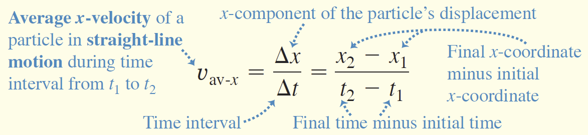
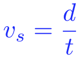
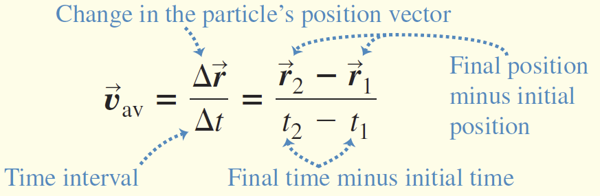
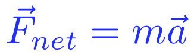
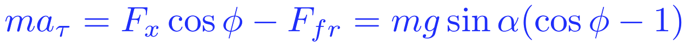
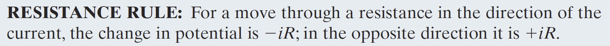

# PhysicsSummary

## Introduction

### Idealized Models，理想模型.

### Dimensional Analysis **量纲分析**

通过量纲分析可以保证计算结果的正确性

### SI定义

+ Time (s):Definition since 1967: 1 second is 9 192 631 700 times the period of oscillation of radiation from the cesium atom.

+ Length (m):Definition since October 1983: 1 meter is the distance travelled by light in vacuum during a time interval of 1 / 299 792 458 second.

+ Mass (kg):Definition since 2019 (!!!): 1 kilogram is defined by taking the fixed numerical value of the Planck constanthto be6.62607015×$10^{−34}$ when expressed in the unit J⋅s, which is equal to kg⋅m2⋅s−1, where the meter and the second are defined in terms of c and Δν$_{Cs}$.

    

+ Prefixes for Powers of Ten 

    

### Uncertainty in Measurements 保留小数值

+ Accuracy of measurement depends on:
    • sensitivity of the apparatus 仪器灵敏度
    • skill of the person 个人技能
    • number of times the measurement is repeated 重复测量的次数

+ 

+ > 例如上面的例子由于长度测量数据的不精确,导致最后乘出来的结果会有更大的偏差,这样情况下,要靠去一个测量值,再加上最少有效位数的结果.上图`4.5`就是一个两位有效数字,所以结果也要又两位有效数字

### 有效数字

+ 规则1:将两个或两个以上的量相乘（除）时，最终==乘积（商）中的有效数字的数目与被组合的因子中最不准确的有效数字的数目相同==，其中最不准确的意味着有效数字的数目最少。(正如上面的那个面积的例子)

    

    > 比如在这样的例子里
    >
    > > 
    >
    > 由于`3.46`只有三位,所以结果只能有三位,剩下四舍五入

+ 规则2:加（减）数时，结果的小数位数应等于和（差）中任何一项的最小小数位数。

    > > 
    >
    > 这里都跟着两边最小的对其.

### 估计值

### 一些数学知识规律

#### 坐标系:heavy_check_mark:

#### 向量加减:heavy_check_mark:

#### 向量乘法

##### 数量积:heavy_check_mark:

##### 向量积:x:

注意这里的乘数顺序以及第二个关于模的运算公式

##### 混合积:heavy_check_mark:

##### 双向量积:x:

## 运动学

### 质点的定义

点质量（又名质点，point particle）的概念是力学理论的基础。按点质量，我们假设一个质量为m的物体，==但在各个方向上的延伸可以忽略不计==。

### 基础的位移

### 速度 Speed(标量)

==这里面的速度是有方向的!!!有方向的速度是由正负值的!!==

### 平均速度(标量)

要十分注意2.3和2.4的公式写法,这==两个里面的公式写法不一样==.速度就是`( - )/( - )`,平均速度就是`( )/( )`

### 瞬时速度Velocity(矢量)

这是原始公式,对于这个原始公式,书写的时候要注意写法!

### 位移变化量

$$
\Delta x= x_2-x_1
$$

### X-t图像的切线是速度，向上为正速度，向下为负速度。

### 平均加速度（矢量）：两点连线的斜率。

### 瞬时加速度(矢量):某一点的切线,向上加速度为正,向下加速度为负.

### 速度变化量

$$
\Delta v= v_2-v_1
$$

### ==线性运动(一维)下==速度与加速度的关系

==注意在这里面的积分号直接带a的表达式进去不要再加一个t了,因为就是单纯的对加速度积分!!!==

### 线性运动(一维)下位移与速度关系

==注意在这里面的积分号直接带a的表达式进去不要再加一个t了,因为就是单纯的对加速度积分!!!==

### 由2.12的导出速度与位移(不含时间的公式:star:

### 自由落体加速度

### 自由落体高度公式

$$
h=\frac{v_i^2-v_x^2}{2g}
$$

### 自由落体速度公式

### 二维及三维运动速度公式

这里面就是直接的拿模算

### 二维及三维运动瞬时速度公式

这里面直接减,因为最后的速度一定是一个向量!!,所以不用担心数字的问题!

### 二维及三维运动加速度

这里的加速度也是一个矢量

### 二维及三维运动顺时加速度

由于最终是一个矢量所以在运算的过程中,就是求分别对`x,y,z`求导数量即可.

这样就可以直接得出各分量

### 二维状态下的运动也就是再一维上扩充下下 x y

### 斜抛运动(水平方向速度不变,只在竖直方向上有加速度的变化)

### 斜抛运动的水平距离抛物线公式

> 在这个公式里我们找的是x与y的关系，所以，直接用$t=\frac{x}{v_0\cos \theta}$来带入$y=v_0t-\frac12at^2$就能得出这个抛物型.

### 对于三维模型下的运动直接求导数就可以

> 例题:
>
> 1)这里面的直接就对t求两次导数就行.
>
> 2)这个是实际上是椭圆的参数方程,得能够看出来才行!

### 对于曲线运动的公式

速度:

加速度:

> 这里面的加速度分为向心和离心,想要计算推导出这个式子,需要使用相似三角形的知识,后半部分就示范高中学过的东西,前半部分直接求导数加上方向向量就好.

### 对于函数的计算思路的一道重要习题

==在这里的x是一个式子,不能直接按照求导的方式求没了,要严格按照伟大的链式法则来做.==

### 三维空间下的圆周运动

+ ==角速度垂直于旋转平面==，具体方向由右手准则来确定.
+ 角速度加速度方向沿角速度方向（垂直于旋转平面）
+ 对于最后的式子后半部分是向心的，前半部分是切向的.
+ 推导过程中

这里使用了换元积分的方法,把$\vec{r}转化为了\vec{\phi}$这是一个很巧妙的方法.

### 角速度周期公式

## 动力学

### 四种作用力

>•亚原子粒子之间的<u>强核力</u>
>
>•电荷之间的<u>电磁力</u>
>
>•在某些放射性过程中发挥作用的<u>弱核力</u>
>
>•物体之间的引力

### 牛顿第一定律(惯性定律,定义了质量)

伽利略定律惯性：有无作用力物体（质点）保持静止或匀速直线运动的坐标系。这种系统称为惯性系统。

所有IRF的一个重要特征是：时间和空间对它们具有明确的对称性。

### 质量

+ 惯性是物体对其速度的任何变化不敏感的程度.
+ 惯性的量度，由称为质量的量提供（质量越大的物体惯性越大）
+ 两个不同物体的质量之比，通过等力给它们的加速度的倒数.

### 牛顿第二定律(通过质量联系了合力$\vec{F_{net}}$和加速度$\vec{a}$)

+ 第二定律或运动方程：作用在物体上的净力等于物体质量和加速度的乘积.
+ 

### 动量和加速度之间的关系(通过力作为桥梁)

### 牛顿第三定律(作用力与反作用力)仅仅在低速条件下适用!

第三定律或作用等于反作用：作用和反作用的大小相等，方向相反。

### 伽利略变换(相当于变换参考系)

只要在原基础上添加一个变换向量就可以实现转移

### 六种力的公式

+ 第四个是弹力,第五个是滑动摩擦力,第六个是阻力.

### 动力学基本等式

+ 这是一个向量形式的质点运动微分方程
    问题的可能表述：

+ （i)如果已知质量和半径向量随时间的变化，则求作用在点上的力→微分

    

+ （ii)如果已知质量和力+初始条件（t0处的位置和速度），则找出点的运动规律（=半径向量随时间的变化）
    →积分；可以矢量形式或坐标形式求解，也可以在给定点的切线和轨迹法线上的投影中求解。

### 练习题

1. 

    这里面的的推导就是直接变换$F=-kv \Longrightarrow m\frac{d\vec{v}}{dt}=-kv$,再在左右两边同时积分$\int m\frac{d\vec{v}}{dt}=\int -kv$

2. 

    简单板块模型,就是注意`plank`是摩擦系数$k$而已.

3. 

这里面的推导先列出,和,再由线速度公式推导出角速度公式,再对推导出的$dt$带入先前第一个加速度的式子,得出再积分得,当R=0的时候由有带入联立解得

4. 

    由受力分析能够有

其中切向加速度为,沿斜面向下加速度为,会发现上面两个式子巧妙地互为相反数,再同时积分由,当时间进行下去会有,可以得出C就是$v_0$,仍有,代入可得出

## 功能关系

### 功的定义

功是通过作用在物体上的力向物体传递的能量。转移到物体上的能量是正功，从物体上转移出的能量是负功。

与运动方向相同做正功,相反做负功.垂直不做功(其实就是在计算标量积的时候,由于$\cos \theta$的角度变化导致数值上的变化.)

### 弹性势能计算公式

由于施加弹力的时候有运动状态,当$v_1为0$的时候就有:

其中弹性势能做负功.

### 功能转换定律

+ 一个粒子的动能等于把它从静止加速到现在速度所做的总功
+ 粒子的动能等于粒子在静止过程中所能做的总功

### 积分情况下的做工计算方式($F-X$图像)

由此推导出在变大小力做功下仍然有

变方向力上做工也符合这样的规律:

因为至于始末位置有关,所以直接就可以通过两点位置利用可变的向量,做好加法之后,直接合并所有的运动.其实就等于在坐标系下分别对三个方向的运动做分别计算再加和:

### 功率

这是平均功率:

这是瞬时功率:

单位是:

对于瞬时情况下,有$P=\frac{dW}{dt} \space  \and W=\vec{F}\cdot \vec{x}\Rightarrow P=\vec{F}\cdot\vec{v}$

### 势能

机械能减少量等于势能增加量.

### 能量守恒与否

检查影响运动的力类型时应考虑的要点：

+ 系统由两个或多个对象组成
+ 力作用于系统中类似粒子的物体和系统的其余部分之间
+ 当系统结构改变时，力作用在类粒子物体上，在物体的动能K和系统的其他能量之间传递能量
+ 当构型改变被逆转时，力逆转了能量传递，在这个过程中做功w2
+ 

### 保守力做功与路径无关

:imp:验证一个力是不是保守的的方法:

1. 与路径无关
2. 沿环路回来做功为0

> 例:
>
> 
>
> 对于这一个积分之后,一个式子中,只有一个积分变量,所以与路径无关
>
> 
>
> 这个式子中由于同时$x和y$都是积分变量,所以与路径有关不是保守力.

### 势能的计算

#### Gravitational Potential Energy

其实就是$-mg\Delta h$

#### Elastic Potential Energy

就是简单的弹性势能

### 机械能守恒（动能是$K$势能是$U$)

只有保守力做功的时候就可以很简单的认为整个系统机械能守恒。

### ==三维状态下的计算:x:==

==注意这里面是有一个负号!!!!==

> 例如:
>
> 
>
> 

### 外力(external force)做功改变机械能

### 线性动量

### ==对于变质量物体的运动分析==

$$
_{\Delta}P=md\vec{v}=\vec{F}dt+dm\cdot\vec{u} 
\\ \Rightarrow m\frac{d\vec{v}}{dt}=\vec{F}+\frac{dm}{dt}\vec{u}(\vec{u}是抛出质量时候的方向向量)
$$

> 即外力导致的动量改变加上反作用力的影响.

> (a)对于这个的解答首先由于在那一时刻加速度为0,那么就意味着$\frac{d\vec{v}}{dt}=0$带入上面的式子(4.14)会有.整理有,左右同时积分,由原题可以知道$\eta的定义$ ,带入就能解出来t:

> (b)\

> 
>
> 先求$\mu$对于m的关系,再通过(a)中间那一步解出时间与质量的变化关系,`要注意这里面的不能直接解出来,因为我们讨论的是是在一段过程中的变化运算`$\mu$与m并不等同!($\mu$实际上就是$_\Delta m$的函数)

## 电学

### 库仑力(在这里面的$k$不能再像高中一样的直接写了,应该是展开为$\frac1{4\pi\epsilon _0}$)

### 电场($\vec{E}$)

#### ==电场的定义(方向由电场线切线决定,强度由电场线疏密决定)==

+ 带电粒子在周围空间中产生电场（矢量）。(场源电荷)
+ 如果第二个带电粒子位于该空间中，由于其所在位置的电场的大小和方向，会产生一个静电作用力
+ 任何一点的电场都是根据施加在正试验电荷q0上的静电力来定义的：

+ 电场线能让我们直观地看到电场的方向和大小。
+ ==任何一点的电场向量都与通过该点的电场线相切==。该区域的场线密度与该区域的电场大小成正比。
+ 电场线从正电荷（它们产生的地方）延伸到负电荷（它们终止的地方）

根据库仑力的公式能够得出电场力的公式,其中$\hat{r}是$单位方向向量等于$\hat{r}=\frac{\vec{r}}{|\vec{r}|}$

> 例如：>
>
> 在这里的亲爱的电荷计算的时候,由于一个为正一个为负,==所以导致后面的实际上是$+(-E_{(-)})$,要注意这里的方向!==

#### 电偶极子(就是一个形容两空间孤立点电荷之间所产生电场性质的一个物理量)

电偶极子是一个由两个粒子组成的系统，两个粒子的电荷大小相等，但符号相反，由一个小距离d隔开。	电偶极矩$\vec{p}$由负电荷指向正电荷，大小等于正电荷量乘以正负电荷之间的距离.($p=qd$)

#### 空间物体所产生的电场描述(实际上就是数学中微积分的应用)==电荷密度用的时候直接来代替$dq$==

##### 描述物体内部电荷密度的量(三维)

$$
\lambda=\frac{dq}{ds} \\
\Rightarrow dq=\lambda*ds
$$

##### 第二个是表面(二维)

$$
\lambda=\frac{dq}{dA} \\
\Rightarrow dq=\lambda*dA
$$

##### 第三个是线性的(一维)

$$
\lambda=\frac{dq}{dV} \\
\Rightarrow dq=\lambda*dV==
$$

##### 练习题自己到ppt上看都很简单,不难PPt上有标记.

#### 电势的定义(与定义重力势能的理念一样!!)==移动检验电荷所做的功与检验电荷的电荷量的比值==

+ 在静电学里，电势，或作电位，是==标量==，定义为处于电场中某个位置的单位电荷所具有的电势能。
+ 其数值不具有绝对意义，只具有相对意义，因此为了便于分析问题，必须设定一个参考位置，并把它设为零，称为零势能点。
+ 通常，会把无穷远处的电势设定为零。那么，电势可以定义如下：假设检验电荷从无穷远位置，经过任意路径，克服电场力，以缓慢、没有产生加速度的方式移动到某位置，则在这位置的电势，等于==因移动检验电荷所做的功与检验电荷的电荷量的比值==。

#### 等势面&等式线

电势相等的一个平面!当带电粒子在同一等势面上的两点间运动时，电场不会对带电粒子产生功。

#### 从电场计算电势

等于电场乘上位移得出其实是推导出来的:

> $$
> \Delta W=- \int_{i}^{f} dW \\
> \Rightarrow \Delta W=-\int_{i}^{f} \vec{F}\cdot d\vec{s} \\
> \Rightarrow\Delta W=-\int_{i}^{f} q_0\vec{E}\cdot d\vec{s} \\
> \Rightarrow\frac{\Delta W}{q_0}= -\int_{i}^{f}  \vec{E}\cdot d\vec{s} \\
> \Rightarrow V=-\int_{i}^{f}  \vec{E}\cdot d\vec{s}
> $$

#### 在匀强电场中的电势计算

#### 点电荷产生的电势

$$
V=-\int_{i}^{f}  \vec{E}\cdot d\vec{s}\\
\Rightarrow V=-\int_{i}^{f}  \frac1{4\pi\epsilon_0}\frac{q}{r^2}\cdot d\vec{r}\\
\Rightarrow V=\frac1{4\pi\epsilon_0}\frac{q}{r^2}\int_{i}^{f} d\vec{r}\\
 \\
\Rightarrow V=\frac1{4\pi\epsilon_0}\frac{q}{r^2} \Delta r
$$

#### 电偶极子引起的电势

(上面的p就是电偶极子这个东西相当于合并了q和d)

#### 计算高维度的电势

策略与计算电场的情况几乎相同：

+ 对于电荷的连续分布（在扩展物体上），通过（i）将分布划分为电荷元素dq（可被视为粒子）
+ ii）通过对整个分布进行积分，求出每个元素的电势之和
+ 为了进行积分，dq被线性电荷密度和长度元素（如dx）或表面电荷密度和面积元素（如dx-dy）或体积电荷密度和体积元素（如dxdydz）的乘积所代替。
+ 注：==由于电势是一个标量，因此不需要考虑矢量分量==

+ 这个里面就是把原来的公式换了下,依旧是直接换`dq`

### 由电势算电场(==里面有几个字母就对几个字母求偏导数再分别写出就行)==

### 电势能($U$)

#### 电势能==就是由电势乘上场源电荷==

### 系统电势能等于各组件之间内部电势能之和,算的时候就每==个电荷之间乘一下加一下就好==

### 电容($C$)

+ 当电容器充电时，其极板上的电荷大小相等，符号相反。
+ 电容是为了在极板之间产生一定的电位差而必须在极板上加多少电荷的量度。
+ 电容越大，需要的电荷就越多

#### 不同形状电容器的电容值计算方法

平行板电容器$C=\epsilon_0 \frac Sd$

柱型电容器$C=2\pi\epsilon_0 \frac L{ln(\frac ba)}$

球体$C=4\pi\epsilon_0 R$

球型电容器$C=4\pi\epsilon_0 \frac{ab}{b-a}$

#### 电容器串并联(和电阻的计算方法一样)

+ 并联间并联电容器(组)的两端电势差相同,可以用来推到电荷量
+ 串联间两串联电容器(组)之间的电势差与电容值成反比,这样的比例可以来推电压值
+ 

#### 由介电物质的电容计算(直接乘上$\kappa$倍)

### 电流($i$)

#### ==电流的定义==(单位时间的流经电荷量)

电荷均为==元电荷$e$的整数倍== ! 

#### 电流密度(每单位截面面积电流量)

电流密度（current density）是电荷流动的密度，即每单位截面面积电流量。电流密度是一种矢量，一般以符号${\displaystyle }\mathbf {J} $表示.

#### 一段电线内部电荷量

$$
q=(nAL)e
$$

#### 电流密度的计算

### 电阻($R$)

#### 物理客观上通过电阻率计算电阻(电阻率$\rho$与导电性$\sigma$)

**这些关系只适用于各向同性材料！**

对于一段小均匀电线内有:
$$
E=\frac VL\\
J=\frac iA
$$
通过上面公式计算能有:

#### 电阻率随着温度的变化

$$
即: \rho=\rho_0(1+\alpha(T-T_0))
$$

### 电功($P$)

$$
dU=dqV =idtV
\\ P=iv
\\P=\frac{V^2}{R}
\\P=i^2R
$$

### 电动势($\mathcal {E}$数学写法的E另一种电动势)

电动势源后，获得能量 ${\displaystyle W\,}$则此元件的电动势定义为
$$
{\displaystyle {\mathcal {E}}={\frac {W}{Q}}}
$$
。通常，这能量是分离正负电荷所做的功，由于这正负电荷被分离至元件的两端，会出现对应电场与电势差。

在[电磁学](https://zh.wikipedia.org/wiki/電磁學)里，电动势又分为两种：“**感生电动势**”（Induced EMF）与“**动生电动势**”（Motional EMF）。根据[法拉第感应定律](https://zh.wikipedia.org/wiki/法拉第感應定律)，处于含时磁场的闭电路，由于磁场随着时间而改变，会有感生电动势出现于闭电路。感生电动势等于电场沿着闭电路的路径积分。处于闭电路的带电粒子会感受到电场，因而产生电流。

移动于磁场的细直导线，其内部会出现动生电动势。处于这导线的电荷，根据[洛伦兹力定律](https://zh.wikipedia.org/wiki/勞侖茲力定律)，会感受到[洛伦兹力](https://zh.wikipedia.org/wiki/勞侖茲力)，从而造成正负电荷分离至直棍的两端。这动作会形成一个电场与伴随的电场力，抗拒洛伦兹力，直到两种作用力达成平衡。

### 电路中电流规则

电位升之和等于电位降之和

### 电源内阻要考虑进去计算($r$)

### 欧姆定律与串并联电阻规律

略

### 电源电压等于电源电动势减去内阻分压

**&多电源电路要先分析各点电势,在确定电流流向以及分压值**

### $RC$电路(有负载和电源的电容板)

上面这个公式使用解微分方程的办法实现的.具体如下:
$$
\mathcal{E}-iR-\frac qC =0
\\\Rightarrow R\frac{dq}{dt}+\frac{q}{C}=\mathcal{E}
\\\Rightarrow Rq` +\frac1Cq=\mathcal{E}
$$

周期为: